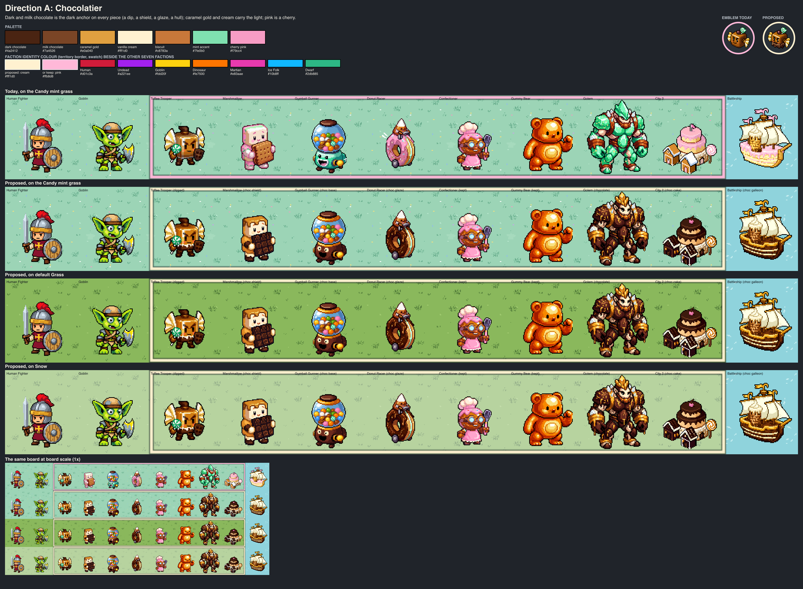
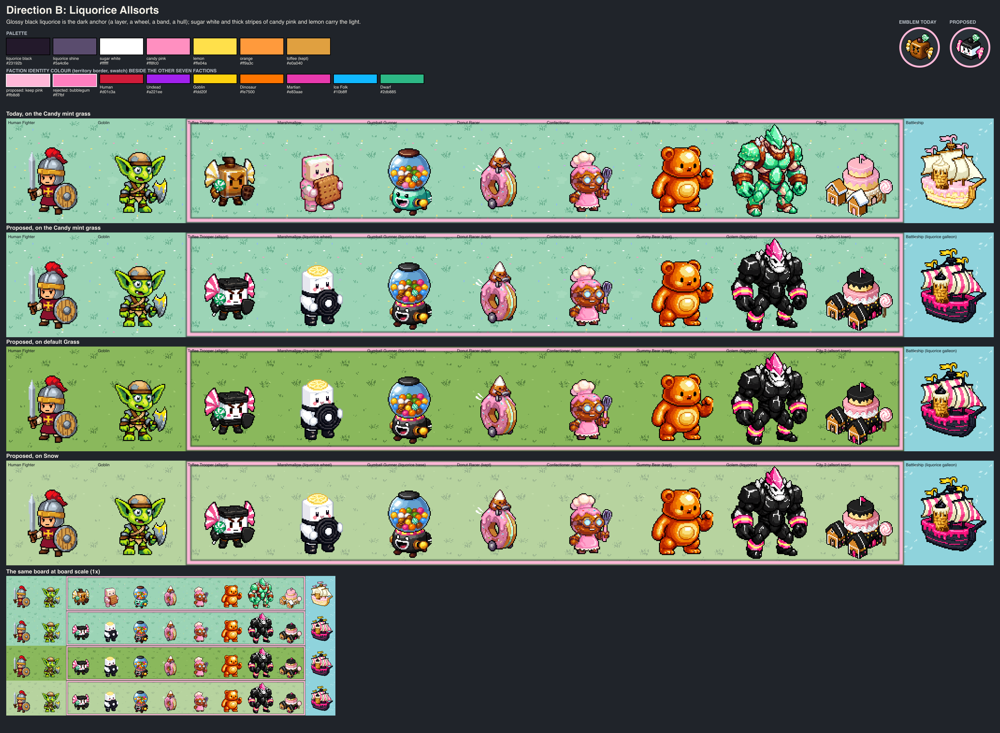
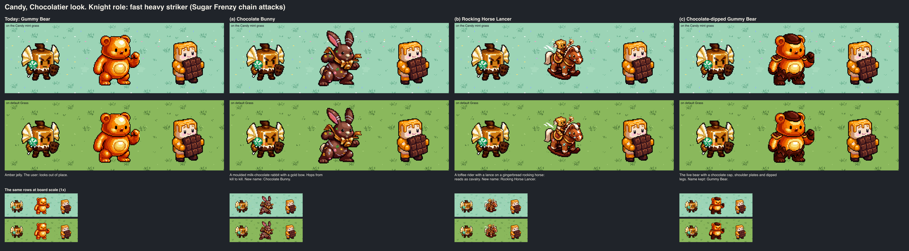
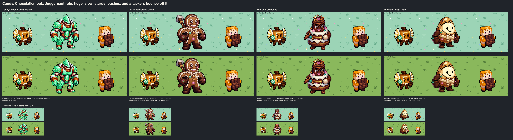

# Candy faction: a new look (proposal)

**Status: decided.** The user chose **direction A, Chocolatier**
(2026-10-05): "the chocolate look is delicious. but I would regenerate the
confectioner to fit the others. and the gummy bear looks out of place. and
the giant is too drippy and not sure what it's supposed to represent. let's
rethink the last two." The faction was converted in the same bead (see
[CANDY.md](../../../docs/art/factions/CANDY.md#the-chocolatier-look-october-2026));
the identity colour stays pink and the mint grass stays. The two units to
rethink had [three options each](#part-2-options-for-the-knight-and-the-juggernaut)
below; the user chose the **Chocolate Bunny** and the **Gingerbread
Giant** ("go with the chocolate bunny and the giant gingerbread man"),
which are now the live Knight- and Juggernaut-role sprites. The rest of this document is the proposal as it was
written for the choice ("today" in it is the roster before the conversion;
the two direction boards were composed then, and `tools/board.mjs` and
`tools/measure.mjs` now read the converted masters as "today").

The proposal's samples are accepted only inside two exploration runs
([`chocolatier/`](chocolatier/), [`allsorts/`](allsorts/)); six of the
Chocolatier samples were imported into the production batches.

The user (2026-10-05): "Propose a new look for all of the candy faction.
The problem with the original look was that it was pink-on-white. It needs a
darker color as accent. could be chocolate. You can change the identities as
well but the main thing is the look." Earlier: the Donut Racer, the
Confectioner and the Marshmallow are liked; "There's chocolate and colorful
gummies and toffee and more".

## What is wrong today

The first roster was pale pink shapes shaded with a paler rose on white and
cream: 46% pink, and its darkest material (chocolate) was 9% of a sprite,
on feet and rims. Bead `pulp_wars-2o7.3` redrew four units (Toffee Trooper,
Gumball Gunner, amber Gummy Bear, mint Golem), which cut the pink to 17% but
gave each unit its own colour: the faction now has no shared material. The
cities, the ships, the icons and four units are still pink frosting on
white. What is missing is **one dark material on every piece**, as every
other faction has one signature material (Human steel and crimson, Dwarf
copper and iron, Undead black cloth).

Both directions below add that dark anchor and keep what works: every
silhouette, every canvas and anchor, the Donut Racer, the Confectioner, the
Marshmallow, the amber Gummy Bear and the gumball machine.

## Direction A: Chocolatier



A chocolatier's kingdom. **Dark and milk chocolate is on every piece**: a
dipped half, a shield that is a chocolate bar, a glaze, a hull, a roof.
Caramel gold and vanilla cream carry the light, toffee stays, and pink
shrinks to a cherry on a cake and the Confectioner's apron. Warm, rich and
edible at a glance; nothing is pale pink on white any more.

| Role          | Colour    | Where                                                     |
| ------------- | --------- | --------------------------------------------------------- |
| Dark anchor   | `#4a2412` | dark chocolate: dips, glazes, hulls, roofs, boots, golem  |
| Mid           | `#7a4526` | milk chocolate: shields, the Gunner's base, shading       |
| Light         | `#e0a040` | caramel and toffee gold: bands, rims, drips, the Trooper  |
| Lightest      | `#fff1d0` | vanilla cream: marshmallow, sails, piping, sponge         |
| Small accents | `#7fe0b0` | mint (a lollipop), `#f79cc4` cherry pink, gumball colours |

- **Identities:** unchanged, except that the Rock Candy Golem becomes a
  Chocolate Golem. No rename is needed.
- **Identity colour:** vanilla cream `#fff1d0` is proposed (see
  [identity colour](#the-faction-identity-colour)); keeping today's pink is
  the fallback.
- **Pros:** the user's own suggestion; the most "candy" of the two; warm
  browns separate it from the cold factions (Martian chrome, Ice Folk, the
  Undead); the liked units need only a glaze or nothing; no name changes.
- **Cons:** brown and gold are the Dwarves' copper, leather and brass and
  the Goblins' sand in hue, so the faction is told by its shapes and its
  cream, not by a colour no one else has; the Golem is very dark (the
  sample's face came out tan, not cream); the roster's dark share rises to
  29%, the highest of the three looks, which is the point but leaves less
  room for dark terrain.

## Direction B: Liquorice Allsorts



A sweet shop of liquorice sweets. **Glossy black liquorice is on every
piece** (a layer, a wheel, a belt, boots, a hull, a roof), beside pure
sugar white and thick flat stripes of candy pink and lemon. The pink stays,
but as a stripe between black and white, where it is an accent and not the
body. Bold, graphic and unlike any other faction.

| Role        | Colour    | Where                                                       |
| ----------- | --------- | ----------------------------------------------------------- |
| Dark anchor | `#23192b` | liquorice black: layers, wheels, belts, boots, hulls, golem |
| Its shine   | `#5a4c6e` | the pale lilac-grey highlight of liquorice                  |
| Lightest    | `#ffffff` | sugar white: the face layers, marshmallow, sails            |
| Accent 1    | `#ff8fc0` | candy pink stripes, wings, crests, rims                     |
| Accent 2    | `#ffe04a` | lemon stripes and beads; `#ff9a3c` orange                   |
| Kept        | `#e0a040` | toffee and caramel of the kept units                        |

- **Identities:** the line unit changes from a toffee to a liquorice
  allsort (the "Toffee Trooper" being renamed now would need another name,
  for example "Allsort"); the Golem becomes a Liquorice Golem. The others
  keep their identity.
- **Identity colour:** keep today's cotton-candy pink `#ffb8d8`.
- **Pros:** the strongest graphic identity (black, white and one pink
  stripe read at any zoom, and under a colour-vision deficiency by value
  alone); it keeps the faction's pink and its border colour, so nothing
  about the interface changes; the kept pink units (Donut Racer,
  Confectioner) fit as they are.
- **Cons:** black with a bright accent is the Undead's recipe (black cloth
  and violet), and the black Golem is menacing where the faction is meant to
  be the silliest (a lighter one was sampled and lost the anchor, see the
  runs); liquorice is a less loved sweet than chocolate and reads less
  "candy" outside Europe; PixelLab draws the pink stripes as a hot pink near
  the Martian magenta (a production batch would pin it, as `candy-pink`
  does today); the line unit needs a new name.

## Measured

`node art/explorations/candy-look-2026-10/tools/measure.mjs`
([`measure.json`](measure.json)): the eight-unit roster, outline ink left
out. "Today" is the roster on `main` after bead `pulp_wars-2o7.3`.

| Roster (8 units) | Mean L\* | Dark (L\* < 35) | Lit (L\* >= 55) | Pink | White |
| ---------------- | -------: | --------------: | --------------: | ---: | ----: |
| Today            |     59.8 |             17% |             59% |  17% |    5% |
| A Chocolatier    |     53.3 |             29% |             48% |  12% |    4% |
| B Allsorts       |     57.9 |             23% |             54% |  22% |   11% |

Both directions stay in the value range of the liked factions (the Humans
measure 49 and 35% dark and the redesigned Goblins 56 and 22% by the Goblin
study's similar measure). In B the pink
share rises because the stripes are pink and three pink units are kept; it
sits beside black, not on white.

## The faction identity colour

Today `CANDY: "#ffb8d8"` in `src/render/canvas/faction-colours-v7.ts`.
`node art/explorations/candy-look-2026-10/tools/identity-colours.mjs`
([`identity-colours.json`](identity-colours.json)) measures candidates as
[FACTION_COLOURS.md](../../../docs/art/FACTION_COLOURS.md) does: CIE76 with
normal vision, then the lower of deuteranopia and protanopia.

| Candidate                   | L\* | Nearest faction (normal; simulated) | Grass    | Candy mint grass | Snow    | Shallow | Mountain |
| --------------------------- | --: | ----------------------------------- | -------- | ---------------- | ------- | ------- | -------- |
| today: cotton-candy pink    |  82 | Martian 55; Dwarf 24                | 79 / 45  | 57 / 11          | 56 / 24 | 50 / 4  | 33 / 11  |
| **vanilla cream `#fff1d0`** |  95 | Dwarf 56; Dwarf 25                  | 47 / 34  | 30 / 14          | 24 / 15 | 38 / 28 | 36 / 35  |
| milk chocolate `#8a5330`    |  41 | Human 47; Human 10                  | 59 / 27  | 62 / 44          | 56 / 39 | 69 / 57 | 51 / 47  |
| caramel gold `#d8973f`      |  67 | Dinosaur 37; Dinosaur 10            | 49 / 9   | 62 / 45          | 49 / 34 | 76 / 65 | 64 / 61  |
| bubblegum pink `#ff7fbf`    |  70 | Martian 27; Martian 17              | 101 / 44 | 83 / 14          | 82 / 27 | 76 / 10 | 56 / 4   |
| allsort turquoise `#22d3c5` |  77 | Dwarf 23; Martian 16                | 49 / 48  | 25 / 11          | 38 / 24 | 26 / 7  | 45 / 5   |
| liquorice black `#2a2030`   |  14 | Ice Folk 71; Human 33               | 85 / 72  | 76 / 67          | 79 / 73 | 72 / 65 | 56 / 55  |

Seven saturated hues are taken, so the obvious colours of both looks fail:
chocolate is a dark crimson to a colour-blind viewer (10 from the Human
colour) and is darker than the border's casing allows (L\* 45); caramel is
the Dinosaur orange (10 simulated); a hotter pink is the Martian magenta
(27); black cannot be a line in a near-black casing.

- **A: vanilla cream `#fff1d0`.** As far from the other seven as today's
  pink (56 and 25 against 55 and 24) and the cream of the look. Its weak
  spot is light ground: 24 from Snow and 30 from the mint grass (the casing
  carries it there, as it carries today's pink on Shallow Water, 4
  simulated). If that is too weak, **keep the pink**: it is then the
  faction's cherry and nothing in the interface changes.
- **B: keep `#ffb8d8`.** It is the look's stripe colour and still the
  best-separated pink.

## The mint faction grass

Both looks were composed on the Candy mint grass (bead `pulp_wars-2o7.4`),
default Grass and Snow. The dark anchor reads on all three; **the mint
grass helps both looks** (chocolate on mint is the strongest contrast on
the boards, and black and white on mint is clean), so it should stay. Two
notes: a cream border is weakest on it (30), which is the one reason to
keep the pink border with A; and the sprinkles of the mint tile are pastel
pink, lemon and blue, which suit B as they are and could become cream and
caramel for A in the bake script, with no PixelLab call.

## The samples

Every sample is an `edit-image-pixen` edit of the accepted sprite named in
its recipe (a cross-batch source of `direction-candy` or `naval-candy`), so
the shapes, canvases and anchors are the live ones. 18 PixelLab calls, none
failed: 15 first samples and 3 follow-up edits; 15 accepted, 2 superseded
by their follow-up edit and 1 alternative recorded as rejected.

| Piece                  | A Chocolatier                                                   | B Liquorice Allsorts                                                  |
| ---------------------- | --------------------------------------------------------------- | --------------------------------------------------------------------- |
| Line unit (`FIGHTER`)  | `trooper-a`: the Toffee Trooper dipped in dark chocolate        | `trooper-a`: an allsort, black, white with the face, black            |
| Guard                  | `marshmallow-b`: caramel-dripped, a chocolate bar as its shield | `marshmallow-b`: all white, black boots and belt, a liquorice wheel   |
| Ranged (`MARKSMAN`)    | `gunner-a`: the gumball machine on a milk chocolate base        | `gunner-a`: on a black base with a pink and lemon band                |
| Juggernaut             | `golem-a`: blocks of dark chocolate, caramel drips              | `golem-a`: black liquorice, striped bands (`golem-b`: a white option) |
| City 2                 | `city-a`: a chocolate cake keep with a cherry                   | `city-a`: a layered-sweet keep, black liquorice roofs                 |
| Battleship             | `ship-a`: a chocolate cake galleon, gold rims, cream sails      | `ship-a`: a black galleon, pink rim, striped sails                    |
| Line-unit portrait     | `portrait-a` (also the faction emblem)                          | `portrait-a`                                                          |
| A liked unit, restyled | `donut-a`: the Donut Racer with a chocolate glaze               | none: the Donut Racer and the Confectioner are shown unchanged        |

What the samples taught: one edit with the target as hex values and "Keep …
every shape" restyles a sprite in place first time (13 of the 15 first
samples); "its lower
half is coated … with a wavy dripping edge" draws a dip; the Marshmallow's
pink arms and legs need to be named or they stay; PixelLab's "bright pink"
is a hot pink.

## Roster: today and what each direction changes

"Recolour" is one edit of the live sprite that keeps every shape; "redraw"
changes the shape; "keep" needs nothing. "Sampled" pieces are already made
in the runs and could be imported.

| Piece                       | Today                                 | A Chocolatier                                                          | B Liquorice Allsorts                                | Identity changes?    |
| --------------------------- | ------------------------------------- | ---------------------------------------------------------------------- | --------------------------------------------------- | -------------------- |
| Toffee Trooper (`FIGHTER`)  | golden toffee cube, lemon wings       | recolour: chocolate dip (sampled)                                      | recolour: allsort layers (sampled)                  | A no; B yes (rename) |
| Donut Racer (`RAIDER`)      | pink-frosted donut                    | recolour: chocolate glaze (sampled), or keep                           | keep                                                | no                   |
| Gumball Gunner (`MARKSMAN`) | gumball machine, mint base            | recolour: chocolate base (sampled)                                     | recolour: liquorice base (sampled)                  | no                   |
| Marshmallow (`GUARD`)       | white block, biscuit, pink limbs      | recolour: caramel, chocolate bar shield (sampled)                      | recolour: liquorice wheel, belt and boots (sampled) | no                   |
| Confectioner (`CAPTAIN`)    | caramel cook, pink apron              | keep (the pink apron is the look's cherry)                             | keep                                                | no                   |
| Pie Launcher (`CATAPULT`)   | gingerbread cart, pink barrel         | recolour: a chocolate roll barrel, caramel wheels                      | recolour: a liquorice barrel with pink stripes      | no                   |
| Gummy Bear (`KNIGHT`)       | amber jelly                           | keep                                                                   | keep                                                | no                   |
| Golem (`JUGGERNAUT`)        | mint rock candy                       | recolour: chocolate blocks (sampled)                                   | recolour: liquorice (sampled; too dark? see cons)   | yes, in name only    |
| 8 portraits                 | follow the sprites                    | 5 recolours (1 sampled), 3 keep                                        | 4 recolours (1 sampled), 4 keep                     | as the sprites       |
| City 1 to 3                 | gingerbread and pink cake             | 3 recolours (City 2 sampled)                                           | 3 recolours (City 2 sampled)                        | no                   |
| Patrol Boat                 | chocolate-bar boat, pink rim          | recolour: caramel rim (small)                                          | recolour: liquorice hull, striped sail              | no                   |
| Battleship                  | pale cake galleon, pink drips         | recolour (sampled)                                                     | recolour (sampled)                                  | no                   |
| Transport                   | pink donut raft                       | recolour: chocolate glaze                                              | keep or a liquorice wheel raft                      | no                   |
| Submarine (+ submerged)     | chocolate eclair, pink stripe         | recolour: caramel stripe; the submerged one re-derives                 | recolour: liquorice, pink stripe kept               | no                   |
| 3 ship portraits            | follow the ships                      | 3 recolours                                                            | 3 recolours                                         | no                   |
| Crumbs marker               | golden biscuit crumbs                 | keep                                                                   | keep                                                | no                   |
| 12 icons                    | pink lollipop, mitt, sweet, piping, … | recolour 4 (emblem, Sugar Toss, Frosting, Peppermint Surprise); keep 8 | recolour 1 (emblem as an allsort); keep 11          | no                   |
| 7 effects                   | palette-mapped on `candy-sugar.png`   | keep (a palette swap in code if wanted)                                | keep                                                | no                   |
| Mint faction grass          | mint with pastel sprinkles            | keep; sprinkles to cream and caramel in the bake                       | keep                                                | no                   |
| Identity colour             | pink `#ffb8d8`                        | cream `#fff1d0` (or keep pink)                                         | keep pink                                           | n/a                  |

**Rough call counts for the full conversion** (edits succeed about three
times in four):

- **A:** 7 unit and 5 portrait recolours, 3 cities, 4 ships, 3 ship
  portraits, 4 icons: 26 pieces, of which 8 are sampled. About 18 new
  pieces, **25 to 30 calls**.
- **B:** 5 unit and 4 portrait recolours, 3 cities, 3 or 4 ships, 3 ship
  portraits, 1 icon: 20 pieces, of which 7 are sampled. About 13 new
  pieces, **18 to 24 calls**, plus an accent preset to pin the pink.

Either way no engine, rule or layout change: asset ids, canvases, anchors
and the shadow table's shape stay. A would change the identity colour (one
constant, its test rows and FACTION_COLOURS.md) if cream is chosen; B would
need a display name for the line unit.

## Recommendation

**Direction A, Chocolatier, keeping the pink identity colour unless the
cream border is liked on the board.** It is what the user asked for in so
many words ("could be chocolate"), it turns the pieces the user already
likes into the look with a glaze instead of replacing them, it needs no
rename, and it reads as sweets at a glance. Its weakness is that brown and
gold are not a colour of its own beside the Dwarves; the cream, the round
shapes and the mint ground tell it apart on the boards.

B is the bolder choice and the better answer if the user wants the Candy to
be unmistakable from across the board and to stay "the pink faction": pick
it if the black Golem and the Undead neighbourhood do not bother.

A middle way is possible and cheap, because every piece is a recolour: A
as the base, with single pieces taken from B where they are liked (the
all-white Marshmallow with dark boots, or the striped sails).

## Part 2: options for the Knight and the Juggernaut

Samples only, in the run [`options/`](options/) with the Chocolatier
fragment; nothing is wired in and the live Gummy Bear and Golem are
untouched. 12 PixelLab calls (10 fresh creations, two seeds of five
concepts, and 2 edits); 6 accepted as the options, 6 rejected with reasons.

### Knight role

A fast heavy striker (move 2, attack 3); while Rushed it has Sugar Frenzy,
an advance into up to two more attacks.



| Option                          | Recipe            | What it is                                                                                                | Display name         |
| ------------------------------- | ----------------- | --------------------------------------------------------------------------------------------------------- | -------------------- |
| (a) **Chocolate Bunny**         | `bunny-b`         | one moulded piece of milk chocolate with tall ears, a caramel gold bow, fists up                          | Chocolate Bunny      |
| (b) Rocking Horse Lancer        | `rocking-horse-a` | a toffee cube rider with a striped lance on a gingerbread rocking horse with dark chocolate rockers       | Rocking Horse Lancer |
| (c) Chocolate-dipped Gummy Bear | `dipped-bear-a`   | the live amber bear with a chocolate cap, shoulder plates and glove and legs dipped in dripping chocolate | Gummy Bear (kept)    |

- **(a)** is the most chocolate of the three, an instantly known sweet, and
  a hopping animal suits a unit that leaps from kill to kill. Its ears give
  it an outline no other Candy unit has. Weak spot: the darkest option, and
  a brown figure on dark terrain.
- **(b)** reads as cavalry at once, which is what the role is in every other
  faction, and it reuses the Toffee Trooper as its rider. Weak spots: at
  board scale the rider and lance are small (the whole piece is 56 x 58 px, the Bunny 62 x 79), and it is a second
  rider-on-a-mount beside the Donut Racer.
- **(c)** changes least (no rename), but the amber jelly the user found out
  of place is still two thirds of the sprite, and its dipped legs drip.

### Juggernaut role

Huge, slow and sturdy (40 HP, reward only); it Pushes, and melee attackers
Bounce off it.



| Option                    | Recipe          | What it is                                                                                                    | Display name      |
| ------------------------- | --------------- | ------------------------------------------------------------------------------------------------------------- | ----------------- |
| (a) **Gingerbread Giant** | `gingerbread-a` | a huge gingerbread man edged with white icing, gumdrop buttons, dark chocolate gauntlets and boots, a hammer  | Gingerbread Giant |
| (b) Cake Colossus         | `cake-b`        | a walking three-tier chocolate cake with cream frosting, a face on its top tier, a crown of candles, a cherry | Cake Colossus     |
| (c) Easter Egg Titan      | `egg-b-white`   | a giant white chocolate egg with a simple smile in torn caramel gold foil, a cream bow, dark chocolate limbs  | Easter Egg Titan  |

- **(a)** is known at a glance at any size, is the biggest of the three
  (84 x 102 px; the cake is 77 x 100, the egg 79 x 89) and has nothing dripping. Biscuit brown with chocolate
  fists sits between the toffee and the chocolate of the roster.
- **(b)** is the most original and its sponge suits Bounce; its face is on
  dark chocolate and small at board scale, and it carries a rolling pin
  that reads as clutter.
- **(c)** is the friendliest and the lightest in value, which sets it off
  from the chocolate units; it is rounder than it is towering, so it looks
  less of a giant. Its first two samples had a brown face in a foil hood
  and were rejected as open to misreading; the accepted one is white
  chocolate.

**Recommendation: the Chocolate Bunny and the Gingerbread Giant.** Together
with the converted roster they give the faction three clear chocolate
shapes (a dipped cube, a rabbit, a bar) and two biscuit ones (the Giant and
the Pie Launcher's cart). Each needs its portrait (one more call or two)
and a display rename, which is a source change for another bead.

## Reproducing

```sh
npm run art:chibi -- plan --exploration art/explorations/candy-look-2026-10/chocolatier
npm run art:chibi -- plan --exploration art/explorations/candy-look-2026-10/allsorts
node art/explorations/candy-look-2026-10/tools/board.mjs
node art/explorations/candy-look-2026-10/tools/measure.mjs
node art/explorations/candy-look-2026-10/tools/identity-colours.mjs
npm run art:chibi -- plan --exploration art/explorations/candy-look-2026-10/options
node art/explorations/candy-look-2026-10/tools/options-board.mjs
```

Each run holds `batch.json` (assets and recipes with seeds, sources and
edit instructions), `faction.md` (the fragment a fresh creation of that
direction would use), `subjects.json`, `records.json` (requests, verdicts
and reasons), `submissions/` (credential-free receipts), `raw/` (every
candidate) and `assets/` (the accepted samples). The boards are in
[`boards/`](boards/): `<direction>-board.png` and the mock board alone at
board scale, `<direction>-board-1x.png`.
