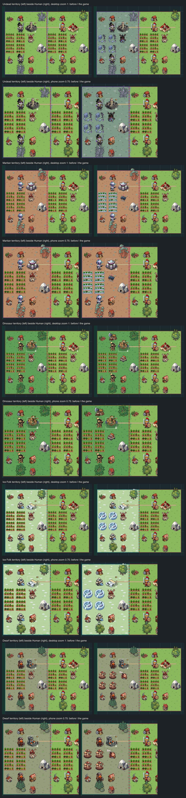
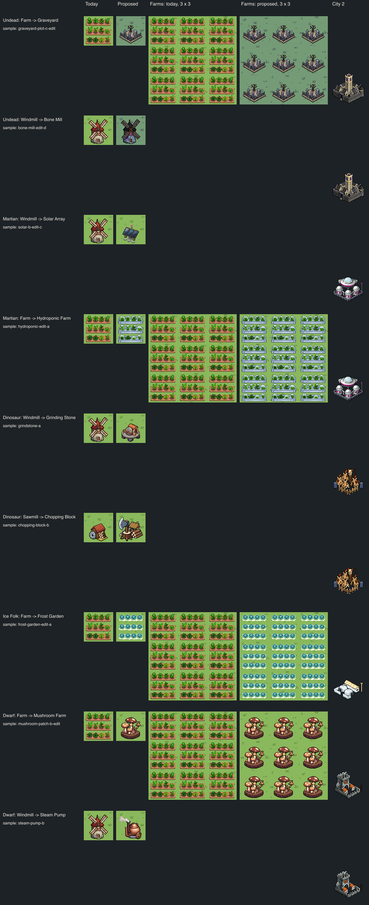
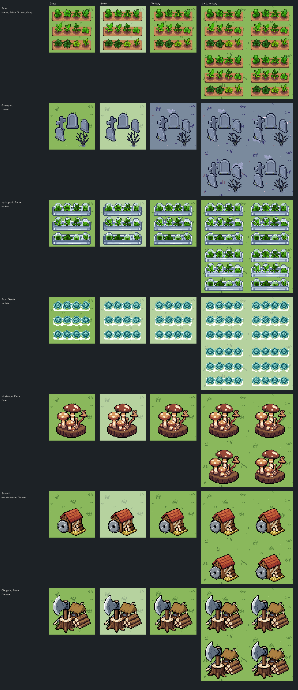
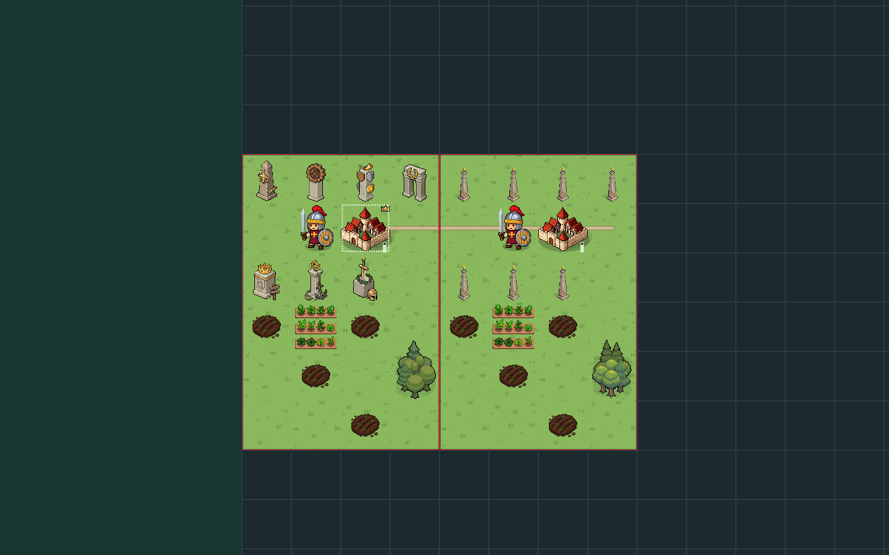
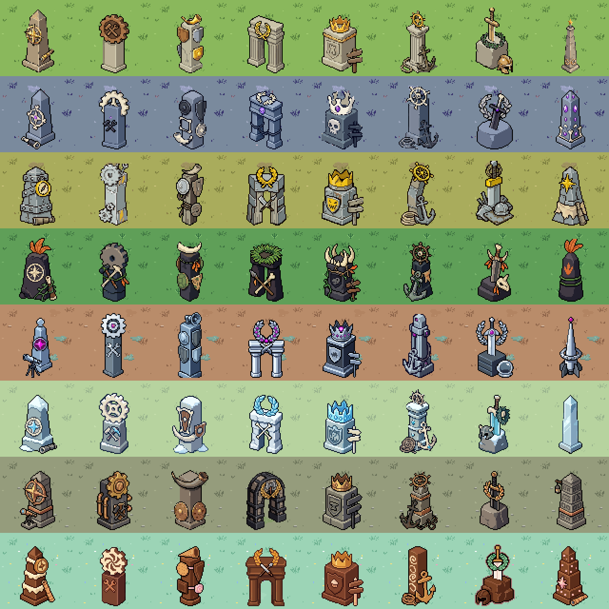

# Faction building looks

**Status: in the game** (bead `pulp_wars-xdh.2`, epic `pulp_wars-xdh`). The
nine buildings are production batches (`buildings-undead`, `-martian`,
`-dinosaur`, `-ice-folk`, `-dwarf`), the Undead "gloam" ground is baked as
masters, and the board, the tile dock, the build buttons, the technology
cards and the Gallery draw and name them by the territory owner: see
[In the game](#8-in-the-game). Sections 1 to 7 are the proposal and sample
study of bead `pulp_wars-xdh.1` as the root accepted them (2026-10-04);
where production changed something (the Bone Mill), section 8 says so.
**Section 9 supersedes the Farm looks** (bead `pulp_wars-2o7.2`, playtest
round 6): no Farm is a seamless field any more, the Graveyard and the
Mushroom Farm were redrawn, and the shared Sawmill was redone. Rule 3's
"seamless `crop-rows` field" and the row looks of sections 3, 5 and 6 are
history. **Section 12 supersedes the "same" of the Lumber Camp and the
Sawmill** (bead `pulp_wars-2yc.38`): every faction but the Humans draws its
own pair, **section 13 the "same" of the Forge, the Workshop, the Port
and the Shipyard, and section 14 the "same" of the Market**. **Section 15
adds a Monument per achievement and faction** (art only; the board does
not draw them yet).

The user's request (2026-10-03): some, not all, building sprites and
descriptions become faction specific. When the Undead take a city, the
buildings inside its borders change appearance (a Farm becomes a
graveyard; "the undead don't need farms"); the grass there becomes
"slightly more halloweeny, but don't go overboard"; Goblins can keep the
Farm; Martians should have something other than windmills, solar panels
maybe. It is **purely visual**: no rule, number or tooltip value changes.

## 1. Rules of the proposal

1. **Who decides the look: the territory owner.** A building is drawn in
   the look of the faction that owns the city whose territory it is in
   (`tile.territoryOwnerId`), the rule the faction cities already follow
   (`cityArtSubjectV7`: "a captured city changes its look with its owner").
   A captured city's buildings flip with it.
2. **Most cells stay the same.** Every faction keeps the shared calm
   building set except for its one or two most jarring mismatches: a
   building whose idea contradicts the faction (the Undead do not eat; a
   medieval windmill in a stone-age camp; open vegetable beds in Ice Folk
   snow).
3. **Same footprint, same role.** A replacement keeps the improvement's
   canvas, anchor and placement: a Farm replacement is a seamless
   `crop-rows` field (blocks of Farms still read as one field, Roads show in
   the gaps), a Windmill replacement a seated `calm-building` of at most
   72 x 72. It reads as "this faction's version of X", not as a new
   building.
4. **Names change, rules do not.** The faction name replaces the building's
   name where the building itself is named (the board label, the tile dock
   title, the build button of that faction's viewer). Every rules text keeps
   its numbers; where a rule names the generic building ("+1 per adjacent
   farm"), it stays, and the dock shows a one-line flavour description that
   ends "Counts as a Farm." so the vocabulary stays learnable. Technology
   names (Farming, Milling) do not change.
5. **Calm, faction-coloured, no player colour.** Replacements follow the
   [visual direction](VISUAL_DIRECTION_2026-10.md) for buildings (flat,
   muted, recede behind units) in the faction's fixed materials (its
   [faction fragment](factions/README.md)); no owner mask.

## 2. Inventory

Every improvement of `IMPROVEMENT_IDS_V7`, plus what else stands in a
territory. All are drawn today from one shared, neutral calm set
([`chibi-direction-art-manifest.ts`](../../src/assets/chibi-direction-art-manifest.ts),
batch `direction-human`).

| Building    | Today's look                                                                                                     | Canvas  | Where its name and text appear                                                           |
| ----------- | ---------------------------------------------------------------------------------------------------------------- | ------- | ---------------------------------------------------------------------------------------- |
| Farm        | three raised beds of mixed vegetables, a seamless field (`crop-rows`)                                            | 80 x 80 | board label, tile dock title, build button "Farm", Windmill formula ("adjacent farm")    |
| Lumber Camp | pines, a log stack, an axe in a stump                                                                            | 72 x 72 | label, dock, "Lumber camp" button, Sawmill formula                                       |
| Mine        | part of the Mined Mountain terrain art (grey rock, pale timber)                                                  | terrain | label, dock, "Mine" button, Forge formula                                                |
| Windmill    | cream plaster tower, terracotta cone roof, four oak sails                                                        | 64 x 72 | label, dock, button, formula "Windmill: +1 per adjacent farm; heals …", healing log line |
| Sawmill     | big steel circular saw blade on a bench, shed, logs                                                              | 72 x 72 | label, dock, button, formula                                                             |
| Forge       | stone smithy, chimney, fire glow, anvil                                                                          | 72 x 72 | label, dock, button, formula                                                             |
| Workshop    | timber-framed house with a cogwheel on the gable                                                                 | 72 x 72 | label, dock, button, formula "Workshop: grows with varied neighbors"                     |
| Market      | two striped stalls heaped with goods                                                                             | 72 x 72 | label, dock, button, formula                                                             |
| Monument    | pale stone obelisk with a gold star                                                                              | 48 x 72 | label, dock, "Monument" button, achievement text                                         |
| Port        | oak pier, harbour hut, mast                                                                                      | 72 x 72 | label, dock, button, naval texts                                                         |
| Shipyard    | half-built hull, crane, boathouse                                                                                | 72 x 72 | label, dock, button, naval texts                                                         |
| Grass       | `chibi-grass-1..3`, one muted green (`#8ab85c`) with a few tufts                                                 | 80 x 80 | terrain name only                                                                        |
| _Not owned_ | City 1–3 (already per faction), the Village (neutral site), Roads, the code-drawn Field Defense and Grave marker |         | unchanged by this proposal                                                               |

The code reads names in `title(tile.improvement)` (the board label in
`board-renderer-v7.ts` and the tile dock title in `app-view-v7.ts`),
`COMMAND_LABELS`, `economicFormulaV7` and the Windmill healing texts of
`app-view-v7.ts`; the dock and technology card art come from
`improvementSubjectV7` (`chibi-ui-art-v7.ts`).

## 3. Per-faction table

"same" means the shared building as today. Every change has an accepted
sample; **bold** marks the first four that were made.

| Building    | Human | Undead                     | Goblin | Dinosaur           | Martian         | Ice Folk        | Dwarf             |
| ----------- | ----- | -------------------------- | ------ | ------------------ | --------------- | --------------- | ----------------- |
| Farm        | same  | **Graveyard**              | same   | same               | Hydroponic Farm | Frost Garden    | **Mushroom Farm** |
| Windmill    | same  | Bone Mill                  | same   | **Grinding Stone** | **Solar Array** | same            | Steam Pump        |
| Sawmill     | same  | same                       | same   | Chopping Block     | same            | same            | same              |
| Lumber Camp | same  | same                       | same   | same               | same            | same            | same              |
| Mine        | same  | same                       | same   | same               | same            | same            | same              |
| Forge       | same  | same                       | same   | same               | same            | same            | same              |
| Workshop    | same  | same                       | same   | same               | same            | same            | same              |
| Market      | same  | same                       | same   | same               | same            | same            | same              |
| Monument    | same  | same                       | same   | same               | same            | same            | same              |
| Port        | same  | same                       | same   | same               | same            | same            | same              |
| Shipyard    | same  | same                       | same   | same               | same            | same            | same              |
| Grass       | same  | **gloam** (cooler, duller) | same   | same               | same            | same (has Snow) | same              |

### The changes

| Faction  | Building → name               | Look (one line)                                                                                  | Flavour description (rules text unchanged)                        | Why                                                         |
| -------- | ----------------------------- | ------------------------------------------------------------------------------------------------ | ----------------------------------------------------------------- | ----------------------------------------------------------- |
| Undead   | Farm → **Graveyard**          | three rows of dark slate gravestones with moss, on mounds of dark earth with tiny violet flowers | "Quiet plots, tended for later. Counts as a Farm."                | the user's example; the Undead do not eat                   |
| Undead   | Windmill → Bone Mill          | the same windmill in dark slate with ragged charcoal sails, charcoal roofs and violet windows    | "Grinds old bones into something useful. Counts as a Windmill."   | a grain mill beside a graveyard; cheap (an edit of today's) |
| Martian  | Windmill → **Solar Array**    | three tilted navy solar panels on chrome stands, a mast with one small magenta light             | "Drinks the light of a lesser star. Counts as a Windmill."        | the user's example; sails are the opposite of a saucer      |
| Martian  | Farm → Hydroponic Farm        | the vegetable beds in chrome troughs under small glass domes                                     | "Earth vegetables, under glass. Counts as a Farm."                | second priority; the plants keep the Farm readable          |
| Dinosaur | Windmill → **Grinding Stone** | an upright grindstone with a wooden lever on a big flat millstone, a hide lean-to on bone poles  | "Push the pole, crush the grain. Counts as a Windmill."           | the worst anachronism: machinery in a stone-age camp        |
| Dinosaur | Sawmill → Chopping Block      | a huge axe in a tree stump, a pile of split logs and a hide lean-to, no saw blade                | "A big stone axe and a bigger arm. Counts as a Sawmill."          | a steel circular saw in a stone-age camp                    |
| Ice Folk | Farm → Frost Garden           | three rows of blue-green frost cabbages on thin banks of snow                                    | "Cabbages that like the cold. Counts as a Farm."                  | green open beds look wrong under the Ice Folk Snow          |
| Dwarf    | Farm → **Mushroom Farm**      | four rows of tan and brown mushrooms on thin peat beds                                           | "Grown in the dark, eaten with ale. Counts as a Farm."            | the classic dwarf crop; still plainly a farm                |
| Dwarf    | Windmill → Steam Pump         | a copper boiler with a domed top, an iron chimney puffing steam and a brass cog wheel            | "Hisses, clanks and keeps the pressure up. Counts as a Windmill." | steampunk; second priority                                  |

**Kept the same, on purpose.** The Goblins keep everything (the user: they
can have the same farms; scrap-built versions would add clutter for little
gain). The Lumber Camp, Mine, Forge, Workshop, Market, Monument, Port and
Shipyard read as generic enough for every faction; changing them all would
make the board harder to learn, against "some but not all". The Ice Folk
Windmill stays: a windmill in a snowy land is plausible.

**Rejected ideas.** A Martian "crop circle" Farm (reads as a decal, not a
Farm, and hides Roads); Ice Folk ice-fishing holes as the Farm (fish read as
the Fish resource and the Port); a Dinosaur fern grove or nest as the Farm
(nests read as the Egg); a Goblin scrap Windmill (the user wants Goblin
farms kept, and the Goblin cities already carry the scrap look); a
graveyard of pale round-topped headstones (that is the shape of the
code-drawn **Grave** marker, a gameplay marker the Necromancer raises from;
the Graveyard's stones are dark slate with moss, so the two differ by tone).

## 4. The Undead territory grass

Inside Undead territory the Grass (and the grass under Forest trees and
beside Mountains) is drawn in a cooler, duller, slightly darker green with
violet-grey tufts. Nothing is added: no skulls, bones or graves on the
ground. Outside it, Grass is unchanged; the territory border sits on the
colour step.

Four candidates were made **in code**, with no PixelLab call
([`undead-grass.ts`](../../scripts/art/faction-buildings/undead-grass.ts)):
each Grass master has only four colours (`#8ab85c` and three tufts), so a
candidate is an exact colour swap of the reviewed tiles. That keeps the
texture, the seamless joins and the three variants, and a territory edge is
a colour change only.

| Candidate            | Base      | Tufts                         | Verdict on the board                                                        |
| -------------------- | --------- | ----------------------------- | --------------------------------------------------------------------------- |
| cool                 | `#7dab76` | `#93be8a` `#659162` `#50764f` | reads as a paler green, not as dusk                                         |
| dusk                 | `#7dab76` | dark tufts toward violet-grey | the tufts are flattened by the terrain tone; same as cool                   |
| **gloam** (proposed) | `#749b76` | `#86ab86` `#54605e` `#4c5656` | the only one that reads as evening; still clearly grass; not spooky "props" |
| wilt                 | `#a1a678` | dry olive                     | autumnal, but reads as dry land or a different biome; rejected              |

A PixelLab alternative was tried (recipes `undead-grass-a` and
`undead-grass-b`, Pixflux forced to
[`undead-grass.png`](../../scripts/art/chibi/palettes/undead-grass.png) and
`undead-grass-leaves.png` with the gloam colours) and rejected: the first
drew tree canopies into the meadow, the second a clean dusk meadow with far
fewer tufts than today's Grass, which would be a second texture beside it.
The recolour is the same field at dusk and is the accepted grass.

Wiring notes for production:

- **Terrain tone.** The live look tones all Grass toward one fixed pivot
  (`GRASS_PIVOT`, contrast 65%), which pulls the Undead grass a third of the
  way back to green. The candidates were judged after that tone (in the
  board captures), so registering them as Grass variants gives what the
  captures show. Toning them around their own mean would make the shift
  stronger.
- **Forest.** The Forest master carries its ground; the study re-composites
  the two Forest bodies over the Undead grass (`groundComposite`, as the
  pipeline builds them). The tree canopies keep their colours. In the board
  captures they read as trees on dusk grass and do not clash, so no canopy
  tone was made; it stays a possible follow-up if play shows otherwise.
- **Mountains** draw Grass under their fringe, which follows automatically.

## 5. Sample study

### What was made

Exploration run
[`art/explorations/faction-buildings-2026-10/`](../../art/explorations/faction-buildings-2026-10/)
(`batch.json`, `subjects.json`, `faction.md`, run fragments, records, raw
sheets, receipts, and the accepted masters under `assets/buildings/`). The
classes skip the faction layer, so each subject line names its materials;
the run overrides `class-calm-building` (no Human materials named) and
`class-crop-rows` / `camera-crop-pattern` (no "plants" or "vegetable
garden"). 25 PixelLab calls: 18 creations and 7 edits.

| Asset                           | Accepted recipe        | Recipes tried | How                                                                                                  |
| ------------------------------- | ---------------------- | ------------- | ---------------------------------------------------------------------------------------------------- |
| `chibi-undead-graveyard`        | `graveyard-pixen-a`    | 4             | Pixen creation; its top row of five stones stamped on three rows in a brick pattern                  |
| `chibi-undead-bone-mill`        | `bone-mill-edit-b`     | 2             | two edits of the accepted shared Windmill (`windmill-flat-a`): colours and sails, then the roofs     |
| `chibi-martian-solar-array`     | `solar-b-edit-c`       | 4             | Pixen creation, then a ground-removal edit                                                           |
| `chibi-martian-hydroponic-farm` | `hydroponic-edit-a`    | 2             | an edit of the accepted Farm candidate (`veg-flux-a`); its top trough stamped as five domes per tile |
| `chibi-dinosaur-grinding-stone` | `grindstone-a`         | 2             | Pixen creation, as drawn                                                                             |
| `chibi-dinosaur-chopping-block` | `chopping-block-b`     | 2             | Pixen creation, as drawn                                                                             |
| `chibi-ice-folk-frost-garden`   | `frost-garden-edit-a`  | 2             | an edit of `veg-flux-a`; its top row stamped as five cabbages per tile, brick pattern                |
| `chibi-dwarf-mushroom-farm`     | `mushroom-flux-b-edit` | 3             | Pixflux creation, then a colour edit; its tan and brown beds stamped on four rows                    |
| `chibi-dwarf-steam-pump`        | `steam-pump-b`         | 2             | Pixen creation, as drawn                                                                             |
| Undead grass (PixelLab)         | none                   | 2             | rejected, see section 4; the code recolour "gloam" is the grass                                      |

Rejected, with the reason recorded in `records.json`:

- `graveyard-flux-a`, `graveyard-flux-b`: Pixflux ignored the subject (pink
  slabs on grass; stumps and bushes on beds). `graveyard-pixen-b`: the
  runner-up, pointed grey-brown stones, thinner and paler.
- `mushroom-flux-a`: blue, red and yellow mushrooms and a row of trees.
  `mushroom-flux-b`: the right shapes with red and green caps (recoloured by
  the accepted edit).
- `solar-a`: small, the lamp low. `solar-b`: the chosen design on a slab.
  `solar-b-edit`: the slab became a glass plate.
- `grindstone-b`: a canopy over grey blocks, no millstone.
- `bone-mill-edit-a`: kept its red roofs.
- `hydroponic-pixen-a`, `frost-garden-pixen-a`: soil plates, no plant or no
  gaps. `chopping-block-a`: small, on a grass slab. `steam-pump-a`: a third
  of a tile wide.

What worked, for the production batches:

- **A Farm replacement is best made by editing the accepted Farm candidate**
  ("Turn each of the three raised beds of soil into …; Keep the three rows
  … exactly the same"): rows, gaps and plant sizes stay, so the `crop-rows`
  stamps are easy. Pixflux creations of a new field ignored the subject
  twice; Pixen creations drew it.
- **Colours by hex in an edit** moved the mushroom caps and the mill's
  roofs; "Change only one thing: …" kept the rest.
- **Ground removal**: "Remove all ground: … stand directly on a transparent
  background with nothing at all under them: no slab, no plate, no glass,
  no shadow" worked where "Erase only the flat slab" drew a glass plate.

To add or redo a recipe (the key is loaded by Node, never printed):

```sh
node node_modules/.bin/tsx --env-file=$HOME/.zshrc scripts/art/chibi-pipeline.ts \
  generate --exploration art/explorations/faction-buildings-2026-10 --ids <recipe>
npm run art:chibi -- accept --exploration art/explorations/faction-buildings-2026-10 \
  --id <recipe> --candidate 0 --notes "..." --native-pass --enlarged-pass --owners-pass --no-plate-pass --camera-pass
npm run art:faction-buildings-review
```

### Board study

`npm run art:faction-buildings-review` writes
[`art/pixellab/reviews/faction-buildings-study/`](../../art/pixellab/reviews/faction-buildings-study/)
(the list is in the script's header): `buildings-{x3,1x}.png` (today's
building beside the sample, Farms also as 3 x 3 blocks, and the faction's
City 2), `grass-x2.png`, the scenes
`scene-<faction>-{before,after}-{desktop,phone}-zoom-{1,0.75}.png` for
Undead, Martian, Dinosaur, Ice Folk (under its Snow) and Dwarf,
`scene-undead-after-grass-<candidate>-desktop-zoom-1.png` and
`before-after-contact.png`.

The scenes ([`scene.ts`](../../scripts/art/faction-buildings/scene.ts)) are
drawn by the real board host in the live look: an 8 x 6 patch with the
studied faction's city territory on the left and a Human territory with the
same buildings in the same places on the right. In the study the "after"
frame applied the proposal per cell without touching the game's code (a
721-variant registry, one entry per cell of the 16 x 16 Showcase board).
Since bead `pulp_wars-xdh.2` the game draws the looks itself: "after" is
the plain live look, "before" hides the faction art from the direction
registry, and `scene-<faction>-captured-*` gives the Human half to the
faction (see [In the game](#8-in-the-game)).





## 6. Weak spots and open questions

- **The Bone Mill is very dark.** Roofs, sails and tower are close in tone;
  at zoom 0.75 it is a black windmill shape with violet dots. It reads as
  "the Undead windmill", but a lighter slate tower would separate the sails.
  _Redone in production (`bone-mill-edit-d`, section 8): a light slate
  tower, near-black roofs and mid-grey sails._
- **The Graveyard's stones are round-topped**, like the Grave marker, but
  dark slate where the marker is pale. If the two are confused in play, the
  pointed-stone runner-up (`graveyard-pixen-b`) is in the run.
- **Roads under the new Farms.** The Hydroponic Farm's troughs are 23 px
  tall, so its gaps are under 4 px (the Farm's are 4 to 5); the Graveyard's
  are about 5 px, the Frost Garden's 9 px, the Mushroom Farm's 6 px.
- **The Mushroom Farm shows a faint join** every 70 px where the bed's
  outline is stamped, and its rows are uniform.
- **The Frost Garden's snow banks vanish on Snow** (white on white); the
  cabbages carry it there. On bare Grass the banks show.
- **The Solar Array keeps a few grey stepping stones** under its feet.
- **The Chopping Block's axe head is smooth grey**: it reads as a big axe,
  not clearly as stone.
- **Style.** The Pixen creations (Solar Array, Steam Pump, Chopping Block,
  Grinding Stone) are a little more detailed and saturated than the calm
  shared set; none takes a player colour.
- **Names in rules text** are settled (root, 2026-10-04): the board shows
  the faction's name; rules text keeps the generic name with "Counts as a
  Farm."

## 7. Production breakdown (proposed beads)

_All three were done as one bead, `pulp_wars-xdh.2`: see section 8._

1. **Runtime: faction building resolution** (`ui/presentation`): an
   improvement subject per faction (`IMPROVEMENT:<FACTION>:<ID>`, falling
   back to `IMPROVEMENT:<ID>`), resolved from the territory owner's faction
   in the board renderer, the tile dock and the technology card of that
   faction's viewer (through `factionImprovementSubjectV7` in
   `chibi-ui-art-v7.ts` once the Gallery bead that adds it has landed);
   Undead grass variants resolved the same way for Grass, the Forest ground
   and the Mountain fringe; tests that a captured city's buildings flip and
   that every other faction is unchanged.
2. **Runtime: names and flavour text** (`ui/presentation`): the display
   name in the board label, dock title and build button, the flavour line
   in the dock; rules texts unchanged; tests. Can be one bead with 1.
3. **Production art** (`asset-only`): `import` the nine accepted recipe
   chains into one batch per faction, register them in a manifest module,
   and bake the three gloam Grass tiles and two Forest composites as
   masters; `art:validate` then re-derives every crop-rows and seated
   master. Any redo from section 6 (a lighter Bone Mill) belongs here.

## 8. In the game

Bead `pulp_wars-xdh.2`. Purely visual: no engine rule, number, command,
save or identity changed.

### Production art

| Batch                | Faction  | Assets (subject)                                                                                                           | Recipes                                                                |
| -------------------- | -------- | -------------------------------------------------------------------------------------------------------------------------- | ---------------------------------------------------------------------- |
| `buildings-undead`   | UNDEAD   | `chibi-undead-graveyard` (`IMPROVEMENT:UNDEAD:FARM`), `chibi-undead-bone-mill` (`IMPROVEMENT:UNDEAD:WINDMILL`)             | `graveyard-pixen-a`; `bone-mill-edit-a` → **`bone-mill-edit-d`** (new) |
| `buildings-martian`  | MARTIAN  | `chibi-martian-hydroponic-farm` (`IMPROVEMENT:MARTIAN:FARM`), `chibi-martian-solar-array` (`IMPROVEMENT:MARTIAN:WINDMILL`) | `hydroponic-edit-a`; `solar-b` → `solar-b-edit-c`                      |
| `buildings-dinosaur` | DINOSAUR | `chibi-dinosaur-grinding-stone` (`IMPROVEMENT:DINOSAUR:WINDMILL`), `chibi-dinosaur-chopping-block` (`…:SAWMILL`)           | `grindstone-a`; `chopping-block-b`                                     |
| `buildings-ice-folk` | ICE_FOLK | `chibi-ice-folk-frost-garden` (`IMPROVEMENT:ICE_FOLK:FARM`)                                                                | `frost-garden-edit-a`                                                  |
| `buildings-dwarf`    | DWARF    | `chibi-dwarf-mushroom-farm` (`IMPROVEMENT:DWARF:FARM`), `chibi-dwarf-steam-pump` (`IMPROVEMENT:DWARF:WINDMILL`)            | `mushroom-flux-b` → `mushroom-flux-b-edit`; `steam-pump-b`             |

- The accepted recipe chains were brought in with `art:chibi -- import`
  (the record, the raw sheet and the receipt of each, no PixelLab call) and
  accepted again after a review at 1:1 and x4. The subject lines moved to
  `scripts/art/chibi/subjects/<FACTION>.json` under the new subjects. The
  imported records keep the prompt the exploration sent (its own
  `class-calm-building` and `class-crop-rows` fragments); a new recipe in
  these batches uses the production fragments.
- **The Bone Mill was redone** (2 PixelLab calls, 4 candidates). The
  exploration's `bone-mill-edit-b` was one dark tone. `bone-mill-edit-c`
  (from edit-b: a light slate tower) separated the tower, but its near-black
  sails still merged with the near-black roofs: rejected. `bone-mill-edit-d`
  (from edit-a, whose sails are a mid grey: "the red roofs become near-black
  charcoal slate (#2b2b31) … the stone walls become a lighter slate
  blue-grey (#8b92a3) with a mid-grey shade (#6a7082)") has three tones,
  near-black roofs, mid-grey ragged sails and a light slate tower, and is
  the accepted master (candidate 0).
- **The Undead ground** is baked by
  [`gloam-grass.ts`](../../scripts/art/faction-buildings/gloam-grass.ts)
  (`npx tsx scripts/art/faction-buildings/gloam-grass.ts bake`):
  `chibi-undead-grass-1..3` (the colour swap of `chibi-grass-1..3`) and
  `chibi-undead-forest-1..2` (the Forest bodies over `chibi-undead-grass-1`),
  with
  [`gloam-grass.json`](../../scripts/art/faction-buildings/gloam-grass.json)
  recording the swap and the hash of every source and output.
  `art:validate` re-derives them and fails if a Grass or Forest master
  changed without a new bake. The Mountain fringe needs no master: it draws
  the cell's Grass under the rocky ground.
- The registry is
  [`chibi-faction-buildings-art-manifest.ts`](../../src/assets/chibi-faction-buildings-art-manifest.ts),
  part of the direction registry.

### Runtime

- **Buildings.** `factionImprovementSubjectV7(improvement, faction)`
  ([`chibi-ui-art-v7.ts`](../../src/assets/chibi-ui-art-v7.ts)) returns
  `IMPROVEMENT:<FACTION>:<ID>` for the pairs of
  `FACTION_IMPROVEMENT_LOOKS_V7` and the shared subject otherwise. The
  board plan asks with the faction that owns the tile's territory
  (`tile.territoryOwnerId`), the tile dock too; the build buttons and the
  technology cards ask with the viewer's faction; the Gallery with each
  faction. A plan entry of a faction or building without a look is exactly
  the entry it was before.
- **Ground.** A terrain plan entry of a Grass, Forest or Mountain cell in
  Undead territory carries `territoryGround: "UNDEAD"`; its `artSubject`
  stays the terrain's. When the renderer resolves the tile it asks for
  `TERRAIN:UNDEAD:GRASS` or `TERRAIN:UNDEAD:FOREST`
  (`territoryTerrainSubjectV7`), and for the Undead Grass under a Mountain
  fringe. The direction's resolver takes these from the direction registry
  and tones them like every Grass tile.
- **Territory changes.** The board host builds its art registry and its
  resolver once and draws from the plan; nothing is rebuilt when a border
  moves. After a capture only the plan entries of the cells that changed
  owner differ, and the rasters they need are loaded once and cached.
- **Names.** [`faction-buildings-v7.ts`](../../src/render/faction-buildings-v7.ts):
  the name and the one flavour line of each building (the table of section
  3). The board label, the tile dock title, the viewer's build button and
  the Gallery cell use the name; the dock, the button's tooltip and the
  Gallery description show the flavour line, which ends "Counts as a
  Farm."; every rules text keeps the generic building.
- **Fallbacks.** The classic look and the LEGACY art set have no such
  rasters and draw the shared building and Grass; the names still follow
  the faction there.

### Evidence

`npm run art:faction-buildings-review` writes
[`art/pixellab/reviews/faction-buildings-study/`](../../art/pixellab/reviews/faction-buildings-study/):
the "after" scenes are now the game's own drawing, "before" hides the
faction art, `scene-<faction>-captured-*` is the frame after the faction
took the Human city, and `gallery-buildings-*` is the Gallery's Buildings
tab. Tests: `tests/unit/faction-buildings-render-v7.test.ts`,
`tests/unit/chibi-faction-buildings-assets.test.ts`,
`tests/integration/ruleset7-faction-buildings-dom.test.ts` and the Gallery
tests.

### Weak spots left

- The weak spots of section 6 stand, except the Bone Mill's tone. Its new
  tower is a pale slate blue, lighter than the Undead cities' dark stone;
  the sails still cover most of it at zoom 0.75.
- **The Rift** inside Undead territory keeps its green Grass (its art
  carries the ground); a gloam Rift would be new masters.
- **Snow, the Blizzard and Forest canopies** are unchanged over the Undead
  ground.
- In the classic look and the LEGACY art set a Graveyard is named
  "Graveyard" and drawn as the shared Farm.

## 9. Whole Farms and the redo (bead `pulp_wars-2o7.2`)

The user's playtest notes (2026-10-05): "the farms - the sprite cut off at
the top and bottom looks weird. let's prioritize that the individual farm
looks good rather than that they connect. I like the leafy vegetables farm
sprite. the hydroponic farm is ok. the graveyard tries to imitate the farm
too closely and ends up looking bad. the rows of identical tombstones are
not readable. try again. mushroom farm is mediocre. redo it." and "sawmill
came out looking quite ugly. redo it."

**Why Farms were cut off.** Not the renderer: every Farm master was a
seamless pattern. The `crop-rows` derivation stamped the beds at a phase of
half a row, so one bed straddled the tile's top and bottom edges, and ran
every bed from the left edge to the right. A Farm with no Farm above it
showed half a bed at its top and bottom.

**The rule now.** Every Farm look is one complete sprite inside its tile
with ground on every side (a test checks at least 3 px). Neighbouring Farms
do not join. Canvas (80 x 80), subjects, names, flavour lines and every
rule are unchanged; nothing in the renderer changed.

| Faction                        | Farm shows                                                                                                                                     | How                                                                                           |
| ------------------------------ | ---------------------------------------------------------------------------------------------------------------------------------------------- | --------------------------------------------------------------------------------------------- |
| Human, Goblin, Dinosaur, Candy | Farm: three raised beds of four leafy vegetables each, 67 x 72                                                                                 | the same candidate (`veg-flux-a`) as drawn, seated; no PixelLab call                          |
| Martian                        | Hydroponic Farm: three chrome troughs of four plants under glass domes, 67 x 73                                                                | the same candidate (`hydroponic-edit-a`) as drawn, seated; no PixelLab call                   |
| Ice Folk                       | Frost Garden: three snow banks of four frost cabbages, 64 x 68                                                                                 | the same candidate (`frost-garden-edit-a`) as drawn, seated; no PixelLab call                 |
| Undead                         | Graveyard: a low plot of pale earth inside a dark iron fence, a stone cross and two slabs in light slate, a bare tree, a violet flame; 62 x 51 | new: `graveyard-plot-c` → `graveyard-plot-c-edit` (class `calm-plot`); replaced in section 10 |
| Dwarf                          | Mushroom Farm: four big spotted mushrooms of different heights, a spade and a crooked post on a round bed of mulch; 54 x 59                    | new: `mushroom-patch-b` → `mushroom-patch-b-edit` (class `calm-plot`)                         |

| Faction                    | Sawmill shows                                                                                                          | How                                                   |
| -------------------------- | ---------------------------------------------------------------------------------------------------------------------- | ----------------------------------------------------- |
| every faction but Dinosaur | Sawmill: a plank shed under a terracotta roof, a big toothed steel saw blade at its side, three logs and yellow planks | new: `sawmill-mill-a` → `sawmill-mill-a-edit`         |
| Dinosaur                   | Chopping Block: unchanged (`chopping-block-b`)                                                                         | not part of the complaint; reviewed beside the others |

**PixelLab calls: 17** (12 creations, 5 edits), all through the chibi
pipeline. Rejected, with the reason in the records:

- Graveyard: `graveyard-plot-a` (small, near-black, on a block),
  `graveyard-plot-b` and its edit (a crypt with a violet door, but orange
  earth on a block; the edit turned everything slate), `graveyard-plot-c`
  (the plan that was kept, before its stones were lightened),
  `graveyard-plot-d` (the best drawing, but 86 px wide from a 96 px
  request: it does not fit the tile), `-e` (84 px: a dithered background),
  `-f` (one grey), `-g` (four stones in a row again).
- Mushroom Farm: `mushroom-patch-a` (clean but small and plain),
  `mushroom-patch-b` (kept, before its block was rounded),
  `mushroom-patch-c` (plain brown caps on a near-black bed).
- Sawmill: `sawmill-mill-a` (kept, before its blade was redrawn),
  `sawmill-mill-b` (a cottage with a tiny wheel), `sawmill-mill-c` (a busy
  house on a plate).

`npm run art:faction-buildings-review` writes
`farms-sawmills-{x3,1x}.png`: every look on Grass, on Snow and on its
faction's ground, and as a 2 x 2 block.



Weak spots:

- **The Graveyard is the smallest and darkest Farm** (62 x 51): the fence
  and the tree are near-black, and on the gloam ground at zoom 0.75 the
  stones are a few pixels each. It has no crypt: the one sample with a
  crypt could not be cleaned.
- **Both new yards are drawn in the cities' three-quarter view** (a diamond
  plot, a round bed), while the vegetable beds are seen from the front; the
  Mushroom Farm's bed is thick and reads as a slice of tree stump.
- **The Sawmill is smaller than the one it replaces** (51 x 48, was
  60 x 58) and has a black outline like the Forge, not the toned outline of
  the Windmill; its planks lie under the logs like a mat.
- **The Frost Garden's snow banks still vanish on Snow.**
- **Roads** under a Farm now show round the plot and between the beds,
  wherever the sprite is transparent.
- _Fixed in bead `pulp_wars-2o7.5`:_ the technology card of Farming said
  "Neighboring farms join into one field" (the engine's
  `CONNECTED_FARM_VISUALS` effect), which is true only where Farms are
  drawn joined. The card now shows that line in the Classic look and the
  LEGACY art set only (`farmsJoinInLookV7`); the effect stays in the tree.

## 10. The Graveyard without a plate, and the ashen ground (bead `pulp_wars-2yc.14`)

The user, 2026-10-06: "re-generate the undead graveyard. it shouldn't be on
a plate. it should be tomb stones directly on grass."

The Graveyard is now a stone cross, a round-topped headstone, a slab and a
leaning slab in light slate with dark slate outlines and a little moss, and
a bare dead shrub, each standing on the tile's own ground: 60 x 58 in the
same 80 x 80 canvas, seated 5 px above the bottom edge as before
(`graveyard-stones-e`, candidate 4 of 16). Name, flavour line, subject
(`IMPROVEMENT:UNDEAD:FARM`) and every rule are unchanged; nothing in the
renderer changed.

- **Class `calm-markers`** (`class-calm-markers.txt`): a few free-standing
  things with nothing under them. It is the first chibi class with the
  light layer (`light-south-west.txt`, after the camera) and the first that
  generates with `generate-image-v2`, the generator of the forest clumps.
- **Why not Pixen.** Six Pixen calls (`graveyard-stones-a` to `-d`, two
  ground-removal edits) all stood the stones on an isometric slab, whatever
  the class text and the negative list said; the edits turned the slab into
  stone or snow. The light text names snow, and Pixen then drew snow.
- **PixelLab calls: 8** (4 Pixen creations, 2 Pixen edits, and the
  `generate-image-v2` request twice: once through the mountain generator to
  try it, whose candidates were not kept, and once through the chibi
  pipeline, recorded). The generator is not deterministic: the same request
  and seed gave different candidates.
- Lighting QA: faces +7.8 (lit from the left).

The Undead ground under it is the ashen ground of the same bead (see
[faction grass](FACTION_GRASS.md)); the "gloam" of section 4 is history.
`farms-sawmills-*.png` and `buildings-*.png` now draw the production ground
masters in the territory column. They are masters: the board tones them, so
the ground is greener in the game than on the sheet.

Weak spots:

- **The stones are small on the board** and the group is four stones, not
  five: the fifth, broken stone of the subject did not come in the chosen
  candidate.
- **Light slate on ashen grey-green is a calm pair**; the dark outlines
  carry the shapes. On default Grass and on Snow the stones stand out more.

## 11. Achievement Monuments, a richer Graveyard, the Frost Garden plot and the soil of Fertile Ground (bead `pulp_wars-2yc.15`)

The user, 2026-10-06: "generate a separate monument sprite for each
achievement", "regenerate the fertile ground sprite. right now it's a bunch
of wheat stalks. make it look like actually the ground", "recreate the snow
garden sprite. Looks just like frozen cabbage. Make it more interesting",
and "the graveyard is better than it was but looks a bit basic and boring."
Purely visual: no rule, command, save or identity changed.

### The art

| Asset (subject)                                             | Shows                                                                                                                                | Recipe, candidate                      |
| ----------------------------------------------------------- | ------------------------------------------------------------------------------------------------------------------------------------ | -------------------------------------- |
| `chibi-monument-explorer` (`IMPROVEMENT:MONUMENT:EXPLORER`) | a stone obelisk with a golden compass rose and a brass spyglass at its foot, 34 x 67                                                 | `explorer-a`, 0 of 16                  |
| `chibi-monument-engineer` (`…:ENGINEER`)                    | a square pillar carrying a bronze cogwheel with a crossed hammer and spanner, 32 x 62                                                | `engineer-a`, 0                        |
| `chibi-monument-muster` (`…:MUSTER`)                        | a pillar hung with four different shields under a golden war horn, 28 x 62                                                           | `muster-a`, 3                          |
| `chibi-monument-conqueror` (`…:CONQUEROR`)                  | a small triumphal arch on fluted pillars with a golden laurel wreath, 39 x 61                                                        | `conqueror-a`, 9                       |
| `chibi-monument-land-baron` (`…:LAND_BARON`)                | a stout boundary stone with a carved shield, a golden crown on top and a signpost, 43 x 61                                           | `land-baron-a`, 5                      |
| `chibi-monument-sea-dog` (`…:SEA_DOG`)                      | a fluted column with a golden ship's wheel, a bronze anchor and a coil of rope, 40 x 66                                              | `sea-dog-a`, 0                         |
| `chibi-monument-slayer` (`…:SLAYER`)                        | a sword with a golden hilt in a block of stone, a laurel wreath and a bronze helmet, 39 x 70                                         | `slayer-a`, 5                          |
| `chibi-undead-graveyard` (`IMPROVEMENT:UNDEAD:FARM`)        | a small mausoleum, a dead tree with a raven, a leaning cross, a cracked slab and a lantern with a violet flame, five pieces, 61 x 61 | `graveyard-rich-c`, 5 (`calm-markers`) |
| `chibi-ice-folk-frost-garden` (`IMPROVEMENT:ICE_FOLK:FARM`) | a round snow-walled plot with two ice-crystal plants, three violet frost flowers and a small lantern, 64 x 63                        | `frost-garden-plot-a`, 2               |
| `chibi-fertile-ground` (`RESOURCE:FERTILE_GROUND`)          | a low patch of dark tilled soil with four furrows, four sprouts and crumbs at a ragged edge, 46 x 38 in the 48 x 48 resource canvas  | `fertile-soil-b`, 1                    |

- **The seven Monuments are one family**: the pale grey-beige stone of the
  shared Monument, bronze and gold trim, no owner colour, the shared
  Monument's 48 x 72 canvas, anchor and seat (batch `monuments`). The shared
  obelisk (`chibi-direction-monument`) stays: it is the Monument of the
  Classic look and of a Monument whose achievement the viewer may not see.
- **Class `calm-feature`** (`class-calm-feature.txt`): `calm-markers`
  without the word "gravestones", and it lets the subject name what lies
  under the piece (a snow wall, a patch of soil). Light layer,
  `generate-image-v2`, seated; it makes a BUILDING or a RESOURCE.
- **The Frost Garden keeps its name** and has a new flavour line, "Frost
  flowers that like the cold. Counts as a Farm." (it has no cabbages now).
- **PixelLab calls: 13**, all `generate-image-v2` through the chibi
  pipeline, 16 candidates each: the seven Monuments once each, the Frost
  Garden once, Fertile Ground twice, the Graveyard three times.
- Rejected, with the reason in the records: `fertile-soil-a` (small round
  discs with a thick rim, a cookie), `graveyard-rich-a` (the group fills
  the image edge to edge and is cut off, in a mid slate that sinks into the
  ashen ground), `graveyard-rich-b` (fits, but one or two gravestones only:
  a crypt and a tree). The first Frost Garden choice, candidate 0 with a
  holly bush, was dropped for its berries: 20 pixels of the owner key red
  on an unowned building.
- Lighting QA (`scripts/art/lighting-qa.ts`, faces): the Monuments +11.8 to
  +33.3, the Graveyard +11.5, the Frost Garden +4.3, Fertile Ground +2.9;
  all lit from the left.

### In the game

- **Which Monument.** `tileImprovementSubjectV7`
  ([`chibi-ui-art-v7.ts`](../../src/assets/chibi-ui-art-v7.ts)) gives the
  board plan and the tile dock `IMPROVEMENT:MONUMENT:<ACHIEVEMENT>` from
  the Monument's population contribution in the player's view. The state
  already records the achievement (`source.achievement`), so no save
  changed.
- **Only your own.** The view names the achievement to the Monument's
  current owner only (`visibility: "FULL"`; another viewer gets
  `BUILDING_ONLY`, [RULESET_7.md](../product/RULESET_7.md): "only its
  source achievement is limited to the current owner"). Another player's
  Monument is therefore the shared obelisk. Showing it in its own look
  would be a rules decision and a change of the view projection
  (`src/engine/v7/view.ts`), not an art change.
- The Monument build button shows its achievement's Monument
  (`commandSubjectV7`), the Achievements screen shows each one beside its
  card, the "achievement complete" notice shows it in the badge, and the
  Gallery's Buildings tab has one row per achievement under the shared
  Monument ("Explorer Monument", ...; since bead `pulp_wars-2yc.44` each
  row has a cell per faction, [section 15](#15-faction-monuments-bead-pulp_wars-eu3r2)).
  A subject without a raster (the
  Classic look) falls back to the shared Monument.

### Evidence

`npm run art:faction-buildings-review` also writes
`scene-monuments-<before|after>-*.png` (a Human city with the seven
Monuments and Fertile Ground bare and under a Farm, beside another
player's city, whose seven Monuments are the shared one) and
`gallery-buildings-monuments-*.png`. Tests:
`tests/unit/chibi-monuments-assets.test.ts`.



### Weak spots

- **The seven Monuments are bolder than the calm set**: near-black
  outlines and more detail than the shared obelisk and the other shared
  buildings, which have toned outlines.
- **The shared obelisk is lit from the right** (faces -19.8); it was not
  part of this bead.
- **The Slayer's wreath is green**, not gold, and its sprite fills the
  canvas (70 of 72 px), so it is seated 2 px above the bottom, not 3.
- **The Conqueror has no crossed swords**: the candidates with them had
  mottled or blue-grey stone.
- **The Graveyard has no mist and no bones.** A haze sits on the roof
  ridge; the seated derivation makes alpha binary, and the class forbids
  bones. Its five pieces stand in two rows.
- **The Frost Garden has no winter berries**, and its wall is a thick ring
  of snow; on Snow the blue-grey outline and the wall's shadow carry it.
- **Fertile Ground is a dark brown patch with a near-black outline**: it
  reads as dug earth, but it is an object lying on the Grass, not a change
  of the tile's own ground.

## 12. A Lumber Camp and a Sawmill per faction (bead `pulp_wars-2yc.38`)

The user, 2026-10-07: "lumber camps should be different per faction -
depending on the native forest skin. ditto for sawmills." Purely visual: no
rule, number, command, save, name or identity changed. This supersedes the
"same" of the Lumber Camp and Sawmill rows of section 3.

Every faction but the Humans draws its own Lumber Camp and its own Sawmill
(the Dinosaur Sawmill is the Chopping Block of section 3, unchanged). The
Humans keep the shared pair. **The camp is the faction's forest being cut**:
two or three of its trees, cut logs, an axe or a stump, a small shelter.
**The mill is a building in the faction's materials with a round saw blade
at its front** and cut wood beside it, and no standing tree. So the pair is
told apart at board size by trees against a house with a blade, in every
faction. They keep the names "Lumber camp" and "Sawmill".

### The art

All `calm-feature` (`generate-image-v2`, 16 candidates a call, the light
stated, seated 3 px above the bottom edge), on the 72 x 72 canvas and the
anchor of the shared pair, no owner colour, no mask.

| Asset (subject)                                                   | Shows                                                                                                                                                                                  | Recipe, candidate  | Sprite  |
| ----------------------------------------------------------------- | -------------------------------------------------------------------------------------------------------------------------------------------------------------------------------------- | ------------------ | ------- |
| `chibi-undead-lumber-camp` (`IMPROVEMENT:UNDEAD:LUMBER_CAMP`)     | two bare ashen dead trees, a stack of pale grey logs, a rusty axe in a stump, one bone                                                                                                 | `lumber-camp-a`, 2 | 68 x 64 |
| `chibi-undead-sawmill` (`IMPROVEMENT:UNDEAD:SAWMILL`)             | a dark slate plank shed with a near-black roof and a violet window, a round blade of ivory bone on a bench, ashen logs                                                                 | `sawmill-a`, 9     | 65 x 64 |
| `chibi-goblin-lumber-camp` (`IMPROVEMENT:GOBLIN:LUMBER_CAMP`)     | a crooked scrub tree, three sawn stumps, a cleaver axe in one, a patched sand-buff lean-to with a tin sheet and a hazard yellow patch                                                  | `lumber-camp-a`, 4 | 58 x 62 |
| `chibi-goblin-sawmill` (`IMPROVEMENT:GOBLIN:SAWMILL`)             | a ramshackle hut of patched tin and grey-tan planks with a hazard yellow door and a bent pipe, a toothed tin blade in a rickety bench                                                  | `sawmill-a`, 7     | 61 x 60 |
| `chibi-dinosaur-lumber-camp` (`IMPROVEMENT:DINOSAUR:LUMBER_CAMP`) | two palms and a fern, a stack of brown palm logs, a small tent of spotted hide over tusks; no axe                                                                                      | `lumber-camp-a`, 0 | 61 x 61 |
| `chibi-martian-lumber-camp` (`IMPROVEMENT:MARTIAN:LUMBER_CAMP`)   | a tall ochre fungal stalk with a teal cap and two small ones, a stack of cut stalk logs, a stump, a chrome harvester pod with a magenta cutting beam                                   | `lumber-camp-b`, 0 | 61 x 62 |
| `chibi-martian-sawmill` (`IMPROVEMENT:MARTIAN:SAWMILL`)           | a low chrome dome hut with a magenta window and an antenna, a round chrome saw disc with a glowing magenta edge in a gunmetal bench, ochre stalk logs                                  | `sawmill-b`, 0     | 62 x 62 |
| `chibi-ice-folk-lumber-camp` (`IMPROVEMENT:ICE_FOLK:LUMBER_CAMP`) | two snow-capped dwarf firs, a cream hide tent on bone poles, a stack of pale birch logs, an ice-blue axe in a stump                                                                    | `lumber-camp-a`, 0 | 62 x 63 |
| `chibi-ice-folk-sawmill` (`IMPROVEMENT:ICE_FOLK:SAWMILL`)         | a pale timber cabin under a thick snow roof, a round toothed blade of ice blue on a bench, a log on a small hoist                                                                      | `sawmill-a`, 3     | 62 x 59 |
| `chibi-dwarf-lumber-camp` (`IMPROVEMENT:DWARF:LUMBER_CAMP`)       | two sturdy mid-green pines and a mossy grey boulder, a stack of thick pine logs in an iron band, an iron axe in a stump, a copper lantern on a post (lightened in stage 2, section 13) | `lumber-camp-b`, 0 | 62 x 62 |
| `chibi-dwarf-sawmill` (`IMPROVEMENT:DWARF:SAWMILL`)               | a squat grey stone mill house with a muted copper roof, an iron chimney with a puff of steam, a steel blade in its front arch, a brass cog on the gable, pale planks                   | `sawmill-a`, 7     | 61 x 62 |
| `chibi-candy-lumber-camp` (`IMPROVEMENT:CANDY:LUMBER_CAMP`)       | a pink-striped candy cane and two peach lollipops, a stack of striped candy logs, a little axe in a gumdrop stump, a wafer lean-to                                                     | `lumber-camp-a`, 4 | 58 x 58 |
| `chibi-candy-sawmill` (`IMPROVEMENT:CANDY:SAWMILL`)               | a gingerbread mill house with a pale pink frosting roof, a round peppermint blade in a wafer bench, a candy log, cut candy sticks                                                      | `sawmill-a`, 13    | 60 x 62 |

- **Batches.** The assets are in the faction's `buildings-<faction>` batch;
  `buildings-goblin` and `buildings-candy` are new. The subject lines are
  `IMPROVEMENT:<FACTION>:LUMBER_CAMP` and `:SAWMILL` in
  `scripts/art/chibi/subjects/<FACTION>.json`.
- **First sample of three**: the Undead Lumber Camp, the Ice Folk Sawmill
  and the Candy Lumber Camp, each reviewed at 1:1 and enlarged on its
  faction's ground before the other ten were generated.
- **PixelLab calls: 16** (15 `generate-image-v2` creations of 16 candidates
  each and one `edit-image-pixen`): one per piece, and three more for the
  Martian pair.
  Why each other candidate was passed over is in the records
  (`scripts/art/chibi/records/batch-buildings-<faction>.json`). The common
  failures: a mill with no blade (a shed with logs: about half of every
  Sawmill sheet), a camp with a tent and no logs or no axe, and pieces
  drawn small.
- **No red.** None of the thirteen has a pixel of the owner key red (the
  check of section 11); the Candy mill's peppermint swirl is pink.
- **Bigger than the Human pair.** The shared Lumber Camp is 52 x 40 and the
  shared Sawmill 51 x 48 in the same canvas; the new pieces are 58 to 68 px
  wide. They stay inside the cell and are seated like the shared pair.

### In the game

- `FACTION_IMPROVEMENT_LOOKS_V7` lists `LUMBER_CAMP` and `SAWMILL` for
  every faction but the Humans, so `factionImprovementSubjectV7` gives the
  board, the tile dock, the build buttons, the technology cards (Forestry,
  Sawmilling) and the Gallery the faction's subject. **Who decides the
  look is unchanged: the owner of the territory** (rule 1). A captured
  city's Lumber Camps and Sawmills change look in the redraw in which its
  border and its Forest change.
- **Names.** `FACTION_BUILDINGS` (the names and flavour lines) names only
  the renamed buildings, so these keep "Lumber camp" and "Sawmill" and have
  no flavour line; `matchHasFactionBuildingsV7` (the Help line about names)
  asks that table and is unchanged for a match of Humans, Goblins and
  Candy.
- **Under the building.** A Forest under a Lumber Camp or a Sawmill is
  drawn as its ground, as before (`suppressesForestCanopyV7`), so the
  camp's own trees are the only trees of its cell.
- **Fallbacks.** The Classic look and the LEGACY art set have no such
  rasters and draw the shared pair, as for every faction building.
- **Gallery.** The Lumber Camp row of the Buildings tab has one cell per
  faction now (the Sawmill row had); a faction's own Lumber Camp stands on
  Grass there, as on the board, the shared one on the Forest tile.

### Evidence

```sh
npx vite --port 6597 --strictPort &
CHROME_PATH=... SWITCH_GAME_URL=http://localhost:6597/ \
  npx tsx scripts/art/look-switch-review.ts \
  scripts/art/faction-buildings/forest-building-scenes.ts <out-dir>
```

One scene per faction
([`forest-building-scenes.ts`](../../scripts/art/faction-buildings/forest-building-scenes.ts)):
the Human territory with the shared pair on the left, the faction's with
its own pair in its own forest on the right, the faction's units in the
wood and beside it, and an Ice Folk scene whose wood runs into the fog.
Tests: `tests/unit/chibi-faction-buildings-assets.test.ts`,
`tests/unit/faction-buildings-render-v7.test.ts`, the Gallery tests.

### Weak spots

- **The Ice Folk and Goblin camps are several small pieces** standing
  apart (a tent, a log stack, a stump), where the other camps are one
  group; each piece is about 25 px.
- **The Undead Sawmill is dark**: a near-black roof on dark slate walls;
  the ivory blade and the violet window carry it on the ashen ground.
- **The Ice Folk camp's firs have a small cap of snow**, less than the
  tundra forest's trees, and are a darker green: it is a building, not
  softened like the forest.
- **The Candy camp is more saturated than the grove** round it, which is
  softened; its cane is the grove's cane.
- **The Dinosaur camp has no axe**, on purpose: the big stone axe is the
  Chopping Block's.
- **The Martian pair took three more calls.** "Red-ochre" stalks came
  out a saturated red, 233 and 166 pixels of it the owner key red
  (`lumber-camp-a`, `sawmill-a`); a colour edit of the mill left 115
  (`sawmill-a-edit`). `lumber-camp-b` and `sawmill-b` give the forest's
  ochre by hex (`#b06a48`, shade `#7f4634`) and have none. The ochre
  stalks and logs are close to the Martian ground's own ochre; the teal
  caps, the chrome and the outline carry the camp.
- _Fixed in stage 2:_ the Dwarf camp's pines were near-black beside the
  softened pines of the Dwarf forest (section 13).

## 13. A Forge, a Workshop, a Port and a Shipyard per faction (bead `pulp_wars-2yc.38`, stage 2)

The user, 2026-10-07: "forge, workshop, port and shipyard should be
generated per faction". Purely visual: no rule, number, command, save, name
or identity changed. This supersedes the "same" of those four rows of
section 3. The Humans keep the shared four.

**What each must say, in every faction.** The Forge: a fire glow in an
open mouth, a chimney and an anvil in front. The Workshop: a house with a
big cogwheel (a stone wheel for the Dinosaurs) and a workbench. The Port: a
pier deck on posts with a small hut. The Shipyard: a half-built hull under a
crane beside a boathouse.

**What exists in the game.** All four are improvements of
`IMPROVEMENT_IDS_V7`. The Shipyard is a distinct building, not a
technology name: Naval Engineering lets a city upgrade one of its active
Ports into its Shipyard, one per city
([RULESET_7_CURRENT.md](../product/RULESET_7_CURRENT.md), section 14). No
other dock building exists, so nothing else was made.

**The Ice Folk have no ships and never embark** (section 21.16 of the same
document), **but they build both docks**: a Port keeps its population, its
Fish and its sea trade for them, and upgrades to a Shipyard. Their two
pieces therefore show no boat: the Port is an ice-fishing pier with an
igloo and a rack of fish, the Shipyard a timber shed with a dog sled on a
slipway and a block of cut ice.

### The art

All `calm-feature` (`generate-image-v2`, 16 candidates a call), on the
72 x 72 canvas and the anchor of the shared four, seated 3 px above the
bottom edge, no owner colour, no mask. A Port and a Shipyard stand on
nothing: the board draws the water under them.

| Asset (subject)                                             | Shows                                                                                                                                             | Recipe, candidate | Sprite  |
| ----------------------------------------------------------- | ------------------------------------------------------------------------------------------------------------------------------------------------- | ----------------- | ------- |
| `chibi-undead-forge` (`IMPROVEMENT:UNDEAD:FORGE`)           | a squat smithy of pale slate stone under a near-black roof, a crooked chimney with violet smoke, a violet fire glow, a dark anvil on a bone stump | `forge-a`, 0      | 58 x 62 |
| `chibi-undead-workshop` (`IMPROVEMENT:UNDEAD:WORKSHOP`)     | a crooked timbered slate house with one big ivory bone cogwheel on its gable, violet windows, a workbench                                         | `workshop-a`, 0   | 57 x 62 |
| `chibi-undead-port` (`IMPROVEMENT:UNDEAD:PORT`)             | a pier of ashen planks on dark posts, a pale slate hut with a violet window, bone mooring posts, a lantern with a violet flame                    | `port-a`, 0       | 53 x 57 |
| `chibi-undead-shipyard` (`IMPROVEMENT:UNDEAD:SHIPYARD`)     | a half-built ashen hull with pale rib bones on trestles, a dark timber crane with a chain, a slate boathouse                                      | `shipyard-a`, 9   | 56 x 62 |
| `chibi-goblin-forge` (`IMPROVEMENT:GOBLIN:FORGE`)           | a patched tin hut with a hazard yellow panel and a bent pipe, an oil-drum furnace with an orange fire, a dented anvil on a stump                  | `forge-a`, 0      | 57 x 62 |
| `chibi-goblin-workshop` (`IMPROVEMENT:GOBLIN:WORKSHOP`)     | a tin and plank shack with a hazard yellow cogwheel, a sand-buff hide awning and a workbench                                                      | `workshop-a`, 0   | 48 x 50 |
| `chibi-goblin-port` (`IMPROVEMENT:GOBLIN:PORT`)             | a wide rickety pier of grey-tan planks, a patched tin hut with a hazard yellow door, a rope coil, a barrel                                        | `port-a`, 12      | 62 x 60 |
| `chibi-goblin-shipyard` (`IMPROVEMENT:GOBLIN:SHIPYARD`)     | a half-built hull of tin sheets on rickety trestles, a crooked pole crane, a tin shed with a yellow door and awning                               | `shipyard-b`, 13  | 60 x 62 |
| `chibi-dinosaur-forge` (`IMPROVEMENT:DINOSAUR:FORGE`)       | a round furnace of grey basalt stones with an orange fire, a stone chimney, a flat stone anvil, a lean-to of spotted hide                         | `forge-a`, 3      | 62 x 63 |
| `chibi-dinosaur-workshop` (`IMPROVEMENT:DINOSAUR:WORKSHOP`) | a round hut of spotted hide with tusks at its door, a big stone wheel on a rack, a log workbench with stone tools                                 | `workshop-a`, 0   | 58 x 62 |
| `chibi-dinosaur-port` (`IMPROVEMENT:DINOSAUR:PORT`)         | a jetty of lashed brown logs with green vine lashings and a cone tent of spotted hide with tusks on it                                            | `port-a`, 4       | 60 x 60 |
| `chibi-dinosaur-shipyard` (`IMPROVEMENT:DINOSAUR:SHIPYARD`) | a big dugout canoe half carved from a log, on trestles with wood chips, a tripod hoist of poles and tusks, a hide lean-to                         | `shipyard-a`, 8   | 62 x 60 |
| `chibi-martian-forge` (`IMPROVEMENT:MARTIAN:FORGE`)         | a low chrome dome with a gunmetal exhaust stack and a steam puff, an arch glowing hot magenta, a chrome anvil block                               | `forge-a`, 0      | 57 x 60 |
| `chibi-martian-workshop` (`IMPROVEMENT:MARTIAN:WORKSHOP`)   | a tall chrome dome with a magenta window, a big chrome cogwheel with a magenta hub, a gunmetal workbench with a robot arm                         | `workshop-a`, 5   | 60 x 62 |
| `chibi-martian-port` (`IMPROVEMENT:MARTIAN:PORT`)           | a chrome pier deck on gunmetal pylons, a round chrome dome hut with a magenta window, a mooring pylon with a magenta light                        | `port-a`, 0       | 62 x 56 |
| `chibi-martian-shipyard` (`IMPROVEMENT:MARTIAN:SHIPYARD`)   | a chrome boat hull on gunmetal cradles, a chrome crane with a magenta light, a tall chrome dome hangar with a magenta band                        | `shipyard-b`, 14  | 59 x 58 |
| `chibi-ice-folk-forge` (`IMPROVEMENT:ICE_FOLK:FORGE`)       | an igloo of snow blocks with an orange fire glow in its mouth, a grey stone chimney with smoke, a stone anvil with an ice-blue hammer             | `forge-a`, 2      | 57 x 67 |
| `chibi-ice-folk-workshop` (`IMPROVEMENT:ICE_FOLK:WORKSHOP`) | a tall pale timber hut under a thick snow roof, a pale cogwheel on the gable, a workbench with a block of ice being carved                        | `workshop-a`, 0   | 56 x 63 |
| `chibi-ice-folk-port` (`IMPROVEMENT:ICE_FOLK:PORT`)         | a pier of pale timber dusted with snow, an igloo on it, a bone rack with hanging fish, a rope coil; no boat                                       | `port-a`, 0       | 64 x 60 |
| `chibi-ice-folk-shipyard` (`IMPROVEMENT:ICE_FOLK:SHIPYARD`) | a timber shed under a thick snow roof, a dog sled on a plank slipway at its door, a block of ice-blue ice; no boat                                | `shipyard-a`, 13  | 57 x 62 |
| `chibi-dwarf-forge` (`IMPROVEMENT:DWARF:FORGE`)             | a squat grey stone hall under a copper roof, a tall iron chimney with white steam, a fire glow, a big dark anvil                                  | `forge-a`, 2      | 52 x 62 |
| `chibi-dwarf-workshop` (`IMPROVEMENT:DWARF:WORKSHOP`)       | a two-storey grey stone house under a copper roof, three meshing brass cogwheels, a copper pipe with a big steam puff, a workbench                | `workshop-a`, 6   | 61 x 62 |
| `chibi-dwarf-port` (`IMPROVEMENT:DWARF:PORT`)               | a quay of iron-banded timber on squat stone piers, a stone harbour house under a copper roof, bollards, a brass lantern                           | `port-a`, 3       | 62 x 63 |
| `chibi-dwarf-shipyard` (`IMPROVEMENT:DWARF:SHIPYARD`)       | a half-built timber hull with copper plates on a stone cradle, an iron steam crane with a steam puff, a stone boathouse                           | `shipyard-a`, 13  | 61 x 62 |
| `chibi-candy-forge` (`IMPROVEMENT:CANDY:FORGE`)             | a gingerbread house with a white frosting roof, a pink-striped candy-cane chimney, a warm oven glow, a caramel anvil on a gumdrop                 | `forge-a`, 0      | 54 x 58 |
| `chibi-candy-workshop` (`IMPROVEMENT:CANDY:WORKSHOP`)       | a gingerbread house with two round peppermint cogwheels in cream and pink, a piping bag by the door, a wafer workbench                            | `workshop-a`, 2   | 62 x 64 |
| `chibi-candy-port` (`IMPROVEMENT:CANDY:PORT`)               | a deck of pale biscuit wafers on peach-striped candy-cane posts, a gingerbread hut with a pale pink roof, a coil of caramel rope                  | `port-b`, 8       | 62 x 63 |
| `chibi-candy-shipyard` (`IMPROVEMENT:CANDY:SHIPYARD`)       | a half-built hull of chocolate bar planks with wafer ribs, a pink-striped candy-cane crane, a gingerbread boathouse                               | `shipyard-a`, 0   | 62 x 62 |

- **First sample of three**: the Dwarf Forge, the Candy Port and the
  Martian Shipyard, reviewed at 1:1 and enlarged on their ground before the
  rest. The Martian Shipyard failed as a sample and was redone before the
  batch.
- **PixelLab calls: 33** for the twenty-eight buildings (three redone) and
  the two touch-ups below, all `generate-image-v2`. Why each other
  candidate was passed over is in the records.
- **Redone.** `shipyard-a` of the Martians came back as a sheet of sixteen
  labelled parts with captions of pixel text; `shipyard-b` asks for "one
  single building group" whose three things touch, and "no captions".
  `shipyard-a` of the Goblins drew brown wooden yards on a plate of sand
  (the word "sand" in its colour list); `shipyard-b` does not name it.
  `port-a` of the Candy had 64 to 173 pixels of the owner key red in the
  stripes of its posts; `port-b` gives them a pale peach by hex.
- **No red.** None of the twenty-eight has a pixel of the owner key red.

### Two touch-ups of section 12

One attempt each, taken only if clearly better (the root, 2026-10-08).

- **The Dwarf Lumber Camp is lighter**: `lumber-camp-b`, candidate 0, the
  same plan with pines of the forest's mid green (`#3f7355`) where
  `lumber-camp-a`'s were near-black. 62 x 62.
- **The Undead Sawmill is unchanged.** `sawmill-b` has pale slate walls,
  but its bone blade came out a low toothless half disc in fifteen of
  sixteen; the round toothed blade of `sawmill-a` is what says sawmill, so
  it stays.

### In the game

- `FACTION_IMPROVEMENT_LOOKS_V7` lists the four for every faction but the
  Humans. The look follows the owner of the territory, as in section 12; a
  dock's water tile belongs to its city's territory like any other tile. A
  captured city's Forge, Workshop, Port and Shipyard change look with it.
- **Technology cards.** The cards that show these buildings show the
  viewer's own: Crafting the Workshop, Metallurgy the Forge, Shorecraft the
  Port.
- **Names** are unchanged ("Forge", "Workshop", "Port", "Shipyard"), with
  no flavour line.
- **Pennants.** The live look draws no pennant on a Port or a Shipyard
  (`LIVE_DIRECTION_V7`), so the new pieces need no pennant anchor.
- **Fallbacks.** The Classic look and the LEGACY art set draw the shared
  four.
- **Gallery.** The four rows of the Buildings tab have one cell per faction.

### Evidence

The scenes `trade-<faction>` of
[`forest-building-scenes.ts`](../../scripts/art/faction-buildings/forest-building-scenes.ts):
the Human territory with the shared four on the left, the faction's own on
the right, each with a strip of Shallow Water for its Port and Shipyard.

### Weak spots

- **The Ice Folk Shipyard has no hoist**: no candidate had the shed, the
  sled and the crane together. It reads as a boathouse with a sled.
- **The Dinosaur Port has no fish rack** (the candidates had the tent or
  the rack, never both), and its Workshop's stone wheel is the Grinding
  Stone's idea again.
- **The Candy Forge's anvil stands on a green and red gumdrop**, small but
  the most saturated spot of the set; it is not the owner key red.
- **The Goblin Workshop is the smallest** (48 x 50).
- **The Dwarf pieces have a warm copper roof** close to the Human
  terracotta; the grey stone, the steam and the brass carry the faction.
- **The Martian pieces are near-white chrome** and the palest buildings on
  the board; on the Martian ground they stand out more than the calm set.

## 14. A Market per faction (bead `pulp_wars-eu3r.1`)

The user's polish batch (2026-10-08): faction Markets. Purely visual: no
rule, number, command, save, name or identity changed. This supersedes the
"same" of the Market row of section 3. The Humans keep the shared Market.

**What each must say, in every faction.** Like the shared Market: open
stalls with no walls and no house, under an awning or a canopy, heaped
with goods, wide and low, so it never reads as a small city
([buildings class](classes/buildings.md): "Market cannot look like a
generic city").

### The art

All `calm-feature` (`generate-image-v2`, 16 candidates a call), on the
72 x 72 canvas and the anchor of the shared Market, seated 3 px above the
bottom edge, no owner colour, no mask. Each is a recipe `market-<x>` of the
faction's `buildings-<faction>` batch (a batch has one faction layer and
one faction's subject texts, so the seven do not share one batch), with
its subject line `IMPROVEMENT:<FACTION>:MARKET` in
`scripts/art/chibi/subjects/<FACTION>.json`.

| Asset (subject)                                         | Shows                                                                                                                                                   | Recipe, candidate | Sprite  |
| ------------------------------------------------------- | ------------------------------------------------------------------------------------------------------------------------------------------------------- | ----------------- | ------- |
| `chibi-undead-market` (`IMPROVEMENT:UNDEAD:MARKET`)     | two pale slate stalls under ragged ivory and pale violet striped awnings, violet glowing jars, pale bones, a crate of herbs, a barrel, a violet lantern | `market-b`, 10    | 60 x 61 |
| `chibi-goblin-market` (`IMPROVEMENT:GOBLIN:MARKET`)     | two rickety plank stalls under patched sand-buff hide awnings with a hazard yellow patch, a cog and tin pots, a barrel and a sack                       | `market-a`, 0     | 62 x 55 |
| `chibi-dinosaur-market` (`IMPROVEMENT:DINOSAUR:MARKET`) | one long log stall under a roof of spotted hide on four big tusks, yellow and orange fruit and stone tools, a bundle of spears, a woven basket          | `market-a`, 9     | 60 x 59 |
| `chibi-martian-market` (`IMPROVEMENT:MARTIAN:MARKET`)   | two chrome kiosks under curved chrome canopies with hot magenta trim and ribs, jars of glowing magenta orbs, gunmetal boxes, a chrome crate             | `market-b`, 2     | 60 x 59 |
| `chibi-ice-folk-market` (`IMPROVEMENT:ICE_FOLK:MARKET`) | two pale timber stalls under snow-heaped cream hide awnings, rows of silver fish, blocks of ice-blue ice, a small sled of sacks                         | `market-a`, 2     | 62 x 62 |
| `chibi-dwarf-market` (`IMPROVEMENT:DWARF:MARKET`)       | two grey stone stalls under copper canopies banded with dark iron, brass ingots and brass cogs, sacks and an iron-banded ale keg                        | `market-a`, 7     | 62 x 62 |
| `chibi-candy-market` (`IMPROVEMENT:CANDY:MARKET`)       | two gingerbread stalls under cream and pale peach striped awnings on candy-cane posts, lollipops, pink-frosted cupcakes, a gumdrop jar, a barrel        | `market-a`, 0     | 62 x 62 |

- **First sample of three**: the Undead, Martian and Candy Markets,
  reviewed at 1:1 and enlarged on their ground before the other four.
- **PixelLab calls: 9**, all `generate-image-v2`, $0.125 each ($1.125):
  one per Market and two more.
- **Redone.** `market-a` of the Undead drew one stall of near-black timber
  under charcoal stripes in all sixteen candidates: a dark mass on the
  ashen ground, its goods lost (rejected). `market-b` asks for two touching
  stalls of pale slate-blue stone (`#8b92a3`) under ivory and pale violet
  stripes, as the stage-2 Undead buildings did. `market-a` of the Martians
  was submitted, but the network failed while it was being polled; it stays
  recorded as submitted with its receipt (the pipeline has no resume), and
  `market-b` is the same plan under a new id and seed.
- **No red.** None of the seven has a pixel of the owner key red. The
  Candy subject gives the peach (`#f0b99a`) and the pink (`#f6c9d2`) by hex;
  twelve of its sixteen candidates still had 8 to 23 key pixels in the post
  stripes or the frosting, and the chosen one has none.
- **Size.** The shared Market is 47 x 60 in the same canvas; the faction
  Markets are 60 to 62 px wide, like the other faction buildings. They stay
  inside the cell and are seated like the shared one.

### In the game

- `FACTION_IMPROVEMENT_LOOKS_V7` lists `MARKET` for every faction but the
  Humans. The look follows the owner of the territory (the board and the
  tile dock), as in sections 12 and 13; a captured city's Markets change
  look with it.
- **Build button and technology card.** The Market build button and the
  Commerce card show the viewer's own Market.
- **Name** unchanged ("Market"), with no flavour line.
- **Fallbacks.** The Classic look and the LEGACY art set draw the shared
  Market.
- **Gallery.** The Market row of the Buildings tab has one cell per
  faction; the Mine and the Monuments stay one shared cell (the Monuments
  until bead `pulp_wars-2yc.44`, section 15).

### Evidence

The scenes `trade-<faction>` of
[`forest-building-scenes.ts`](../../scripts/art/faction-buildings/forest-building-scenes.ts)
have a Market on Grass in both territories (the shared one on the left,
the faction's on the right), and their 3x zoom is taller so it shows the
Market's row.

### Weak spots

- **The Dinosaur Market is one stall**, a long counter under one hide
  roof on tusks: the two-stall candidates read as plain wooden stalls, and
  the tusks are what says Dinosaur.
- **The Dwarf Market's copper canopies** are close to the Human terracotta,
  as in section 13; the iron bands, the brass ingots and the cogs carry
  the faction.
- **The Goblin Market's sand-buff hide** is close to the olive Goblin
  ground; the dark outline and the yellow patch carry it.
- **The Ice Folk Market is the palest** piece on a snowy tile; its dark
  blue-slate outline keeps it apart.
- **No candidate drew the Martian crate hovering**; it stands on the
  ground.

## 15. Faction Monuments (bead `pulp_wars-eu3r.2`)

The user, 2026-10-08, approved this plan: the seven achievement Monuments of
[section 11](#11-achievement-monuments-a-richer-graveyard-the-frost-garden-plot-and-the-soil-of-fertile-ground-bead-pulp_wars-2yc15)
are the **Human** look; every other faction gets the seven in its own
materials (49 masters), plus **one faction obelisk** each (7) for a viewer
who sees only the building, so the builder's faction is public and the
achievement stays hidden as today. The skin rule (the builder's faction is
recorded and kept after capture) is bead `pulp_wars-eu3r.3`, which wires the
subjects to the board (below, "In the game").

**What each must say, in every faction** (the motif of the Human one):
Explorer, an obelisk with a compass rose and a spyglass; Engineer, a pillar
under a cogwheel with a crossed hammer and spanner; Muster, a pillar hung
with shields under a war horn; Conqueror, a small arch with a laurel wreath;
Land Baron, a boundary stone with a carved shield, a crown and a signpost;
Sea Dog, a column with an anchor, a coil of rope and a ship's wheel; Slayer,
a sword in a stone with a wreath and a helmet. The Ice Folk keep the anchor
although they have no ship: their Sea Dog counts land units on ice
([RULESET_7_CURRENT.md](../product/RULESET_7_CURRENT.md)), and the anchor is
what reads as the achievement.

### The art

Batches `monuments-<faction>` (one per faction), class `calm-feature`
(`generate-image-v2`, 16 candidates a call), on the 48 x 72 canvas, anchor
and seat of the shared Monument, no owner colour, no mask. Subjects
`IMPROVEMENT:MONUMENT:<FACTION>:<ACHIEVEMENT>` (asset
`chibi-<faction>-monument-<achievement>`) and `IMPROVEMENT:MONUMENT:<FACTION>`
(asset `chibi-<faction>-monument`). Their subject texts are in
[`SHARED.json`](../../scripts/art/chibi/subjects/SHARED.json) beside the
Human ones: the achievement's motif, then the faction's materials as one
palette line (Undead pale slate `#8b92a3`, ivory bone, dark iron, violet
glows; Goblin riveted tin `#9aa5a8`, planks, buff hide, hazard yellow
`#fdd20f`; Dinosaur dark basalt, cream bone, hide, vine, orange feathers,
no metal; Martian chrome, gunmetal, magenta lights; Ice Folk pale stone,
snow, bone, one ice blue; Dwarf warm grey stone, soot-black iron, copper
`#c27c3a`, brass; Candy milk chocolate `#7a4526`, cream, caramel `#e0a040`,
pale pink `#f6c9d2`, never red). Every accepted candidate and why the others
were passed over is in the records.

| Faction  | Explorer        | Engineer        | Muster        | Conqueror        | Land Baron        | Sea Dog       | Slayer        | Obelisk                  |
| -------- | --------------- | --------------- | ------------- | ---------------- | ----------------- | ------------- | ------------- | ------------------------ |
| Undead   | `explorer-a` 2  | `engineer-a` 0  | `muster-a` 3  | `conqueror-a` 3  | `land-baron-a` 1  | `sea-dog-a` 1 | `slayer-a` 10 | `explorer-a` 13 (reused) |
| Goblin   | `explorer-a` 8  | `engineer-a` 0  | `muster-a` 11 | `conqueror-a` 10 | `land-baron-a` 5  | `sea-dog-a` 0 | `slayer-a` 2  | `explorer-a` 14 (reused) |
| Dinosaur | `explorer-a` 5  | `engineer-a` 12 | `muster-a` 12 | `conqueror-a` 10 | `land-baron-a` 6  | `sea-dog-a` 3 | `slayer-a` 7  | `obelisk-b` 5            |
| Martian  | `explorer-a` 10 | `engineer-a` 0  | `muster-a` 8  | `conqueror-a` 0  | `land-baron-a` 10 | `sea-dog-a` 5 | `slayer-a` 8  | `obelisk-a` 12           |
| Ice Folk | `explorer-a` 1  | `engineer-b` 6  | `muster-a` 13 | `conqueror-a` 0  | `land-baron-a` 13 | `sea-dog-a` 6 | `slayer-a` 9  | `explorer-a` 9 (reused)  |
| Dwarf    | `explorer-a` 4  | `engineer-a` 6  | `muster-a` 13 | `conqueror-a` 15 | `land-baron-a` 2  | `sea-dog-a` 9 | `slayer-a` 9  | `explorer-a` 2 (reused)  |
| Candy    | `explorer-a` 4  | `engineer-a` 3  | `muster-a` 2  | `conqueror-a` 0  | `land-baron-b` 0  | `sea-dog-a` 4 | `slayer-a` 4  | `explorer-a` 2 (reused)  |

- **Sample first**: the Dinosaur set (the hardest: no metal, so a stone
  wheel, a bone spyglass, a trilithon, a stone anchor) and the Martian and
  Candy Explorers were reviewed at 1:1 and enlarged before the other
  factions were batched.
- **PixelLab calls: 52** (US$4.94; 0.095 each): 49 first recipes, the
  Dinosaur obelisk and two redone recipes. Six calls lost their poll
  connection ("fetch failed") after the job was paid; `art:chibi -- resume`
  (below) fetched their candidates without a new job. Bead
  `pulp_wars-eu3r.10` added two (US$0.19): the Martian obelisk and the
  Dinosaur `obelisk-b`.
- **Redone.** `land-baron-a` of the Candy ran its wafer signpost into the
  canvas edge in every candidate and had owner key red in most jewels;
  `land-baron-b` adds "Small signpost; nothing touches the edges."
  `engineer-a` of the Ice Folk was lit from the right in all sixteen;
  `engineer-b` adds "Its left face is pale, its right face shaded."
- **Five obelisks are reused candidates, no new job.** Generation stopped
  at US$4.94: one more call (US$0.095) would pass the bead's US$5 limit.
  Every Explorer sheet is sixteen obelisks of the faction's materials, and
  some lost the compass rose and the spyglass the prompt asked for; such a
  piece is exactly a faction obelisk. The batch manifest names the recipe
  on the asset (`"fromRecipe": "explorer-a"`), and
  `art:chibi -- accept --id explorer-a --candidate K --asset chibi-<faction>-monument`
  derives the obelisk's master from that candidate; the Explorer keeps its
  own verdict on the sheet. Rule for taking one: **no achievement's motif**
  (rose, spyglass or telescope, cogwheel or tools, shields and horn, arch
  and wreath, crown and signpost, anchor and wheel, sword) and the
  faction's materials. Taken: Undead 13 (slate, violet gems, bone trim),
  Goblin 14 (crooked tin, hide skirt, one hazard yellow star, the star the
  obelisk recipe asked for), Ice Folk 9 (clear ice blue), Dwarf 2 (runic
  stone, copper bands, a lantern), Candy 2 (stepped chocolate, pink
  sprinkles and star; a two-pixel wafer spyglass on its plinth is the one
  trace of the Explorer prompt). Each obelisk keeps its own `obelisk-a`
  recipe; a later dedicated generation supersedes the reuse when
  accepted.
- **The Martian obelisk** (bead `pulp_wars-eu3r.10`, `obelisk-a` 12).
  No candidate of the achievement sheets would do (every Explorer stands
  by a telescope, and a bare column reads as the Sea Dog), so it has its
  own call: a silver-white chrome needle spire like a rocket antenna on
  three gunmetal fins, a chrome ring round its middle and a hot magenta
  light on its tip. The sixteen were near twins; 12 has the tip light
  that best survives 1:1.
- **The Dinosaur obelisk, redone** (bead `pulp_wars-eu3r.10`, `obelisk-b`
  5). On `obelisk-a` the two cream tusks at the top and the painted
  spiral read as an angry face when enlarged, on all sixteen candidates;
  its verdict is now rejected. `obelisk-b` changes the subject line (a
  tapering basalt stone with one orange painted three-toed footprint, a
  vine band and a tuft of orange feathers, no bone) and adds a negative
  (face, eyes, mouth, beak, tusks, horns, spiral and every achievement's
  motif). The stone is now the near-black basalt of the set, not the
  brown one of candidate `obelisk-a` 5.
- **No red, inside the canvas.** None of the fifty-six has a pixel of the owner
  key red; each is seated 3 px above the bottom and inside x 1 to 46.

### In the game

The list is
[`chibi-faction-monuments-art-manifest.ts`](../../src/assets/chibi-faction-monuments-art-manifest.ts)
(`CHIBI_FACTION_MONUMENT_ART_ASSETS_V7`), registered in the direction
registry (`chibiDirectionArtAssetsV7`), so the live look resolves the
subjects and the preload fetches each faction's Monuments with that
faction's art (every manifest raster is in the inventory).
`chibiFallbackSubjectV7` maps every new subject to the shared Monument (the
Classic look).

**The skin rule** (bead `pulp_wars-eu3r.3`, the user 2026-10-08): a
Monument keeps its builder's faction look whoever owns it now. The engine
records the builder's faction on the Monument (`builderFaction` on its
population contribution, docs/product/RULESET_7_CURRENT.md section 5) and the
view publishes it to every viewer. The board and the dock
(`tileImprovementSubjectV7`, through `monumentArtSubjectV7`) ask a FULL
viewer (the current owner) for `IMPROVEMENT:MONUMENT:<FACTION>:<ACHIEVEMENT>`
and everyone else for the builder's obelisk `IMPROVEMENT:MONUMENT:<FACTION>`;
a Human Monument, and one without a recorded builder, keeps the Human
subjects (`IMPROVEMENT:MONUMENT:<ACHIEVEMENT>` or the shared
`IMPROVEMENT:MONUMENT`). The build buttons and the Achievements screen show
the viewer's own faction's Monument. The Gallery shows every one of them
(bead `pulp_wars-2yc.44`, the user 2026-10-10: "all skins for all the
monuments for all factions"): the Buildings tab's "Monument" row is the
obelisk and the seven rows under it the achievements' Monuments, each with
one cell per faction on that faction's ground
(`galleryBuildingSubjectV7` asks `monumentArtSubjectV7` with the column's
faction). A hidden faction has no column; its Monuments appear with it.

### Evidence

`npm run art:faction-monuments-review` writes
`art/pixellab/reviews/faction-monuments/`: `sheet-<faction>.png` (the Human
seven and the shared obelisk above the faction's, x4 on their ground, then
1:1 on 80 x 80 tiles placed by the anchor), `overview-1x.png` and
`overview-x2.png` (every faction by every Monument on its ground), and
`index.json` (size, box, faces lighting, key-colour pixels, hash). A slot
not made is a dashed "missing" cell. Tests:
`tests/unit/chibi-faction-monuments-assets.test.ts`.



### Weak spots

- **Weakest motifs**: the Goblin Engineer (a tin pillar with two grey cogs
  and a spanner; the cog is not on top and there is no crossed pair), the
  Martian Sea Dog (an anchor and cable on a chrome column, no wheel; no
  candidate had both) and the Candy Sea Dog (an anchor and rope, no wheel).
  The Ice Folk and Undead Musters carry the horn at the foot, not on top;
  the Ice Folk Muster has two shields, not four.
- **The Dinosaur basalt is near-black**, the darkest set on the board. The
  faces measure counts most of it as outline, so the Muster (-3.0) and the
  Land Baron (-2.1) read as lit from the right although their stone's front
  face is the lit one; the test lists both. The Dwarf Engineer and Conqueror
  are flat (-0.6, +1.4): every other Dwarf candidate of those two was lit
  from the right.
- **The Dinosaur obelisk's footprint** is a three-toed track pointing
  down; at 1:1 it is an orange mark that could pass for a flame. The
  Martian obelisk is a rocket-like spire, the plainest Martian piece, and
  shares the Explorer's chrome needle outline (as the Human obelisk shares
  the Human Explorer's).
- **The Candy Explorer's rose looks like a biscuit** with a bolt, and the
  Candy Slayer has a rose-brown halo round its whole outline.
- **The reused obelisks resemble their faction's Explorer** in outline
  (they come from its sheet), as the Human obelisk resembles the Human
  Explorer; none carries the rose. The Ice Folk one is ice, not the snowy
  stone of its set, and the Goblin star sits where the Goblin Explorer
  bolts its dial.
- **The Martian Muster and Sea Dog are tall grey columns**, the least
  saturated of the Martian set; the Dwarf Slayer has no helmet.

## 16. The Cultists' buildings and Monuments (bead `pulp_wars-mch9.16`)

The ninth faction, registered and still hidden, has the same looks as the
other seven: a Lumber Camp, a Sawmill, a Forge, a Workshop, a Port, a
Shipyard and a Market (batch `buildings-cult`, seven calls, none redone),
and the seven Monuments and an obelisk (batch `monuments-cult`, eight
calls, the obelisk its own). It keeps the shared Farm, Windmill and Mine.
All are `calm-feature` on the canvases, anchors and seat of sections 12 to
15, with the `cult-lodge` accent (indigo roofs, one green), no owner colour
and no mask. `FACTION_IMPROVEMENT_LOOKS_V7.CULT` lists the seven; the skin
rules are unchanged (the territory's owner for a building, the builder for
a Monument). The table, the candidates, what differs from the direction
and the weak spots are in
[the Cult fragment, "The places"](factions/CULT.md#the-places); the
evidence is `npm run art:chibi-cult-direction-review`
(`places-{x4,1x}.png`, `places-compare-x2.png`, `places.json`) and the Cult
row of `npm run art:faction-monuments-review`. Tests:
`tests/unit/chibi-cult-places-assets.test.ts` and the Cult rows of the
building and Monument tests.
