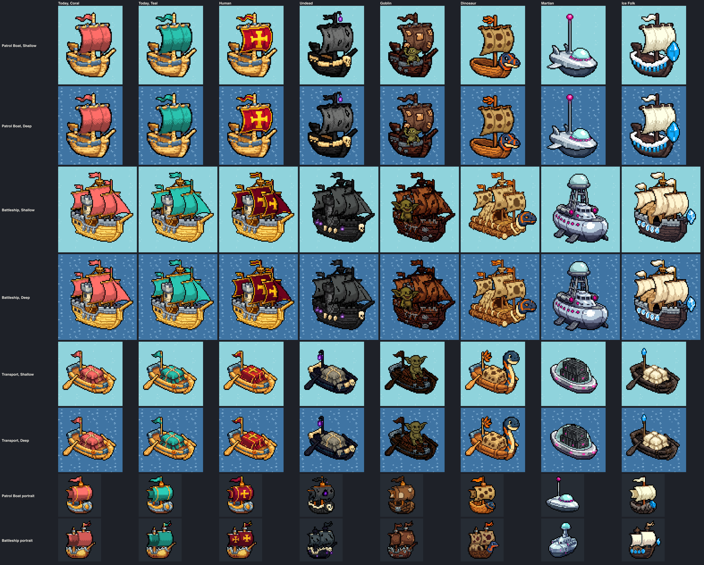
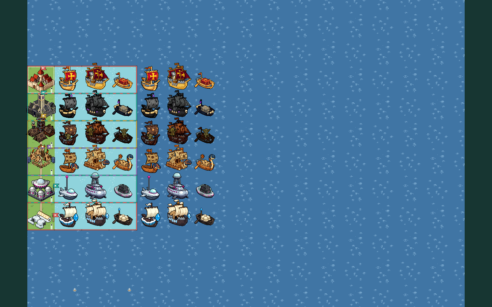
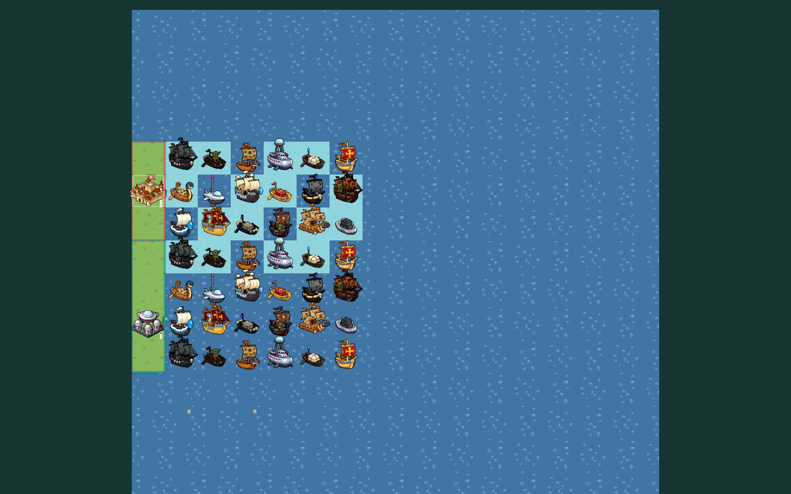

# Faction-styled naval units

**Status:** art made in bead `pulp_wars-w5j.2` (epic `pulp_wars-w5j`), **not
wired in yet**. The user (2026-10-03): "We have enough factions now that we
can enforce that every player plays a different faction. we can get rid of
the colored base plates and just let the faction esthetics do the job. the
exception are the naval units. you'll have to generate new sprites for the
naval stuff in the style of each faction." Bead `pulp_wars-w5j.3` removes the
base plates and the ships' rings and wires this art in (see the
[wiring list](#wiring-list-for-pulp_wars-w5j3)). The Dwarf naval units come
with the Dwarf art bead.

Until then every faction sails the shared ships of batch 4: one hull per
role, a sail (or tarp) in the owner key colour recoloured to the player
colour, standing in a thin player-coloured ring on the water.

## The naval sprites a player sees

From the engine (`src/engine/rules/ruleset-v7.ts`) and the art subjects
(`unitArtSubjectV7` in `src/assets/chibi-art-v7.ts`, `portraitSubjectV7` in
`src/assets/chibi-ui-art-v7.ts`):

| Piece                | Engine                                                                  | Today's subject and asset                             | Canvas, class         |
| -------------------- | ----------------------------------------------------------------------- | ----------------------------------------------------- | --------------------- |
| Patrol Boat          | role `PATROL_BOAT` (Shorecraft), every faction, identical rules         | `UNIT:PATROL_BOAT`, `chibi-patrol-boat`               | 72 x 88, `LARGE_UNIT` |
| Battleship           | role `BATTLESHIP` (Naval Engineering), every faction                    | `UNIT:BATTLESHIP`, `chibi-battleship`                 | 88 x 96, `GIANT_UNIT` |
| Embarked transport   | form `EMBARKED`: any land unit afloat (Move 2 on water) draws this boat | `UNIT:EMBARKED_TRANSPORT`, `chibi-embarked-transport` | 72 x 72, `LARGE_UNIT` |
| Patrol Boat portrait | training card, rewards, technology tree                                 | `PORTRAIT:PATROL_BOAT`, `chibi-portrait-patrol-boat`  | 48 x 48, `PORTRAIT`   |
| Battleship portrait  | as above                                                                | `PORTRAIT:BATTLESHIP`, `chibi-portrait-battleship`    | 48 x 48, `PORTRAIT`   |

The transport has no portrait: the dock shows the map sprite. **Martian**
naval pieces: the Patrol Boat and the Battleship are the ordinary roles, and
a Martian **foot** unit (Grunt, Ray Gunner, Shield Projector, Brain) embarks
at a Port into the transport, so the Martians need all five pieces too. A
self-launched Martian **machine** (Saucer, Tripod, Mothership, Colossus) is
drawn as itself over the water and needs none
([RULESET_7_MARTIANS.md section 13.1](../product/RULESET_7_MARTIANS.md#131-surfaces)).

So the bead made **30 rasters**: six factions x (Patrol Boat, Battleship,
transport, two portraits).

## The designs

Every piece keeps the canvas, class and anchor of the shared piece it
replaces (a test checks them, and that each hull's lowest row is within 4
rows of the shared hull's waterline). No piece has an owner area or a mask:
they register with `fixedColours`, like the land units of the new direction.

| Faction  | Patrol Boat                                                                                                      | Battleship                                                                                                    | Transport                                                                                             | Tell at a glance                                |
| -------- | ---------------------------------------------------------------------------------------------------------------- | ------------------------------------------------------------------------------------------------------------- | ----------------------------------------------------------------------------------------------------- | ----------------------------------------------- |
| Human    | the cog, pale polished hull with a gold rail trim; a deep crimson sail with a gold border and a big gold cross   | the carrack: three crimson sails with gold crosses, crimson pennants with gold tips, the grey stone castle    | the rowing barge with a crimson tarp, gold border and gold cross                                      | crimson and gold crosses                        |
| Undead   | a ghost ship: near-black hull, ivory bone rail, a big skull figurehead, tattered charcoal sail, violet lantern   | a black ghost galleon: tattered charcoal sails, black rags, bone studs, a skull figurehead, violet lanterns   | a black funeral barge, bone rail, skull prow, cargo under a tattered warm-grey shroud, violet lantern | black hull, bone, small violet lights           |
| Goblin   | a scrap junk-boat: dark planks, gunmetal patches, a patched brown leather sail, an olive goblin waving           | a scrap warship with brown leather sails and a big olive goblin shouting at the bow                           | a dark plank raft with barrels and an olive goblin sitting on the cargo                               | an olive goblin with sideways ears; dark brown  |
| Dinosaur | a dugout canoe with a spotted sandy hide sail and a carved blue plesiosaur-head prow with orange stripes         | a log war raft with three spotted hide sails, bone fittings, orange feathers and a big plesiosaur prow        | a log boat with a tall blue plesiosaur neck at the bow and the cargo under spotted hide               | spotted hide, the blue-and-orange plesiosaur    |
| Martian  | a chrome hover-boat: glass dome, gunmetal underside, fins, magenta rim lights, an antenna with a magenta orb     | a chrome hover-cruiser: glass-domed bridge on a lattice tower, magenta portholes and turret emitters          | a chrome saucer-barge with gunmetal crates and magenta lights under a glass canopy                    | chrome, glass and magenta; no sail              |
| Ice Folk | a hide longship: dark hull, white fur rail with ice-blue icicles, a big ice-crystal figurehead, cream-white sail | a war longship: dark hull with a row of ice-blue shields, three cream sails, fur pennants, crystal figurehead | a dark hide boat with the cargo under heaped cream fur and an ice crystal on the pole                 | white sails over a dark hull, ice-blue crystals |

Decisions taken in this bead (the brief's design intent, refined):

1. **Human:** the brief's "cog, carrack, war galley" are the three shared
   hulls as they are; only the sail, pennant and tarp change to the Human
   crimson and gold. The pale hull is kept: it is the cleanest of the six and
   keeps the Humans apart from the brown Goblin and Dinosaur hulls.
2. **Undead:** dark sails, not bone-white ones, as the brief asks; the bone
   rail, the skull and the violet lights carry it. The transport's shroud is
   a warm ash grey (hue 44, saturation 0.18) so the cargo reads on the black
   hull.
3. **Goblin:** the ships alone (planks, scrap, brown sails) did not say
   Goblin at native size; **a goblin crew member on every ship** does. The
   stray firework was dropped: a rocket is a small orange shape that
   competes with the Dinosaur accent.
4. **Dinosaur:** a **carved plesiosaur prow**, not a swimming dinosaur
   pulling a raft: a swimming animal would widen the footprint and put a
   body in the water the class text forbids. The transport's prow became a
   tall neck after the readability measure (below).
5. **Martian:** chrome hover-boats with no sail. The Patrol Boat's sail
   became an antenna with a magenta orb, so the boat keeps a tall shape at a
   glance and the cog's waterline. A fresh creation (`martian-patrol-boat-create-a`)
   drew a finer saucer-boat but floats 9 px above the waterline and reaches
   the HP bar strip; an edit could not move it.
6. **Ice Folk:** longships with white sails; "white fur" sails came out as
   cream-white cloth, and the ice (icicles, shields, crystals) is what makes
   them Ice Folk. The Battleship keeps the carrack's grey stone castle.
7. **Accents** are pinned by the existing presets, as on each faction's
   land units: `undead-violet`, `martian-magenta`, `ice-folk-blue`. The
   Human crimson, the Goblin browns and the Dinosaur orange are as drawn.
8. **Portraits** are edits of the batch-5 ship portraits with the same
   changes; the Martian Patrol Boat portrait was edited again to carry the
   antenna of the map sprite.

## Palettes, measured

The largest colour bins of each map sprite's body (opaque, brighter than
value 0.14), from
[`readability.json`](../../art/pixellab/reviews/chibi-batch-naval-factions/readability.json):

| Faction  | Main colours                                                                                    | Outline share |
| -------- | ----------------------------------------------------------------------------------------------- | ------------- |
| Human    | crimson `#c50d25`, `#850621` (Battleship `#6b021b`); gold `#fddb21`, `#ffdb6a`; hull `#aa6b27`  | 14% to 17%    |
| Undead   | charcoal `#737473`, `#535353`, `#4f5352`; near-black `#272525`; shroud `#827c6b`; violet lights | 42% to 51%    |
| Goblin   | leather `#80573f`, `#9c5224`; planks `#351611`, `#3c2111`; goblin olive `#736935`               | 34% to 52%    |
| Dinosaur | hide `#cda461`, `#debb78`; wood `#ab8344`, `#5d351b`; plesiosaur blue `#2c4b66`; orange         | 10% to 22%    |
| Martian  | chrome `#ccd8e0`, `#b6c9da`; gunmetal `#3d4c61`, `#222f45`; glass `#acf1ec`; magenta lights     | 15% to 26%    |
| Ice Folk | cream-white `#feffe6`, `#fef5d1`, `#dcd4b6`; hide `#3a2a2a`, `#554040`; ice blue `#0da8fa`      | 20% to 30%    |

No piece of the five non-Human factions has more than 1% of its pixels in
the owner key's band (hue 340 to 5, saturated); a test holds it. The Human
crimson is in that band (19% to 34%), as on the Human land units, which are
never recoloured. No pixel of any piece is within 12 (RGB) of a player
colour.

## Readability

`npm run art:chibi-naval-faction-review` measures the masters
(`readability.json`). CIE76 colour difference: about 10 is clear at a
glance, 20 and more are different colours; the WCAG luminance contrast in
brackets. Shallow Water is `#8fd3dc`, Deep Water `#4277a5` (40.6 apart).

**Against the water** (body mean of the three map sprites, and the share of
the body within 12 of the water):

| Faction  | On Shallow Water                | On Deep Water                   | Notes                                                                                                                                    |
| -------- | ------------------------------- | ------------------------------- | ---------------------------------------------------------------------------------------------------------------------------------------- |
| Human    | 67 to 72 (2.4 to 3.0); 0%       | 67 to 75 (1.0 to 1.2); 0%       | the warm hull is the water's complement; on Deep Water it reads by hue, not by lightness                                                 |
| Undead   | 48 to 55 (3.5 to 5.5); 0%       | 35 to 39 (1.2 to 1.9); 0%       | the darkest fleet; half outline and near-black, clearly darker than both waters                                                          |
| Goblin   | 64 to 73 (5.5 to 6.8); 0%       | 48 to 61 (1.9 to 2.4); 0%       | dark and warm on both waters                                                                                                             |
| Dinosaur | 61 to 68 (2.7 to 3.0); 0%       | 63 to 68 (1.0 to 1.1); 0%       | as the Humans: a warm hull reads by hue on Deep Water                                                                                    |
| Martian  | 27 to 38 (1.8 to 2.8); 3% to 7% | 20 to 25 (1.0 to 1.6); 0%       | **the weakest**: chrome and glass are cool and close to both waters; the outline, the gunmetal underside and the magenta lights carry it |
| Ice Folk | 23 to 45 (1.6 to 2.8); 0%       | 34 to 46 (1.0 to 1.8); 0% to 3% | the cream sails against Shallow Water are light on light (23 for the Patrol Boat); the dark hull and the outline separate them           |

**Between factions** (palette distance per role: each colour of one sprite
to the nearest colour of the other, weighted by area, both ways; under
deuteranopia in brackets). The full 6 x 6 matrices are in
`readability.json`.

| Pair (role)                    | Distance   | What tells them apart                                                                                     |
| ------------------------------ | ---------- | --------------------------------------------------------------------------------------------------------- |
| Ice Folk / Undead (transport)  | 10.4 (9.3) | both dark hulls; cream fur heap against a grey shroud, ice crystal against violet lantern                 |
| Dinosaur / Human (transport)   | 11.2 (6.1) | the same barge hull; the blue plesiosaur neck and spotted hide against the crimson tarp with a gold cross |
| Goblin / Undead (Patrol Boat)  | 11.5 (9.1) | brown sail and the olive goblin against a charcoal sail, bone and skull                                   |
| Goblin / Dinosaur (Battleship) | 11.6 (8.6) | dark planks and the goblin against light tawny logs and the blue prow                                     |
| Undead / Ice Folk (Battleship) | 12.4 (9.9) | black against cream sails over similar dark hulls                                                         |
| all other pairs                | 13 to 44   |                                                                                                           |

The measure is of colour only and weighs every pixel alike, so it
understates the pairs that share a dark hull but differ in their sails or
crew: Undead and Ice Folk battleships are black against cream sails. Seen
in the sheet at native size and at zoom 0.75 and in the captures, all six
fleets are told apart ship by ship; the weakest by eye are the Goblin and
Undead Patrol Boats (both dark; the goblin and the skull decide) and the
Human and Dinosaur transports (same barge; before the plesiosaur neck it was
the closest pair, 9.9 and 4.8 for a deuteranope).

## How it was made

Batches `naval-human`, `naval-undead`, `naval-goblin`, `naval-dinosaur`,
`naval-martian` and `naval-ice-folk` (one per faction, as the pipeline
requires): 30 assets from **48 recipes, 48 PixelLab calls**. Every accepted
piece is an `edit-image-pixen` edit of the accepted batch-4 ship
(`patrol-boat-a-edit`, `battleship-d-edit` candidate 1,
`embarked-transport-a-edit`) or batch-5 portrait
(`portrait-patrol-boat-a`, `portrait-battleship-b`), or of an earlier step
of its own chain; one fresh creation was tried and rejected.

| Faction  | Recipes | Accepted chains (map sprites; portraits as noted)                                                                                                                                                             |
| -------- | ------- | ------------------------------------------------------------------------------------------------------------------------------------------------------------------------------------------------------------- |
| Human    | 5       | one recolour edit each (`*-heraldic-a`): "Change only the colours of the sail and pennant …", the crimson by hex                                                                                              |
| Undead   | 5       | one rebuild edit each (`*-ghost-a`), then the `undead-violet` accent step                                                                                                                                     |
| Goblin   | 14      | rebuild (`*-scrap-a`: sails came out ochre-orange), saddle recolour (`*-saddle-edit-a`), crew (`*-crew-edit-a`); the transport's maroon planks recoloured (`-plank-edit-a`); portraits end at the saddle step |
| Dinosaur | 7       | one rebuild edit each (`*-primal-a`); the transport's neck (`-neck-edit-a`); the Battleship portrait's maroon lines recoloured (`-log-edit-a`)                                                                |
| Martian  | 10      | rebuild (`*-chrome-a`); Patrol Boat fin to antenna (`-chrome-a-edit`); transport cargo recolour (`-cargo-edit-a`, the red tarp showed under the glass); the portrait's antenna edit                           |
| Ice Folk | 7       | rebuild (`*-frost-a`); the Patrol Boat's icicles and crystal (`-icicle-edit-a`); the Battleship's red pennants (`-pennant-edit-a`)                                                                            |

Every rejected recipe carries its reason in the batch records. What the
edits taught, beyond the earlier batches' notes:

- **"Turn it into …" keeps the hull's footprint** and changes materials,
  figureheads and sails reliably; a sail can become a fin or an antenna.
- **Edits do not move a sprite.** "Move the whole boat down …" returned it
  unchanged, so a creation that floats above the waterline cannot be
  rescued; edit the shared hull instead.
- **Brown leather drifts to ochre-orange,** as in the Goblin production;
  the proven saddle wording ("dull desaturated mid-brown leather like an
  old saddle, colour `#8a4a1c` with `#5a2e10` shadows, not orange") fixes
  it in one edit.
- **"Dark brown" hulls can come back maroon** (hue 350, in the owner key's
  band); "dark brown wood, colour `#4a2c14` …, not red and not maroon"
  fixes it.
- **Red left behind:** a part the edit did not name (pennants, the cargo
  under the tarp) keeps the source's key red; name every red part.
- **A crew member is the strongest faction tell** for a faction whose
  materials are close to another's.

Recipes are in `scripts/art/chibi/batches/batch-naval-*.json`, the subject
lines (`UNIT:<FACTION>:<ROLE>`, `PORTRAIT:<FACTION>:<ROLE>`, and
`…/HERALDIC` for the Humans) in `scripts/art/chibi/subjects/*.json`.

## Evidence

`npm run art:chibi-naval-faction-review` writes
[`art/pixellab/reviews/chibi-batch-naval-factions/`](../../art/pixellab/reviews/chibi-batch-naval-factions/):
`naval-sheet-{x4,1x}.png` and `naval-sheet-zoom-0.75.png`,
`readability.json`, `scene-{coast,mixed}-{desktop,phone}-zoom-{1,0.75}.png`
and `index.json`. The scenes
([`scene.ts`](../../scripts/art/naval-factions/scene.ts)) are drawn by the
real board host in the live look **with `unit.base: "NONE"`**: no plates and
no rings. Since the naval subjects are not wired, each faction's three
sprites are registered under three of its own land subjects (FIGHTER,
GUARD, MARKSMAN) and drawn as land-form units on water cells.

## Weak spots

- **Martian chrome on water** is the lowest contrast (20 to 38); the
  outline, gunmetal and magenta carry it. The Martian Patrol Boat is small
  and low (an antenna in place of a sail).
- **The Goblin goblins are large**, the Battleship's most of all; the
  transport's goblin hides most of the tarp.
- **Undead and Goblin Patrol Boats** are the two darkest; at zoom 0.75 the
  skull and the goblin decide.
- **The Ice Folk Battleship keeps the carrack's grey stone castle**, and its
  sails are cream cloth, not shaggy fur.
- **Human and Dinosaur transports** share the barge's silhouette; the
  plesiosaur neck and the colours tell them apart.
- **The Martian Battleship's fins** hang below the hull like short legs.
- **Dinosaur and Human hulls are warm wood on Deep Water** at near-equal
  lightness (contrast 1.0 to 1.2): they read by hue, not by value.
- **The Undead Battleship portrait** has no skull at 48 px.

## Wiring list for `pulp_wars-w5j.3`

The art is in
[`chibi-naval-faction-art-manifest.ts`](../../src/assets/chibi-naval-faction-art-manifest.ts)
(`CHIBI_NAVAL_FACTION_ART_ASSETS_V7`, 30 entries with `faction`, `role`,
`kind` and `asset`), which no game module imports.

1. **Subjects.** Add `UNIT:<FACTION>:PATROL_BOAT|BATTLESHIP|EMBARKED_TRANSPORT`
   and `PORTRAIT:<FACTION>:PATROL_BOAT|BATTLESHIP` for `UNDEAD`, `GOBLIN`,
   `DINOSAUR`, `MARTIAN` and `ICE_FOLK` to `ArtSubjectV7`
   (`src/assets/chibi-art-v7.ts`); `NavalFactionArtSubjectV7` lists them.
   Then `ChibiNavalArtAssetV7` can become `ChibiArtAssetV7`.
2. **Map sprites.** In `unitArtSubjectV7`, return the faction subject for
   the two naval roles and for the `EMBARKED` form of a non-Human faction;
   the Humans keep `UNIT:PATROL_BOAT`, `UNIT:BATTLESHIP` and
   `UNIT:EMBARKED_TRANSPORT`. Keep the two Martian rules first: a
   self-launched machine afloat is drawn as itself, and a Thrall returns
   `UNIT:MARTIAN:THRALL` before the embarked check today (decide whether an
   embarked Thrall should be a Martian transport instead).
3. **Portraits.** `portraitSubjectV7` (`src/assets/chibi-ui-art-v7.ts`)
   returns `PORTRAIT:<ROLE>` for the naval roles of every faction
   (`NAVAL_ROLES`); return
   `PORTRAIT:<FACTION>:<ROLE>` for the five non-Human factions.
4. **Registry.** Add `CHIBI_NAVAL_FACTION_ART_ASSETS_V7.map((entry) =>
entry.asset)` to the direction registry (`chibiDirectionArtRegistryV7`).
   The Human entries take the shared subjects in the direction registry, as
   the Human land units do, so a Human ship is drawn crimson and gold.
5. **Fallback.** `chibiFallbackSubjectV7` already maps `UNIT:GOBLIN:PATROL_BOAT`
   to `UNIT:PATROL_BOAT`. Check what a failed faction raster then resolves
   to: through the direction registry it would be the **Human** crimson
   ship; it should be the classic masked ship in the owner colour (or the
   faction's look should fail as a whole).
6. **Plates and rings.** Remove the ships' ring and the sail exception:
   `directionUnitAfloatV7`, the afloat branch of `drawDirectedUnitBaseV7`
   and the ship case of `ownerAreas` in
   `src/render/canvas/visual-direction-v7.ts`. With fixed colours the sail
   is no longer the owner's marker; a new ready cue is part of w5j.3.
7. **Tests to update:** the Dinosaur production test that finds the ships
   alone without a fixed-colour asset; `chibi-naval-faction-assets.test.ts`
   ("is not wired in") turns round, as the Martian and Ice Folk tests did.
8. **Review.** Rerun `npm run art:chibi-naval-faction-review`; its scene can
   then register the art under the real subjects instead of the land
   stand-ins.
