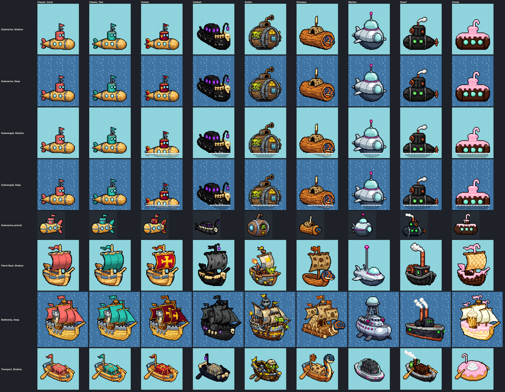
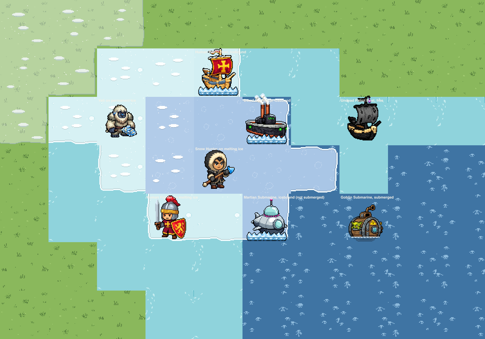
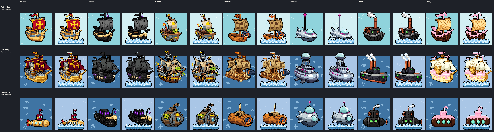
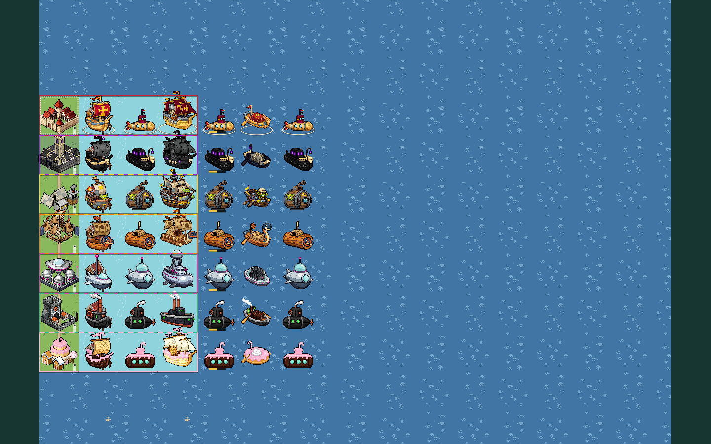

# Faction-styled naval units

**Status:** art made in bead `pulp_wars-w5j.2` (epic `pulp_wars-w5j`),
**wired in by bead `pulp_wars-w5j.3`**: in the default (live) look every
faction sails its own ships, transport and ship portraits, with no ring and
no player-coloured sail (see the [wiring](#wiring-done-in-pulp_wars-w5j3)).
The user (2026-10-03): "We have enough factions now that we can enforce
that every player plays a different faction. we can get rid of the colored
base plates and just let the faction esthetics do the job. the exception
are the naval units. you'll have to generate new sprites for the naval
stuff in the style of each faction." The base plates went in the same bead
([VISUAL_DIRECTION_2026-10.md section 20](VISUAL_DIRECTION_2026-10.md#20-faction-looks-instead-of-base-plates)).
The Dwarf naval units come with the Dwarf art bead; the wiring is by
faction, so they need only their registry entries.

The Classic look and LEGACY keep the shared ships of batch 4: one hull per
role, a sail (or tarp) in the owner key colour recoloured to the player
colour (the Classic look never had the ring).

## The naval sprites a player sees

From the engine (`src/engine/rules/ruleset-v7.ts`) and the art subjects
(`unitArtSubjectV7` in `src/assets/chibi-art-v7.ts`, `portraitSubjectV7` in
`src/assets/chibi-ui-art-v7.ts`):

| Piece                | Engine                                                                  | Shared subject and asset (Classic look)               | Canvas, class         |
| -------------------- | ----------------------------------------------------------------------- | ----------------------------------------------------- | --------------------- |
| Patrol Boat          | role `PATROL_BOAT` (Shorecraft), every faction, identical rules         | `UNIT:PATROL_BOAT`, `chibi-patrol-boat`               | 72 x 88, `LARGE_UNIT` |
| Battleship           | role `BATTLESHIP` (Naval Engineering), every faction                    | `UNIT:BATTLESHIP`, `chibi-battleship`                 | 88 x 96, `GIANT_UNIT` |
| Embarked transport   | form `EMBARKED`: any land unit afloat (Move 2 on water) draws this boat | `UNIT:EMBARKED_TRANSPORT`, `chibi-embarked-transport` | 72 x 72, `LARGE_UNIT` |
| Patrol Boat portrait | training card, rewards, technology tree                                 | `PORTRAIT:PATROL_BOAT`, `chibi-portrait-patrol-boat`  | 48 x 48, `PORTRAIT`   |
| Battleship portrait  | as above                                                                | `PORTRAIT:BATTLESHIP`, `chibi-portrait-battleship`    | 48 x 48, `PORTRAIT`   |

The transport has no portrait: the dock shows the map sprite. **Martian**
naval pieces: the Patrol Boat and the Battleship are the ordinary roles, and
a Martian **foot** unit (Grunt, Ray Gunner, Shield Projector, Brain) embarks
at a Port into the transport, so the Martians need all five pieces too. A
self-launched Martian **machine** (Saucer, Tripod, Mothership, Colossus) is
drawn as itself over the water and needs none
([RULESET_7_MARTIANS.md section 13.1](../product/RULESET_7_MARTIANS.md#131-surfaces)).

So the bead made **30 rasters**: six factions x (Patrol Boat, Battleship,
transport, two portraits).

The **Submarine** of the naval branch (role `SUBMARINE`, Submersibles) and
its portrait came later, with the branch's icons and the Ice Folk sea ice:
see [the naval branch art](#the-naval-branch-art-bead-pulp_wars-5ti6).

## The designs

Every piece keeps the canvas, class and anchor of the shared piece it
replaces (a test checks them, and that each hull's lowest row is within 4
rows of the shared hull's waterline). No piece has an owner area or a mask:
they register with `fixedColours`, like the land units of the new direction.

| Faction  | Patrol Boat                                                                                                       | Battleship                                                                                                    | Transport                                                                                             | Tell at a glance                                |
| -------- | ----------------------------------------------------------------------------------------------------------------- | ------------------------------------------------------------------------------------------------------------- | ----------------------------------------------------------------------------------------------------- | ----------------------------------------------- |
| Human    | the cog, pale polished hull with a gold rail trim; a deep crimson sail with a gold border and a big gold cross    | the carrack: three crimson sails with gold crosses, crimson pennants with gold tips, the grey stone castle    | the rowing barge with a crimson tarp, gold border and gold cross                                      | crimson and gold crosses                        |
| Undead   | a ghost ship: near-black hull, ivory bone rail, a big skull figurehead, tattered charcoal sail, violet lantern    | a black ghost galleon: tattered charcoal sails, black rags, bone studs, a skull figurehead, violet lanterns   | a black funeral barge, bone rail, skull prow, cargo under a tattered warm-grey shroud, violet lantern | black hull, bone, small violet lights           |
| Goblin   | a scrap junk-boat: brown hull with tin patches, a pale sand sail with a hazard yellow patch, a firework, a goblin | a scrap warship with pale sand sails, tin plates, hazard stripes, a tin lookout tower and two yellow rags     | a low rowing raft with oars, tin patches, a hazard yellow rag and a goblin in a sand hat              | a lime goblin; tin, pale sails, hazard yellow   |
| Dinosaur | a dugout canoe with a spotted sandy hide sail and a carved blue plesiosaur-head prow with orange stripes          | a log war raft with three spotted hide sails, bone fittings, orange feathers and a big plesiosaur prow        | a log boat with a tall blue plesiosaur neck at the bow and the cargo under spotted hide               | spotted hide, the blue-and-orange plesiosaur    |
| Martian  | a chrome hover-boat: glass dome, gunmetal underside, fins, magenta rim lights, an antenna with a magenta orb      | a chrome hover-cruiser: glass-domed bridge on a lattice tower, magenta portholes and turret emitters          | a chrome saucer-barge with gunmetal crates and magenta lights under a glass canopy                    | chrome, glass and magenta; no sail              |
| Ice Folk | a hide longship: dark hull, white fur rail with ice-blue icicles, a big ice-crystal figurehead, cream-white sail  | a war longship: dark hull with a row of ice-blue shields, three cream sails, fur pennants, crystal figurehead | a dark hide boat with the cargo under heaped cream fur and an ice crystal on the pole                 | white sails over a dark hull, ice-blue crystals |

Decisions taken in this bead (the brief's design intent, refined):

1. **Human:** the brief's "cog, carrack, war galley" are the three shared
   hulls as they are; only the sail, pennant and tarp change to the Human
   crimson and gold. The pale hull is kept: it is the cleanest of the six and
   keeps the Humans apart from the brown Goblin and Dinosaur hulls.
2. **Undead:** dark sails, not bone-white ones, as the brief asks; the bone
   rail, the skull and the violet lights carry it. The transport's shroud is
   a warm ash grey (hue 44, saturation 0.18) so the cargo reads on the black
   hull.
3. **Goblin:** the ships alone (planks, scrap, brown sails) did not say
   Goblin at native size; **a goblin crew member on every ship** does. The
   stray firework was dropped: a rocket is a small orange shape that
   competes with the Dinosaur accent.
4. **Dinosaur:** a **carved plesiosaur prow**, not a swimming dinosaur
   pulling a raft: a swimming animal would widen the footprint and put a
   body in the water the class text forbids. The transport's prow became a
   tall neck after the readability measure (below).
5. **Martian:** chrome hover-boats with no sail. The Patrol Boat's sail
   became an antenna with a magenta orb, so the boat keeps a tall shape at a
   glance and the cog's waterline. A fresh creation (`martian-patrol-boat-create-a`)
   drew a finer saucer-boat but floats 9 px above the waterline and reaches
   the HP bar strip; an edit could not move it.
6. **Ice Folk:** longships with white sails; "white fur" sails came out as
   cream-white cloth, and the ice (icicles, shields, crystals) is what makes
   them Ice Folk. The Battleship keeps the carrack's grey stone castle.
7. **Accents** are pinned by the existing presets, as on each faction's
   land units: `undead-violet`, `martian-magenta`, `ice-folk-blue`. The
   Human crimson, the Goblin browns and the Dinosaur orange are as drawn.
8. **Portraits** are edits of the batch-5 ship portraits with the same
   changes; the Martian Patrol Boat portrait was edited again to carry the
   antenna of the map sprite.

## Palettes, measured

The largest colour bins of each map sprite's body (opaque, brighter than
value 0.14), from
[`readability.json`](../../art/pixellab/reviews/chibi-batch-naval-factions/readability.json):

| Faction  | Main colours                                                                                      | Outline share |
| -------- | ------------------------------------------------------------------------------------------------- | ------------- |
| Human    | crimson `#c50d25`, `#850621` (Battleship `#6b021b`); gold `#fddb21`, `#ffdb6a`; hull `#aa6b27`    | 14% to 17%    |
| Undead   | charcoal `#737473`, `#535353`, `#4f5352`; near-black `#272525`; shroud `#827c6b`; violet lights   | 42% to 51%    |
| Goblin   | sails `#f3e3c8`, `#e2c892`; tin `#899a9c`, `#7d8b91`; hull `#ac6f41`, `#6b381b`; hazard `#fcd701` | 22% to 33%    |
| Dinosaur | hide `#cda461`, `#debb78`; wood `#ab8344`, `#5d351b`; plesiosaur blue `#2c4b66`; orange           | 10% to 22%    |
| Martian  | chrome `#ccd8e0`, `#b6c9da`; gunmetal `#3d4c61`, `#222f45`; glass `#acf1ec`; magenta lights       | 15% to 26%    |
| Ice Folk | cream-white `#feffe6`, `#fef5d1`, `#dcd4b6`; hide `#3a2a2a`, `#554040`; ice blue `#0da8fa`        | 20% to 30%    |

No piece of the five non-Human factions has more than 1% of its pixels in
the owner key's band (hue 340 to 5, saturated); a test holds it. The Human
crimson is in that band (19% to 34%), as on the Human land units, which are
never recoloured. No pixel of any piece is within 12 (RGB) of a player
colour.

## Readability

`npm run art:chibi-naval-faction-review` measures the masters
(`readability.json`). CIE76 colour difference: about 10 is clear at a
glance, 20 and more are different colours; the WCAG luminance contrast in
brackets. Shallow Water is `#8fd3dc`, Deep Water `#4277a5` (40.6 apart).

**Against the water** (body mean of the three map sprites, and the share of
the body within 12 of the water):

| Faction  | On Shallow Water                | On Deep Water                   | Notes                                                                                                                                    |
| -------- | ------------------------------- | ------------------------------- | ---------------------------------------------------------------------------------------------------------------------------------------- |
| Human    | 67 to 72 (2.4 to 3.0); 0%       | 67 to 75 (1.0 to 1.2); 0%       | the warm hull is the water's complement; on Deep Water it reads by hue, not by lightness                                                 |
| Undead   | 48 to 55 (3.5 to 5.5); 0%       | 35 to 39 (1.2 to 1.9); 0%       | the darkest fleet; half outline and near-black, clearly darker than both waters                                                          |
| Goblin   | 49 to 60 (2.4 to 3.3); 0%       | 55 to 63 (1.1 to 1.2); 0%       | since the redesign a warm mid-value fleet like the Humans': it reads by hue on Deep Water                                                |
| Dinosaur | 61 to 68 (2.7 to 3.0); 0%       | 63 to 68 (1.0 to 1.1); 0%       | as the Humans: a warm hull reads by hue on Deep Water                                                                                    |
| Martian  | 27 to 38 (1.8 to 2.8); 3% to 7% | 20 to 25 (1.0 to 1.6); 0%       | **the weakest**: chrome and glass are cool and close to both waters; the outline, the gunmetal underside and the magenta lights carry it |
| Ice Folk | 23 to 45 (1.6 to 2.8); 0%       | 34 to 46 (1.0 to 1.8); 0% to 3% | the cream sails against Shallow Water are light on light (23 for the Patrol Boat); the dark hull and the outline separate them           |

**Between factions** (palette distance per role: each colour of one sprite
to the nearest colour of the other, weighted by area, both ways; under
deuteranopia in brackets). The full 6 x 6 matrices are in
`readability.json`.

| Pair (role)                    | Distance   | What tells them apart                                                                                     |
| ------------------------------ | ---------- | --------------------------------------------------------------------------------------------------------- |
| Ice Folk / Undead (transport)  | 10.4 (9.3) | both dark hulls; cream fur heap against a grey shroud, ice crystal against violet lantern                 |
| Dinosaur / Human (transport)   | 11.2 (6.1) | the same barge hull; the blue plesiosaur neck and spotted hide against the crimson tarp with a gold cross |
| Goblin / Ice Folk (Battleship) | 10.1 (8.4) | both pale sails over a dark hull; tin plates, a tin tower, yellow rags and a goblin against ice crystals  |
| Undead / Ice Folk (Battleship) | 12.4 (9.9) | black against cream sails over similar dark hulls                                                         |
| all other pairs                | 13 to 44   |                                                                                                           |

The measure is of colour only and weighs every pixel alike, so it
understates the pairs that share a dark hull but differ in their sails or
crew: Undead and Ice Folk battleships are black against cream sails. Seen
in the sheet at native size and at zoom 0.75 and in the captures, all six
fleets are told apart ship by ship; the weakest by eye are the Goblin and
Ice Folk Battleships (both pale sails; the tin tower with its yellow rags
and the ice-blue crystals decide) and the Human and Dinosaur transports (same barge; before the plesiosaur neck it was
the closest pair, 9.9 and 4.8 for a deuteranope).

The Goblin row is the fleet as **redrawn by bead `pulp_wars-wrn.2`** (see
[the Goblin fleet redrawn](#the-goblin-fleet-redrawn-bead-pulp_wars-wrn2));
the sheets and captures linked here show it.

## How it was made

Batches `naval-human`, `naval-undead`, `naval-goblin`, `naval-dinosaur`,
`naval-martian` and `naval-ice-folk` (one per faction, as the pipeline
requires): 30 assets from **48 recipes, 48 PixelLab calls**. Every accepted
piece is an `edit-image-pixen` edit of the accepted batch-4 ship
(`patrol-boat-a-edit`, `battleship-d-edit` candidate 1,
`embarked-transport-a-edit`) or batch-5 portrait
(`portrait-patrol-boat-a`, `portrait-battleship-b`), or of an earlier step
of its own chain; one fresh creation was tried and rejected.

| Faction  | Recipes | Accepted chains (map sprites; portraits as noted)                                                                                                                                                             |
| -------- | ------- | ------------------------------------------------------------------------------------------------------------------------------------------------------------------------------------------------------------- |
| Human    | 5       | one recolour edit each (`*-heraldic-a`): "Change only the colours of the sail and pennant …", the crimson by hex                                                                                              |
| Undead   | 5       | one rebuild edit each (`*-ghost-a`), then the `undead-violet` accent step                                                                                                                                     |
| Goblin   | 14      | rebuild (`*-scrap-a`: sails came out ochre-orange), saddle recolour (`*-saddle-edit-a`), crew (`*-crew-edit-a`); the transport's maroon planks recoloured (`-plank-edit-a`); portraits end at the saddle step |
| Dinosaur | 7       | one rebuild edit each (`*-primal-a`); the transport's neck (`-neck-edit-a`); the Battleship portrait's maroon lines recoloured (`-log-edit-a`)                                                                |
| Martian  | 10      | rebuild (`*-chrome-a`); Patrol Boat fin to antenna (`-chrome-a-edit`); transport cargo recolour (`-cargo-edit-a`, the red tarp showed under the glass); the portrait's antenna edit                           |
| Ice Folk | 7       | rebuild (`*-frost-a`); the Patrol Boat's icicles and crystal (`-icicle-edit-a`); the Battleship's red pennants (`-pennant-edit-a`)                                                                            |

Every rejected recipe carries its reason in the batch records. What the
edits taught, beyond the earlier batches' notes:

- **"Turn it into …" keeps the hull's footprint** and changes materials,
  figureheads and sails reliably; a sail can become a fin or an antenna.
- **Edits do not move a sprite.** "Move the whole boat down …" returned it
  unchanged, so a creation that floats above the waterline cannot be
  rescued; edit the shared hull instead.
- **Brown leather drifts to ochre-orange,** as in the Goblin production;
  the proven saddle wording ("dull desaturated mid-brown leather like an
  old saddle, colour `#8a4a1c` with `#5a2e10` shadows, not orange") fixes
  it in one edit.
- **"Dark brown" hulls can come back maroon** (hue 350, in the owner key's
  band); "dark brown wood, colour `#4a2c14` …, not red and not maroon"
  fixes it.
- **Red left behind:** a part the edit did not name (pennants, the cargo
  under the tarp) keeps the source's key red; name every red part.
- **A crew member is the strongest faction tell** for a faction whose
  materials are close to another's.

Recipes are in `scripts/art/chibi/batches/batch-naval-*.json`, the subject
lines (`UNIT:<FACTION>:<ROLE>`, `PORTRAIT:<FACTION>:<ROLE>`, and
`…/HERALDIC` for the Humans) in `scripts/art/chibi/subjects/*.json`.

## Evidence

`npm run art:chibi-naval-faction-review` writes
[`art/pixellab/reviews/chibi-batch-naval-factions/`](../../art/pixellab/reviews/chibi-batch-naval-factions/):
`naval-sheet-{x4,1x}.png` and `naval-sheet-zoom-0.75.png`,
`readability.json`, `scene-{coast,mixed}-{desktop,phone}-zoom-{1,0.75}.png`
and `index.json`. The scenes
([`scene.ts`](../../scripts/art/naval-factions/scene.ts)) are drawn by the
real board host in the live look exactly as the game passes it (since bead
`pulp_wars-w5j.3`): the naval art from the live registry under the
subjects the game asks for, naval-form Patrol Boats and Battleships and an
embarked Fighter as the transport, no plates and no rings. Each faction's
Patrol Boat is docked at a Port in front of its city, the viewer's (Human)
ships carry the ready ring, and some ships are damaged (until w5j.3 the
art was registered under three land subjects of each faction and drawn
without the ready cue). `npm run art:faction-looks-review` captures the
same scenes beside the land armies.

## The Goblin fleet redrawn (bead `pulp_wars-wrn.2`)

The Goblin ships above were the darkest pieces of the faction (mean L\* 22
to 27, the Battleship with no lit pixel) and went with the land roster when
the user asked for the [Goblin redesign](factions/GOBLIN.md#redesign-october-2026-lime-sand-and-hazard-paint).
The five assets keep their ids, subjects, canvases and anchors; their new
recipes are **fresh creations** (`create-image-pixen` with the `ship` class,
the portraits with the `icon` class) from the study's lime run, followed by
edits of those creations: water removed under the Patrol Boat, a red and a
blue flag turned into hazard yellow rags, the mast and sail removed from the
transport, and the Battleship goblin's salmon ear (13 pixels of the Coral
player colour, caught by the asset test) made lime. 10 recipes, 11 PixelLab
jobs (one failed and was retried). The fourteen recipes of the first fleet
stay in the batch as history.

- **Waterline.** A fresh creation floats where Pixen draws it (the Patrol
  Boat came 5 px high). The three ship assets name a `bottomMargin` (8, 11
  and 13, the shared ships' margins), which seats the sprite by whole
  pixels; the test's 4-row tolerance is met exactly.
- **Accent.** Every piece names the `goblin-hazard` preset, which pins the
  yellow paint to the faction colour.
- **Values.** Mean L\* 49 (Patrol Boat), 53 (Battleship) and 42 (transport),
  from 27, 23 and 22; the outline share fell from 34 to 52% to 22 to 33%.

## Weak spots

- **Goblin and Ice Folk Battleships** both carry pale sails over a dark
  hull since the Goblin redesign (palette distance 10.1, 8.4 for a
  deuteranope: the closest pair); the tin tower, the yellow rags and the
  goblin against the ice crystals tell them apart.
- **The Goblin Battleship portrait** has a few teal and green lights along
  its rail, and the transport's hull is the darkest piece of the new fleet.

- **Martian chrome on water** is the lowest contrast (20 to 38); the
  outline, gunmetal and magenta carry it. The Martian Patrol Boat is small
  and low (an antenna in place of a sail).
- **The Ice Folk Battleship keeps the carrack's grey stone castle**, and its
  sails are cream cloth, not shaggy fur.
- **Human and Dinosaur transports** share the barge's silhouette; the
  plesiosaur neck and the colours tell them apart.
- **The Martian Battleship's fins** hang below the hull like short legs.
- **Dinosaur and Human hulls are warm wood on Deep Water** at near-equal
  lightness (contrast 1.0 to 1.2): they read by hue, not by value.
- **The Undead Battleship portrait** has no skull at 48 px.

## Wiring (done in `pulp_wars-w5j.3`)

The art is in
[`chibi-naval-faction-art-manifest.ts`](../../src/assets/chibi-naval-faction-art-manifest.ts)
(`CHIBI_NAVAL_FACTION_ART_ASSETS_V7`, 30 entries with `faction`, `role`,
`kind` and `asset`). The wiring list of bead `pulp_wars-w5j.2`, as done:

1. **Subjects.** `ArtSubjectV7` (`src/assets/chibi-art-v7.ts`) includes
   `NavalFactionArtSubjectV7`: `UNIT:<FACTION>:PATROL_BOAT|BATTLESHIP|EMBARKED_TRANSPORT`
   and `PORTRAIT:<FACTION>:PATROL_BOAT|BATTLESHIP` for **every faction but
   the Humans**, defined by `FactionIdV7`, so a faction the engine adds
   (the Dwarves) has its naval subjects at once. `navalArtSubjectV7(faction,
kind, role)` names them (the shared subject for the Humans);
   `ChibiNavalArtAssetV7` is gone, the entries are `ChibiArtAssetV7`.
2. **Map sprites.** `unitArtSubjectV7` returns the owner faction's subject
   for the two naval roles and for the `EMBARKED` form; the Humans keep
   `UNIT:PATROL_BOAT`, `UNIT:BATTLESHIP` and `UNIT:EMBARKED_TRANSPORT`. The
   Martian machine rule stays first: a self-launched machine afloat is
   drawn as itself. An embarked mind-controlled unit draws **its own
   kind's** transport (bead `pulp_wars-b5f.3`: the subject reads the
   unit's kind, and "embarked foot units keep the transport",
   [RULESET_7_MARTIANS.md section 13.1](../product/RULESET_7_MARTIANS.md#131-surfaces)),
   under its control halo. (The retired Thrall drew the Martian transport,
   decided in w5j.3.)
3. **Portraits.** `portraitSubjectV7` returns `PORTRAIT:<FACTION>:<ROLE>`
   for the naval roles (the Humans' `PORTRAIT:<ROLE>`). By the same rule
   the Naval Engineering card shows the faction's Battleship and the
   Disembark command its transport.
4. **Registry.** `chibiDirectionArtRegistryV7` adds every entry, so the
   live look (board and interface) resolves them first; the Human entries
   take the shared subjects, so a Human ship is drawn crimson and gold. The
   Classic look and LEGACY never see them.
5. **Fallback.** `chibiFallbackSubjectV7` maps any faction's naval subject
   to the shared one (`navalSharedSubjectV7`). A faction's ship whose own
   raster is missing or failed to load is drawn as the **classic shared
   ship with its sail in the owner's colour**, never the Human direction
   ship: `createDirectedChibiArtV7` (board) and `createChibiDomArtV7`
   (interface) resolve that stand-in from the classic art.
6. **Plates and rings.** The ships' ring, the afloat branch of the plate and
   the sail exception of `ownerAreas` are gone: a unit afloat gets no plate
   and no ring in any direction (a ready one has the ready ring round its
   hull), and `directionUnitAfloatV7` recognises every faction's naval
   subject. The new ready cue is the ground ring of
   [VISUAL_DIRECTION_2026-10.md section 20](VISUAL_DIRECTION_2026-10.md#20-faction-looks-instead-of-base-plates).
7. **Tests.** The Dinosaur production test finds no owned subject without
   a fixed-colour asset; `chibi-naval-faction-assets.test.ts` checks that
   the live registry holds every entry on the subject the game asks for
   and the classic registry none; `visual-direction-render-v7.test.ts`
   draws a faction's ship and its stand-in.
8. **Review.** `npm run art:chibi-naval-faction-review` was rerun; its
   scene registers nothing of its own and draws the live look as the game
   does (see [Evidence](#evidence)).

## The naval branch art (bead `pulp_wars-5ti.6`)

**Status (`pulp_wars-5ti.9`):** the naval branch is folded into the current
rules, which state what this art draws
([section 14](../product/RULESET_7_CURRENT.md#14-naval-rules), the ships;
[section 21.16](../product/RULESET_7_CURRENT.md#2116-the-frozen-sea), the
frozen sea). The art and its wiring below are live; a Freeze action icon
and dedicated icons for the five Ice Folk Naval technologies are open
(`pulp_wars-5ti.10`).

Art of the [naval branch](../product/RULESET_7_NAVAL_BRANCH.md#143-what-the-art-bead-must-draw-bead-5ti6):
the Submarine of every seafaring faction and of the Classic look, with its
portrait; the two technology icons and the Ram, Board and Torpedo icons;
the Ice Folk sea ice over both waters and the Icebound pack ice. 26 PixelLab
assets from 58 recipes (58 calls: 24 accepted, 34 rejected, each with its
reason in the records), and 7 sprites derived by script.

### The Submarines

| Faction  | Submarine                                                                                                                | Tell beside its own fleet                         |
| -------- | ------------------------------------------------------------------------------------------------------------------------ | ------------------------------------------------- |
| Classic  | a pale birch cigar hull with steel bands and two portholes; conning tower, pennant and tail fin in the owner's colour    | no sail: a tower and a fin                        |
| Human    | the shared Submarine with a crimson tower carrying a gold cross, a gold-tipped pennant and a gold-edged fin              | as the Classic one, in crimson and gold           |
| Undead   | a long low closed black hull with barnacle studs, the bone rail and skull, a humped cabin with violet windows, lantern   | violet windows low on the hull, no mast           |
| Goblin   | a diving barrel of the fleet's planks and tin hoops, the lime goblin at the hatch window, a periscope pipe, hazard sign  | a barrel on its side with one big porthole        |
| Dinosaur | a closed tree-trunk log with bark and a sawn end, the plesiosaur head at the bow end, a spotted hide hatch, a bone reed  | a log with no sail; the hide is on the hatch      |
| Martian  | a round chrome bathysphere: gunmetal underside, glass dome, a big side porthole, fins, magenta light band and antenna    | a ball, where the Patrol Boat is a flat saucer    |
| Dwarf    | a soot-iron cigar hull with grey bands, a low tower with a copper hatch wheel and a short funnel, two green portholes    | green portholes on a long hull, no paddle wheel   |
| Candy    | a level stubby dark chocolate capsule with dripping pink frosting, three mint portholes, a tower, a candy-cane periscope | a capsule with portholes; the periscope is a cane |

Decisions:

1. **Eight, not seven.** The overlay's table lists six factions and the
   Classic one; the Candy joined later as a seafaring faction
   ([section 20](../product/RULESET_7_NAVAL_BRANCH.md#20-engine-step-i-as-built-pulp_wars-5ti2)),
   so it has one too. Its design is this bead's: the fleet's chocolate and
   pink frosting as a capsule.
2. **The Ice Folk have none.** They lose their ships in engine step II.
   Until then an Ice Folk Submarine (they may train one in step I) is drawn
   as the shared Submarine in the owner's colour, the fallback of any
   faction naval subject without a raster.
3. **Every map sprite is an edit of that fleet's accepted Patrol Boat**
   ("Turn it into …", a `sibling` source in the same batch), so planks, tin,
   chrome and chocolate are the fleet's own; the Human one is the shared
   Submarine recoloured, as the Human Patrol Boat is the shared cog. A fresh
   creation was tried beside the first three edits and rejected each time:
   more detailed and shaded than the fleet's flat style.
4. **The Dwarf one is soot iron and copper**, as the Dwarf fleet is; the
   overlay's "brass" is the copper of the fleet's fittings.
5. **The Goblin is lime**, as the redrawn fleet's crew (the overlay's
   "olive" predates the redesign).
6. **The Dinosaur one is a log**, not an animal: the first edit read as a
   swimming turtle on four flippers and was rejected; the accepted one asks
   for "no legs, no flippers: a log boat".
7. **Portraits** are edits of each fleet's Patrol Boat portrait with the
   same instruction (the Classic one of the batch-5 portrait). The Classic
   portrait's red tower, pennant and fin were enlarged by a second edit: the
   first had 10.9% owner colour, under the mask QA floor.
8. **Anchor.** A Submarine is longer than a cog's hull (57 to 62 px on the
   72 px canvas), so every Submarine map sprite, shared and faction,
   surfaced and submerged, is anchored at (32, 48): drawn 4 px right of the
   class placement, clear of the HP bar and seat badge strips
   (`SUBMARINE_ANCHOR_V7`; a test holds it). The first Candy Submarine was
   69 px wide and was replaced by a stubbier one.
9. **Waterline.** The shared one is an edit that asked for the submarine
   "lying low at the very bottom of the image, exactly where the boat's hull
   is now" (an owned asset cannot be seated), which put its keel on the cog's
   row; the faction ones name `bottomMargin: 8`, the Patrol Boat's.

Measured on the masters
([`readability.json`](../../art/pixellab/reviews/chibi-batch-naval-factions/readability.json),
`submarines`): each Submarine is 46 to 66 px tall against 69 to 74 px for
its fleet's Patrol Boat (63% to 93% of it; the Goblin barrel and the Martian
ball are the tallest). Against the water (body mean, CIE76): 51 to 73 on
Shallow and 37 to 73 on Deep Water, except the Martian chrome, 26 and 24,
with 19% of its body within 12 of Shallow Water, the fleet's known weak
spot. Between factions the closest Submarines are the Dwarf and the Goblin
(palette distance 14.1; 8.6 for a deuteranope: dark hulls both), then the
Dinosaur and the Human (15.9; 8.2: warm wood both); shape tells them apart
(a barrel, a long black hull; a log, a cigar with a tower).

### Riding low: the submerged sprites

The overlay asks for a Submarine "drawn low in the water" and names no
second raster, so that look is **derived by script** from each accepted
sprite, with no PixelLab call
([`submerged.ts`](../../scripts/art/naval-branch/submerged.ts)): the sprite
sinks 7 rows, the waterline staying on the row every ship shares; the hull
under it is kept as a ghost at alpha 72, so the tile's water shows through
it whatever its depth; one row of pale foam (`#f1fbff`) is drawn where the
hull meets the water, with a broken row under it. The seven faction sprites
have one (`chibi-naval-<faction>-submarine-submerged`, subject
`UNIT:<FACTION>:SUBMARINE_SUBMERGED`, the Humans' `UNIT:SUBMARINE_SUBMERGED`);
`npm run art:validate` re-derives them. The Classic look has none (its
registry holds only accepted pipeline assets) and draws the shared
Submarine surfaced.

**Drawn by the board in the live look**: the board passes `submerged: true`
to `unitArtSubjectV7` for a Submarine whose public stats say it is submerged,
and draws the low-riding sprite with the periscope badge of the naval
interface; the code-drawn wave lines are left out there, because the sprite
already shows its waterline. The Classic look and LEGACY have no low-riding
raster and keep the whole Submarine under the wave lines and the badge. The
dock, the Gallery and every portrait keep the whole Submarine.

### Icons

| Subject                  | Asset                          | Drawing                                                    |
| ------------------------ | ------------------------------ | ---------------------------------------------------------- |
| `ICON:TECH:SEAMANSHIP`   | `chibi-icon-tech-seamanship`   | a ship's wheel with a small grappling hook hanging on it   |
| `ICON:TECH:SUBMERSIBLES` | `chibi-icon-tech-submersibles` | a round steel diving helmet with glass windows             |
| `ICON:ACTION:RAM`        | `chibi-icon-action-ram`        | a steel ram spike on a riveted collar, yellow impact marks |
| `ICON:ACTION:BOARD`      | `chibi-icon-action-board`      | a three-pronged grappling hook on a trailing rope          |
| `ICON:ACTION:TORPEDO`    | `chibi-icon-action-torpedo`    | a steel torpedo with yellow bands and two bubbles          |

One set for every faction, in the shared set like the batch-5 technology
and action icons (no faction has its own technology icons except for
Fortification and Explosives, whose names and rules differ by faction). The
two technology cards show their icons (`technologySubjectV7`); they showed
the Patrol Boat and the Shipyard as stand-ins. The Board button of the dock
resolves `ICON:ACTION:BOARD` (its code-drawn hook is the fallback), and the
Bow Ram and Torpedo lines of a selected ship's information carry
`ICON:ACTION:RAM` and `ICON:ACTION:TORPEDO` in the icon slot the Charge!
line has. The Help list "At sea" and the Gallery's ability list have no
icon slot, so they show none.

### The sea ice

Ice is a layer over a water tile, in two looks so the water's depth stays
readable under it: **ice over Shallow Water** (`TERRAIN:ICE_SHALLOW`, a pale
turquoise white, `#d3eff3`, with sparse frost specks) and **ice over Deep
Water** (`TERRAIN:ICE_DEEP`, sky blue, `#a9c6e6`, with faint rings like air
frozen in). Each has two variants, two windows of one PixelLab field, so a
frozen sea does not repeat tile by tile. They are flat sheets like the two
waters, with no cracks: the melting stages are cracks the board draws over
them.

| Measured (CIE76, mean tile colour) | Shallow Water | Deep Water | Snow on Grass | the other ice |
| ---------------------------------- | ------------- | ---------- | ------------- | ------------- |
| Ice over Shallow Water             | 17.3          | 51.2       | 30.4          | 20.4          |
| Ice over Deep Water                | 18.3          | 32.5       | 43.5          | 20.4          |

Every pair is past "clear at a glance" (10); the two ices are different
colours (20.4). Seams between the tiles of an ice measure 0 to 0.2.

What a sheet cannot carry is its edge. `seaIceTileV7`
([`sea-ice-v7.ts`](../../src/assets/sea-ice-v7.ts)), pure like the Snow
tiles, cuts it: on each side where the ice meets **open water** the sheet
stops 2 to 6 wavy pixels short behind a pale rim with a darker line, and a
corner between two such sides is rounded; a side that meets more ice or the
shore is left whole, so ice joins ice without a seam and reaches the land.
`permanent` (ice inside its owner's territory) dusts the sheet with a faint
wash, four small snow drifts and a few sparkles, all inside the tile's
margin: snow where melting ice has cracks.

**Icebound.** `OVERLAY:ICEBOUND` (`chibi-overlay-icebound`, 80 x 40, anchor
(40, 0): the lower half of the ship's cell, drawn over the hull) is a low
strip of pack ice 66 px wide and 18 px tall with a jagged crest. With the
existing Frosted rime on the hull's top edges it is the frost crust of the
overlay; it grips the foot of every hull and leaves a Submarine's portholes
in view. The first, a 28 px ridge, hid two thirds of a Patrol Boat's hull
and was rejected.

What PixelLab taught on the ice: with a forced palette (`colorImage`) the
sheet comes out in the **lightest** colour of the palette when the subject
says "pale", whatever share the palette gives it, so the deep ice's first
two palettes gave sheets as pale as the lagoon's ice; a palette with the
wanted base as its lightest colour gives a perfectly flat tile; the
accepted one says "sky-blue ice" on a palette with one lighter colour for
the marks. "Frost patches" came out as rings, "shine lines" as a network of
cracks, and one field had fishing holes and another ice stumps.

### How it was made

Batch `naval-branch` (faction `ORIGINAL`, not `fixedFactionColours`: the
shared Submarine and its portrait are owned) holds the shared Submarine and
portrait, the five icons, the four ice tiles and the overlay: 12 assets
from 37 recipes. The seven faction Submarines and portraits are later
assets of the existing batches `naval-<faction>` (`naval-dwarf` and
`naval-candy` included): 14 assets from 21 recipes. Recipes and subject
lines are where the other naval ones are.

### Wiring

Done in this bead:

1. **Subjects.** `NavalArtRoleV7` has `SUBMARINE` and
   `SUBMARINE_SUBMERGED`; `navalArtRoleForV7` returns a ship role's own
   art role, so `unitArtSubjectV7` and `portraitSubjectV7` return
   `UNIT:<FACTION>:SUBMARINE` and `PORTRAIT:<FACTION>:SUBMARINE` (the
   Humans' `UNIT:SUBMARINE`, `PORTRAIT:SUBMARINE`). `ICON:ACTION:RAM`,
   `ICON:ACTION:TORPEDO`, `TERRAIN:ICE_SHALLOW`, `TERRAIN:ICE_DEEP` and
   `OVERLAY:ICEBOUND` are `NavalBranchArtSubjectV7`.
2. **Registries.** The faction Submarines and portraits are the last
   entries of `CHIBI_NAVAL_FACTION_ART_ASSETS_V7`
   ([`chibi-naval-submarine-art-manifest.ts`](../../src/assets/chibi-naval-submarine-art-manifest.ts)),
   so the live look draws them on the board, in the dock, on the training
   card and in the Gallery. The shared Submarine, its portrait, the icons,
   the ice tiles and the overlay are in the shared manifest
   ([`chibi-art-manifest.ts`](../../src/assets/chibi-art-manifest.ts)), so
   the Classic look has them too. The submerged sprites are in the live
   registry only.
3. **Fallbacks.** A faction's Submarine subject without a raster falls
   back to the shared Submarine in the owner's colour (the Ice Folk; a
   failed load); a submerged subject without one to the shared Submarine
   surfaced. LEGACY has no Submarine art and keeps the Patrol Boat's, and
   the Patrol Boat and the Shipyard on the two technology cards.
4. **Shadows.** The unit shadow table has the new unit subjects
   (`npm run art:unit-shadows-measure`); ships have no shadow, the table
   places their ready ring.
5. **Board and dock (after the naval UI of `pulp_wars-5ti.7`).** The
   board renderer asks for the low-riding sprite and drops the wave lines
   over it (`drawNavalUnitMarkersV7`'s `wash`); the unit information adds
   the Ram and Torpedo icons.

### Wired by the frozen-sea interface (`pulp_wars-5ti.7`)

1. **Ice tiles.** The board draws, over the water tile,
   `seaIceTileV7(sheet, openWater, variant, permanent)` of the tile's depth
   (`seaIceArtSubjectV7`), one cached surface per sheet, side set, variant
   and state (`IceFolkBoardArtV7.seaIce`), then the code-drawn melting
   cracks (`drawSeaIceCellV7`). LEGACY, and a sheet that is still loading,
   draw a plain floe in the sheets' mean colours.
2. **Icebound.** Over a ship frozen in: the Frosted rime of its sprite,
   then `OVERLAY:ICEBOUND` on the lower half of its cell and a pill with
   the crush it takes next (`drawIceboundMarkerV7`); LEGACY draws a jagged
   strip in code.
3. **Ice Folk technology cards.** Rime, Pack Ice, Icebound, Black Ice and
   Glacier show registered ice art as stand-ins (`ICON:STATUS:CHILLED`,
   `EFFECT:SHATTER_SHARDS`, `OVERLAY:ICEBOUND`, `EFFECT:COLD_SNAP`,
   `ICON:STATUS:FROZEN`; `ICE_FOLK_NAVAL_TECH_SUBJECTS_V7`).

What remains for art: icons of their own for those five cards, and an
`ICON:ACTION:FREEZE` (the Freeze button shows the code-drawn snowflake).

### Evidence

`npm run art:chibi-naval-faction-review` now also writes
`submarine-sheet-{x4,1x}.png`, the `submarines` section of
`readability.json`, and `scene-submarines-*` and
`scene-submarines-classic-*`: the seven seafaring fleets drawn by the real
board host, each Submarine beside its Patrol Boat, Battleship and
transport, in the live look and in the Classic look.

`npm run art:naval-branch-ice-review` writes
[`art/pixellab/reviews/naval-branch-ice/`](../../art/pixellab/reviews/naval-branch-ice/):
`ice-tiles-x3.png`, `ice-tiling-1x.png`, `ice-scene-{1x,x2}.png`,
`icebound-sheet-{1x,x3}.png`, `readability.json` and `index.json`. It makes
no browser capture: no state names an ice tile yet, so its sheets are
composed from the rasters with the functions the board will call.

### Weak spots

- **The Martian Submarine on Shallow Water** is the lowest contrast of the
  set (26; the Martian fleet's chrome), and beside its Patrol Boat it is
  told by shape alone (a ball, a saucer): both are chrome with a glass dome
  and an antenna.
- **The Dwarf Submarine on Deep Water** is a black hull on dark blue; its
  green portholes, copper propeller and steam carry it.
- **The Human Submarine's crimson tower** is small, and its gold cross is
  a few pixels: at board size it is the Classic Submarine with a dark red
  tower.
- **The Dinosaur head** sits in the log's sawn end and reads as a creature
  looking out of the log more than as a carved prow.
- **The submerged foam** follows the row of the keel, so on a sprite drawn
  at an angle (the Undead hull) it spans only the lowest part of the hull.
- **The deep ice's rings** are faint; the tile is nearly flat at board
  size, and the two variants of each ice differ little.
- **The Seamanship wheel** is brown wood, darker than the pale birch of the
  other shared icons.
