# Visual direction study, October 2026: less clutter, faction colours, player markers

**Status:** exploration for bead `pulp_wars-3tq.1`. The user reviewed it
(`pulp_wars-3tq.2`) and asked for a fully worked-out demo of the Human
faction before any rollout; that demo is [section 11](#11-human-demo) (bead
`pulp_wars-3tq.3`), which also changes some of the rules proposed below and
what the developer toggle draws. The user then chose the direction
(`pulp_wars-3tq.4`); [section 12](#12-production) records the production art
(bead `pulp_wars-3tq.5`), and [section 13](#13-live-default) records how
bead `pulp_wars-3tq.6` made the direction the default look of the CHIBI art
set. Sections 1 to 12 are kept as written at the time: where they say
"today", "by default" or "the developer toggle", read them as history;
section 13 is the current behaviour.
[Section 14](#14-goblin-study) is a study of the Goblin faction in the same
direction (bead `pulp_wars-3tq.8`), and
[section 16](#16-goblin-production) is the Goblin production art that
followed it and is live in the default look (bead `pulp_wars-3tq.9`). The
[chibi art direction](CHIBI_ART_DIRECTION.md) governs production art; its
section 4a holds the rules this direction changed.

The user's brief: a developed map looks cluttered and slightly unpleasant;
whole garments and whole roofs in the player colour look weird ("trolls in
bright yellow pants"); yet seeing at once who owns a unit is very good. The
wanted direction keeps (1) units of several players fielding the same unit
clearly distinguishable, (2) nothing weird or ugly, and (3) less clutter:
units stand out, buildings and terrain recede. Scope: diagnose and
recommend, on the Human faction and three units only.

## 1. Summary

- **Diagnosis.** Today everything is drawn at the same visual weight, and
  the player colour is on everything. Units, buildings, wheat, roads, HP
  bars and borders all use black outlines, full saturation and full
  contrast, so nothing recedes; 62% of all player-coloured pixels on a busy
  map are _not_ on units, so the colour that should say "this unit is mine"
  mostly says "this roof is mine".
- **Recommendation.** Reserve the saturated player colour for units and
  their markers. Give each faction a fixed, muted palette for garments and
  roofs. Show the player by a **base under the unit's feet** (colour plus a
  seat-specific shape), a **small accent on the sprite** (crest, shield
  face, hood, plume, pennant) and a **pennant on each city**, with the
  territory border as a thin solid line. Recede buildings, cities and
  terrain by code (lower contrast, lower saturation, coloured outlines).
  Cut the chrome: no seat badge, the HP bar only when damaged, the ready
  cue on the base.
- **Effect, measured on the test bench.** The backdrop's edge density falls
  by 42% (108.7 to 62.7), units carry 4.4 times the backdrop's detail
  instead of 2.5 times, and the share of player-coloured pixels that sit on
  units and their markers rises from 38% to 46% (section 4).
- **Cost.** Most of it is code-side. PixelLab is needed only to move unit
  owner masks from garments to accents: about one edit call per unit sprite
  and portrait, roughly 120 calls (about US$1.50) for all four factions.
  This study used 4 PixelLab calls.
- **See it live.** The direction is what the game draws by default
  ([section 13](#13-live-default)); Settings > Developer tools > Classic
  look (previous art) returns to the look this study started from. The
  study's sheets are still reproduced by
  `npm run art:visual-direction-review`.

Key comparisons (all under
[`art/explorations/visual-direction-2026-10/review/`](../../art/explorations/visual-direction-2026-10/review/)):

| Image                                | Shows                                                         |
| ------------------------------------ | ------------------------------------------------------------- |
| `before-after-phone-zoom-0.75.png`   | today beside the recommendation, phone, fit zoom (worst case) |
| `before-after-phone-zoom-1.png`      | the same at zoom 1                                            |
| `before-after-desktop-zoom-1.png`    | desktop at zoom 1                                             |
| `before-after-desktop-zoom-0.75.png` | desktop at zoom 0.75                                          |
| `factors-desktop.png`                | one lever changed at a time                                   |
| `candidates-desktop.png`             | the candidate directions, desktop                             |
| `candidates-phone-zoom-0.75.png`     | the candidate directions, phone                               |
| `same-unit-phone-zoom-0.75.png`      | four players' Fighters, with colour-blindness simulations     |
| `sample-units-x4.png`                | production sprites, code-side cream, and the PixelLab samples |
| `empty-map-desktop.png`              | bare terrain, and the map without units, for reference        |

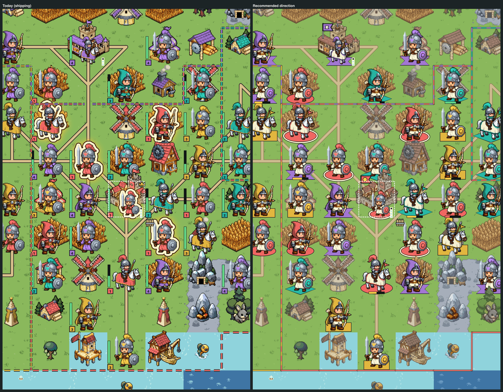

## 2. How other games do it

Short notes on what is reusable; sources are listed at the end.

| Game or practice                 | How ownership is shown                                                                                                                                   | What keeps the map readable                                                                                               | Reusable here                                                             |
| -------------------------------- | -------------------------------------------------------------------------------------------------------------------------------------------------------- | ------------------------------------------------------------------------------------------------------------------------- | ------------------------------------------------------------------------- |
| Polytopia                        | The tribe is the player: units wear the tribe colour, and a mirror match gives each player a recoloured copy of the tribe. Borders are thin solid lines. | Flat low-poly shapes without outlines, few colours per object, one small HP number, almost no other chrome.               | Thin solid borders; almost no per-unit chrome; flat, calm buildings.      |
| Advance Wars, Wargroove          | Whole-palette swap: Wargroove draws every unit in a "red team" palette with a faction-colour range, a skin range and fixed colours.                      | Terrain is flat and low-contrast; spent units are greyed; HP is a small number shown only when damaged.                   | HP only when damaged; a fixed-colour range that never changes with owner. |
| Into the Breach                  | Few units; side is shown by shape (mechs against bugs) and outline colour.                                                                               | Muted, simplified environment tiles; information is carried by a small set of abstract markers.                           | The environment is deliberately duller than the pieces.                   |
| Civilization V and VI            | A flag or shield above each unit in the civilisation's two "jersey" colours; borders in the same colours.                                                | Units are realistic and not recoloured, so the flag is the only owner cue.                                                | A marker separate from the sprite carries ownership.                      |
| Age of Empires, Age of Mythology | Small player-colour areas on units and buildings (shields, banners, roof trims), an outline when hidden, and a coloured ring under selected units.       | Buildings keep their civilisation's own materials; only accents change.                                                   | Accents instead of whole garments; rings under units.                     |
| StarCraft II                     | Team-colour accents on a fixed race palette.                                                                                                             | Blizzard's map guidance puts unit readability first: limited environment palettes so colour does not pull from the units. | Limit the palette of everything that is not a unit.                       |
| Fire Emblem                      | Blue, red and green sprite palettes for player, enemy and neutral.                                                                                       | A plain grid and small sprites.                                                                                           | (Works for two sides only.)                                               |
| Tabletop miniatures              | Painted base rims or clip-on base rings mark squads and players; the model keeps its faction paint scheme.                                               | The base is the same shape on every model, so it reads as a marker, not as part of the figure.                            | A coloured base under every unit; faction scheme on the figure.           |
| Awesomenauts (Ronimo) dev blog   | Not applicable.                                                                                                                                          | Gameplay objects get outlines, deeper shading and more saturation; the background is desaturated and loses its outlines.  | Outlines and saturation are for pieces; backgrounds get neither.          |

Three techniques recur and are missing here today: (a) saturated colour and
hard outlines are reserved for the pieces; (b) ownership sits on a small,
fixed-place marker (base ring, flag, shield) or on small accents, not on
whole surfaces; (c) per-unit chrome is shown only when it carries news (HP
when damaged).

## 3. The test bench

`npm run art:visual-direction-review` (source:
[`scripts/art/visual-direction-review.ts`](../../scripts/art/visual-direction-review.ts),
[`scene.ts`](../../scripts/art/visual-direction/scene.ts),
[`variants.ts`](../../scripts/art/visual-direction/variants.ts)) draws one
deterministic busy map through the real `CanvasBoardHostV7` in headless
Chrome and writes the comparison sheets and `metrics.json`.

- **Scene:** 13 x 11 cells on the fixed Showcase board. Four players who
  all play Human (Coral, Teal, Gold, Violet), a city each at levels 1 to 3,
  a Village, all eleven improvements, Roads, Forest, Mountains, coast.
  Thirty-six Fighters, Marksmen and Knights of the four players intermixed:
  on open ground, on improvements, in cities, on a Field Defense, damaged,
  ready and spent. It is deliberately denser than a real game.
- **Views:** desktop 1440 x 900 at DPR 1 and phone 390 x 844 at DPR 3, each
  at zoom 1 and 0.75, plus the map without units and the bare terrain.
- **Variants:** a `BoardVisualDirectionV7` value
  ([`visual-direction-v7.ts`](../../src/render/canvas/visual-direction-v7.ts))
  names every lever; a variant is today's rendering with some levers moved.
  "Today" passes no direction at all, so it is the shipping board.
- **Measurements** (desktop, zoom 1, the scene patch): unit pixels are the
  pixels that differ between the scene with and without units.
  - _backdrop edge density_: mean Sobel gradient of the luma of the map
    without units, a proxy for how busy the backdrop is;
  - _unit-to-backdrop edge ratio_: mean gradient on unit pixels divided by
    the backdrop's, a proxy for how much the units stand out;
  - _backdrop saturated share_: share of strongly saturated pixels;
  - _player colour on units_: share of all player-coloured pixels that lie
    on units and their markers;
  - _backdrop player colour_: player-coloured pixels per thousand in the map
    without units.

The proxies support the judgement; they do not replace looking.

## 4. Diagnosis

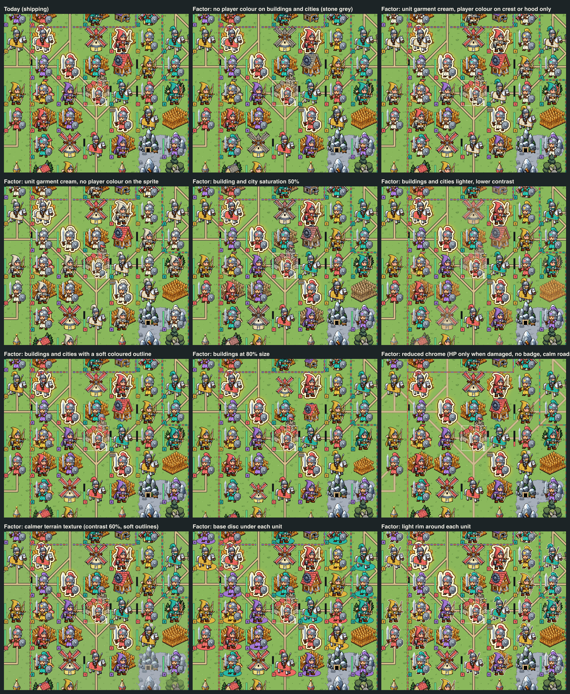

| Variant (one lever from today)                 | Backdrop edge density | Unit-to-backdrop edge ratio | Backdrop saturated share | Player colour on units | Backdrop player colour (per 1000) |
| ---------------------------------------------- | --------------------- | --------------------------- | ------------------------ | ---------------------- | --------------------------------- |
| Today                                          | 108.7                 | 2.54                        | 13.2%                    | 37.6%                  | 71.7                              |
| No player colour on buildings and cities       | 108.6                 | 2.54                        | 11.2%                    | 48.4%                  | 46.1                              |
| Building and city saturation 50% (the sliders) | 108.7                 | 2.54                        | 3.5%                     | 54.0%                  | 36.2                              |
| Buildings and cities lighter, lower contrast   | 83.6                  | 3.27                        | 12.6%                    | 30.1%                  | 111.0                             |
| Buildings and cities with a coloured outline   | 101.2                 | 2.72                        | 13.2%                    | 37.3%                  | 72.6                              |
| Buildings at 80% size                          | 89.7                  | 3.05                        | 9.8%                     | 45.4%                  | 52.3                              |
| Reduced chrome                                 | 99.4                  | 2.82                        | 13.4%                    | 34.3%                  | 73.5                              |
| Calmer terrain texture                         | 97.5                  | 2.83                        | 12.6%                    | 38.7%                  | 68.7                              |
| Base disc under each unit                      | 108.7                 | 2.40                        | 13.2%                    | 48.0%                  | 71.7                              |
| Light rim around each unit                     | 108.7                 | 2.81                        | 13.2%                    | 38.1%                  | 71.7                              |
| Unit garment cream, accent in player colour    | 108.7                 | 2.72                        | 13.2%                    | 26.0%                  | 71.7                              |
| Unit garment cream, no player colour           | 108.7                 | 2.80                        | 13.2%                    | 16.6%                  | 71.7                              |
| **Recommended (all together)**                 | **62.7**              | **4.4**                     | **9.4%**                 | **46.4%**              | **60.0**                          |

Findings, in order of weight:

1. **The backdrop is as loud as the units.** Buildings, cities and
   especially Farms carry the same black outline, saturation and contrast
   as units. Lowering building and city _contrast and lightness_ is the
   single biggest lever (edge density 108.7 to 83.6, unit ratio 2.54 to
   3.27). **Saturation alone does little:** the existing sliders at 50%
   leave edge density and the unit ratio unchanged, because the black
   outlines and the light/dark texture stay. This is why the slider
   experiment did not feel like a fix.
2. **The player colour is spent on the backdrop.** Only 38% of
   player-coloured pixels are on units; roofs, sails, awnings and dashed
   borders hold the rest. A unit on its own windmill or in its own city
   merges with it. Taking the player colour off buildings raises the share
   on units to 48% at no cost in information, because territory already
   says who owns a building.
3. **Wheat collides with the Gold player.** Farms are the most common
   improvement and their wheat has the Gold player's chromaticity: the
   "lighter buildings" row shows backdrop player colour _rising_ to 111 per
   thousand. Farms need their saturation lowered or a paler straw, whatever
   else is decided; the recommendation lowers it (60.0 with every other
   change included).
4. **Chrome is constant, so it is noise.** Every unit has a full-height HP
   bar and a numbered badge all the time; 36 units make 72 marks that say
   nothing new. Showing HP only when damaged and dropping the badge removes
   about 9% of backdrop edges and, more importantly, the vertical bars that
   read as part of the neighbouring sprite. The black-cased cream Roads and
   the 8 px dashed borders are high-contrast linework over the whole map.
5. **Whole garments in the player colour are the "weird" part, and they are
   not needed for ownership.** With a base under the unit, the share of
   player colour on units goes from 38% to 48% without any colour on the
   sprite. Units in cream with a small accent look like one army's soldiers
   instead of four costume sets (see `sample-units-x4.png`).
6. **Sprite size and the square grid matter less than expected.** Buildings
   at 80% size help (edge density 89.7) because grass shows between pieces,
   but code-side scaling of pixel art is ugly, so it would mean regenerating
   every building; receding by tone gets most of the benefit for free. A
   unit cannot stand "in front of" a building on a square top-down grid, but
   the base separates the two well enough.
7. **Outlines.** A coloured outline on buildings is a small measured gain
   (101.2) and a clear visual one: without the black line a building stops
   competing with the black-outlined units. A light rim around units helps
   a little (ratio 2.81) but adds linework and is not needed with a base.
8. **The four player colours are weak for red-green colour blindness.**
   Under simulated deuteranopia and protanopia, Coral and Teal both turn
   grey-olive (see `same-unit-phone-zoom-0.75.png`). This is true today as
   well, where only the tiny seat number separates them. Any marker should
   therefore also differ by shape.

## 5. Candidates

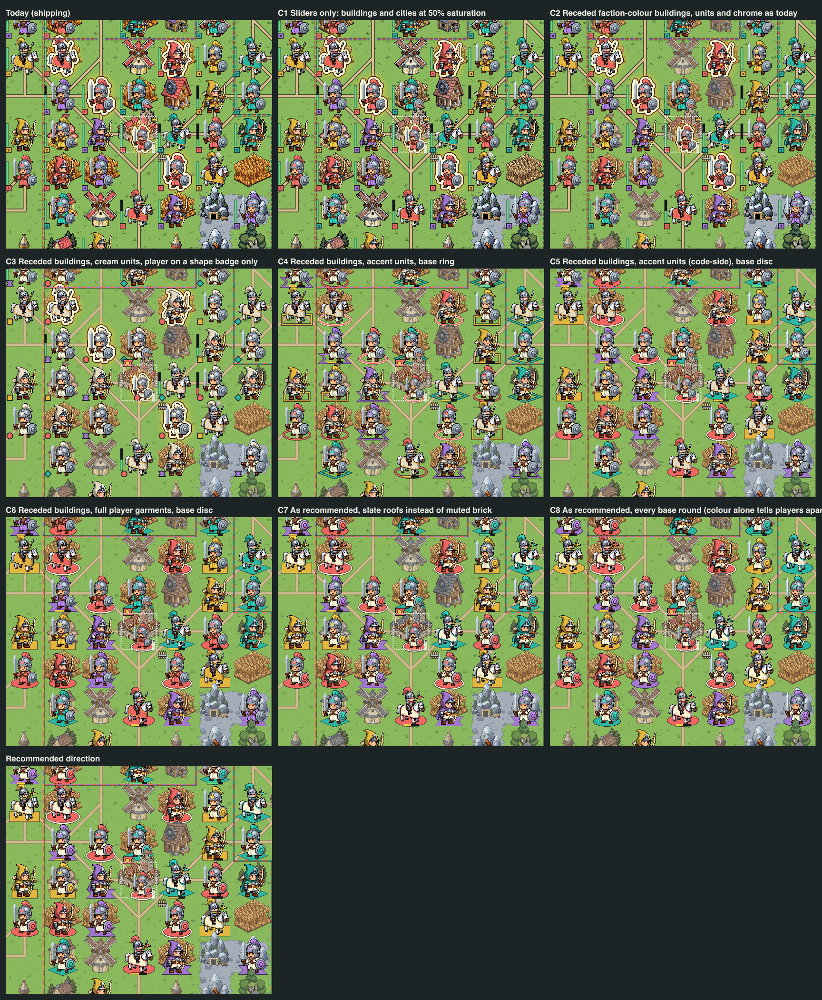

| Candidate                                                   | Backdrop edge density | Unit-to-backdrop edge ratio | Player colour on units | Verdict                                                                                                                                                 |
| ----------------------------------------------------------- | --------------------- | --------------------------- | ---------------------- | ------------------------------------------------------------------------------------------------------------------------------------------------------- |
| Today                                                       | 108.7                 | 2.54                        | 37.6%                  | Baseline.                                                                                                                                               |
| C1 Sliders only (saturation 50%)                            | 108.7                 | 2.54                        | 54.0%                  | Rejected: greyer, not calmer.                                                                                                                           |
| C2 Receded faction-colour buildings, rest as today          | 81.4                  | 3.35                        | 43.5%                  | Better backdrop; garments still weird, chrome still heavy. A valid first step.                                                                          |
| C3 Cream units, player on a shape badge only                | 62.7                  | 4.91                        | 21.0%                  | Rejected: calmest, but ownership needs a search for a 10 px badge. Fails requirement 1.                                                                 |
| C4 Accent units, base ring                                  | 62.7                  | 4.65                        | 35.2%                  | Works; the ring is thinner than the sprites' outlines and gets lost on Farms and Roads.                                                                 |
| C5 Accent units (code-side), base disc                      | 62.7                  | 4.36                        | 42.8%                  | Good, and needs no PixelLab: the crest, hood or plume stays in the player colour by a row split of today's mask. The accent is small on the Fighter.    |
| C6 Full player garments, base disc                          | 62.7                  | 4.04                        | 51.1%                  | Strongest ownership; keeps the "yellow pants". The fallback for a faction whose sprites are not yet redone.                                             |
| C7 Recommended with slate roofs                             | 62.7                  | 4.40                        | 46.7%                  | Equal; slate is cooler and further from Coral, muted brick is warmer and closer to today's look.                                                        |
| C8 Recommended with every base round                        | 62.7                  | 4.40                        | 46.4%                  | Prettier bases, but Coral and Teal are then told apart by hue alone.                                                                                    |
| **Recommended** (PixelLab accent samples, seat-shaped base) | **62.7**              | **4.40**                    | **46.4%**              | Chosen: ownership reads from the base at a glance and is confirmed by the shield face, hood or pennant; nothing looks like a costume; backdrop recedes. |

Iterations that were tried and dropped along the way:

- contrast lowered toward mid grey turned the grass olive and the whole map
  drab; contrast is now lowered toward each sprite's own mean colour (land
  terrain toward its ground's mean), which keeps hue and brightness;
- building saturation 60% with a grey-brown roof looked dusty; the roof is
  a muted brick `#b0705c` and saturation is 65% with 10% lightening;
- a thin cream ready rim was invisible; the ready cue is a 4 px warm-white
  rim with a dark edge around the base;
- the first Fighter edit painted the face red; the second instruction names
  the face (see the recipes below).

### The same-unit, four-player case

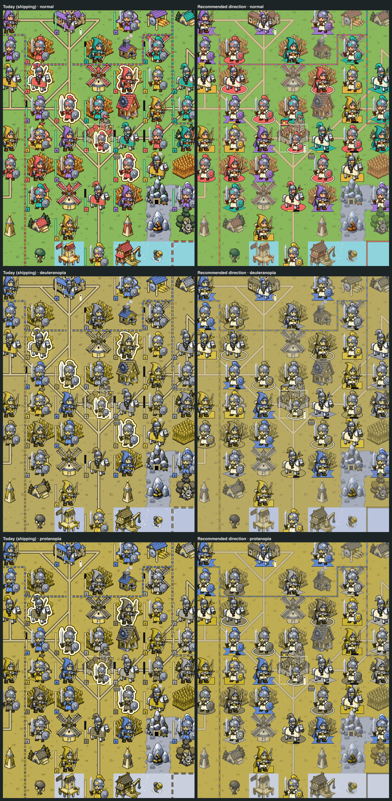

At phone size and zoom 0.75 a tile is 60 CSS px. In the recommended
direction each Fighter stands on a 45 x 16 px base in the player colour, and
its shield face and crest repeat the colour; the four players' Fighters can
be told apart without looking for a badge. Under simulated deuteranopia and
protanopia Violet and Gold stay distinct, and Coral and Teal both turn
grey; there the base _shape_ decides: round (seat 1), pointed (seat 2),
square (seat 3), swallow-tailed (seat 4). City pennants carry the same
shapes. This is better than today, where the same two colours collapse and
the only other cue is an 11 px seat number.

## 6. Recommended direction

Rules, as they would enter the art direction. "Player colour" is the
owner's colour; "faction colours" are fixed per faction and never change
with the owner.

**Colour roles**

1. The saturated player colour appears only on: unit bases, unit accents,
   city pennants, territory borders, and interface elements. Nothing else on
   the map is drawn in a player colour.
2. Each faction has a fixed palette for cloth and roofs, chosen in a muted
   band (saturation under about 45%) so it never reads as a player colour.
   Human: cream cloth `#e6dcc3`, light steel, muted brick roofs `#b0705c`.
   Other factions pick theirs when they are redone (for example Undead
   bone and sickly green, Goblin scrap and rust), under the same rule.
3. No improvement, resource or terrain uses a colour close to a player
   colour at full saturation. Wheat in particular is paler than Gold.

**Units**

4. A unit's owner mask covers one or two small, well placed accents: a
   crest, a shield face, a hood, a plume, a pennant, a sail stripe. Target
   10–20% of opaque pixels (today 20–40%); the rest of the garment is in
   the faction palette. The key colour and the mask pipeline are unchanged.
5. Units keep the black outline and full saturation. They are the only
   black-outlined, fully saturated things on the map.
6. Every unit stands on a code-drawn base: a flat ellipse about 60 x 22 CSS
   px at zoom 1 in the player colour with a dark outline, centred under the
   feet. The base's outline shape is the seat's shape. (The rule "nothing is
   drawn under it" still holds for the sprites: the base is an overlay.)

**Buildings, cities and terrain**

7. Buildings and cities carry no player colour. Their masks are recoloured
   to the faction roof colour. Ownership of a building is its territory.
8. Buildings recede: saturation 65%, contrast 70% around the sprite's mean,
   10% lighter, and the black outline replaced by a darker tone of the fill
   beside it (75%). Cities recede less (85%, 85%, 3%, 60%), so a city still
   outranks an improvement.
9. A city shows its owner by a pennant on a pole at its top-left corner, in
   the player colour, carrying the seat shape; the capital's shape is gold.
10. Terrain keeps its hue and brightness but has less texture: contrast 65%
    around the ground's mean and a 60% coloured outline on trees and rocks.

**Chrome**

11. No seat badge on units or cities.
12. The HP bar is drawn only for a damaged unit: a short horizontal bar on
    the base, green, amber below two thirds, red below one third.
13. A unit ready to act has a bright warm-white rim around its base; the
    sprite outline glow is not drawn.
14. Territory borders are one solid 2 px line in the player colour with a
    soft dark casing; a shared border alternates the two colours.
15. Roads lose the black casing and are slightly darker.
16. Population pips, the Field Defense badge, status chips and selection
    and target outlines are unchanged in this study.

**What stays as it is:** the chibi unit style, the camera, the grid, the
sprite sizes, the mask-based recolour, the terrain art.

## 7. Known weaknesses

- **Coral and Teal for red-green colour blindness.** The base shapes solve
  it, but the palette itself could be improved (a darker, bluer Teal or a
  lighter Coral would differ in brightness). Not changed here.
- **Seat-shaped bases are less pretty than round ones.** The square and
  swallow-tailed bases look slightly like signs. C8 (all round) is the
  alternative if colour alone is judged enough.
- **A unit behind a city.** A unit standing directly north of a city has
  its base hidden by the city's upward overflow.
- **Ships.** A base on water looks odd. Ships should carry the player colour
  on the sail and a pennant and skip the base, or get a ring-shaped wake.
- **Giants and wide units** get a wider base that can touch the next cell.
- **Other factions are not designed.** With the developer toggle, Undead,
  Goblin and Dinosaur units keep their player-coloured garments and get a
  base (candidate C6); their cities are recoloured to the Human brick, which
  is wrong for them.
- **The samples are edits, not finished art.** The Fighter kept brown boots
  and straps, the Marksman gained a steel cap and a few cheek pixels in its
  mask, and the Knight's outline thinned. Production versions need the
  normal review.
- **Ready cue.** The rim is clear on the test bench but weaker than today's
  glow; it has not been tried in play.
- **Portraits and the interface** still show whole-garment player colour.
- **Runtime toning** reads and rewrites each building sprite once per
  owner; for production the receded sprites should be baked by the
  pipeline.
- **The measurements are proxies** and the scene is denser than a real map.

## 8. Rollout plan and cost

Everything in steps 1 and 2 is code-only and reversible, and can ship
before any art is regenerated.

| Step | Work                                                                                                                                                                              | Means                                                             | PixelLab calls |
| ---- | --------------------------------------------------------------------------------------------------------------------------------------------------------------------------------- | ----------------------------------------------------------------- | -------------- |
| 1    | Chrome: bases with seat shapes, HP when damaged, ready rim, city pennants, solid borders, calm Roads. Decide ships, giants and garrisons.                                         | Code (renderer), tests, browser smoke                             | 0              |
| 2    | Buildings, cities and terrain recede; roofs take the faction colour. Bake the toned sprites in the pipeline instead of at runtime; pick faction roof colours for the other three. | Code (pipeline step over the 10 improvements and 12 city sprites) | 0              |
| 3    | Human units: move the owner mask to accents. 11 unit sprites and 10 portraits, as edits of the accepted sprites.                                                                  | PixelLab edits, mask review, overrides where needed               | about 35       |
| 4    | Undead, Goblin and Dinosaur units and portraits (25 sprites, 24 portraits), after a short palette decision per faction.                                                           | PixelLab edits                                                    | about 85       |
| 5    | Optional: Farms with paler straw; smaller building footprints (regenerate 10 improvements).                                                                                       | PixelLab                                                          | about 25       |
| 6    | Update the art direction (owner colour section, class notes, faction fragments) and the mask QA thresholds (coverage 10–20%).                                                     | Docs, pipeline thresholds                                         | 0              |

Estimates assume about 1.7 calls per asset (this study: 4 calls for 3
sprites, one retry) at about US$0.01 per edit call: roughly 120 calls and
US$1.50 for steps 3 and 4, 145 calls with step 5. The cost that matters is
review time, not PixelLab. Between steps 2 and 4, a faction whose sprites
are not redone yet can run as candidate C6 (full garments on a base) or as
C5 for Humans (code-side accent), so the game never has to show a mixed
state that looks broken.

Suggested order: 1, 2, 6, 3, then one faction at a time.

## 9. What this study produced

- **Runtime (off by default):**
  [`src/render/canvas/visual-direction-v7.ts`](../../src/render/canvas/visual-direction-v7.ts)
  (the direction model, sprite toning, the wrapped art resolver, bases,
  pennants, HP and border drawing), six small hook points in
  `board-renderer-v7.ts`, the host wiring in `board-host-v7.ts`, and the
  developer checkbox (Settings > Developer tools > Visual direction,
  stored under `pulpWars.ruleset7.boardVisualDirection.v1`). Without a
  direction the frame is drawn exactly as before; a test checks that the
  baseline direction issues the same canvas calls as none.
- **Test bench:** `npm run art:visual-direction-review`.
- **Exploration assets** in
  [`art/explorations/visual-direction-2026-10/`](../../art/explorations/visual-direction-2026-10/):
  `batch.json`, `faction.md`, `subjects.json`, `records.json`, the receipts
  in `submissions/`, the candidates in `raw/`, the cut samples and masks in
  `assets/` with `samples.json`, and the sheets in `review/`. None is in the
  production manifest; the developer toggle loads the three samples through
  a separate, lazily imported module.

### PixelLab recipes

Four calls through `npm run art:chibi -- generate --exploration
art/explorations/visual-direction-2026-10`, all `edit-image-pixen` edits of
accepted production sprites (seeds and full instructions are in
`batch.json`; requests and job ids in `records.json`):

| Recipe                  | Source                   | Seed  | Result                                                                           |
| ----------------------- | ------------------------ | ----- | -------------------------------------------------------------------------------- |
| `fighter-accent-edit`   | batch 1 `fighter-h-edit` | 71001 | Rejected: the face was painted red.                                              |
| `fighter-accent-edit-b` | batch 1 `fighter-h-edit` | 71002 | Sample: cream tunic; red crest, helmet emblem and shield face; 15.9% owner area. |
| `marksman-accent-edit`  | batch 1 `marksman-c`     | 71011 | Sample: red hood and shoulder cape, cream tunic; 27.7% owner area.               |
| `knight-accent-edit`    | batch 2 `knight-a-edit`  | 71021 | Sample: cream barding with red trim; red plume and lance pennant; 12.5%.         |

`npx tsx scripts/art/visual-direction/samples.ts` cuts candidate 0 of each
sample and extracts its mask with the production key-colour band.

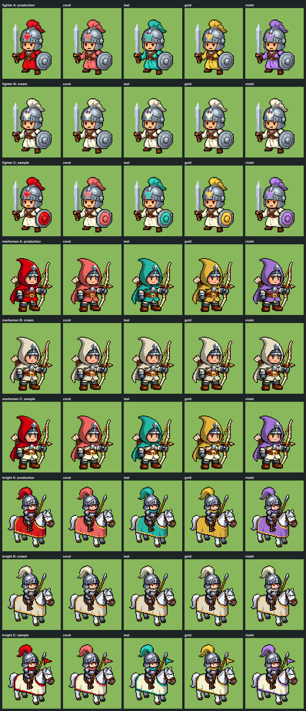

## 10. Open questions for the user

1. Is a base under every unit acceptable as the main owner marker, and
   should its shape differ by seat (recommended) or stay round?
2. Human faction colours: cream cloth and muted brick roofs, or slate roofs
   (C7)? The brief suggested red insignia for Humans; red is close to the
   Coral player, so this study keeps saturated colour for players only.
3. Should buildings lose the player colour entirely (recommended), or keep a
   small flag where the art has one?
4. Is the HP bar only when damaged acceptable, or should full HP stay
   visible in some smaller form?
5. Should the player palette be adjusted for colour blindness (Coral and
   Teal)?
6. Ready cue on the base, or keep today's glow?
7. Go ahead with steps 1 and 2 (code only) before any regeneration?

## 11. Human demo

**Status:** bead `pulp_wars-3tq.3`, waiting for the user's review
(`pulp_wars-3tq.4`). It answers the user's decisions on the study
(recorded on `pulp_wars-3tq.2`): shaped base plates; buildings in faction
colours with a small player flag only where it makes sense; the HP bar only
when damaged; Humans in a high-medieval look, red and gold allowed; every
building and city re-created, not toned; and a Farm of crop rows with gaps.
Nothing ships by default: the demo is what the developer toggle
(Settings > Developer tools > Visual direction, "Human faction demo") now
draws, and with the toggle off the board is drawn exactly as before.

To see it, start a Showcase match with three rivals and every seat Human,
with `?art=chibi`, and switch the toggle on. Sections 6 and 8 above are the
study's proposal; where this section differs, this section is the current
proposal.

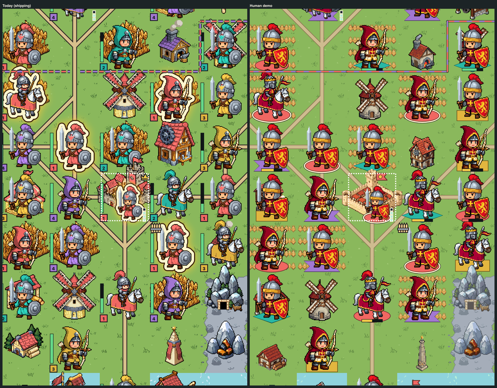

Evidence, all under
[`art/explorations/human-demo-2026-10/review/`](../../art/explorations/human-demo-2026-10/review/),
written by `npm run art:visual-direction-demo-review`:

| Image                                                     | Shows                                                               |
| --------------------------------------------------------- | ------------------------------------------------------------------- |
| `before-after-busy-{desktop,phone}-zoom-{1,0.75}.png`     | the busy bench of section 3, today beside the demo                  |
| `before-after-showcase-{desktop,phone}-zoom-{1,0.75}.png` | a real all-Human Showcase match, today beside the demo              |
| `demo-scene-desktop.png`                                  | the demo patch: Farms and Roads, units north of cities, ships       |
| `building-style-candidates-x4.png`                        | every building style sample tried, with the rejected ones           |
| `building-styles-bench-desktop.png`                       | style A against style B on the bench, with units on and beside them |
| `buildings-old-new.png`                                   | every improvement and city tier, old and new, 1:1 and x4            |
| `farm.png`                                                | one Farm, a 3 x 3 block, Roads passing under it, and the sprite x5  |
| `base-plates.png`                                         | the base variants on land, north of cities and on water             |
| `same-unit-phone-zoom-0.75.png`                           | four players' units, as seen and under two colour-vision deficits   |

### What was chosen, and why

**Units: crimson and gold heraldry, as edits of the accepted sprites.** The
Fighter wears a crimson surcoat with a gold cross and carries a heater
shield with a gold lion; the Marksman a crimson hood with a gold trim over
a cream gambeson; the Knight a crowned great helm, a crimson caparison with
a gold trim and a lance pennant. They are `edit-image-pixen` edits of the
production sprites, so the silhouettes, sizes and feet stay and the eight
Human units not yet redone still stand beside them without a break. Fresh
creations of the same three were darker, taller and less chibi, and were
rejected. Nothing on a unit changes with the player: the three samples
carry no owner area (an empty mask), and a Human unit without a sample has
its old owner area painted the faction crimson `#a8202c` by code.

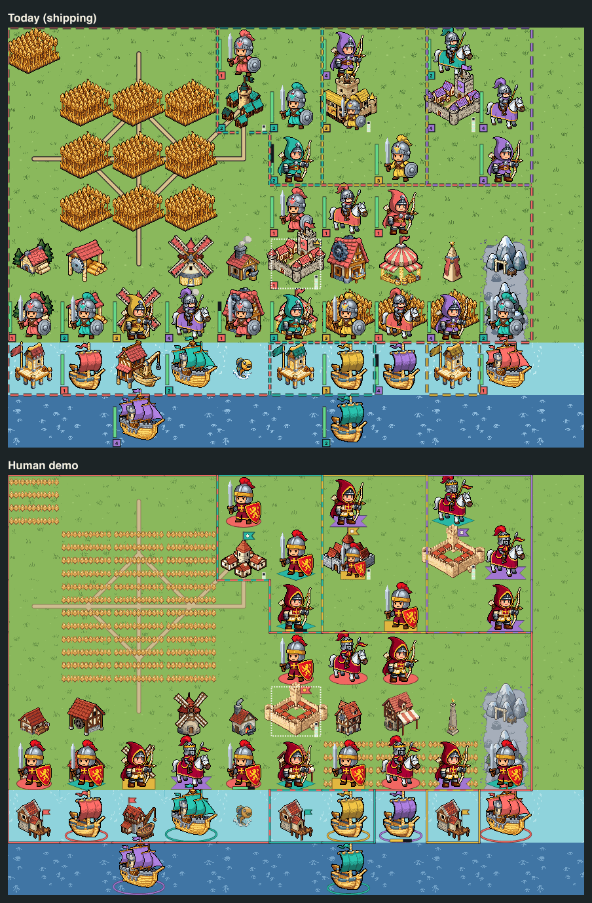

**Buildings: style B, smaller and calmer, in fixed faction colours.** Two
treatments were generated for the Windmill, the Forge and the Market and
judged on the bench:

- _A, soft chibi:_ the production style at the full 80 x 88 canvas, with a
  dark-brown outline, less detail and muted colours.
- _B, flatter and smaller:_ a "flat-shaded minimalist" style text, a thin
  outline in a darker tone of each colour, a 64 to 72 px canvas, so the art
  is about 70% of the tile and grass shows round it.

Both are far calmer than today. B was chosen: the smaller footprint is what
separates the layers on a square grid, where a unit cannot stand in front
of a building, and at 1:1 its roofs read as one tone where A's still read
as texture. The honest limit: Pixen does not draw truly flat shading when
asked, so B is "simpler and smaller", not Polytopia-flat. Pixflux has a
flat-shading option and was tried (four calls): it ignored the subject and
drew generic cottages on ground plates, so it was rejected, as was a
lineless Pixen sample that turned to mush at 1:1.

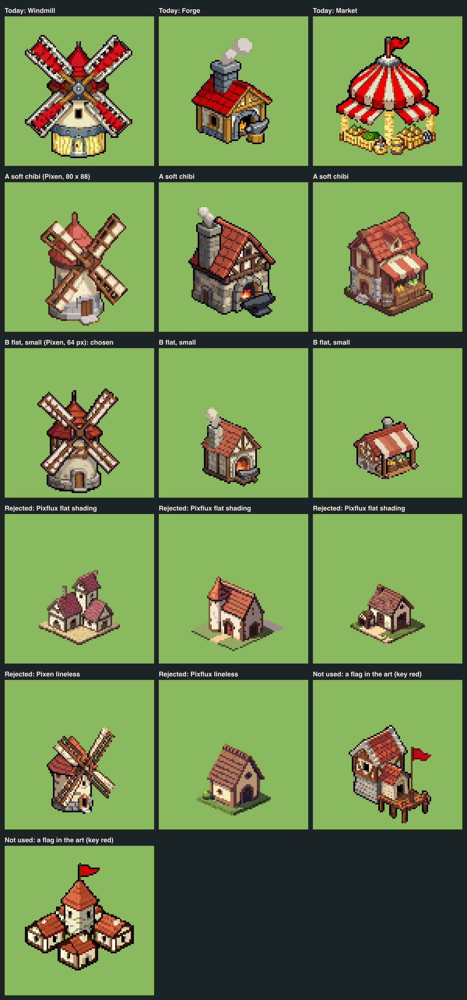

All ten improvements and City 1 to 3 were then re-created in style B: cream
plaster with dark oak framing, pale stone and terracotta roofs. None has a
flag, a banner or any player colour in its art.

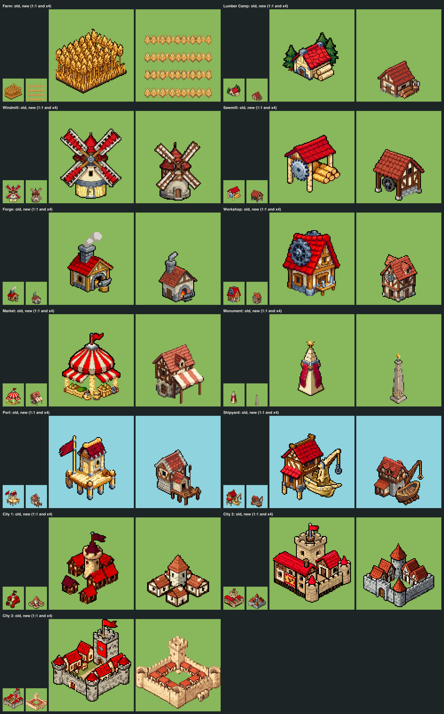

**Flags: drawn in code, on five pieces only.** A generated flag would have
to be masked and recoloured, and at this size the generator neither places
nor colours it reliably enough to trust. This was tried on the Port and
City 1 (two edits, last row of the style sheet above): the generator did
add a tidy small red flag, but the production key-colour band then also
takes terracotta roof pixels, so the automatic mask is two to three times
the flag (146 and 98 pixels, spread over the roofs) and would speckle the
roofs in the player colour. It would need a hand-corrected mask per
building, or roofs kept away from red, which the Human palette is not. So
the art is neutral and the renderer draws a small swallow-tailed pennant
in the exact player colour at an authored anchor per sprite
(`DIRECTION_FLAG_ANCHORS_V7`): the same shape, size and colour on every
building, at no generation cost. Which pieces fly one:

| Piece                                                   | Pennant | Reason                                                        |
| ------------------------------------------------------- | ------- | ------------------------------------------------------------- |
| City 1, 2, 3                                            | yes     | on the tower; larger, with the seat shape, gold for a capital |
| Port                                                    | yes     | the pier has a bare mast for it                               |
| Shipyard                                                | yes     | a pole on the boathouse ridge; ships are built for one player |
| Lumber Camp, Sawmill, Workshop, Forge, Market, Monument | no      | a flag adds nothing the territory border does not say         |
| Farm, Mine, Windmill                                    | no      | a field, a hole in a mountain and a mill have no flagpole     |

Fewer is better here: on the bench every extra pennant was one more
saturated mark competing with the bases.

**Farm: rows of wheat with real gaps.** The Farm is an 80 x 80 sprite that
fills its square cell: four horizontal rows of wheat tufts running edge to
edge, with transparent gaps between them. It has no outline box, no
parallelogram, no soil and no owner colour. The cut script moves the rows
to an even 20 px pitch, so the gaps fall on the cell's centre line and on
its top and bottom edges: stacked Farms keep one rhythm and read as one
field, and a Road through the cell centre lies in a gap. The renderer
already draws Roads before improvements, so nothing had to change there: a
Road under a Farm shows through every gap (fully when it runs along the
rows, as a dashed line across them). The wheat is orange-gold calmed toward
pale straw, clearly a crop and clearly not the Gold player's yellow.

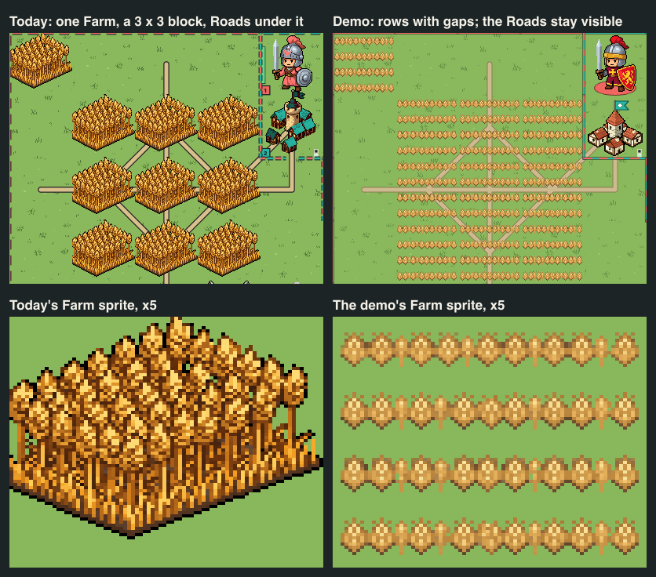

Pixen could not draw this directly: it painted soil bands and a fake
transparency chequerboard between the rows. An edit that erased everything
but the plants gave real gaps, and a second edit made the thin ears lush.

**Bases: a smaller plate with a rim in a darker player tone.** Three were
compared on the same units: the study's disc (60 x 22 px, near-black
outline), a thick ring, and a smaller plate (52 x 18 px) whose rim is a
darker tone of the player colour. The ring is lost under the sprites'
black outlines; the disc is the heaviest mark on the map; the plate reads
at a glance and stops looking like a sign. Each seat keeps its shape
(round, pointed, square, swallow-tailed), as the user chose.

- _Ships:_ a filled plate on water looks like a raft. A ship keeps its sail
  in the player colour (ships are shared by every faction) and stands in a
  thin round ring, like its own wake; nothing is filled.
- _A unit north of a city:_ today's cities reach 24 px into the cell above
  and hide the base there. The new cities are drawn inside their cell (City
  3 reaches 5 px up with one narrow tower), and City 3's pennant flies from
  the side of its tower instead of above it, so the base stays visible.

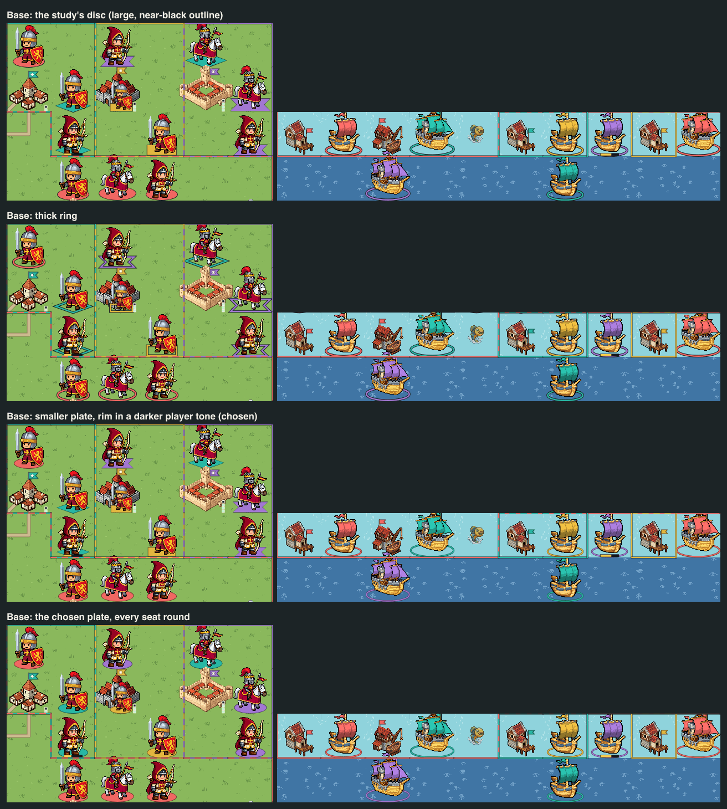

**Chrome**, as in the study: no seat badge; the HP bar only for a damaged
unit, on the base; the ready cue as a bright rim round the base; thin solid
territory borders; calm Roads. The seat shapes make a numbered badge
unnecessary for colour-blind players (see `same-unit-phone-zoom-0.75.png`).

**Terrain** is unchanged art, toned as in the study.

### The rules, now concrete

These replace rules 1, 2, 4, 6, 7, 8 and 9 of section 6.

1. **Faction colours are fixed and may be saturated.** Human: crimson
   `#a8202c` and gold on steel and cream for units; cream plaster, dark oak,
   pale stone and terracotta roofs for buildings. A faction colour may be
   close to a player colour: the player is never read from a garment or a
   roof.
2. **The player colour appears only on:** the base under a unit, a ship's
   sail and ring, the pennant of a city, a Port and a Shipyard, the
   territory border, and the interface.
3. **Units** keep the chibi style, the black outline and full saturation,
   and carry no owner area (ships excepted). A redone unit is an edit of
   its accepted sprite unless its design changes.
4. **Buildings and cities** are generated in the calmer building style:
   simpler shapes, an outline in a darker tone of each colour, no flag in
   the art. An improvement is 64 to 72 px wide on its canvas and stands at
   the bottom of its cell; a city fills the cell's width and stays inside
   its height (at most 8 px above it).
5. **A pennant** is drawn in code at an authored anchor, and only on a
   piece with a mast, a tower or a ridge that a flag belongs on.
6. **The Farm** is a full-cell pattern of crop rows with transparent gaps,
   with no outline box and no owner colour; its gaps lie on the cell's
   centre line and edges.
7. **The base** is a flat plate about 52 x 18 CSS px at zoom 1 in the
   player colour, with a rim in a darker tone of it, in the seat's shape; a
   ship's is an unfilled round ring.

### Known weaknesses

- **The buildings are calmer, not flat.** See above; a truly flat style
  would need another generator or hand-made art.
- **The set is not perfectly even.** City 1 is cream plaster with a heavier
  outline, City 2 grey stone and City 3 pale sandstone; the roofs are a
  fairly strong terracotta. The Sawmill shows a wheel, not a saw blade; the
  Market is a house with an awning and lost its crates in the ground-removal
  edit; the Lumber Camp lost its pine trees and reads as a cottage with
  logs. Production versions need the normal per-asset review.
- **The Mine and the Village are not re-created.** A Mine is a Mountain
  terrain sprite and a Village is neutral; both are only toned by code.
- **Improvements are one shared set.** The runtime has one subject per
  improvement for every faction, so with the toggle on an Undead, Goblin or
  Dinosaur player's improvements also draw as Human buildings. Their units
  keep the player-coloured garments on a base and their cities are toned,
  as in the study. Only an all-Human match shows a finished look.
- **The interface does not match.** Portraits, train buttons and the dock
  still show the old sprites with whole-garment player colour.
- **The Farm** leaves a 4 px seam between side-by-side Farms, hides part of
  a diagonal Road, and its calm straw tone is applied by the cut script,
  not drawn by the generator.
- **Ships** still show the player on a whole sail. It reads well and no one
  wears it, but it is the one large player-coloured surface left.
- **Seat shapes** are still less pretty than round plates (the last row of
  `base-plates.png` shows all round).
- **Coral and Teal under red-green colour blindness.** Both plates turn a
  dark olive that is also close to the grass, so they are told apart by
  shape alone and are less visible than the Gold and Violet plates
  (`same-unit-phone-zoom-0.75.png`). The darker rim helps; a palette change
  would help more. Unchanged from the study.
- **The ready cue** on the base has not been tried in play.
- **Runtime:** the samples are separate files loaded on demand, and a unit
  or city sample goes through the owner recolour with an empty mask. A
  rollout registers them as production assets without masks.

### Rollout estimate for all factions

This demo used 52 PixelLab calls (about US$0.50): 6 for the three units, 6
for style A and the first style B samples, 4 rejected Pixflux and 1
lineless sample, 28 for the other buildings and cities (most needed a
ground-removal edit; the cities were generated twice, the second time
larger), 2 for the flag comparison, and 5 for the Farm. With the recipes now stable, a building or
city costs about 2.2 calls (one creation, one edit, an occasional retry)
and a unit edit about 1.3.

| Step | Work                                                                                                                                                 | Means                           | PixelLab calls |
| ---- | ---------------------------------------------------------------------------------------------------------------------------------------------------- | ------------------------------- | -------------- |
| 1    | Renderer: plates, ship rings, pennant anchors, HP when damaged, ready rim, borders, Roads; drop the toggle. Unit and city subjects lose their masks. | Code, tests, browser smoke      | 0              |
| 2    | Human: accept the 13 building and city samples and the Farm as production assets after per-asset review; redo any that fail it.                      | Pipeline `accept`, a few redos  | about 10       |
| 3    | Human: the other 8 unit sprites and 11 portraits, as edits.                                                                                          | PixelLab edits                  | about 25       |
| 4    | Decide whether improvements become per-faction (new `IMPROVEMENT:<FACTION>:<ID>` subjects). If yes: 10 improvements for each of three factions.      | Code, PixelLab                  | about 65       |
| 5    | Undead, Goblin, Dinosaur: 9 city sprites restyled, 25 unit sprites and 24 portraits moved from player garments to fixed faction colours.             | PixelLab edits, palette choices | about 85       |
| 6    | Art direction and class documents, faction fragments, mask QA rules (no owner area), `art:validate`.                                                 | Docs, pipeline                  | 0              |

About 185 calls (about US$2) with per-faction improvements, about 120
without. As before, review time is the cost that matters: roughly 100
sprites and portraits to look at one by one. Suggested order: 1, 2, 3, 6,
then one faction at a time; until a faction is redone it runs as today's
sprites on a base, which looks consistent, if not finished.

### What the demo produced

- **Runtime (off by default):** `HUMAN_DEMO_DIRECTION_V7`, the plate and
  ship ring, `drawDirectedFlagV7` and its anchors, and sample sprites for
  buildings and cities in
  [`visual-direction-v7.ts`](../../src/render/canvas/visual-direction-v7.ts);
  one hook in `board-renderer-v7.ts` (the pennant, after the sprite); the
  sample sets in
  [`visual-direction-samples-v7.ts`](../../src/render/canvas/visual-direction-samples-v7.ts),
  still imported only when the toggle is on. The test that the baseline
  direction issues the same canvas calls as no direction still holds.
- **Pipeline:** an exploration run may override prompt fragments in its own
  `fragments/` directory, and buildings may be generated with Pixflux (see
  [CHIBI_PIPELINE.md](CHIBI_PIPELINE.md#exploration-runs)).
- **Exploration runs** under
  [`art/explorations/human-demo-2026-10/`](../../art/explorations/human-demo-2026-10/):
  `units/`, `buildings-soft/` (style A), `buildings-flat/` (style B, the
  cities and the Pixflux samples) and `farm/`, each with its `batch.json`
  (recipes, seeds, instructions), `faction.md`, `subjects.json`, `fragments/`,
  `records.json` (requests, job ids and every rejection with its reason),
  `submissions/` and `raw/`. `assets/` holds the cut sprites and
  `samples.json` says which candidate each came from.
- **Cut script:**
  [`scripts/art/visual-direction/demo-samples.ts`](../../scripts/art/visual-direction/demo-samples.ts)
  (no PixelLab call): seats each building at the bottom of its canvas,
  crops the cities, evens the Farm's rows.
- **Test bench:** `npm run art:visual-direction-demo-review`; the scenes
  `DEMO` and `LIVE` in
  [`scene.ts`](../../scripts/art/visual-direction/scene.ts).

### Open questions for the user

1. Is building style B right, or should the buildings be flatter still
   (which means leaving Pixen for buildings), or larger?
2. Are pennants on the cities, the Port and the Shipyard the right set, or
   should improvements carry none at all?
3. Is the Farm what you had in mind: four rows, this density, this colour?
   Should the rows also break where a Road crosses them?
4. Shaped plates, or all round (last row of `base-plates.png`)?
5. Ships: is the player colour on the whole sail acceptable?
6. Should each faction get its own improvement sprites (65 more calls and
   new runtime subjects), or do all factions share one neutral set?
7. Should the three city tiers share one stone (all sandstone, say)?
8. Roll out in the order above?

## 12. Production

**Status:** bead `pulp_wars-3tq.5`. The user reviewed the demo on 2026-10-02
(recorded on `pulp_wars-3tq.4`): the buildings are a clear improvement and
the pattern stays, even if single buildings need iterating (the Sawmill);
the units look good, though telling players apart is hard; go ahead
tentatively with everything: replace the buildings and **all** Human units
in the live game and do the base plates; do **not** replace the other
factions' sprites yet. This section is the art half of that decision. Bead
`pulp_wars-3tq.6` makes it the default rendering; here the default is
unchanged and the developer toggle draws the production art instead of the
exploration samples.

**The other factions are not converted.** Undead, Goblin and Dinosaur units,
cities and portraits are drawn as today (player-coloured garments on a base
plate with the toggle on). Ships are shared and unchanged. The user will play
with the new look and then decide (`pulp_wars-3tq.7`).

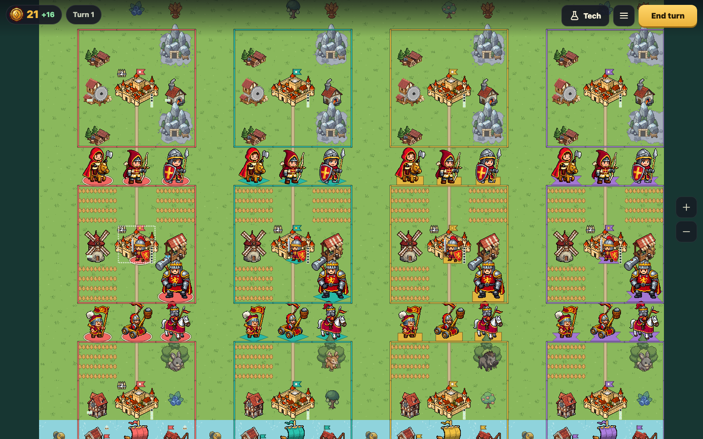

### What was made

Batch [`direction-human`](../../scripts/art/chibi/batches/batch-direction-human.json)
(records in `scripts/art/chibi/records/`, masters under
`public/assets/chibi/`, registry
[`chibi-direction-art-manifest.ts`](../../src/assets/chibi-direction-art-manifest.ts)):
30 assets from 53 recipes, 22 of them imported from the demo's exploration
runs and 31 new PixelLab calls. The Farm was replaced later (two more
imported recipes, see [the Farm's second pass](#the-farm-second-pass)) and
then became three green variants for a comparison (three more imported
recipes, see [the third pass](#the-farm-third-pass-three-green-crops-compared)).
The user chose the vegetable beds, so the batch is 30 assets again (see
[the Farm as chosen](#the-farm-as-chosen-vegetable-beds)).

| Asset                     | Recipes tried     | Accepted                   | Notes                                                                                              |
| ------------------------- | ----------------- | -------------------------- | -------------------------------------------------------------------------------------------------- |
| Fighter, Marksman, Knight | 1 each (imported) | the demo's edits           | the style anchor, re-accepted unchanged                                                            |
| Raider, Guard, Juggernaut | 1 each            | first edit                 | cloak, shield and tabard in crimson with gold; props unchanged                                     |
| Captain                   | 2                 | `captain-heraldic-edit-b`  | the first edit drew a nineteenth-century officer; "change only the colours and the flag" kept him  |
| Catapult                  | 2                 | `catapult-heraldic-edit-b` | the first edit rebuilt the frame as a box cart; "change only the cloth" kept the machine           |
| 8 portraits               | 1 each            | first edit                 | edits of the batch-5 portraits                                                                     |
| Windmill, Port, Shipyard  | 1 each (imported) | the demo's                 |                                                                                                    |
| Forge, Workshop, Monument | 2 each (imported) | the demo's ground edits    |                                                                                                    |
| Sawmill                   | 3                 | `sawmill-c-a-edit-2`       | new subject line; the first two had a dark spoked wheel; a third edit made it a solid saw blade    |
| Market                    | 2                 | `market-c-a-edit`          | open stall with goods on the counter; the edit names the goods so they survive the slab removal    |
| Lumber Camp               | 3                 | `lumber-camp-c-a-edit-b`   | pines, log stack, axe in a stump; the first ground edit removed the logs and the axe too           |
| Farm                      | 8 (imported)      | `veg-flux-a`               | vegetable beds; before it wheat (`wheat-a-edit`), lettuce (`leafy-b`), cabbage (`leafy-thin-a`)    |
| City 1                    | 3 (2 imported)    | `city-1-c-a-edit-2`        | the demo's town with a sandstone tower                                                             |
| City 2                    | 3 (2 imported)    | `city-2-c-a-edit-2`        | the demo's walled town repainted from grey stone to sandstone                                      |
| City 3                    | 6 (3 imported)    | `city-3-d-a-edit-2`        | a new creation: a keep, a church, houses and four towers inside the wall; then ground, then colour |
| Village                   | 3                 | `village-a-edit-b`         | thatched cottages; the first ground edit painted the yard white                                    |

Recipes that worked:

- **Units and portraits:** `edit-image-pixen` on the accepted sprite. Say what
  changes and end with "Keep the …, pose, proportions, thick black outline
  and art style exactly the same". When an edit redesigns the piece, start
  the instruction with "Change only the colours of …" and list what stays.
- **Buildings:** the `calm-building` class with a subject line that puts the
  signature prop first ("one huge round steel circular saw blade …"), the
  addendum "drawn large and fills most of the image", then a ground-removal
  edit that lists every prop to keep. An edit that says "erase only the flat
  ground slab; do not change anything standing on it" keeps small props best.
- **Cities:** generate at 96 x 96, remove the ground, then one repaint edit
  that names the stone and roof colours of the set.

### Rules that are now fixed

1. **Human units and portraits** wear crimson and gold for every player and
   have no owner area and no mask (`fixedColours`).
2. **Improvements** are one shared neutral set in the calm style. The Sawmill
   shows a saw blade and logs, the Market stalls and goods, the Lumber Camp
   pines, logs and an axe.
3. **The Farm** tiles without a seam: three raised beds of mixed
   vegetables that run from edge to edge, with gaps between them, so a
   block of Farms is one field, horizontally and vertically, and a Road
   under a Farm shows in the gaps (see
   [the Farm as chosen](#the-farm-as-chosen-vegetable-beds)).
4. **Cities** are one set: pale sandstone, cream plaster with dark oak and
   terracotta-red roofs, growing from four cottages round a tower (80 x 80)
   to a walled town (88 x 80) to a walled city full of buildings (96 x 88).
   The canvases are smaller than today's and stay inside the cell.
5. **Pennants** are drawn in code at recorded anchors on City 1–3, the Port
   and the Shipyard (`DIRECTION_FLAG_ANCHORS_V7`).
6. **The Mine** stays part of the Mined Mountain terrain art (grey rock and
   pale timber, no red) and is toned with the terrain; the **Village** is
   re-created in neutral straw and stone.

### Runtime

- [`chibi-direction-art-manifest.ts`](../../src/assets/chibi-direction-art-manifest.ts)
  lists the production art under the same subjects as the default art but
  in its own list, so no default subject gains a variant. The developer
  toggle imports it on demand and resolves it before the default art, on the
  board and in the interface (docks, training cards, technology cards).
- With the toggle off nothing is imported and the frame is drawn exactly as
  before; the test that a baseline direction issues the same canvas calls as
  no direction still holds.
- The exploration sample sets remain only for the study's review benches.

### Evidence

`npm run art:chibi-direction-review` writes
[`art/pixellab/reviews/chibi-batch-direction-human/`](../../art/pixellab/reviews/chibi-batch-direction-human/)
(see [the pipeline document](CHIBI_PIPELINE.md#review-evidence) for the list).

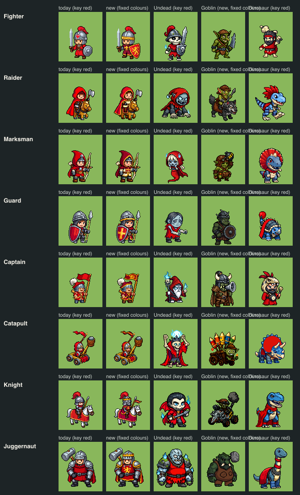

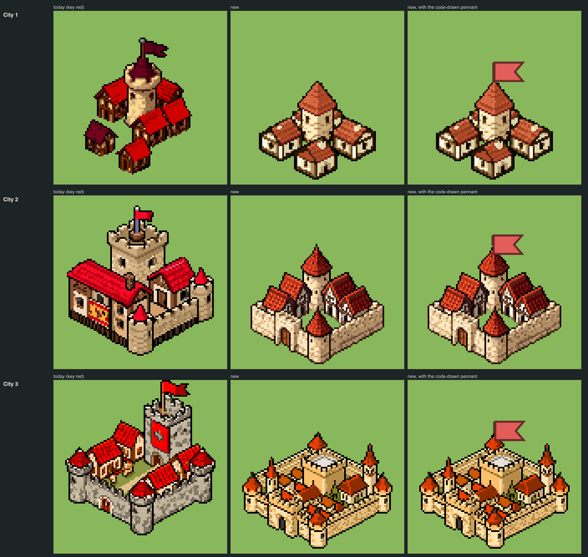

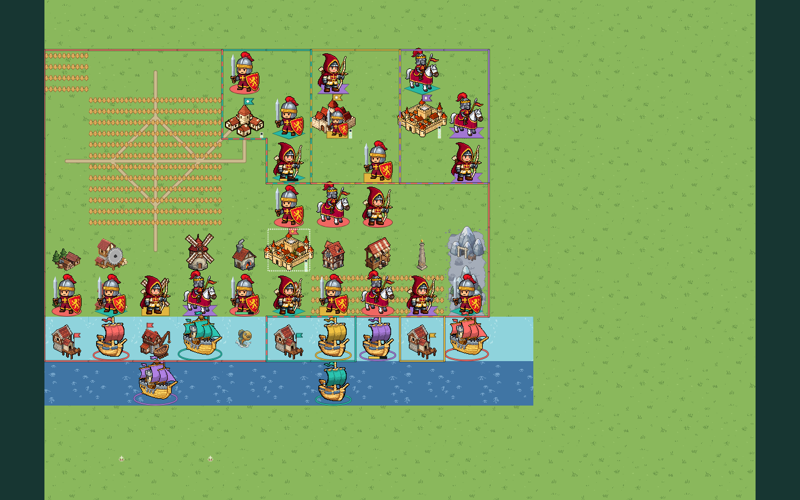

### Weak spots left

- **The city set is close, not identical:** City 1 keeps a heavier dark
  outline than City 2 and 3, and City 3's stone is a little more yellow.
- **City roofs are a clear red-orange**, stronger than the improvements'
  dusty terracotta.
- **The Lumber Camp and the Village are small** (about half a tile wide).
- **The Raider's cloak is a brighter red** than the Fighter's surcoat.
- **The Guard's portrait and map sprite show different faces**, as today.
- **A Road under a Farm** shows only in the gaps between the beds: whole
  when it runs east-west, about a sixth of its length when it runs
  north-south or diagonally.
- **A Farm with no Farm above or below it** ends in part of a bed at its
  top and bottom edge.
- **Four players who all play Human differ only by plate, pennant and
  border.** The user plans a rule of one player per faction per map later.
- **Ships, terrain and the other factions** are not converted.

### The Farm, second pass

Bead `pulp_wars-9s0.3`: the user found the first row Farm (thin orange
ears, no soil) ugly, though it matched the description. The constraints
stayed: rows with gaps across the whole tile, a Road visible under it, no
player colour, calm. Run
[`art/explorations/farm-rows-2026-10/`](../../art/explorations/farm-rows-2026-10/)
tried 20 recipes (20 PixelLab calls) with a new class text: big plump
plants, each row on its own strip of tilled soil.

| Concept                     | Recipes                                | Verdict                                                                                |
| --------------------------- | -------------------------------------- | -------------------------------------------------------------------------------------- |
| Golden wheat sheaves        | `wheat-a`, `wheat-b`, `wheat-a-edit`   | **accepted: `wheat-a-edit`**, leaf-shaped sheaves on a thin dark ridge                 |
| Round pale stooks           | `wheat-pale-a/b`, `wheat-pale-b-edit`  | runner-up: plumper and bolder, but the soil strip stays 9 px thick and hides a Road    |
| Green vegetables            | `veg-a`, `leafy-a/b`, `leafy-thin-a/b` | runner-up `leafy-b`: lettuces; green on Grass has little contrast and reads as a hedge |
| Mixed wheat and vegetables  | `mixed-a`, `mixed-b-a/b`               | rejected: two crops and two soil tones in one tile are busy                            |
| Thin soil from the start    | `wheat-thin-a/b`                       | rejected: pine-cone sheaves, or rows 20 px tall with no gap                            |
| One row; Pixflux from above | `wheat-row-a`, `veg-row-a`, `*-flux-a` | rejected: an isometric plot on a slab; no gaps, or rows too tall                       |

What worked: Pixen draws four tidy rows on soil strips when the subject
says so, but the strips are 8 to 11 px thick, which leaves a Road only the
5 px gaps. An edit ("make each strip of soil much thinner … keep the
sheaves exactly as they are") thinned the soil to a 5 px ridge. The
`crop-rows` derivation then stamps the five sheaves of the candidate's top
row 16 px apart with plain soil between them, on four rows at a 20 px
pitch, moves each row along itself so the sheaves stand in a brick pattern
(`rowOffsets`), and calms the colours (saturation 85%, 12% toward pale
straw). Nothing is drawn by hand.

The wheat was replaced in the third pass, below.

### The Farm, third pass: three green crops compared

Bead `pulp_wars-9s0.6`, **closed by the user's choice below**. The user
liked every candidate of the second pass more than the first Farm, but not
the wheat: "too short to look like wheat and too yellow to look like
anything else. Let's go with the greens instead. Use lettuce or cabbage rows
or the veg-flux-a veggies randomly so I can have a look at all of them."

The wheat master was retired and three green masters were live at once, one
per tile by the tile's coordinates, with a developer setting "Farm crop" to
force one. All three came from recipes of the second pass's run, imported
with no new PixelLab call, colours unchanged (saturation 100%, no straw).

| Variant | Recipe                 | Derivation                                                                                                                                        | Rows and gaps                            |
| ------- | ---------------------- | ------------------------------------------------------------------------------------------------------------------------------------------------- | ---------------------------------------- |
| Lettuce | `leafy-b` (Pixen)      | a 40 px piece (three lettuces) of each of the candidate's four rows, every second row moved 7 px                                                  | 4 rows, 13 to 14 px tall, gaps 6 to 7 px |
| Cabbage | `leafy-thin-a` (Pixen) | the five cabbages of one row 16 px apart with plain soil columns between them, brick pattern, two bottom lines of soil dropped                    | 4 rows, 13 px tall, gaps 7 px            |
| Veggies | `veg-flux-a` (Pixflux) | the three raised beds as drawn (four different plants each); the plants 20 px apart with plain soil columns between them, so a bed spans the cell | 3 beds, 21 to 24 px tall, gaps 4 to 5 px |

In that comparison the middle vegetable bed lay on the cell's centre line,
so a Road running east-west was hidden inside the tile.

### The Farm as chosen: vegetable beds

Bead `pulp_wars-9s0.7`. The user: "let's go with veggies for farms." The
vegetable beds are now the only Farm, under the stable id
`chibi-direction-farm`. The lettuce and cabbage masters, the per-tile mix,
the developer setting "Farm crop" and its stored value are removed; the
recipes and receipts of all three stay in the batch as history, and
`art:chibi -- retire` removed the three comparison assets.

The plants and the palette are those of the comparison. One thing changed:
**where the beds stand**. Three beds at a pitch of 80 / 3 px tile without a
seam wherever they start, so the derivation moves them down half a pitch
(`phase: 0.5`) and starts with the candidate's third bed. The two shorter
beds (21 and 22 px) now lie either side of a 5 px gap on the cell's centre
line (y 37 to 41), and the tallest bed (24 px) straddles the top and bottom
edges, half in this Farm and half in the next. The other two gaps are 4 px.

**A Road under a Farm, before and after.**

| Road        | Before (comparison)               | After                                                            |
| ----------- | --------------------------------- | ---------------------------------------------------------------- |
| East-west   | hidden inside the tile            | shows whole: the 4 px line and most of its 7 px edge, in the gap |
| North-south | three gaps, 13 of 80 px (a sixth) | unchanged: three gaps, 13 of 80 px                               |
| Diagonal    | about a sixth, in the gaps        | unchanged; the crossing at the cell's centre now shows           |

**What it costs.** A Farm with no Farm above or below it now ends in part
of a bed: the lower half of a bed at its top edge and leaf tips over a thin
line of soil at its bottom edge. In a field the beds continue across the
edge and nothing is cut.

**Tried and not kept: a slit for a Road running north-south.** The beds
have a plant-free soil column 4 px wide at the cell's centre (x 38 to 41)
once the third bed is moved 2 px along itself. Leaving that column empty
shows a north-south Road whole, but it cuts every bed of every Farm in two,
Road or no Road, and a field reads as a grid of half tiles. The beds stay
unbroken.

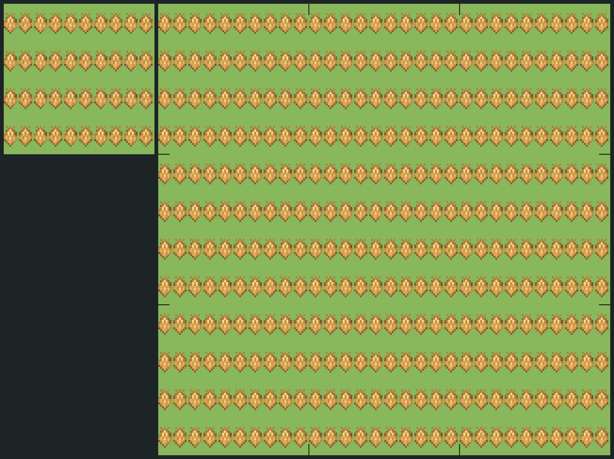

## 13. Live default

**Status:** bead `pulp_wars-3tq.6`, waiting for the user's play test
(`pulp_wars-3tq.7`). The user's decision (recorded on `pulp_wars-3tq.4`):
replace the buildings and all Human units in the live game and do the base
plates; do not replace the other factions' sprites yet; play, then decide.

A player with no stored preference now gets the direction in the CHIBI art
set. The LEGACY art set is untouched: it is never given a direction.

### What the default look draws

| Piece                                          | Default look                                                                                                    |
| ---------------------------------------------- | --------------------------------------------------------------------------------------------------------------- |
| Human units and portraits                      | the production art in fixed crimson and gold, for every player                                                  |
| Every land unit, of every faction, and the Egg | a seat-shaped base plate in the player colour under the feet                                                    |
| Ships and the embarked transport               | unchanged art with the player-coloured sail, in a thin round ring                                               |
| Shared improvements, Farm, Village             | the production art, drawn as authored, no player colour                                                         |
| Port, Shipyard                                 | a small code-drawn pennant in the territory owner's colour                                                      |
| Human City 1 to 3                              | the production art with a pennant on the tower: seat shape in cream, gold for the capital (no separate crown)   |
| Seat badge                                     | not drawn, on any unit or city                                                                                  |
| HP bar                                         | only for a damaged unit: a short bar on the plate, green, amber at two thirds or less, red at one third or less |
| Ready cue                                      | a bright rim round the plate (or the ship's ring); no outline glow                                              |
| Territory border                               | one thin solid line with a soft dark casing; a shared border alternates the two colours                         |
| Roads                                          | no black casing                                                                                                 |
| Terrain, resources, Treasure, the Mine         | unchanged art, toned by code (contrast 65% around the ground's mean, softened outlines), once per raster        |

### What is not converted

**Since bead `pulp_wars-3tq.9` the Goblins are converted** (units,
portraits and cities; see [section 16](#16-goblin-production)); what follows
still holds for Undead and Dinosaur, and for a Goblin piece whose direction
raster failed to load.

Undead, Goblin and Dinosaur keep their current art until the user decides
(`pulp_wars-3tq.7`):

- **Units and portraits** keep their player-coloured garments. On the board
  they stand on a plate, lose the seat badge and show the HP bar only when
  damaged, like every unit. Nothing Human reaches them: no crimson recolour,
  no Human portrait in the dock, the training cards or the technology tree.
- **Cities** keep their faction art, their owner recolour and the classic
  capital crown, exactly as the classic look draws them, minus the seat
  badge. They are **not** toned and get **no pennant**. Decided by looking:
  the fallback pennant on a pole in the cell's top-left corner covers the
  Field Defense badge (the "+2" palisade of a fortified city), floats beside
  the art instead of on a tower, and repeats a colour that already fills
  the roofs; the Goblin and Undead cities also have a flag of their own in
  the art. The study's toning (85% saturation and contrast, softened
  outline) is dropped for them too, so that "not converted" means exactly
  the current sprite.
- **Faction markers are unchanged:** Egg countdown chips, growth chevrons,
  Plague and Bitten chips, Grave markers, the faction badge of a stand-in
  sprite, landing markers, Stampede lanes and Kaboom! previews. One
  collision was fixed: the damaged HP bar on the plate was drawn in the last
  five pixels of the cell, where the territory border and the selection
  outline hid most of it (seen on a damaged Egg and on a selected Guard); it
  now sits 3 px higher, inside both.
- **Stand-ins.** A faction unit whose own raster is missing or fails to load
  is still drawn as the Human sprite of its role with the faction badge;
  that stand-in is now the crimson Human direction sprite.
- **Ships, terrain and resources** are not re-created.

### Loading and fallback

- The production art of section 12 is part of the CHIBI set's normal asset
  loading: `src/render/canvas/live-board-look-v7.ts` builds its registry
  with the module, and the board host and the interface resolve it before
  the default art. Nothing is imported on demand any more.
- **No flash of the previous art.** While a direction raster loads, the
  piece is not drawn (like any CHIBI piece), and the interface shows its
  loading placeholder.
- **Per-piece fallback.** A direction raster that fails to load resolves as
  missing, and that piece alone is drawn from its classic asset: a Human
  unit in the faction crimson through its old mask, a building or a Human
  city in the faction's roof colour and toned, a Human city with the corner
  pennant (it has no authored anchor), a portrait or a dock sprite in the
  owner's colour. The rest of the board is unaffected.
- **No per-frame pixel work.** Toned terrain and fallback copies are built
  once per source raster and cached with it; direction art is drawn as
  authored. A frame only issues draw calls.

### The developer option

Settings > Developer tools > **Board look** > "Classic look (previous art)",
off by default, stored in the browser under
`pulpWars.ruleset7.boardClassicLook.v1` as `{"classic": true|false}`. On, the
board is given no direction and the interface resolves the default registry
alone: the frame is the one drawn before the direction existed (a test
keeps that exact). The experiment's key
`pulpWars.ruleset7.boardVisualDirection.v1` is retired: it is never read and
is removed on load. Its `false` meant "the experiment was not switched on",
not "I prefer the previous art", so no value of it turns the classic look
on; someone who had the experiment on, or off, simply gets the default.

The building and city saturation sliders keep working in both looks: the
direction's rasters go through the same cached desaturated copies.

### Runtime

- `LIVE_DIRECTION_V7` in
  [`visual-direction-v7.ts`](../../src/render/canvas/visual-direction-v7.ts)
  is the Human demo's direction with `city.factionCities: "CLASSIC"`.
  `liveBoardLookV7(artSet, classicLook)` in
  [`live-board-look-v7.ts`](../../src/render/canvas/live-board-look-v7.ts)
  returns the two board-host model fields the game passes
  (`visualDirection`, `visualDirectionArt`), or nothing for LEGACY and the
  classic look. The CHIBI review scenes under `scripts/art/chibi/` spread
  the same fields, so review evidence shows what the game draws.
- `createChibiDomArtV7` takes a `preferred` registry, resolved subject by
  subject before the default one and before a faction subject's shared
  stand-in, so an Undead portrait never becomes the Human direction
  portrait (the experiment's toggle had that leak).
- `HUMAN_DEMO_DIRECTION_V7`, `RECOMMENDED_DIRECTION_V7` and the sample sets
  remain for the study's benches only.

### Evidence

`npm run art:chibi-direction-review` now captures the default look
(`showcase-*`, `ingame-farms-*`) and the classic look
(`showcase-human-today-desktop-zoom-1.png`).

### Weak spots for the play test

- **Mixed matches look two-speed.** Human cities and units are in fixed
  colours beside whole-roof and whole-garment player colour on the other
  three factions, and an unconverted city is bolder than a Human one.
- **Other factions' cities carry no seat shape.** Their owner is read from
  the colour and the border alone; the numbered badge is gone.
- **Four Human players** differ only by plate, pennant and border.
- **The plate sits at the very bottom of the cell;** a ready unit's bright
  rim reaches about 2 px into the cell below.
- **The damaged HP bar overlaps the boots** of a unit by a pixel or two, and
  on a garrisoned unit it is short (25 px).
- **Growth chevrons and affliction chips** stay in the left strip, which no
  longer has a bar beside them; they read, but float a little.
- **The Grave marker overlaps the right tip of the plate.**
- **Improvement value pips** are drawn over the lower left of the smaller
  buildings, as they were over the previous ones.
- **The ready cue** on the plate is weaker than the old glow; not yet tried
  in play.
- **Terrain toning** runs once per terrain raster on first use (a few
  milliseconds each); it is not baked by the pipeline yet.

## 14. Goblin study

**Status:** bead `pulp_wars-3tq.8`; the user reviewed both passes and the
roster was produced and made live in bead `pulp_wars-3tq.9`
([section 16](#16-goblin-production)). The text below is the study as it
was written. The user
liked the Human faction in play and asked to redo the Goblins on the same
principles; the approved look is **scrapyard raiders**. This is a study on
three units (Goblin, Bomb Chucker, Rocket Cart). **Nothing is live:** the
game draws the Goblins exactly as before, no sprite is registered, and
[GOBLIN.md](factions/GOBLIN.md) is unchanged. Bead `pulp_wars-3tq.9`
converts the roster after the review.

**Pass 2** (bead `pulp_wars-3tq.10`) follows the user's review of this
first pass: darker skin, orange-brown leather loincloths instead of the
dark clothing, and a fireworks cart. It is the [last subsection](#pass-2);
the text up to there describes pass 1.

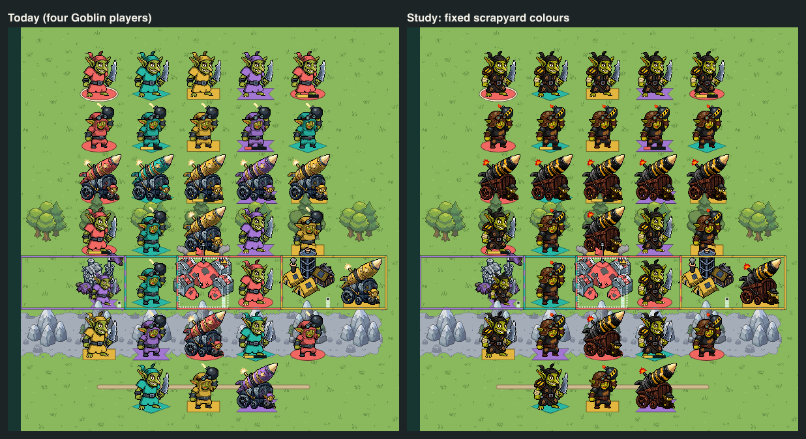

### The look

The same rules as the Human direction (section 12): fixed faction colours,
no owner area and no mask; the player is read from the seat-shaped plate,
the pennant and the border; chibi proportions, camera, top-left light and
black outline unchanged; the same canvases and anchors (56 x 80, and
72 x 88 with anchor 34, 48 for the Rocket Cart).

| Role                    | Colours (measured on the three sprites)      | Share of the sprite | Used for                                                            |
| ----------------------- | -------------------------------------------- | ------------------- | ------------------------------------------------------------------- |
| Skin                    | `#bcbb17`, `#d1bd12`; shadow `#797a0f`       | 9%                  | Goblin skin: a saturated yellow-olive, hue about 57° (Grass is 90°) |
| Leather                 | `#151516`, `#2e2925`, `#291411`              | 35%                 | tunics, caps, bandanas: near-black, warm                            |
| Hide, rust, planks      | `#682f1c`, `#562c12`, `#945b23`              | 14%                 | stitched patches, the rusted pot helmet, the cart                   |
| Gunmetal                | `#6c7c93`, `#97a6c0`, `#3c4859`              | 3%                  | blades, goggles, buckles, the rocket's fins                         |
| Hazard yellow on black  | `#f9c61f`, `#fcab01`, `#f9bb00` on `#151516` | 1.5 to 2.1%         | stripes only: a shoulder pad, a bomb band, the rocket's bands       |
| Fuse spark              | `#de2900`, `#fe7d00`                         | 0.5%                | the lit fuse of a bomb or a rocket, nothing else                    |
| Bandage and paper cream | `#fbeaa5`, `#f6e1a3`                         | 2%                  | forearm wraps, teeth, the rocket's paper cone                       |

`npm run art:goblin-direction-study-review` writes the swatches
(`palette.png`, `palette.json`) from the sprites, so the table is measured,
not chosen by hand. For the units still to come: Orcs a darker, greyer
green, the Troll a grey-blue stone tone (the user's direction; not
generated here).

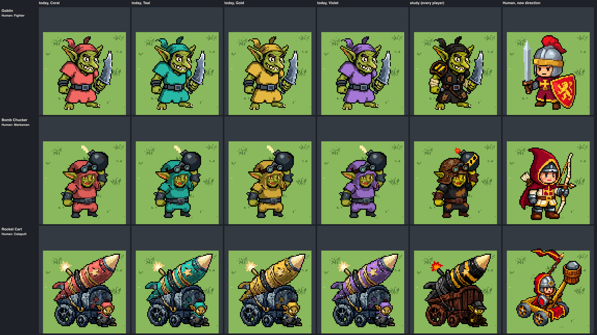

- **Goblin** (`goblin-scrap-edit-h`, candidate 0): near-black leather
  bandana and tunic with brown stitched patches, bandage wraps, a strap,
  and one black shoulder pad with three hazard stripes and a rust rim.
- **Bomb Chucker** (`bomb-chucker-scrap-edit-e`, candidate 0): a rusted
  pot helmet with the goggles, near-black leather with a hide patch, one
  hazard band on the bomb and a small red-orange spark.
- **Rocket Cart** (`rocket-cart-scrap-edit-e`, candidate 0): still the
  low-tech fireworks rocket the user asked for (paper cone, stick, fuse),
  now black tarred card with hazard bands, tied onto a cart of dark planks
  with rusty wheels; the crouching goblin wears a pot helmet.

### How it was made

Run
[`art/explorations/goblin-direction-2026-10/`](../../art/explorations/goblin-direction-2026-10/)
(`batch.json` with every recipe, seed and instruction; `faction.md`;
`subjects.json`; `records.json` with each request as sent and each verdict;
receipts in `submissions/`; candidates in `raw/`): 22 recipes, 22 PixelLab
calls, 39 candidates. One job failed at PixelLab (`goblin-scrap-edit-i`)
and stays recorded as submitted.
[`scripts/art/goblin-direction/samples.ts`](../../scripts/art/goblin-direction/samples.ts)
cuts the chosen candidates and four alternatives into `assets/` and lists
them in `samples.json`.

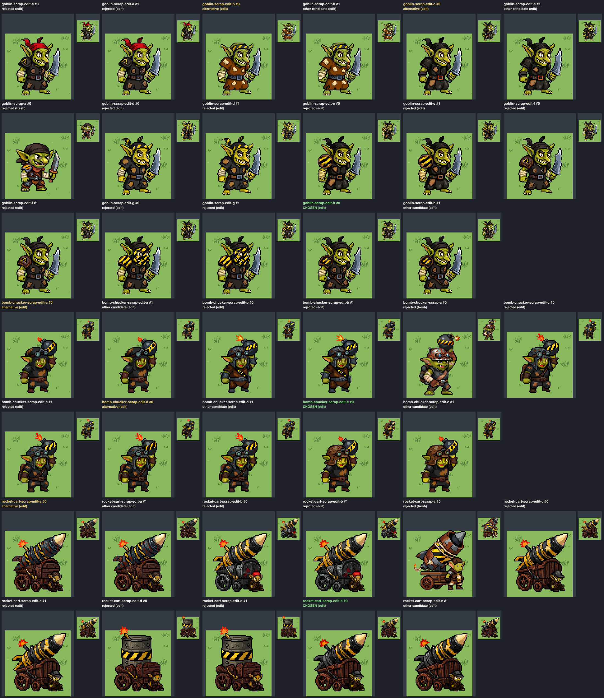

The palette balance was explored on the Goblin first, then carried over:

| Question                | Tried                                                                                                  | Finding                                                                                                                                                                              |
| ----------------------- | ------------------------------------------------------------------------------------------------------ | ------------------------------------------------------------------------------------------------------------------------------------------------------------------------------------ |
| How much hazard stripe? | none (`edit-c`); a 3-pixel chevron (`edit-a`, `edit-f`); a pad (`edit-h`); a headband (`edit-b`, `-d`) | None is a plain dark goblin with no faction mark. The chevron vanishes at 1:1. A pad with three stripes reads at zoom 0.75. The headband reads best but puts yellow beside the face. |
| Skin hue                | unchanged `#a8b941` (`edit-b`); brighter `#bcbb17` (`edit-a`, `-h`); `#e8ce27` (`edit-d`)              | The brighter yellow-olive doubles the distance from Grass (see below). Beyond it the skin is mustard and reads as the Gold player: rejected.                                         |
| Leather darkness        | near-black (`edit-a`, `-c`, `-h`); warm mid brown hide (`edit-b`)                                      | Near-black gives the strongest silhouette on Grass. Mid brown is friendlier, but its cream patches spot the tunic like a giraffe and it sits closer to the Human leather.            |
| Fresh creation or edit? | one `create-image-pixen` per unit                                                                      | As for the Humans: fresh creations come out smaller-headed, more realistic and thinner-lined, and would not stand beside the unconverted units. Edits keep the silhouette.           |
| Rocket material         | scrap-iron plates (`edit-a`); striped paper (`edit-b`, `-c`, `-e`); one barrel band (`edit-d`)         | Scrap iron with spiral stripes is busy and reads as a drill missile. The barrel edit turned the rocket into an oil drum. Black card with yellow bands stays a firework.              |

What worked in the prompts:

- **Edit the accepted sprite**, with an instruction that starts "Change
  only the colours of his clothes and skin: …" and ends "Keep the face,
  ears, dagger, belt, pose, proportions, thick black outline and art style
  exactly the same". An edit instruction is at most 500 characters.
- **Name every red item.** "The red bandana and the red tunic become …"
  left the bandana red once; a second edit that named only the bandana
  fixed it.
- **Repair in small steps.** The chosen Goblin and Rocket Cart are the
  third edit in a chain, each changing one or two things ("Change only the
  brown armour plate on his shoulder: …").
- **Give the stripe a dark carrier.** "A black iron shoulder pad with three
  bold hazard yellow diagonal stripes" works; "painted with hazard yellow
  and black stripes" on a brown plate gave a tiny chevron.
- **Never write "face" for an object.** "Paint its whole face with …
  stripes" (meaning the plate) painted the stripes over the goblin's face.
  Add "Do not touch his head, skin or ears" when the edit is beside them.
- **Ask for "brighter" skin once only**, and not in the same edit as a
  yellow item near the head: yellow pulls the skin to mustard.
- **Say what stays cream or dark on a vehicle**, and check the small crew
  figure: its bandana and skin need their own clause.

The pipeline gained one rule for this: an edit recipe's `source.batch` may
name a production batch by name (`goblin`), not only by number, so a
direction edit can start from a faction's accepted sprite.

### Readability

`npm run art:goblin-direction-study-review` writes `readability.json`
(CIE76 colour difference; about 10 is clear at a glance, 20 and more are
different colours) and draws the scenes of
[`scene.ts`](../../scripts/art/goblin-direction/scene.ts) through the real
board host with the look the game draws.

| Check                                        | Result                                                                                                                                                                                                             |
| -------------------------------------------- | ------------------------------------------------------------------------------------------------------------------------------------------------------------------------------------------------------------------ |
| Goblin skin against Grass (`#89b75b`)        | 34 (Goblin) and 41 (Bomb Chucker); today's skin is 18. Under simulated deuteranopia 30 and 35, today 16. The skin and the Grass are equally bright (contrast 1.1), so the black outline still does the separating. |
| Dark clothes against Grass                   | Leather 82 with a luminance contrast of 7.8; a Coral or Teal garment today has 1.1 to 1.3. The silhouette is far stronger than today on Grass, Forest and Mountain.                                                |
| Hazard yellow against Human gold             | 6: **the same yellow**. They are told apart by amount and pattern, not hue: 1.5 to 2.1% of a Goblin sprite, in stripes on black, against 10 to 18% of a Human sprite, in solid fields on crimson.                  |
| Hazard yellow against the Gold player colour | 17: lighter and more saturated than the plate, and never a filled area.                                                                                                                                            |
| Goblin skin against the Gold player colour   | 22 (Goblin) and 17 (Bomb Chucker); under simulated deuteranopia 7 and 10. A Goblin of the Gold player is a yellow-green figure on a gold plate: readable, but the weakest of the four.                             |
| Four Goblin players by plate only            | Plate colours differ by 61 to 110 from each other. With nothing on the sprite to help, the plate is the only cue, and it works at zoom 0.75 on a phone for the Goblin and the Bomb Chucker.                        |
| The Rocket Cart's plate                      | The cart is 65 px wide and its plate 52: only the plate's tips and front edge show. The same is true of today's cart, but today the rocket itself is in the player colour.                                         |
| Coral and Teal plates under colour blindness | Unchanged from section 7: the Coral plate is 5.5 from Grass under deuteranopia; the seat shape decides.                                                                                                            |

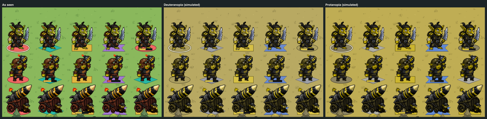

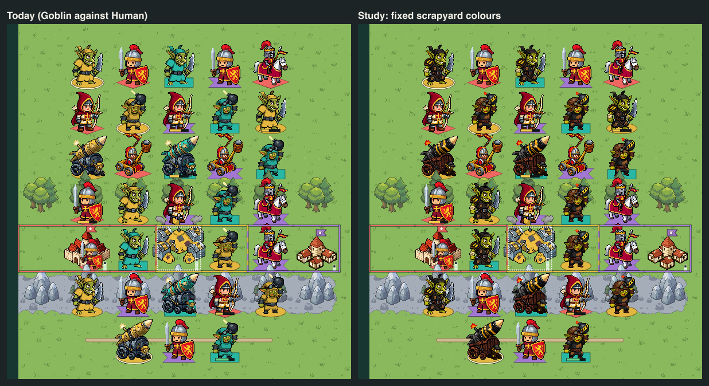

Against the Humans the two factions separate at once: crimson, gold and
polished steel against near-black, rust and olive. Beside a Goblin city the
units no longer repeat the roof colour, so a garrison is easier to pick out;
the city itself is still today's art with player-coloured roofs.

Evidence in
[`art/pixellab/reviews/goblin-direction-study/`](../../art/pixellab/reviews/goblin-direction-study/):
`candidates-x3.png`, `chosen-{1x,x4}.png`, `alternatives-x4.png`,
`palette.{png,json}`, `readability.json`,
`before-after-{four,mixed}-{desktop,phone}-zoom-{1,0.75}.png`,
`same-unit-{desktop,phone}-zoom-{1,0.75}.png` and `index.json`.

### Weak spots

- **The units are dark.** That is the look, and it reads on Grass, but
  three near-black figures in a row are heavier than the Humans, and the
  Bomb Chucker's face is small under its helmet at zoom 0.75.
- **Skin is yellower than the old palette's `#9aa83e`** and differs a
  little between units (`#bcbb17`, `#d1bd12`; the cart's tiny crew goblin
  is `#a08511`, nearly ochre). A production pass should hold one value.
- **The Bomb Chucker's helmet is rust brown**, the Goblin's pad black and
  the dagger blue-grey: the "rusted iron and gunmetal" metal is three
  tones over three units. The gunmetal-helmet alternative
  (`bomb-chucker-scrap-edit-d`) is in `alternatives-x4.png`.
- **The hazard yellow is the Human gold.** Kept apart only by the stripe
  rule; a solid yellow panel on a later unit would break it.
- **The rocket's bands are plain rings**, not diagonal stripes, and one
  star is left from the old fireworks tube.
- **A wide unit hides its plate** (Rocket Cart; the Scrap Buggy, Wolf Rider
  and Troll will too).
- **Portraits, cities and the interface are not touched.**

### Open questions for the user

1. Is near-black leather right, or should the clothes be a warmer mid
   brown (`goblin-scrap-edit-b` in `alternatives-x4.png`)?
2. Is the brighter yellow-olive skin right, or should the skin stay as
   today (greener, closer to the Grass)?
3. Should the base Goblin carry a hazard stripe at all, or only the units
   that go bang (Bomb Chucker, Rocket Cart, Scrap Buggy)? `goblin-scrap-edit-c`
   shows it without.
4. Bomb Chucker: rust-brown pot helmet (chosen), gunmetal pot helmet or the
   leather flying cap?
5. Rocket Cart: striped paper rocket on a plank cart (chosen), or the
   scrap-iron rocket (`rocket-cart-scrap-edit-a`)?
6. Wide units cover their plate. Accept it, or give large units a wider
   plate (a renderer change for every faction)?

### Recommendation for the rest of the roster

Convert as one production batch (`direction-goblin`, `fixedFactionColours`,
every asset `ownerColour: false`), as edits of the accepted `goblin`,
`5-goblin` and `cities-goblin` assets, importing the three study recipes
with `art:chibi -- import`. Write the palette above into a new
`factions/GOBLIN.md` fragment first (it replaces the "no rust, no brown,
no wood" rules, which existed only to protect the red key colour), and
register the art in the direction manifest so the live look resolves it
like the Human art. Expected cost: about 1.5 edits per unit and portrait
and 2 per city, roughly 35 to 45 PixelLab calls.

| Piece                 | Plan                                                                                                     | Predicted difficulty                                                                                                                                                                                                         |
| --------------------- | -------------------------------------------------------------------------------------------------------- | ---------------------------------------------------------------------------------------------------------------------------------------------------------------------------------------------------------------------------- |
| Wolf Rider            | dark leather rider; the red saddle blanket becomes patched hide with one striped strap                   | Medium. The wolf is already dark slate: wolf, rider and blanket may merge into one dark mass. Keep the wolf grey and the blanket a clearly lighter brown.                                                                    |
| Orc Brute             | darker, greyer green skin; rusted pot helmet; the round shield gets a hazard-striped rim or boss         | Medium. The shield is the largest surface: a fully striped shield would be the biggest yellow area in the faction. The red skull emblem must go.                                                                             |
| Orc Warboss (Captain) | grey-green skin; the red cape becomes patched hide; striped shoulder plates; tin megaphone unchanged     | Medium. The cape is about a third of the sprite; in dark hide the Warboss may lose his standing as the leader. One striped pauldron pair should carry it.                                                                    |
| Scrap Buggy           | rusted and gunmetal mismatched panels with one hazard-striped panel or ram; driver as the Bomb Chucker   | High. Today the whole body is the owner colour; the edit must invent a material for it without redrawing the car (the Human Catapult needed "change only …").                                                                |
| Troll                 | grey-blue stone skin; the red smock becomes a patched hide loincloth; no stripe, or one striped arm band | Medium. The smock is huge; a near-black one would make the largest unit a black block. Use mid-brown hide here and let the skin carry the figure.                                                                            |
| Portraits (8)         | edits of the `5-goblin` busts, same instruction as the unit                                              | Low to medium. 48 x 48 leaves a stripe two pixels wide; ask for one bold stripe band. The two vehicle portraits follow their units.                                                                                          |
| Cities 1 to 3         | red roofs and tents become rusted sheet iron and patched hide; one hazard-striped gate or tower per tier | Medium to high. Needs a decision the Humans already have: a code-drawn pennant with recorded anchors (`DIRECTION_FLAG_ANCHORS_V7`) and `factionCities` no longer `"CLASSIC"` for Goblins, which is renderer work with tests. |
| Kaboom! and WAAAGH!   | add the hazard band to the bomb icon                                                                     | Low.                                                                                                                                                                                                                         |

Order: the fragment and the batch scaffold; Orc Brute, Wolf Rider and Troll
as the next sample (they settle the two other skin tones); then the rest,
the portraits, and the cities with their renderer change last. Until then
a Goblin player keeps today's sprites on plates, as now.

### Pass 2

**Status:** bead `pulp_wars-3tq.10`, waiting for the user's review. Still a
study: nothing is live and nothing is registered. The user's feedback on
the first pass: "let's make the skin a bit darker but reduce the dark
clothing. try orange-brown leather loincloths and such. for the cart let's
try a fireworks cart look rather than a missile."

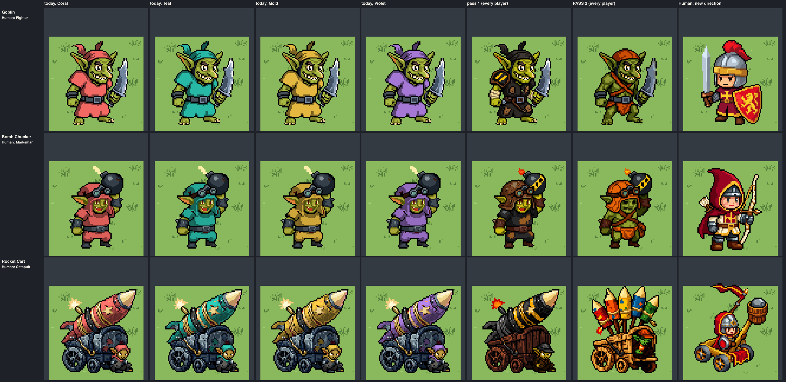

#### What changed

- **Skin:** from the yellow of pass 1 (`#bcbb17`, hue 57°) to an olive
  green a step darker than today's (`#8e9a35` and `#929f2f`, hue 67°;
  today's is `#a8b941`), with a much darker shadow (`#4b560f`). The Goblin
  and the Bomb Chucker differ by 4.8, which is not visible.
- **Clothes:** the near-black leather (35% of the pass 1 sprites) is gone.
  Both figures wear an orange-brown leather cap, crossed chest straps and a
  loincloth, and show bare skin on the chest, arms and legs: skin is 33% of
  the Goblin and 23% of the Bomb Chucker. Near-black is left in the belt,
  the wrist bands, gloves and boots, and the bomb.
- **Hazard stripe:** only on the Bomb Chucker's bomb. The chosen Goblin has
  none; `goblin-leather-edit-m` in the alternatives shows a Goblin with the
  pass 1 striped shoulder pad, to compare.
- **Rocket Cart:** a fireworks cart. A roped bundle of five paper rockets
  on sticks (red, orange, yellow, blue, green, with cream cones, a star or
  patch on each wrapper and one lit fuse) on a rickety cart of pale planks,
  with the crew goblin riding in the cart and holding a match.
- **Principles:** unchanged. Fixed colours, no owner area, the same
  canvases and anchors, the same outline, camera and light.

| Role                           | Colours (measured on the three sprites) | Share of the sprites | Used for                                                   |
| ------------------------------ | --------------------------------------- | -------------------- | ---------------------------------------------------------- |
| Skin                           | `#929f2f`, `#8e9a35`; shadow `#4b560f`  | 17%                  | Goblin skin: olive green, hue about 67° (Grass is 90°)     |
| Orange-brown leather           | `#ca4d02`, `#e66607`; shadow `#7e2602`  | 17%                  | caps, straps, loincloths, the satchel; also the fuse spark |
| Planks, sticks, rope           | `#ac700f`, `#ce9435`, `#fbba55`         | 11%                  | the cart (24% of that sprite), rocket sticks, rope         |
| Near-black                     | `#151b1e`, `#2b2f36`, `#350e01`         | 12%                  | the bomb, belts, gloves and boots, gaps between planks     |
| Gunmetal                       | `#687a8e`, `#909fb5`, `#3a4759`         | 3.5%                 | the dagger, goggles, buckles                               |
| Yellow                         | `#fbc208`, `#ffc100`                    | 1.5%                 | the bomb's hazard band; one yellow rocket                  |
| Rocket paper: red, blue, green | `#e00c02`, `#075c93`, `#27781c`         | 4.5%                 | the fireworks only                                         |
| Paper cream                    | `#fee182`, `#fef1b7`                    | 2.4%                 | rocket cones, teeth                                        |

`npm run art:goblin-direction-study-review` now writes the pass 2 evidence
(`--pass 1` rewrites the pass 1 evidence unchanged). The table is measured
by it (`pass-2/palette.png`, `pass-2/palette.json`).

- **Goblin** (`goblin-leather-edit-k`, candidate 0): leather cap, crossed
  straps, loincloth, today's belt and wrist bands, no stripe.
- **Bomb Chucker** (`bomb-chucker-leather-edit-f`, candidate 0): a leather
  flying cap with the goggles, crossed straps to the satchel, loincloth;
  the bomb keeps one hazard band and a small spark.
- **Rocket Cart** (`fireworks-cart-edit-h`, candidate 0): the fireworks
  cart on pale planks.

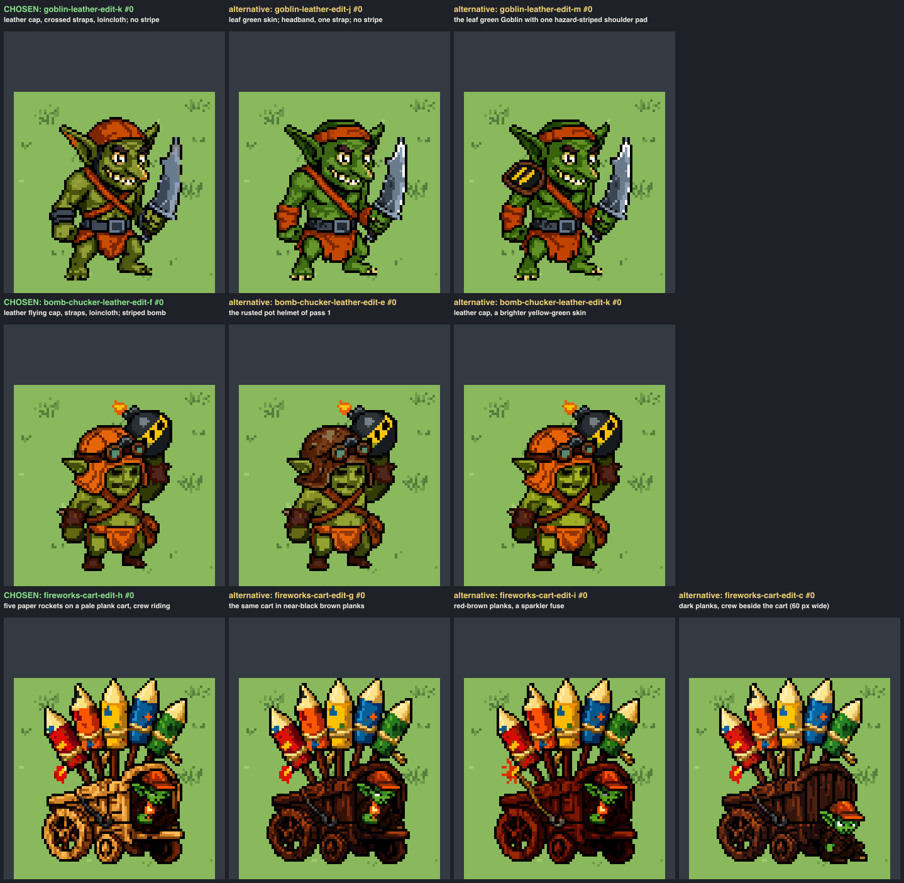

Alternatives kept for the review: a truer leaf-green Goblin with a
headband (`goblin-leather-edit-j`, skin `#67952d`, hue 87°) and the same
with a striped shoulder pad (`-m`); the Bomb Chucker with the rusted pot
helmet of pass 1 (`bomb-chucker-leather-edit-e`) and with a brighter skin
(`-k`); the cart in near-black planks (`fireworks-cart-edit-g`), in
red-brown planks (`-i`) and with the crew beside it (`-c`).

#### How it was made

The same run,
[`art/explorations/goblin-direction-2026-10/`](../../art/explorations/goblin-direction-2026-10/),
extended: 35 new recipes (seeds from 79001), 35 PixelLab calls, 66
candidates; the pass 1 recipes, records and receipts are unchanged. One job
failed at PixelLab (`bomb-chucker-leather-edit-h`) and stays recorded as
submitted. `faction.md` now carries the pass 2 fragment (the pass 1 text is
kept in it as history) and `subjects.json` a `UNIT:GOBLIN:CATAPULT/FIREWORKS`
subject for the two fresh creations. `samples.ts` cuts the pass 2 samples as
`chibi-study2-*` beside the pass 1 `chibi-study-*`.

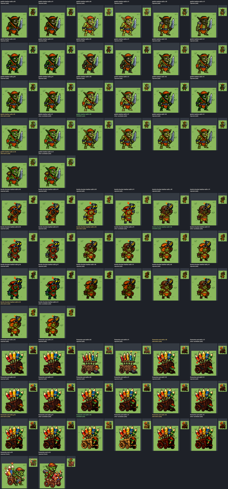

| Question                | Tried                                                                                                            | Finding                                                                                                                                                                                                                                                    |
| ----------------------- | ---------------------------------------------------------------------------------------------------------------- | ---------------------------------------------------------------------------------------------------------------------------------------------------------------------------------------------------------------------------------------------------------- |
| Wardrobe                | loincloth and one strap (`goblin-…-a`); cap and crossed straps (`-b`); open vest and shoulder plate (`-c`)       | "Take off the tunic so his chest, belly, arms and legs are bare skin; he wears only …" redraws the body well from either the live sprite or a pass 1 one. The vest read as armour again.                                                                   |
| How dark is the skin?   | "deeper, darker" (`-a`, `-d`); "one shade darker" (`-g`); "a little lighter" (`-h`); "clearly lighter" (`-k`)    | PixelLab has two answers: nearly black (`#46480c`, `#00290f`) or today's pale olive (`#a8ba47`). The chosen tone came from lifting a too-dark result ("a mid-tone … the shadow only a little darker than the light tone"), not from darkening a light one. |
| Olive or true green?    | "moss", "leaf green" (emerald with black limbs); "the green of a fresh pea pod … the same darkness" (`-j`)       | The pea-pod wording gave a clean leaf green (`#67952d`) on one Goblin and did nothing on the other Goblin and on the Bomb Chucker (three tries). The olive tone is the one all three figures reach.                                                        |
| Helmet or cap?          | leather flying cap (`bomb-chucker-…-f`); rusted pot helmet (`-e`); red hood (`-b`)                               | The cap carries the orange-brown leather and matches the Goblin's; the pot helmet is the darkest thing left on the figure. Both are in the alternatives.                                                                                                   |
| Fireworks: edit or new? | edits of the pass 1 cart (`fireworks-cart-edit-a`) and of the live cart (`-b`); two fresh creations (`-a`, `-b`) | The edit of the pass 1 cart kept the chibi cart and replaced the rocket with a bundle. The fresh creations drew a big realistic goblin beside a small cart, and a cart of dynamite: not the roster's style.                                                |
| Pencils or fireworks?   | plain tubes (`-edit-a`, `-b`); a star or patch on each wrapper and a lit fuse (`-edit-c`)                        | Plain coloured tubes with cream cones are coloured pencils. A second colour on each wrapper, the rope and one spark make them fireworks.                                                                                                                   |
| A narrower cart         | "shorter cart" (`-edit-d`, `-f`); the crew on the cart (`-edit-e`, `-g`)                                         | Asking for a shorter cart changed nothing (twice). Moving the crew goblin from the ground onto the cart took the sprite from 60 to 58 px; pass 1 and today's are 65.                                                                                       |
| Plank colour            | near-black brown (`-edit-g`); pale (`-edit-h`); red-brown (`-edit-i`)                                            | The pale planks are the least dark and lift the cart off the Grass; they are also the colour nearest to the Human Catapult.                                                                                                                                |

Prompt notes added to those of pass 1:

- **Ask for bare skin by body part** ("his chest, belly, arms and legs are
  bare skin") and name each remaining garment.
- **Change the skin alone**, in an edit of its own. Skin and leather in one
  edit gave a grey, muddy figure.
- **Never say "deeper" or "darker" for skin.** Say what the shadow tone
  should be relative to the light tone.
- **"Change only the colour of the wood"** recolours a vehicle cleanly;
  "like old walnut" gives red-brown, "weathered mid brown with orange-brown
  highlights" gives a pale honey.

#### Readability

`pass-2/readability.json`, same measures as pass 1.

| Check                                         | Result                                                                                                                                                                                                                                     |
| --------------------------------------------- | ------------------------------------------------------------------------------------------------------------------------------------------------------------------------------------------------------------------------------------------ |
| Skin against Grass (`#89b75b`)                | 17 (Goblin) and 18 (Bomb Chucker): the same as today's 18, and half of pass 1's 34. Under simulated deuteranopia 12 and 14. The skin's shadow tone is 39 with a contrast of 3.4. The outline and the shadow do the separating, as today.   |
| The leaf-green alternative against Grass      | 14: a truer green is nearer to the Grass in hue; it is darker than the Grass (contrast 1.5), which keeps it apart.                                                                                                                         |
| Clothes against Grass                         | Leather 83 (contrast 2.0), its shadow 79 (4.2), planks 53. Pass 1's leather had a contrast of 6.2: the figures are lighter and the silhouette is weaker than in pass 1, though stronger than today's Coral or Teal garment (contrast 1.3). |
| Orange-brown leather against the Coral plate  | 32 (27 under deuteranopia): different colours, but the nearest pair in the study. A Coral player's Goblin is an orange figure on a coral plate.                                                                                            |
| Orange-brown leather against the Gold plate   | 51.                                                                                                                                                                                                                                        |
| Orange-brown leather against Human crimson    | 37 for the lit tone; the leather's shadow (`#7e2602`) is 22 from the crimson (`#980322`), and 8 under deuteranopia. Told apart by amount, by the green skin beside it, and by the Humans' steel and gold.                                  |
| Yellow against Human gold and the Gold plate  | 8 and 20: as in pass 1, the same yellow as the Human gold. It is 0% of the Goblin, 2% of the Bomb Chucker and 2.2% of the cart (one rocket).                                                                                               |
| Pale planks against Human gold and Gold plate | 36 and 28: browner and darker than both.                                                                                                                                                                                                   |
| Skin against the Gold plate                   | 30 (Goblin) and 29 (Bomb Chucker), up from 22 and 17 in pass 1: the Gold player's Goblin is no longer yellow on gold.                                                                                                                      |
| Four Goblin players by plate only             | Unchanged: the plates differ by 61 to 110 and are the only cue.                                                                                                                                                                            |
| The cart against its plate                    | 58 px over a 52 px plate: 3 px beyond each end. Pass 1 and today's cart are 65 px (5 and 8 px beyond). The plate's tips and front edge show; see the scenes.                                                                               |
| Skin from unit to unit                        | Goblin to Bomb Chucker 4.8. The cart's tiny crew goblin is a brighter green (`#5da923`, 28 away): it is 1.4% of the sprite.                                                                                                                |

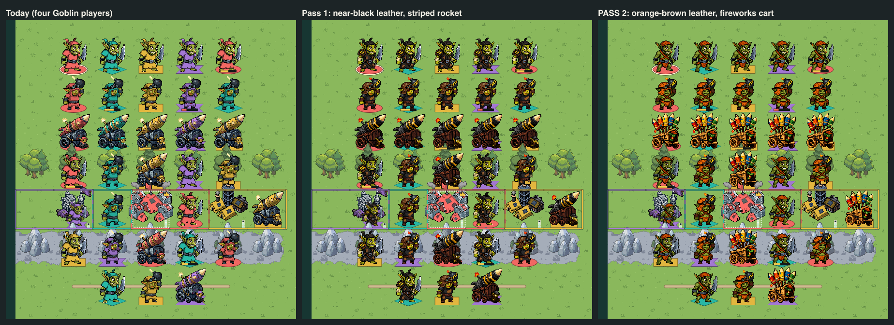

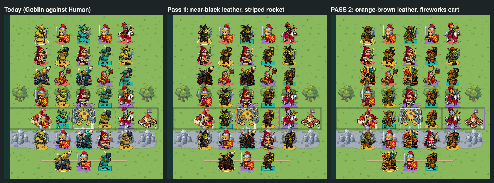

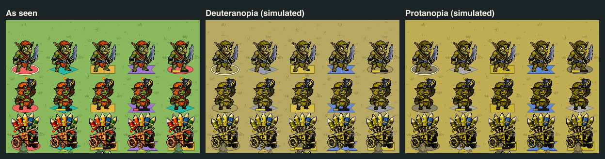

Evidence in
[`art/pixellab/reviews/goblin-direction-study/pass-2/`](../../art/pixellab/reviews/goblin-direction-study/pass-2/):
`candidates-x3.png`, `chosen-{1x,x4}.png` (today in four colours, pass 1,
pass 2, Human), `alternatives-x4.png`, `palette.{png,json}`,
`readability.json`,
`before-after-{four,mixed}-{desktop,phone}-zoom-{1,0.75}.png` (three
panels: today, pass 1, pass 2), `same-unit-{desktop,phone}-zoom-{1,0.75}.png`
and `index.json`. The pass 1 files stay one directory up.

#### Findings

- **The lighter look works as a faction.** Green skin, orange leather and
  a little black read as "goblin raiders" at zoom 0.75, and the three
  units belong together: the same cap, the same straps, the same skin.
- **It is calmer and friendlier than pass 1, and less contrasty.** On
  Grass the figures are mid-tones on a mid-tone; pass 1's black figures
  stood out more. On Forest and Mountain the difference is small.
- **The fireworks cart is the strongest sprite of the study.** It is the
  only Goblin unit with red, blue and green on it, so it reads as the
  siege unit at once, and it cannot be mistaken for the Human Catapult.
- **The faction now has no signature accent on its basic unit.** With the
  stripe gone from the Goblin, the faction mark is the skin and the
  leather; the hazard stripe is a mark of "things that explode".
- **Against Humans** the two factions still separate at once: crimson,
  gold and steel against green skin and orange leather. The Bomb Chucker's
  orange cap beside the Marksman's crimson hood is the nearest pair.

#### Weak spots

- **The leather is more orange than brown** (`#ca4d02`, `#e66607`). An
  edit asking for "browner saddle leather" together with the skin failed;
  a leather-only edit was not tried. It is the colour nearest to the Coral
  plate.
- **The skin is olive, not a true green**, and no nearer to separable from
  the Grass than today's. The leaf-green alternative could not be
  reproduced on the Bomb Chucker.
- **The cart's crew goblin is small, dark and a different green**, and is
  hard to see inside the cart at zoom 0.75.
- **The cart is still 6 px wider than its plate.** No edit made the cart
  itself shorter.
- **The pale planks are near the Human Catapult's wood.** The dark and the
  red-brown carts are in the alternatives.
- **The rockets' cones still look a little like pencil tips** at ×4; at
  1:1 they read as fireworks.
- **Portraits, cities and the interface are not touched.**

#### Open questions for the user

1. Skin: the olive green chosen (`#8e9a35`), or the truer leaf green of
   the alternative (`#67952d`), which would need more tries per unit?
2. Leather: is this orange right, or should it be browner (less like the
   Coral plate)?
3. Is the Goblin right with no stripe, or should it keep a small striped
   pad (`goblin-leather-edit-m`)?
4. Bomb Chucker: leather flying cap (chosen) or the rusted pot helmet?
5. Cart planks: pale (chosen), red-brown or near-black?
6. Is losing some contrast on Grass, compared with pass 1, acceptable?
7. Still open from pass 1: wide units cover their plate. Accept it, or
   give large units a wider plate?

#### Recommendation for the rest of the roster, in this look

As in pass 1, one production batch (`direction-goblin`,
`fixedFactionColours`, every asset `ownerColour: false`) of edits of the
accepted `goblin`, `5-goblin` and `cities-goblin` assets, importing the
three chosen recipes with `art:chibi -- import`, after a new
`factions/GOBLIN.md` fragment with the pass 2 palette. The lighter look
costs more than pass 1 did: taking a tunic off redraws the body, and the
skin tone needs its own edit. Expect about 3 edits per unit (wardrobe,
skin, repair), 1.5 per portrait and 2 per city: roughly 45 to 60 PixelLab
calls.

| Piece                 | Plan in this look                                                                                                   | Predicted difficulty                                                                                                                                                                           |
| --------------------- | ------------------------------------------------------------------------------------------------------------------- | ---------------------------------------------------------------------------------------------------------------------------------------------------------------------------------------------- |
| Wolf Rider            | bare-chested rider in a leather cap and loincloth; the red saddle blanket becomes orange-brown hide                 | Low to medium. Easier than in pass 1: the grey wolf, green rider and orange blanket are three tones, so they no longer merge.                                                                  |
| Orc Brute             | darker, greyer green skin; leather harness and loincloth; a plank shield with a rusted iron rim, no red skull       | Medium. More bare skin makes the Orc's skin tone the main difference from a Goblin: fix the Orc green first, on this unit.                                                                     |
| Orc Warboss (Captain) | grey-green skin; the red cape becomes an orange-brown hide cape; rusted shoulder plates; tin megaphone unchanged    | Medium. An orange-brown cape is a third of the sprite and the largest leather area in the faction: check it against the Coral plate.                                                           |
| Scrap Buggy           | a plank and rusted-panel body, a bundle of fireworks or a string of bangers on the back; driver as the Bomb Chucker | High. Today the whole body is the owner colour; the edit must invent a material without redrawing the car. Planks worked on the cart ("change only the colour of the wood").                   |
| Troll                 | grey-blue stone skin; the red smock becomes an orange-brown hide loincloth and one shoulder strap                   | Medium to high. Taking the smock off redraws most of a large body; expect a wardrobe edit and a skin edit, and check the proportions against today's.                                          |
| Portraits (8)         | edits of the `5-goblin` busts: cap or headband, bare shoulders, a strap                                             | Low to medium. A bust shows mostly skin and cap, so the skin tone must be held to one value across all eight.                                                                                  |
| Cities 1 to 3         | red roofs and tents become orange-brown hide and pale planks; a rack of fireworks on the tier 3 tower               | Medium to high. Needs the renderer decision of pass 1 (a code-drawn pennant with recorded anchors, `factionCities` no longer `"CLASSIC"` for Goblins). Hide roofs must stay off the Coral hue. |
| Kaboom! and WAAAGH!   | the bomb icon gets the hazard band; fireworks could mark WAAAGH!                                                    | Low.                                                                                                                                                                                           |

Order: decide the leather and skin questions above first, since every
later edit copies them; then the fragment and the batch scaffold; Orc
Brute, Wolf Rider and Troll as the next sample; then the rest, the
portraits, and the cities with their renderer change last.

## Sources

- Wargroove, "Palette swapping": <https://wargroove.com/palette-swapping/>
- Joost van Dongen (Ronimo), "Making gameplay stand out against rich
  backgrounds":
  <http://joostdevblog.blogspot.com/2015/05/making-gameplay-stand-out-against-rich.html>
- Blizzard, "Mastering Mapmaking: Part One" (unit readability first):
  <https://news.blizzard.com/en-us/article/20097658/mastering-mapmaking-part-one>
- Age of Empires wiki, "Player" (player colours, outlines, rings under
  units): <https://ageofempires.fandom.com/wiki/Player>
- Age of Empires II: Definitive Edition accessibility (colour-blind modes,
  friend-or-foe colours): <https://www.ageofempires.com/age-ii-de-accessibility/>
- Polytopia wiki, "Tribes" (mirror matches get recoloured copies):
  <https://polytopia.fandom.com/wiki/Tribes>
- TheGamer, Polytopia review (clutter on small maps):
  <https://www.thegamer.com/battle-of-polytopia-review/>
- Civilization VI unit flags: <https://civ6.fandom.com/wiki/Category:Unit_flag_icons>;
  "jersey" colours: <https://forums.civfanatics.com/threads/%E2%80%9Cjersey%E2%80%9Dcolors.642076/>
- Into the Breach, readability of its tiles and markers:
  <https://skullduggery.us/rants/into-the-breach/>
- Game Developer, "How to reduce visual confusion in your game":
  <https://www.gamedeveloper.com/design/how-to-reduce-visual-confusion-in-your-game>
- Purple Pwny Studios, "Visual hierarchy for game developers":
  <http://purplepwny.com/blog/visual_hierarchy_for_game_developers_a_practical_guide_to_making_important_stuff_seem_important.html>
- Tabletop base rings and rim colours for squad identification:
  <https://www.heresy-online.net/threads/do-you-paint-around-the-edge-of-bases.164034/>
- Colour-blindness simulation: Machado, Oliveira and Fernandes, "A
  physiologically-based model for simulation of color vision deficiency"
  (2009).

## 15. Undead study

**Status:** bead `pulp_wars-3tq.11`, waiting for the user's review. The
user's direction for the Undead: "I'm ok with dark for the undead esp
necromancers robes. but there should be a lot of pale bones plus one accent
color. violet, cyan or green. run a study and show me." This is a study on
three units, each in the three accent options. **Nothing is live:** the
game draws the Undead exactly as before, no sprite is registered, and
[UNDEAD.md](factions/UNDEAD.md) is unchanged.

Units chosen from the roster (`src/engine/rules/ruleset-v7.ts`):

- **Skeleton** (`UNIT:UNDEAD:FIGHTER`), the bone-heavy basic unit;
- **Zombie** (`UNIT:UNDEAD:GUARD`), the flesh unit. It is chosen over the
  Ghoul because Infect and the Bitten status turn other units into Zombies,
  so it is the flesh unit seen most, and its upright figure compares
  directly with the Human Guard;
- **Necromancer** (`UNIT:UNDEAD:CAPTAIN`), the caster that raises the dead
  from Graves, in dark robes.

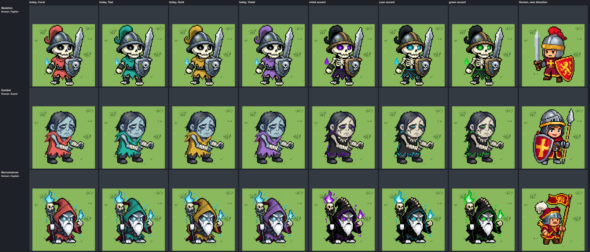

### The look

The same rules as the Human direction (section 12) and the Goblin study
(section 14): fixed faction colours, no owner area and no mask; the player
is read from the seat-shaped plate, the pennant and the border; chibi
proportions, camera, top-left light and black outline unchanged; the same
56 x 80 canvas and anchor.

| Role             | Colours (measured on the three sprites) | Share of the sprites | Used for                                                             |
| ---------------- | --------------------------------------- | -------------------- | -------------------------------------------------------------------- |
| Bone, lit        | `#e6e0c8`, `#fefbdd`, `#d0c9a9`         | 8.7%                 | skulls, ribs, arm and hip bones, bandages, the bone necklace         |
| Bone, shaded     | `#bab497`, `#a59e84`, `#898670`         | 4.7%                 | the warm grey shade of bone                                          |
| Pallid flesh     | `#948884`, `#9e918b`, `#a89b93`         | 2.8% (Zombie 9%)     | Zombie skin: a warm ash grey, hue 15, saturation 0.11                |
| Dark cloth       | `#313135`, `#14181a`, `#100f10`         | 28.1%                | loincloth, smock, hood and robe, crest: near-black charcoal          |
| Iron             | `#64717e`, `#818f9b`, `#3d424d`         | 11%                  | helmet dome, shield face, sword, staff                               |
| Tarnished bronze | `#574329`, `#966f40`, `#755732`         | 3.6%                 | the rims of the Skeleton's helmet and shield only                    |
| Beard white      | `#ffffff`, `#ebecf1`                    | 4.2%                 | the Necromancer's beard                                              |
| **Accent**       | one of the three below                  | 7% (3.5% to 13.4%)   | eye glow, flames and sparks, the staff head, a thin hem or hood trim |

| Option | Lit tone  | Commonest tones                 | Derivation (hue, spread) |
| ------ | --------- | ------------------------------- | ------------------------ |
| Violet | `#a221ee` | `#6f06c9`, `#9d1aea`, `#7614ca` | 274°, 0.5                |
| Cyan   | `#21ceee` | `#06b6c9`, `#1acaea`, `#14b8ca` | 187°, 0.3                |
| Green  | `#21ee44` | `#06c91d`, `#1aea3e`, `#14ca29` | 128°, 0.3                |

Bone and the pale face or beard together are 18% of the Skeleton, 29% of
the Zombie and 15% of the Necromancer; dark cloth is 24%, 37% and 25%. The
accent is 4.6% of the Skeleton (eye sockets, the small flame, the hem), 3.5%
of the Zombie (eyes and hem) and 13.4% of the Necromancer (two flames,
sparks, eyes, hood and hem trim). The table is written from `palette.json`,
which `npm run art:undead-direction-study-review` measures on the sprites.

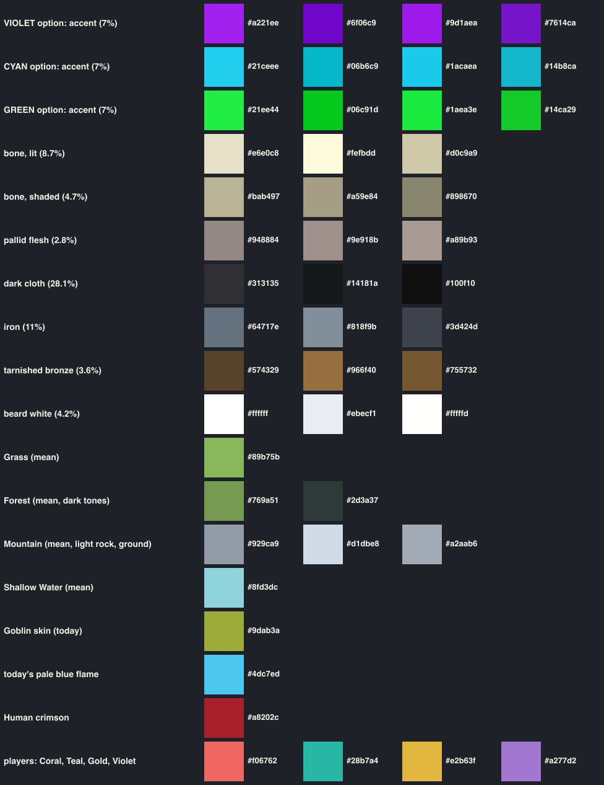

- **Skeleton** (`skeleton-bone-edit-d`, candidate 0): the tabard is gone,
  so the ribcage, spine and hip bones show; a short near-black loincloth
  with an accent hem; a black crest; the eye sockets glow; iron helmet and
  shield with bronze rims.
- **Zombie** (`zombie-bone-edit-b`, candidate 0): pallid ash grey skin
  (today it is blue-grey), a ragged charcoal smock with an accent hem, a
  necklace of small bones, the bandaged arms, thin glowing eyes.
- **Necromancer** (`necromancer-bone-edit-c`, candidate 0): near-black hood
  and robe with a thin accent trim, small bone spikes along the hood's
  ridge, the skull staff with its flame, the white beard and glowing eyes.

### How it was made

Run
[`art/explorations/undead-direction-2026-10/`](../../art/explorations/undead-direction-2026-10/)
(`batch.json` with every recipe, seed and instruction; `faction.md`;
`subjects.json`; `records.json` with each request as sent and each verdict;
receipts in `submissions/`; candidates in `raw/`): 13 recipes, 13 PixelLab
calls, 25 candidates.

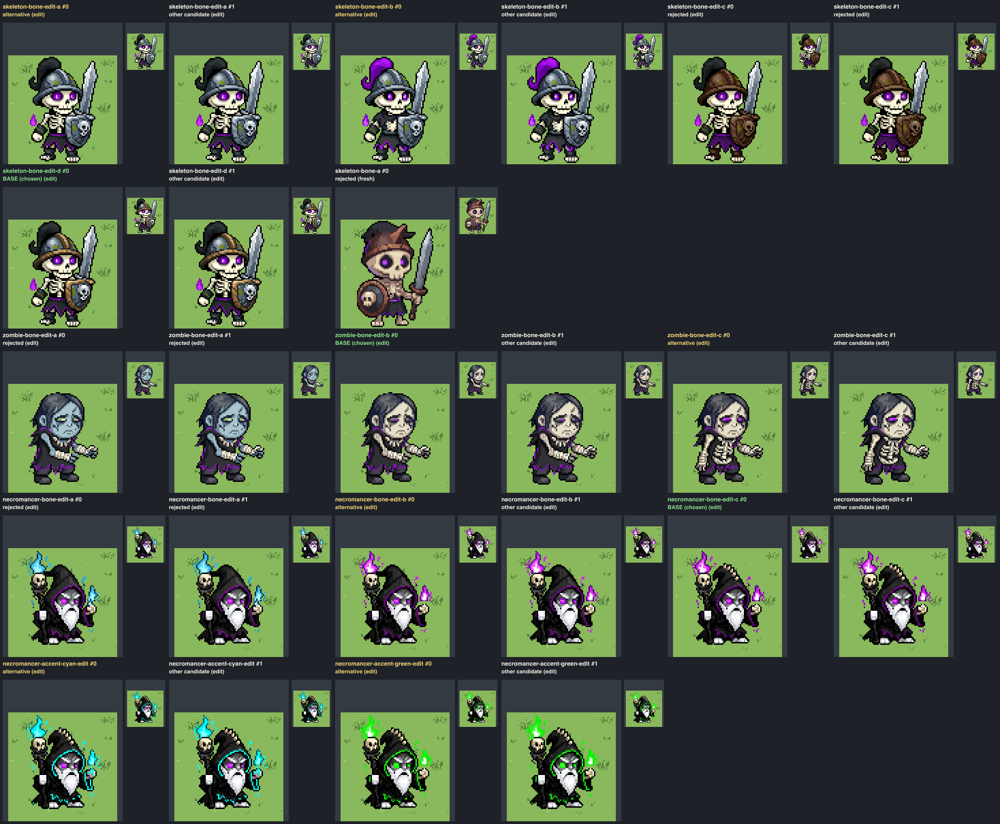

**Step 1, the base.** Each unit is an `edit-image-pixen` chain on its
accepted sprite (batch `undead`), always asking for a violet accent:

| Recipe                          | Result                                                                                                                                          |
| ------------------------------- | ----------------------------------------------------------------------------------------------------------------------------------------------- |
| `skeleton-bone-edit-a`          | alternative: tabard removed, bare ribcage, black loincloth and crest, violet eyes, trim and flame; all-iron helmet and shield                   |
| `skeleton-bone-edit-b`          | alternative: the tabard kept in charcoal with a few ribs showing and the whole crest violet; less bone, and the crest is a large accent area    |
| `skeleton-bone-edit-c`          | rejected: "tarnished bronze" helmet and shield came out as brown wood, the loincloth turned solid violet, the boots brown                       |
| `skeleton-bone-edit-d`          | **base**: `edit-a` with only the rims of the helmet and shield in bronze                                                                        |
| `skeleton-bone-a`               | rejected: a fresh creation; thinner, a thinner outline, a different skull and cap                                                               |
| `zombie-bone-edit-a`            | rejected: the skin stayed blue-grey and the eyes came out yellow-green                                                                          |
| `zombie-bone-edit-b`            | **base**: a repair naming only the skin ("with no blue at all") and the eyes                                                                    |
| `zombie-bone-edit-c`            | alternative: "a torn hole showing three ribs" replaced the whole torso and one arm with bare bones; a second Skeleton, no longer the flesh unit |
| `necromancer-bone-edit-a`       | rejected: hood, robe, trim and eyes right, but every flame stayed pale blue                                                                     |
| `necromancer-bone-edit-b`       | alternative: a repair naming every flame and spark                                                                                              |
| `necromancer-bone-edit-c`       | **base**: `edit-b` plus bone spikes on the hood (the shoulder skulls that were also asked for did not appear)                                   |
| `necromancer-accent-cyan-edit`  | comparison: the cyan accent by a PixelLab edit; the eyes stayed violet and the trim became twice as thick                                       |
| `necromancer-accent-green-edit` | comparison: the green accent by a PixelLab edit; correct, but a thicker and brighter trim than the base                                         |

**Step 2, the accent options.** The three options of a unit are the same
base with only its accent pixels recoloured, by
[`scripts/art/undead-direction/accent.ts`](../../scripts/art/undead-direction/accent.ts):
a pixel is an accent pixel when its hue is 250° to 320°, its saturation at
least 0.4 and its value at least 0.2 (nothing else in the look comes near:
bone is hue 30° to 55°, flesh and iron are below saturation 0.3, and the
Zombie's navy hair is hue 227°); its new hue is the option's hue plus a
fraction of its distance from 285°, with saturation and value unchanged.
So the violet, cyan and green sprites of a unit are pixel-identical outside
the accent (120, 76 and 290 accent pixels), and a test checks that.
[`samples.ts`](../../scripts/art/undead-direction/samples.ts) cuts the nine
masters and six alternatives into `assets/` and records each derivation in
`samples.json`. The violet option is itself a remap: PixelLab's "bright
violet" is a magenta (`#d521ee`, hue 293°), moved here to a true violet
(274°).

The two accents made by an edit pass show why the remap is the better
method: an edit changes the trim's thickness and brightness and can miss a
part (the eyes), so the options would not be like for like.

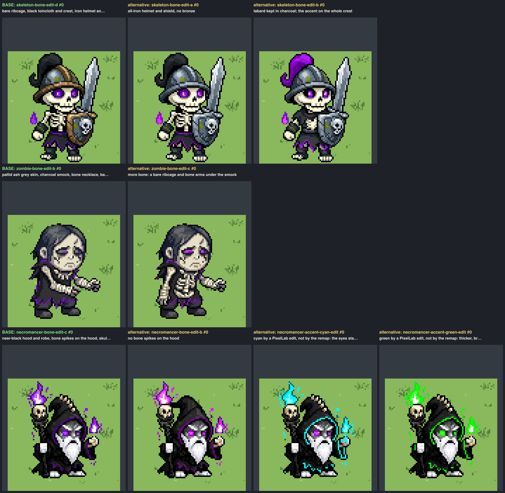

What worked in the prompts:

- **"Remove the tabard so his bare ribcage, spine and hip bones show"** is
  the one instruction that makes a unit bone-heavy. "Open at the chest so
  ribs show" gives a dark shirt with three ribs.
- **Name the skin's wrong colour.** "Pallid light ash grey" alone left the
  blue-grey skin; "pallid light warm ash grey with no blue at all" in an
  edit of its own changed it.
- **Name every glow.** "Every pale blue flame and spark becomes violet" in
  an edit that also recolours the robe changed nothing; a second edit that
  lists the flame above the staff, the flame at the hand and the sparks,
  and ends "Nothing blue is left", changed all of them. Eyes need their own
  clause.
- **Ask for bronze on a rim, not on an object.** A bronze helmet is drawn
  as brown wood or leather at this size; "the rim of the helmet and the rim
  of the shield become dull tarnished bronze … the dome and the face stay
  dark grey iron" works.
- **"A thin trim along the torn hem"** gives a one-pixel zigzag line, which
  is the right amount. "The crest becomes violet" gives a large solid
  accent area.
- **Do not add bone to a flesh unit by a hole in its clothes:** the
  generator replaces the body under the hole.
- As for the Humans and the Goblins, **edits keep the silhouette and fresh
  creations do not.**

Not used: verdigris. A blue-green metal sits between the cyan and the green
option and would be a second accent beside either; the study keeps the
metal to iron and bronze.

### In the game

`npm run art:undead-direction-study-review` draws the scenes of
[`scene.ts`](../../scripts/art/undead-direction/scene.ts) through the real
board host with the look the game draws: today's sprites, then each accent.

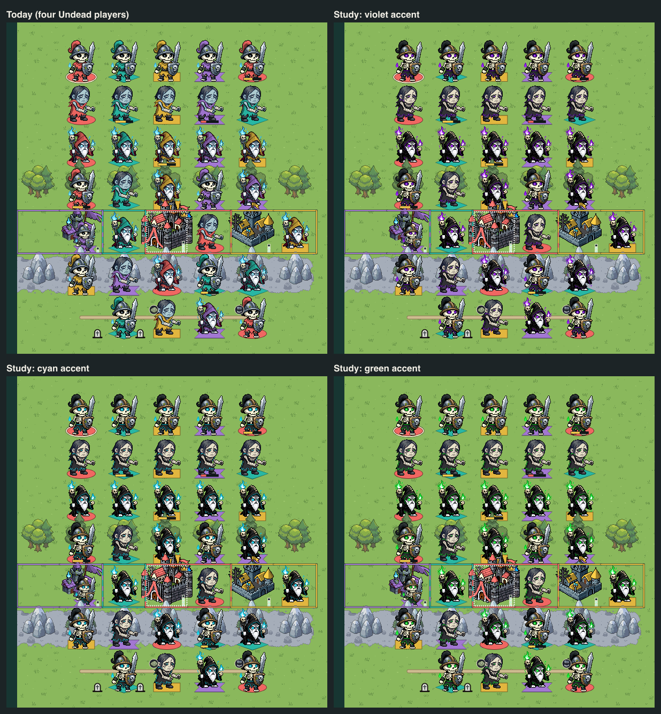

`FOUR` has four Undead players (Coral, Teal, Gold, Violet): rows of
Skeletons, Zombies and Necromancers on Grass with the ready rim and the
damaged HP bar, a row on Forest, a row beside and inside Undead cities of
the three tiers, a row on Mountain and a row on a Road with Graves, a
Plague chip and a Bitten chip.

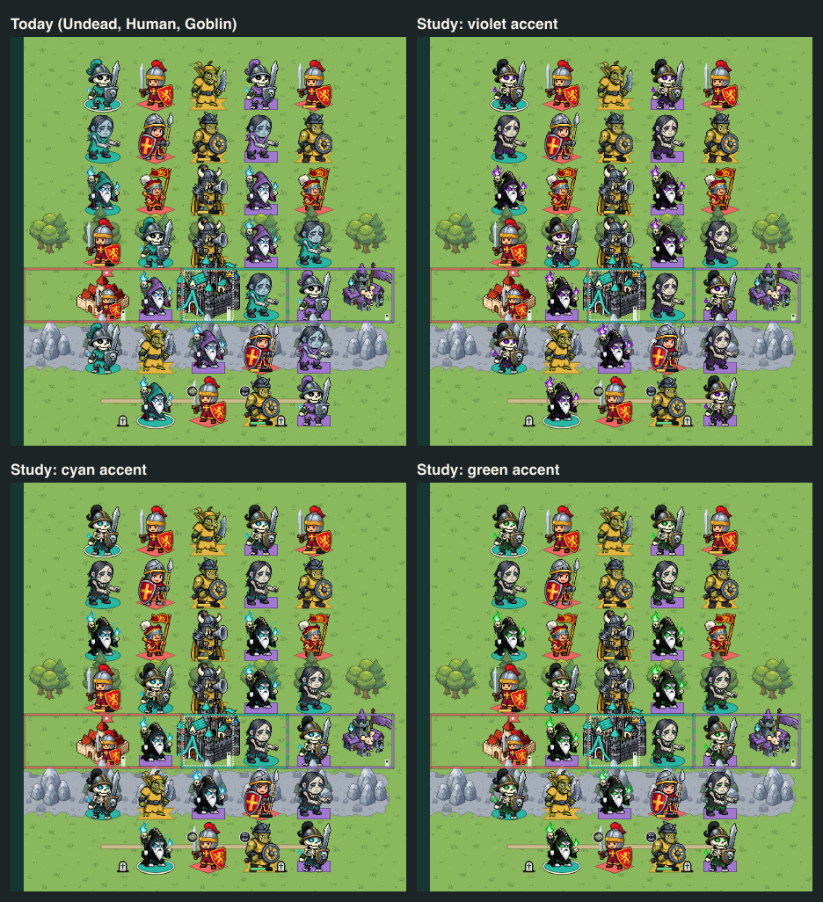

`MIXED` has an Undead player in Teal and one in Violet, a Human player in
Coral and a Goblin player in Gold (today's Goblin sprites; the Goblin
study's sprites are not used). The three factions separate at once:
crimson and gold, yellow-olive skin, and black with ivory.

### Readability

`readability.json` (CIE76 colour difference: about 10 is clear at a glance,
20 and more are different colours; "contrast" is the WCAG luminance ratio).
Terrain is measured on the untoned rasters.

| Check                                       | Result                                                                                                                                                                                                                                                                                                                                                     |
| ------------------------------------------- | ---------------------------------------------------------------------------------------------------------------------------------------------------------------------------------------------------------------------------------------------------------------------------------------------------------------------------------------------------------- |
| Bone against Grass (`#89b75b`)              | 46 (33 under simulated deuteranopia). Bone is the lightest thing on a Grass tile.                                                                                                                                                                                                                                                                          |
| Bone against Mountain                       | 32 against the Mountain's mean (`#929ca9`), 28 against its ground, and 20 against its light rock (`#d1dbe8`) with a luminance contrast of 1.1: bone and snow-lit rock are equally bright and differ only as warm against cool. The known risk is real, and the black outline and dark cloth do the separating: on the Mountain row every unit still reads. |
| Pallid flesh                                | 53 against Grass, 57 against today's Goblin skin, but only 14 against the Mountain's mean: a Zombie's face on a Mountain is grey on grey, held by its outline and dark hair.                                                                                                                                                                               |
| Dark cloth against Grass and Forest         | 73 against Grass (contrast 5.5) and 60 against the Forest's mean (contrast 4.0); today's Coral and Teal garments have a contrast of 1.3 and 1.1. Against the Forest's own dark tones (`#2d3a37`) the cloth is 8: a robe in front of a tree trunk merges with it, and the beard, skull and flame carry the Necromancer there.                               |
| Violet accent                               | 57 against the Violet plate (35 deuteranopia), 162 against Grass, 122 against Shallow Water, 110 or more against every other plate. Darkest of the three: contrast 2.5 against the dark cloth, so the thin trim is the weakest of the three at zoom 0.75; eyes and flames read.                                                                            |
| Cyan accent                                 | 30 against the Teal plate (28 deuteranopia): cyan is bluer and lighter than Teal, but they are neighbours. 69 against Grass, 37 against the Mountain's light rock (16 under protanopia), **20 against Shallow Water**. Contrast 6.9 against the dark cloth. 8 from today's pale blue flames.                                                               |
| Green accent                                | 54 against Grass and 60 against today's Goblin skin as seen, but 24 and 15 under deuteranopia, and **5 against the Gold plate** under deuteranopia. Contrast 8.3 against the dark cloth: the brightest trim.                                                                                                                                               |
| Under simulated deuteranopia and protanopia | Violet stays a clear blue. Cyan turns a pale grey-white close to bone. Green turns the yellow of bone and of the Gold plate. Violet is the only accent that is still a colour.                                                                                                                                                                             |
| Four Undead players by plate only           | Plate colours differ by 61 to 110 from each other. With nothing on the sprite to help, the plate is the only cue; it works at zoom 0.75 on a phone for all three units. Coral and Teal plates under colour blindness are unchanged from section 7.                                                                                                         |
| Any unit wider than its plate               | No. The sprites are 51, 51 and 53 px wide against a 52 px plate, and their feet 30, 34 and 45 px, so the plate shows on both sides. The Necromancer's flame overhangs by a pixel.                                                                                                                                                                          |

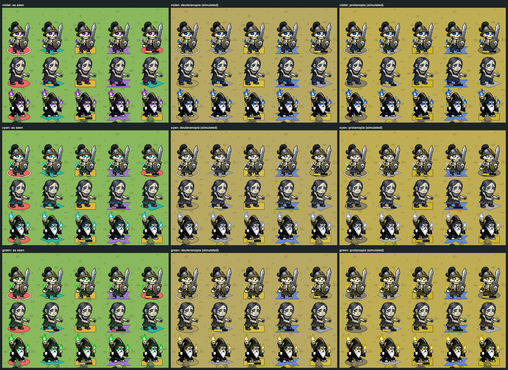

### The existing Undead markers

| Marker or effect                                   | Its colour today                             | Violet                              | Cyan                     | Green                                                              |
| -------------------------------------------------- | -------------------------------------------- | ----------------------------------- | ------------------------ | ------------------------------------------------------------------ |
| Grave marker (code-drawn tombstone)                | neutral stone `#d9dcd4` on a dark outline    | agrees                              | agrees                   | agrees                                                             |
| Undead badge of a stand-in sprite                  | bone `#efe8cf` on a violet-black `#231a2c`   | agrees                              | agrees                   | agrees                                                             |
| Plague chip (`STATUS:PLAGUED`)                     | grey-green cloud `#9fac8a`                   | agrees: a different, dull colour    | agrees                   | **clashes**: every unit already glows green, so the chip says less |
| Bitten chip (`STATUS:BITTEN`)                      | slate jaws `#3e4859`, `#7f8ca0`, ivory teeth | agrees                              | agrees                   | agrees                                                             |
| Raise Dead effect (`EFFECT:RAISE`)                 | slate and pale blue `#7f8ca0`, `#a9bdd8`     | off: pale blue wisps, violet caster | agrees                   | off                                                                |
| Wail, spirit wisp, Lich splash effects             | the same slate and pale blue                 | off                                 | agrees                   | off                                                                |
| Raise Dead target preview                          | green outline `#8ff0a4`                      | off                                 | off                      | agrees                                                             |
| Wail radius preview                                | violet outline `#c9a6ff`                     | agrees                              | off                      | off                                                                |
| Flames in the Undead cities, portraits, four icons | pale blue                                    | off until converted                 | agrees before conversion | off until converted                                                |

The five effect rasters are palette-mapped onto a checked-in palette (the
[pipeline](CHIBI_PIPELINE.md#status-markers-and-effects)), so moving them to
another accent is a palette change and a re-map, not new art. The two
ability previews are one colour constant each.

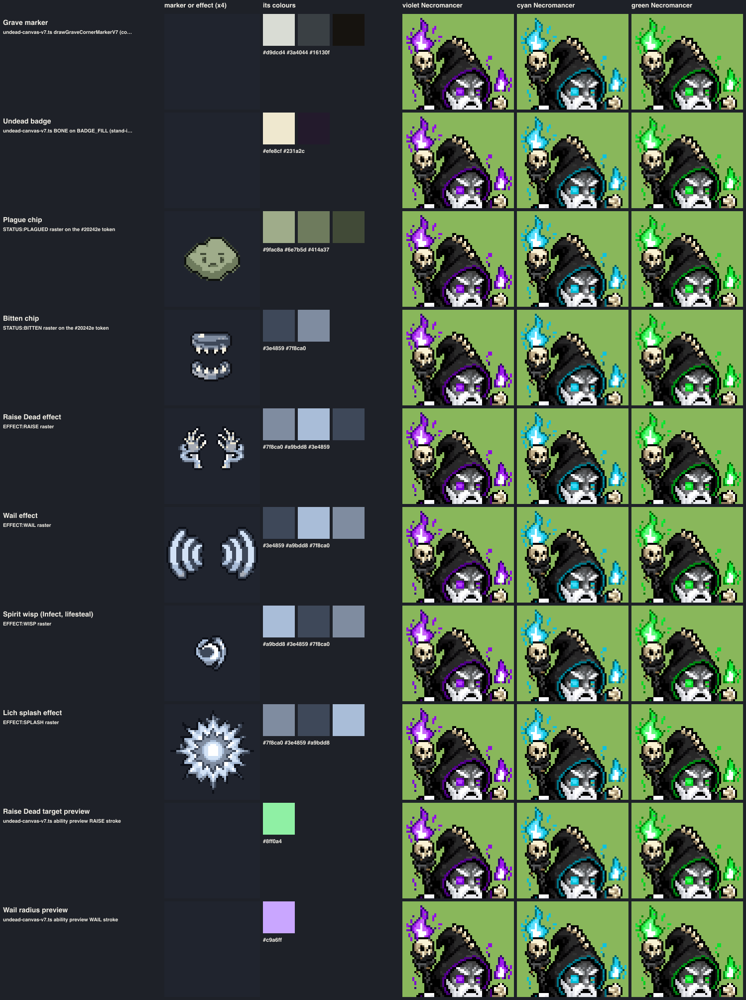

### Findings per accent

- **Violet.** The only hue nothing else on the board uses: terrain is
  green, water is blue-green, Humans are red and gold, Goblins yellow-olive.
  It is the furthest from Grass, Forest, Mountain, water and Goblin skin,
  and the only accent that survives red-green colour blindness as a colour.
  Its weaknesses: it is the darkest, so the hem and hood trim nearly
  disappear on black cloth at zoom 0.75 (the eyes and flames do not); it is
  the Violet player's hue family (57 apart: a saturated blue-violet glow
  against a pastel plate), so a Violet player's Undead look "matched" and
  another player's Undead carry a little of a rival's colour; and the pale
  blue effect sprites must be re-mapped.
- **Cyan.** The brightest and cleanest glow on black cloth, and it is
  today's pale blue flame made saturated (8 apart), so every existing
  effect, icon, portrait and city flame already agrees. Its weaknesses: it
  is the Teal player's neighbour (30); it is close to Shallow Water (20),
  which matters for a unit on a shore; it is weakest on the Mountain's
  light rock; and under red-green colour blindness it fades to the grey
  white of bone.
- **Green.** The loudest trim, and the classic colour of plague. But it is
  a green glow on a green map: the same hue family as Grass and Forest, 15
  from Goblin skin and 5 from the Gold plate under deuteranopia, where it
  turns bone yellow. It also makes the Plague chip less of a signal.

### Recommendation

**Violet.** Reasons, in order: it gives the Undead a hue of their own that
no terrain, faction or water uses; it is the most robust under colour
blindness; and bone, not the accent, is what separates the units from the
Grass, so the accent does not need to be the brightest thing on the sprite.
Its two costs are small and known: lighten the trim one step in production
(a lit tone near `#b45cff` on hems and hoods, the eyes and flames as they
are), and re-map the five effect sprites and two preview colours.

**Cyan is the runner-up**, and the right choice if keeping every existing
effect, icon and city flame untouched matters more than a hue of the
faction's own. **Green is not recommended.**

### Weak spots

- **The Zombie is quiet.** Its accent is two thin eye slits and a hem: 76
  pixels. It reads as an Undead unit by its pallid face and black smock,
  not by the accent. A production pass could give it glowing stitches or a
  larger eye glow.
- **The Necromancer's body is a black shape.** The hood, robe and staff
  merge inside the outline; the beard, skull, bone spikes and flames carry
  it. That is the look asked for, but three Necromancers in a row are
  heavy.
- **The Skeleton's helmet and shield are the Human steel.** The bronze rims
  help; the dome is still the same grey as a Human helmet.
- **A patch of olive moss** (`#637409`, 21 pixels) is left on the
  Skeleton's helmet from the old "moss" motif. It is not an accent pixel in
  any option, but it is a second green beside the green accent.
- **Bone is warm, the old palette's bone was cool.** The new bone
  (`#e6e0c8`) is fine against Gold (the plate is far more saturated), but
  UNDEAD.md's rule "bone is shaded with cool grey, never brown" no longer
  holds.
- **The violet option is a remap too**, so its exact tone is a choice of
  this study (274°), not what PixelLab drew (293°, a magenta).
- **The cities in the scenes are today's art** with player-coloured roofs
  and pale blue flames; so are the portraits and the interface.

### Open questions for the user

1. Which accent: violet (recommended), cyan or green?
2. If violet: this blue-violet (`#a221ee`), or closer to PixelLab's magenta
   (`#d521ee`, the `alternatives-x4.png` sprites)?
3. Skeleton: bare ribcage with a loincloth (chosen), or a charcoal tabard
   with an accent crest (`skeleton-bone-edit-b`)?
4. Should bronze stay (rims only), or should all Undead metal be dark iron
   (`skeleton-bone-edit-a`)? Should verdigris be tried at all, given that
   it reads as a second accent beside cyan or green?
5. Zombie: flesh with a bone necklace (chosen), or the half-skeleton
   (`zombie-bone-edit-c`)?
6. Should the Violet player keep that colour if the Undead accent is
   violet, or does the planned "one player per faction" rule make that
   moot?

### Plan for the rest of the roster

On approval, first rewrite [UNDEAD.md](factions/UNDEAD.md): warm ivory
bone, near-black cloth, pallid ash grey flesh, the chosen accent, bronze
allowed; its negative fragment today forbids "glowing green, cyan glow,
purple magic glow, bronze, brown", which existed to protect the red key
colour and the player colours. Then one production batch
(`direction-undead`, `fixedFactionColours`, every asset
`ownerColour: false`) as edits of the accepted `undead`, `5-undead` and
`cities-undead` assets, importing the three base recipes with
`art:chibi -- import`.

**The accent method for production:** generate every base with a violet
accent, as here, whatever accent is chosen, because violet is the one hue
that no other material of the look uses and so can be found by colour
alone. If the choice is cyan or green, the pipeline needs the remap as a
recorded derivation (like `seated` and `crop-rows`), so that `art:validate`
re-derives each master.

| Piece               | Plan                                                                                                                 | Predicted difficulty                                                                                                                                                                                                                     |
| ------------------- | -------------------------------------------------------------------------------------------------------------------- | ---------------------------------------------------------------------------------------------------------------------------------------------------------------------------------------------------------------------------------------- |
| Ghoul               | pallid grey skin, ivory claws, the red hooded cloak becomes a ragged charcoal cloak with an accent hem; glowing eyes | Medium. The hood covers the head, so a charcoal hood leaves a small pale face on a dark lump. Push the hood back or give it a bone trim.                                                                                                 |
| Banshee             | pale hair and face, a charcoal shroud with an accent hem, glowing eyes and mouth                                     | Medium to high. She has no bone at all and her gown is most of the sprite: in charcoal she is a dark tadpole. A bone-white shroud with a dark hood may fit her better; needs two samples.                                                |
| Lich                | crowned skull, bare bone hands, a near-black royal robe, a bronze crown, the orb in the accent                       | Medium. The orb is the largest glow in the faction (well above 13%); the wide robe is the largest black area. Ribs showing at the open robe would bring the bone back.                                                                   |
| Vampire             | pale face, black cape and coat, the cape's lining in the accent                                                      | High. A vampire's red lining is the one place where "exactly one accent" fights the subject; an accent-coloured lining is a large area, and a black cape on a black coat has no inner lines.                                             |
| Abomination         | pallid patchwork flesh, a charcoal smock, bone spurs or a visible rib, accent stitches                               | Medium. The largest flesh area: ash grey must not drift back to blue (it did on the Zombie) or to goblin green. Its four blue flames each need naming.                                                                                   |
| Portraits (8)       | edits of the `5-undead` busts with the unit's instruction                                                            | Low to medium. At 48 x 48 a hem trim does not exist; the eyes carry the accent.                                                                                                                                                          |
| Cities 1 to 3       | red roofs and drapes become dark slate with bone trim; flames in the accent                                          | Medium to high. As for the Goblins: code-drawn pennants with recorded anchors and `factionCities` no longer `"CLASSIC"` for the Undead, which is renderer work with tests. A dark necropolis may need bone-white stone to stay readable. |
| Effects and markers | re-map the five effect rasters and the pale blue flame of the four command icons; two preview colours                | Low. Not needed at all if the choice is cyan.                                                                                                                                                                                            |

Expected cost: about 2 edits per unit (the skin and the glows each needed a
repair edit here), 1.5 per portrait and 2 per city, roughly 40 to 50
PixelLab calls. Order: the fragment and the batch scaffold; Banshee,
Vampire and Lich as the next sample (they are the three that the rules fit
worst); then the rest, the portraits, and the cities with their renderer
change last. Until then an Undead player keeps today's sprites on plates.

Evidence in
[`art/pixellab/reviews/undead-direction-study/`](../../art/pixellab/reviews/undead-direction-study/):
`candidates-x3.png`, `options-{1x,x4}.png`, `terrain-x3.png`,
`alternatives-x4.png`, `markers-x4.png`, `palette.{png,json}`,
`readability.json`, `scene-{four,mixed}-{desktop,phone}-zoom-{1,0.75}.png`,
`same-unit-{desktop,phone}-zoom-{1,0.75}.png` and `index.json`.

## 16. Goblin production

**Status:** bead `pulp_wars-3tq.9`. The user reviewed pass 2 of the
[Goblin study](#14-goblin-study) on 2026-10-02: "let's go with olive skin,
make leather browner, try a pot helmet on the bomb chucker, make the cart
dark brown. lower contrast on grass is fine. generate the other sprites as
well. make the troll a dark hue of green, not blue. make whatever decisions
you need and incorporate it all into the game." This section is that: the
whole Goblin roster, its portraits and its three cities in fixed faction
colours, **live in the default look**. The Classic look and LEGACY are
unchanged. Undead and Dinosaur are still not converted.

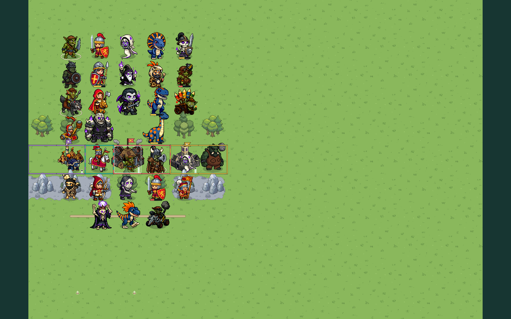

### Decisions

The first five are the user's; the rest were delegated ("make whatever
decisions you need") and are recorded here so they can be overruled.

| Question                 | Decision                                                                                                                                                                                               | By        |
| ------------------------ | ------------------------------------------------------------------------------------------------------------------------------------------------------------------------------------------------------ | --------- |
| Goblin skin              | olive, as in pass 2 (`#8a952f`, shadow `#495508`), on every Goblin-crewed unit                                                                                                                         | user      |
| Leather                  | a warm mid brown, `#955627` shaded `#562a0c`: browner than pass 2's orange `#ca4d02`, lighter than pass 1's near-black                                                                                 | user      |
| Bomb Chucker             | the rusted pot helmet with goggles                                                                                                                                                                     | user      |
| Cart                     | the fireworks cart stays; planks dull dark brown (`#391501` to `#642b03`)                                                                                                                              | user      |
| Troll                    | a dark green (`#3f5a37`, hue 105 to 128), not blue or grey                                                                                                                                             | user      |
| Orcs                     | a dull dark moss green, darker and duller than the Goblins (Brute `#4a5830`; the Warboss one step lighter, `#7f8c54` on `#3e4e29`, so the shouting face reads)                                         | root      |
| Hazard stripe            | none on the basic Goblin; only on the Bomb Chucker's bomb, one panel of the Scrap Buggy and the bomb and buggy portraits                                                                               | root      |
| Rust and gunmetal        | minor accents: the pot helmet, the buggy's body, the city huts and tower                                                                                                                               | root      |
| Player colour            | none anywhere: no owner area and no mask on any Goblin sprite; plate, pennant and border show the player                                                                                               | root      |
| Wardrobe of the rest     | Wolf Rider bare-chested with one strap, a brown hide saddle blanket; Orc Brute bare-chested with crossed straps and a kilt; the Warboss keeps cape and tunic, in brown hide; the Troll keeps the smock | this bead |
| Orc Brute's shield       | dark planks with an iron rim and boss, no red skull, no stripe                                                                                                                                         | this bead |
| Scrap Buggy's body       | gunmetal scrap panels with rust streaks, one small hazard-striped panel, rusted hubs; no planks (it must not read as a second cart)                                                                    | this bead |
| Crew of the cart         | bigger and leaning out of the cart with a lit match, so it reads at zoom 0.75; this costs width (66 px)                                                                                                | this bead |
| Cities                   | converted: hide tents, rust and gunmetal huts, a bare pole for the code-drawn pennant; same canvases and footprint as the classic camps                                                                | this bead |
| City 1's lookout pole    | kept (dark iron, no flag): the recipe that dropped it left the level-1 camp with no tall shape and nowhere to fly a pennant                                                                            | this bead |
| Tent colour              | not unified: City 1 pale hide (`#cdb083`), City 2 brown (`#765a41`), City 3 tan (`#8f6e41`); two edits to unify City 1 added a ground rim or recoloured the hut instead                                | this bead |
| Portrait of the Rider    | keeps a short olive tunic where the unit is bare-chested                                                                                                                                               | this bead |
| Kaboom!, WAAAGH! icons   | unchanged (the bomb icon has no hazard band)                                                                                                                                                           | brief     |
| Goblin boats             | unchanged: the shared ships with the player-coloured sail and ring                                                                                                                                     | brief     |
| Wide units and the plate | accepted as they are; no wider plate for large units                                                                                                                                                   | this bead |

### What the Goblin batch made

Batch [`direction-goblin`](../../scripts/art/chibi/batches/batch-direction-goblin.json)
(faction `GOBLIN`, `fixedFactionColours`, every asset `ownerColour: false`;
records in `scripts/art/chibi/records/`, masters under `public/assets/chibi/`,
registered in `CHIBI_DIRECTION_GOBLIN_ART_ASSETS_V7` of
[`chibi-direction-art-manifest.ts`](../../src/assets/chibi-direction-art-manifest.ts)):
19 assets from 72 recipes, 14 of them imported from the study's exploration
run with no PixelLab call and 58 new calls, two of which failed at PixelLab
(`goblin-brown-edit-b`, `wolf-rider-scrap-edit-a`) and stay recorded as
submitted. Every asset is an `edit-image-pixen` edit of the accepted classic
sprite (batches `goblin`, `5-goblin`, `cities-goblin`) or of a study step,
so canvas, anchor, overflow, silhouette and feet are unchanged.

| Asset        | Recipes tried   | Accepted                     | Notes                                                                                                   |
| ------------ | --------------- | ---------------------------- | ------------------------------------------------------------------------------------------------------- |
| Goblin       | 6 (3 imported)  | `goblin-brown-edit-c`        | the pass-2 Goblin with the leather recoloured by hex values; "chestnut" wording browned only the belt   |
| Bomb Chucker | 6 (4 imported)  | `bomb-chucker-brown-edit-b`  | the pass-2 pot helmet alternative, straps and satchel brown; the first edit painted the face brown      |
| Rocket Cart  | 15 (7 imported) | `fireworks-cart-crew-edit-d` | wood by hex values, then a bigger crew, then one recolour of crew and wood together                     |
| Wolf Rider   | 4               | `wolf-rider-skin-edit-b`     | wardrobe edit, then two skin edits to bring the rider from yellow-green to olive                        |
| Orc Brute    | 5               | `orc-brute-skin-edit-d`      | wardrobe edit, then four skin edits: "grey-green" gave charcoal and stone grey; "moss green" worked     |
| Orc Warboss  | 4               | `orc-warboss-skin-edit-c`    | one recolour of cape and tunic, then three skin edits                                                   |
| Scrap Buggy  | 4               | `scrap-buggy-hub-edit-a`     | one recolour of the body; the driver's skin and the red hub rings each needed an edit of their own      |
| Troll        | 2               | `troll-scrap-edit-b`         | smock and skin in one hex recolour; without hex values the smock came out ochre with spots              |
| 8 portraits  | 20              | see the records              | wardrobe edit, then a skin (or smock, or rocket) edit each; two skin edits redrew the face and were cut |
| City 1       | 4               | `goblin-city-1-scrap-edit-b` | the first edit removed the lookout pole with the flag                                                   |
| City 2 and 3 | 1 each          | first edit                   | "change only the colours and the flag … remove the red flag, leaving a bare pole"                       |

What worked, added to the prompt notes of the study:

- **Give colours as hex values.** "The orange cap … becomes dull desaturated
  mid-brown leather like an old saddle, colour `#8a4a1c` with `#5a2e10`
  shadows" landed on `#955627` and `#562a0c`. Colour words alone ("chestnut",
  "milk chocolate", "dark chocolate") were ignored or gave orange highlights.
  This is the leather-only edit pass 2 had not tried.
- **Start with "Recolour only …"** and name the current colour of the part
  ("the orange cap", "the yellow skin", "the thin red-orange rings").
- **Never write "grey" for skin.** "Grey-green" turned an orc charcoal black,
  stone grey all over, or yellow. "Moss green, colour `#5f7d3a`" gave a
  clear green; "one step darker and duller, a dull dark moss green" then
  gave the Orc tone.
- **One part per edit.** Skin and wheel hubs together repainted the tyres
  and the soot cloud; each alone worked.
- **"Do not redraw anything"** protects a portrait's face: two skin edits
  without it drew a human face and a white mask.
- **Removing a flag can remove its pole.** Say what stays: "the red flag
  cloth is removed, but the tall lookout pole and its basket platform stay".
- **An edit instruction is at most 500 characters**, and PixelLab's tier
  allows eight jobs at once.

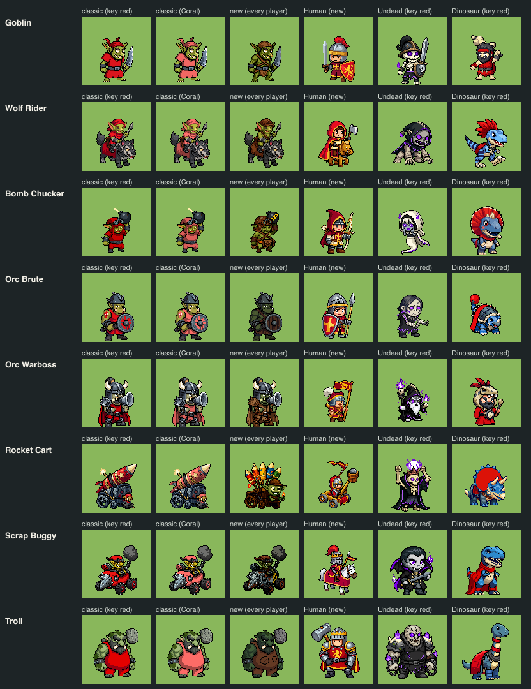

### The palette, measured

Measured on the accepted masters (the most common lit tone and the next
tone of each material).

| Role            | Colours                                                                          | Used for                                                                |
| --------------- | -------------------------------------------------------------------------------- | ----------------------------------------------------------------------- |
| Goblin olive    | `#8a952f`, `#919e2f`; shadow `#495508`, `#5e6615`; the Wolf Rider's is `#a5a634` | skin of Goblin, Bomb Chucker, Wolf Rider, the cart's crew, the driver   |
| Orc green       | Brute `#4a5830`; Warboss `#7f8c54` on `#3e4e29`                                  | Orc skin: a dull dark moss green                                        |
| Troll green     | `#3f5a37`, `#415d38`; shadow `#22331b`                                           | Troll skin: dark green, hue 105 to 128                                  |
| Brown leather   | `#955627`, `#733b18`, `#643923`; shadow `#562a0c`, `#5f2407`                     | caps, straps, loincloths, kilts, the satchel, the saddle blanket, smock |
| Brown hide      | `#9d6d41` on `#56371a` (Warboss cape); tents `#cdb083`, `#765a41`, `#8f6e41`     | the Warboss's cape, city tents                                          |
| Dark brown wood | `#391501` to `#642b03`; `#5c3a22` in the portrait                                | the cart, the Brute's shield, city huts                                 |
| Gunmetal        | `#6c6d6a`, `#47545b`, `#738c99`; helmets `#313a45`                               | helmets, blades, the buggy's body, the megaphone, city huts and tower   |
| Rust            | `#925432`, `#8a4625`; the pot helmet `#682f1c`; the buggy portrait `#762b1d`     | the pot helmet, streaks on the buggy, hut roofs, tower plates           |
| Hazard yellow   | `#fbc208` on near-black                                                          | the bomb's band, one buggy panel; under 2% of any sprite                |
| Rocket paper    | `#e00c02`, `#f65700`, `#fec100`, `#065f98`, `#27781c`, cones `#fee388`           | the fireworks only                                                      |

No sprite has an owner area. Pixels in the owner key's hue band (hue 340 to
5, saturated) are 0% of six units, 0.4% of the Wolf Rider (the wolf's
mouth), 3.5% of the cart (the red rocket), 2.1% of City 1 (rust) and 0.6 to
5.3% of the portraits (tongues, the red rocket); a classic owned sprite has
15% or more. A test holds every master under 6%.

### Readability

CIE76 colour difference (about 10 is clear at a glance, 20 and more are
different colours) and the WCAG luminance contrast in brackets.

| Unit         | Skin against Grass `#89b75b` | Skin against the Gold plate | Leather or wood against Grass | Against the Coral plate | Against Human crimson | Sprite and plate width |
| ------------ | ---------------------------- | --------------------------- | ----------------------------- | ----------------------- | --------------------- | ---------------------- |
| Goblin       | 39 (3.5) on the shadow tone  | 53                          | 59 (2.5)                      | 36                      | 34                    | 53 and 52 px           |
| Wolf Rider   | 22 (1.1)                     | 22                          | 73 (5.2)                      | 49                      | 34                    | 62 and 57 px           |
| Bomb Chucker | 33 (2.7)                     | 45                          | 66 (3.8)                      | 43                      | 33                    | 46 and 52 px           |
| Orc Brute    | 44 (3.3)                     | 61                          | 68 (4.8)                      | 54                      | 43                    | 53 and 52 px           |
| Orc Warboss  | 25 (1.6)                     | 44                          | 50 (1.9)                      | 40                      | 42                    | 56 and 52 px           |
| Rocket Cart  | 22 (1.6), the crew           | 34                          | 85 (8.0)                      | 71                      | 55                    | 66 and 57 px           |
| Scrap Buggy  | 32 (2.3), the driver         | 44                          | 68 (3.8), the rust            | 40                      | 30                    | 68 and 57 px           |
| Troll        | 44 (3.3)                     | 65                          | 66 (4.2)                      | 49                      | 39                    | 71 and 68 px           |

- **Leather against the Coral plate** is 36 for the Goblin (pass 2's orange
  was 32) and 40 or more for the others: a Coral player's Goblin is now a
  brown and green figure on a coral plate, not an orange one.
- **Leather against Human crimson** is 30 to 43; the lit brown is as far as
  pass 2's orange (34 against 33), and its shadow no longer sits on the
  crimson's hue. Green skin and the Humans' steel and gold do the rest.
- **Skin against Grass** is lower in contrast than pass 1, as the user
  accepted. The lit olive is 17 to 22 from the Grass; the shadow tone, the
  black outline and the brown leather separate the figure. The Orcs and the
  Troll are darker than the Grass by a contrast of 3.3.
- **Hazard yellow** against the Human gold is 14 and against the Gold plate
  20, on under 2% of a sprite.
- **Plates:** the standard units stand within their plate or 4 px over it.
  The cart is 9 px and the buggy 11 px wider than the plate; the plate's
  front edge and tips still show (see the scene above), and today's cart
  and buggy are as wide (65 and 68 px).

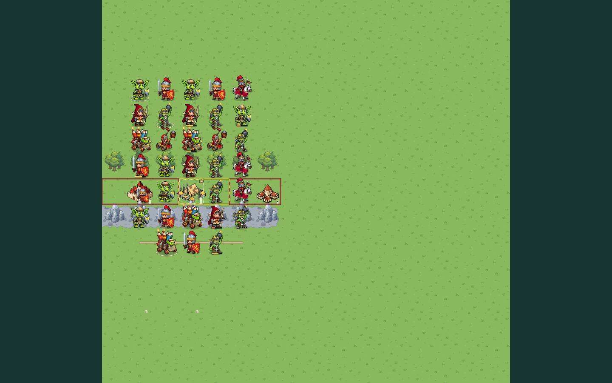

### What is live

| Piece                                       | Default look                                                                                              | Classic look and LEGACY |
| ------------------------------------------- | --------------------------------------------------------------------------------------------------------- | ----------------------- |
| The eight Goblin land units on the board    | the production sprite, the same for every player, on the seat-shaped plate                                | unchanged               |
| Unit dock, unit dialogs, technology cards   | the production map sprite                                                                                 | unchanged               |
| Training cards, rewards, the tree's busts   | the eight production portraits                                                                            | unchanged               |
| Goblin City 1 to 3, board and city dock     | the production camp, drawn as authored, with the code-drawn pennant at its own pole (gold for a capital)  | unchanged               |
| Showcase, Help, the setup screen            | follow from the above: they draw the same subjects (the setup screen shows faction names, no faction art) | unchanged               |
| Patrol Boat, Battleship, embarked transport | not converted: the shared ships with the player-coloured sail                                             | unchanged               |
| Kaboom! and WAAAGH! icons, the bomb glyph   | not converted                                                                                             | unchanged               |
| Kaboom! preview, armed marker, explosions   | unchanged code-drawn markers and effects; checked over the new sprites                                    | unchanged               |
| Gang Up, Plunder, Warrens, Troll regrowth   | unchanged                                                                                                 | unchanged               |
| Undead and Dinosaur units and cities        | not converted (section 13)                                                                                | unchanged               |

Runtime:

- The Goblin art is registered under the Goblin faction subjects
  (`UNIT:GOBLIN:<ROLE>`, `PORTRAIT:GOBLIN:<ROLE>`, `CITY:GOBLIN:<level>`) in
  the live direction registry, so the board and the interface resolve it
  before the classic Goblin art, exactly like the Human art; nothing else
  in the unit path changed. A raster that fails to load falls back to the
  classic Goblin sprite of that piece alone, in the owner's colour.
- **Cities.** `LIVE_DIRECTION_V7` keeps `city.factionCities: "CLASSIC"`, and
  that mode now means: a faction city that has direction art of its own is
  drawn from it as authored (no owner recolour, no tone), anything else as
  the classic look draws it. So Goblin cities are converted and Undead and
  Dinosaur cities are not, with no per-faction switch. The pennant anchors
  are in `DIRECTION_FLAG_ANCHORS_V7` (`chibi-direction-goblin-city-1` to
  `-3`); with the pennant drawn, the stock capital crown and the seat badge
  are replaced, as for a Human city. A Goblin city that fell back to its
  classic raster has no anchor and keeps the classic crown and no pennant.
- The study scenes of section 14 keep drawing the classic Goblin sprites in
  their "today" panels: `scripts/art/goblin-direction/scene.ts` passes the
  Human production art plus the study's samples unless asked for `live`.

Markers and effects, checked in the captures of
`npm run review:ruleset7-goblin-ui` (CHIBI, desktop and phone): the Kaboom!
preview and the armed confirmation (the dashed pale area, the "Yours −5"
and "−3" chips, the "Kaboom!" label) sit on and beside the brown and green
sprites as they did on the red ones; the explosion flash and soot puffs
(white, cream and grey) are lighter than every new sprite; the Gang Up chip
of an attack preview, WAAAGH!, Plunder and Warrens are chips and interface
text and are unaffected.

### Evidence

- `npm run art:chibi-direction-review` writes
  [`art/pixellab/reviews/chibi-batch-direction-goblin/`](../../art/pixellab/reviews/chibi-batch-direction-goblin/):
  `units-old-new-{1x,x4}.png`, `units-zoom-0.75.png`,
  `portraits-old-new-{1x,x4}.png`, `cities-{1x,x4}.png`,
  `showcase-goblin-*` (a Goblin viewer against Human, Undead and Dinosaur;
  four Goblin seats; the Classic look; the dock and the technology tree),
  `ingame-goblin-{roster,mixed}-*` and `index.json`. The Human sheets of the
  same command now show the live Goblin unit in their Goblin column.
- `npm run art:chibi-goblin-review` writes
  `art/pixellab/reviews/chibi-batch-goblin/`: the batch review of the
  classic batch (its in-game roster is drawn in the live look), the faction
  sheets with the live sprite beside the classic one per player, and a
  fresh Goblin match.

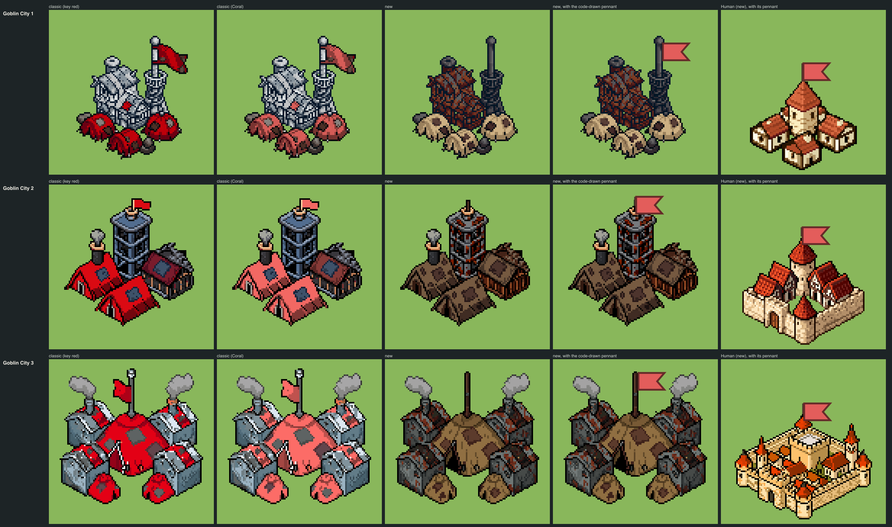

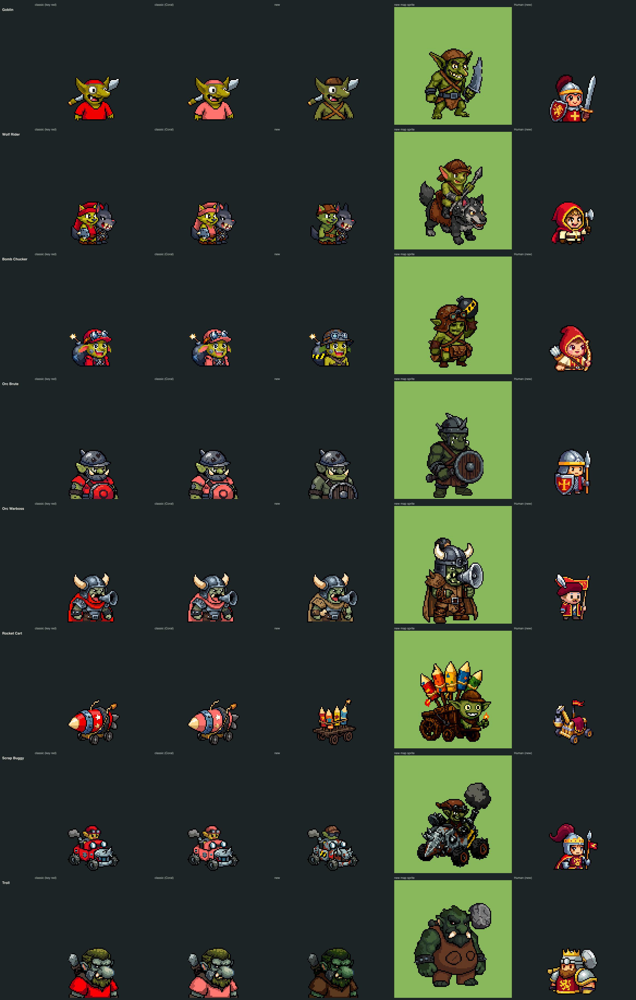

### Weak spots

- **The faction is dark and brown.** Orc Brute, Troll, the buggy and the
  cart's planks are dark sprites; on Forest and beside a Goblin city they
  sit close together in value. A garrison in a Goblin city is brown and
  green on brown and grey: the plate and the damaged HP bar separate it,
  the colours do not.
- **Three greens, not one ramp.** Goblin olive, Orc moss and Troll green
  were each reached by a separate edit; the Warboss is lighter than the
  Brute, and the Wolf Rider and the Bomb Chucker's portrait are a yellower
  olive than the Goblin.
- **The Bomb Chucker lost the lit spark** on the bomb's fuse (the fuse cap
  stays); two small orange strap ends remain at the hip.
- **The cart is 66 px wide**, wider than pass 2's 58: the readable crew
  leans out of the cart. No edit made the cart itself shorter.
- **The cart's portrait** shows four thin rockets with coloured tips on a
  flat cart: recognisably fireworks, but not the unit's fat rockets with
  cream cones, and still with no crew.
- **The buggy's portrait has redder rust** than the unit, and eight bright
  red pixels.
- **City tents differ in tone** from tier to tier, and City 1's are pale.
- **The pennant of a Goblin city flies in the top of its tall canvas**, in
  the cell to the north: a large unit standing there covers it. The classic
  camps had their own flag in the same place.
- **The cities are drab beside the Human ones**: no saturated colour at all.
  Their owner is read from the pennant and the border.
- **Four Goblin players** differ only by plate, pennant and border, as four
  Human players do.
- **Review evidence of other commands** that happens to show a Goblin
  (`art:chibi-faction-cities-review`, `art:chibi-dinosaur-review`,
  `art:chibi-playtest3-review`, the study reviews) was not regenerated.

## 17. Undead production

**Status:** bead `pulp_wars-3tq.12`. The user reviewed the Undead study
(section 15) on 2026-10-02: "let's go with the violet-accented undead.
generate the remaining sprites and merge it into the game." This section is
that work: the whole Undead roster, its portraits, command icons, cities and
effects in the new direction, **live in the default look**. It replaces
what sections 12, 13 and 16 say about the Undead ("not converted"); the
Human, Goblin and Dinosaur art is unchanged by it. The Classic look and the LEGACY
art set are unchanged.

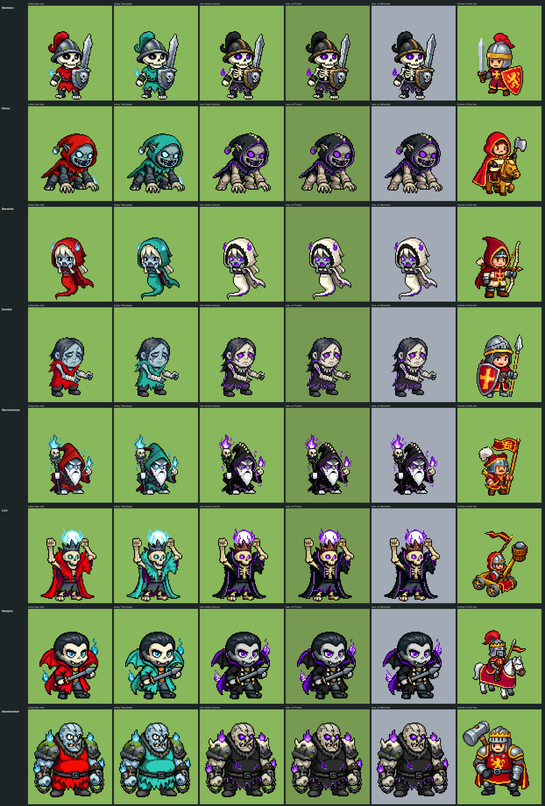

### The look, final

The palette of [UNDEAD.md](factions/UNDEAD.md#palette), measured on the
eight unit masters (`palette.json`):

| Role             | Colours                                    | Mean share of a unit |
| ---------------- | ------------------------------------------ | -------------------- |
| Bone, lit        | `#e6e0c8`, `#fefbdd`, `#d0c9a9`            | 15.4% (0.6% to 44%)  |
| Bone, shaded     | `#bab497`, `#a59e84`                       | (counted with bone)  |
| Pallid flesh     | `#948884`, `#9e918b`, `#a89b93`            | warm ash grey        |
| Dark cloth       | `#313135`, `#14181a`, `#100f10`            | 53% with the outline |
| Iron             | `#64717e`, `#818f9b`, `#3d424d`            |                      |
| Tarnished bronze | `#574329`, `#966f40`                       | rims, crown, buckle  |
| Violet accent    | lit `#a221ee`; `#6f06c9`, `#7614ca`        | 5.9% (2.9% to 10.5%) |
| Violet trim      | `#a85df5` to `#b25df5`, lightened          | 2.7% (0.8% to 5.6%)  |
| Violet effects   | `#46247c`, `#7b36c9`, `#b06bf2`, `#dcc4ff` |                      |

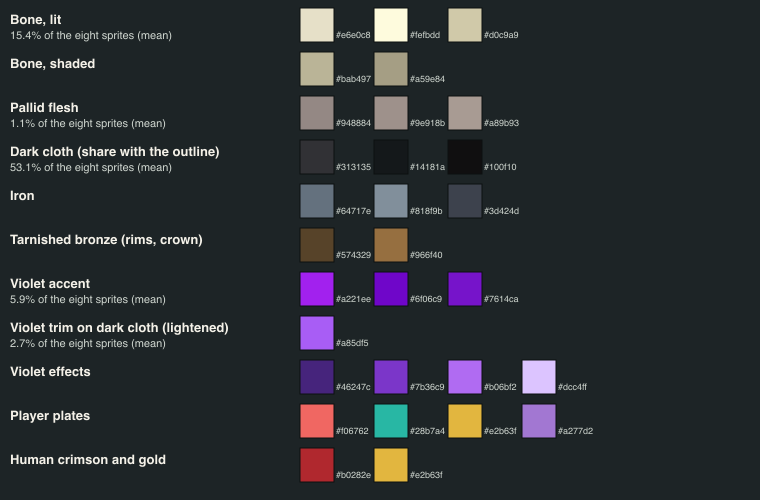

### Decisions

Each was left to this bead by the user's brief; each is recorded in
[UNDEAD.md](factions/UNDEAD.md#decisions).

1. **The accent is derived by a recorded pipeline step.** Every sprite is
   generated with PixelLab's "bright violet" (a magenta, hue about 293°).
   The `undead-violet` accent preset
   ([`accent.ts`](../../scripts/art/chibi/accent.ts)) finds those pixels by
   colour (hue 250° to 320°, saturation at least 0.4, value at least 0.2),
   moves them to hue 274° with half of the hue spread, exactly as the study
   did, and stores the preset in the asset record. `art:validate` re-derives
   every master from its recorded candidate and fails if a byte differs, so
   no master is a hand-made file (the study flagged that its remap was not
   in the pipeline).
2. **Thin trim on dark cloth is lightened.** The study measured a contrast
   of 2.5 for the violet hem on black cloth. An accent pixel with at most
   two accent neighbours and at least three dark neighbours (value at most
   0.3) is trim: its saturation is capped at 0.62 and its value raised to
   0.96, about `#a85df5`. Eyes, flames, the orb and the cape lining are not
   trim and keep the full violet. Between 14 (Banshee) and 115 (Lich)
   pixels per unit are lightened.
3. **Skeleton:** the study's base with a repair edit: the helmet dome is
   blackened iron under the bronze rim, and the olive moss patch is gone.
4. **Zombie:** a repair edit adds violet stitches on the cheek, a violet
   seam down the arm and bigger glowing eyes. Its accent grew from 76
   pixels to 121.
5. **Banshee:** two samples. The dark shroud left her a dark tadpole with
   two flames still blue; the **bone-white shroud** with a dark hood lining
   is the pale spirit the brief asks for, and gives the roster its one
   mostly pale unit (44% bone). She is opaque: a translucent sprite would
   break the outline and the plate under her.
6. **Vampire:** black cape and coat, a pale grey face, bone buttons, and a
   **violet cape lining** where a vampire's would be red (red is the Human
   colour). The lining is the largest accent area of the roster (10.5%); it
   is a dark violet, not a glow. A repair edit turned an orange cravat and
   belt to bronze.
7. **Lich:** crowned skull, bare ribs and spine in an open black robe, bone
   arms and feet, a bronze crown, and the orb as the faction's biggest
   glow. It took three edits: the first drew a red-brown chest, the second
   painted it dark and lost the ribs, the third brought the ribs back.
8. **Ghoul:** the first edit made a dark lump with a pale face; a repair
   made the arms and legs pallid skin. Bone spikes run along the hood.
9. **Abomination:** ash grey patchwork skin, a black smock, bone spurs on
   the shoulder plates and four violet flames. The first edit left the
   flames blue and turned the feet violet; a repair fixed both.
10. **Portraits:** eight edits of the classic busts and five repairs (a
    flame, a face or an eye that stayed blue or red). The eyes carry the
    accent at 48 x 48, as the study predicted.
11. **Command icons:** the four Undead icons (Raise Dead, Devour, Wail,
    Frenzy) are edited to violet sparks and flames; the moss on the Devour
    bone and the green rim of the Raise Dead grave are removed. The Wail
    ghost is bone-white with a violet mouth.
12. **Effects are a palette swap.** The four effect sprites that are the
    faction's magic (Wail, the Lich's splash, the Raise Dead hands, the
    spirit wisp) are the accepted sprites of batch `effects-undead` with
    each colour of the frost palette replaced by the colour at the same
    position of `undead-violet.png`: the same shapes, no new art, no
    PixelLab call. The code-drawn rings and the lifesteal orb beside them
    are `#c9a6ff`.
13. **Raise Dead's preview is violet**, the colour of the Wail preview
    (`#c9a6ff`), instead of green: the faction's abilities have one colour.
14. **Plague stays grey-green, Bitten slate and ivory, the cure white.**
    Plague and a bite are afflictions that sit on any faction's unit, most
    often a Human or a Goblin; they are not the caster's glow. A violet
    Plague chip on a unit would read as "Undead magic is helping this
    unit", and it would be the accent on a sprite that is not Undead. The
    dull grey-green differs from the violet effects by 98 (CIE76). The cure
    sparkle is a Human Captain's Tend. The Devour and splash previews
    (coral, orange) mark damage like every faction's previews.
15. **Cities are re-created**, not kept: three `calm-settlement` creations
    with a ground-removal edit each (6 calls), in dark slate with bone trim
    and violet windows, on canvases close to the Human direction's. The
    pennant is drawn in code at a recorded anchor on the tallest tower.
16. **Moss is dropped** from the faction; **bronze** is allowed on rims and
    the Lich's crown.

### What was made

Batch [`direction-undead`](../../scripts/art/chibi/batches/batch-direction-undead.json):
23 assets from 47 recipes, 7 of them imported from the study's run with
`art:chibi -- import` and 40 new PixelLab calls. Batch `effects-undead`
gained 4 assets and no recipe.

| Asset                                      | Recipes tried  | Accepted                                | Notes                                                   |
| ------------------------------------------ | -------------- | --------------------------------------- | ------------------------------------------------------- |
| Skeleton                                   | 3 (2 imported) | `skeleton-bone-edit-e`                  | the study's base plus the helmet repair                 |
| Zombie                                     | 3 (2 imported) | `zombie-bone-edit-d`, candidate 1       | the study's base plus stitches and eyes                 |
| Necromancer                                | 3 (imported)   | `necromancer-bone-edit-c`               | the study's base, unchanged                             |
| Banshee                                    | 2              | `banshee-bone-edit-a`                   | bone-white shroud; the dark shroud rejected             |
| Ghoul                                      | 2              | `ghoul-bone-edit-b`                     | pallid limbs                                            |
| Vampire                                    | 2              | `vampire-bone-edit-b`                   | bronze cravat and belt                                  |
| Lich                                       | 3              | `lich-bone-edit-c`                      | ribs back in the open robe                              |
| Abomination                                | 4              | `abomination-bone-edit-b`               | two later edits could not remove the last olive patches |
| 8 portraits                                | 13             | first edit, or its repair               | Necromancer, Ghoul, Lich: `-b`; Abomination: `-c`       |
| 4 command icons                            | 6              | first edit; Devour and Raise Dead: `-b` | Frenzy: candidate 1 (candidate 0 has a cyan streak)     |
| City 1, 2, 3                               | 2 each         | `undead-city-<n>-calm-a-edit`           | creation at 96 x 96, then ground removal                |
| 4 effects (Wail, splash, Raise Dead, wisp) | 0 new          | the accepted `effects-undead` recipes   | palette swap frost to violet                            |

Recipes that worked, beyond those of the study:

- **A repair edit names one thing and lists what stays.** "Change only the
  helmet dome: it becomes blackened rusted iron … and the green moss patch
  on it is removed. Keep the bronze rim, …".
- **Redraw, do not recolour, a detail that will not change.** "The red ring
  of his big round eye becomes violet" did nothing; "it becomes one glowing
  bright violet eyeball with a small dark pupil and a dark outline, with no
  white and no red ring" worked.
- **"Nothing blue is left"** after a list of every flame is needed in every
  first edit; three of eight units and three of eight portraits kept a blue
  flame without it or despite it.
- **Bone on a dark unit comes from a named object**: "a row of small pale
  warm ivory bone spikes along the hood's ridge", "bone spurs", "bone
  buttons". Asking for ribs on a robed figure needs "open at the chest".
- **Calm cities work for a dark faction** with the stone and roof colours
  in the subject line; "one small arched window glowing bright violet"
  gives a window, not a flame.
- **What did not work:** removing small olive patches from the
  Abomination's shoulder plates (two edits: one also painted the bone spurs
  dark, one changed nothing).

### What is live

| Piece                                             | Default look                                                                                             |
| ------------------------------------------------- | -------------------------------------------------------------------------------------------------------- |
| Undead land units (all eight)                     | the production sprite in fixed colours, on the player's plate                                            |
| Portraits (train buttons, cards, technology tree) | the production portrait, drawn as authored                                                               |
| Selection dock, Help                              | the production unit sprite                                                                               |
| Raise Dead, Devour, Wail, Frenzy icons            | the violet icons                                                                                         |
| Undead City 1 to 3                                | the production art with a pennant on the tower: seat shape in cream, gold for the capital, no crown      |
| Wail, splash, Raise Dead, wisp effects            | the violet sprites, with violet code-drawn rings and orb                                                 |
| Raise Dead target preview                         | violet                                                                                                   |
| Plague and Bitten chips, cure sparkle, Graves     | unchanged                                                                                                |
| Ships and the embarked transport                  | unchanged (shared art, player-coloured sail)                                                             |
| Showcase                                          | an Undead seat draws all of the above                                                                    |
| Setup screen                                      | unchanged: it has no faction art, only a select                                                          |
| Classic look, LEGACY                              | unchanged: the classic Undead art in the owner's colour, pale blue effects, the green Raise Dead preview |

A direction raster that fails to load falls back to the classic asset of
that piece alone (a unit or portrait in the owner's colour, a city with its
owner-coloured roofs and the stock capital crown, a pale blue effect).

### Runtime

- [`chibi-direction-undead-art-manifest.ts`](../../src/assets/chibi-direction-undead-art-manifest.ts)
  lists the 27 Undead entries; `chibiDirectionArtRegistryV7` adds them to
  the Human list, so the board and the interface resolve them first, as
  they do the Human art. Units and portraits needed no other change.
- **Cities.** They use the mechanism the Goblin production added (section
  16): `LIVE_DIRECTION_V7` still says `factionCities: "CLASSIC"`, a faction
  city asks the direction's art first and keeps the classic raster only
  when none is registered (Dinosaur) or it failed to load. The pennant anchors are the `chibi-direction-undead-city-*` entries
  of `DIRECTION_FLAG_ANCHORS_V7`; a city whose pennant was drawn on its art
  already takes the Human path of the chrome (no badge, no crown).
- **Effects.** The directed resolver passes `EFFECT:*` subjects to the
  direction's art first; the board host asks it, not the classic resolver,
  for the cue sprites, and passes the glow colour `UNDEAD_VIOLET_GLOW_V7`.
- **`undeadAccent: "VIOLET"`** is a new optional field of the direction. It
  selects the violet glow and the violet Raise Dead preview
  (`undeadPreviewStyleV7`). Without it (the baseline, the study's benches,
  the Classic look) both are drawn as before.

### Readability

`readability.json` (CIE76 colour difference; contrast is the WCAG luminance
ratio; terrain colours as the study measured them).

| Check                            | Result                                                                                                                                                                                                                                                    |
| -------------------------------- | --------------------------------------------------------------------------------------------------------------------------------------------------------------------------------------------------------------------------------------------------------- |
| Bone against Grass               | 46 (contrast 1.8): bone is the lightest thing on a Grass tile.                                                                                                                                                                                            |
| Bone against Mountain            | 32 against the mean, 20 against the light rock (contrast 1.1). As in the study, the outline and the dark cloth separate a unit from the rock; the bone-white Banshee is the weakest unit on a Mountain and still reads by her dark hood and violet face.  |
| Pallid flesh                     | 53 against Grass, 14 against the Mountain's mean.                                                                                                                                                                                                         |
| Dark cloth against Forest        | 60 against the Forest's mean (contrast 4.0), 8 against its dark tones: a robe in front of a trunk merges with it, and bone, beard and glow carry the unit.                                                                                                |
| Violet accent on dark cloth      | lit `#a221ee`: contrast 2.5 on cloth, 3.4 on its shade. Lightened trim `#a85df5`: **3.4 and 4.7**. The hem and hood trim now read at zoom 0.75.                                                                                                           |
| Violet accent against the plates | Violet plate `#a277d2`: **57** for the lit accent, **34** for the lightened trim, **25** for the effects' lit violet `#b06bf2`. Coral 110, Teal 143, Gold 161.                                                                                            |
| Plague chip against the effects  | 98 from the violet effects, 33 from Grass.                                                                                                                                                                                                                |
| Unit width against the plate     | Skeleton 51, Banshee 49, Zombie 51 (plate 52): narrower. Necromancer 53 (52). Ghoul 66, Lich 64, Vampire 67 (plate 57) and Abomination 82 (68) are wider, as their classic sprites are; the Ghoul's and the Lich's feet (63, 61) cover the plate's width. |

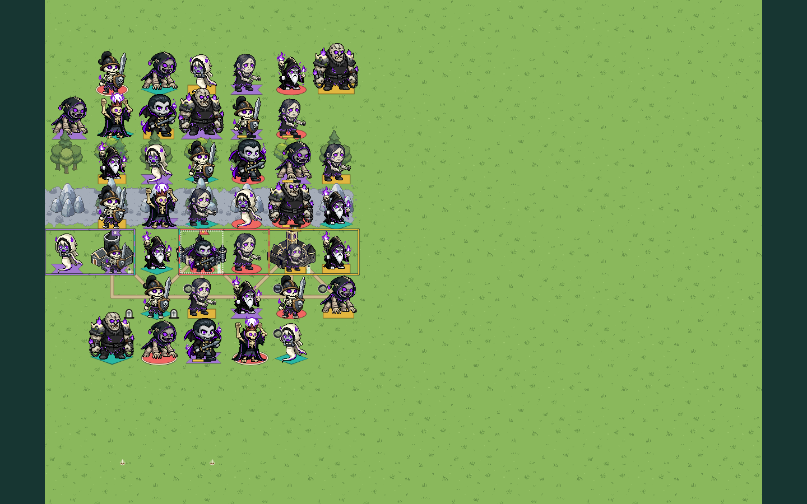

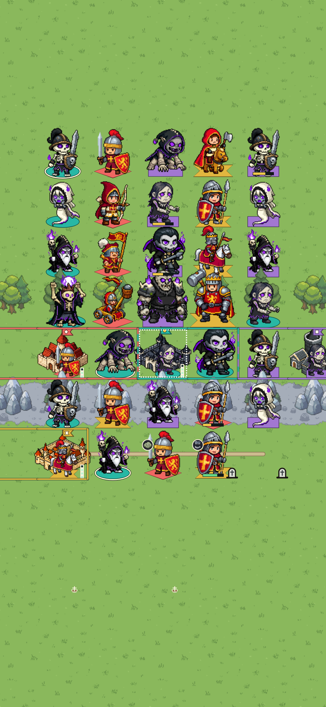

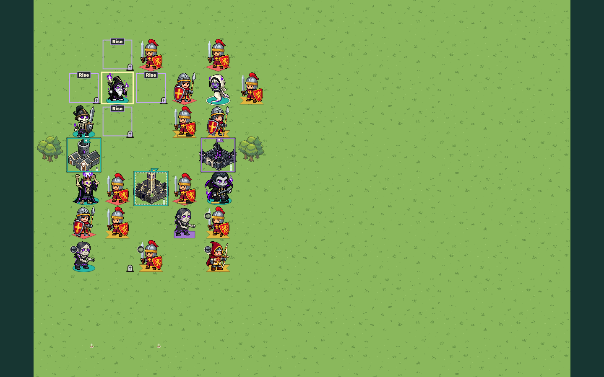

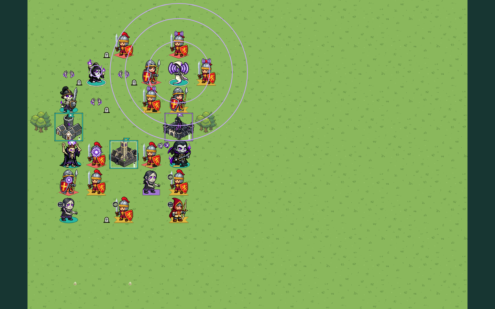

### Evidence

`npm run art:chibi-undead-direction-review` writes
[`art/pixellab/reviews/chibi-batch-direction-undead/`](../../art/pixellab/reviews/chibi-batch-direction-undead/)
(see [the pipeline document](CHIBI_PIPELINE.md#review-evidence) for the
list).

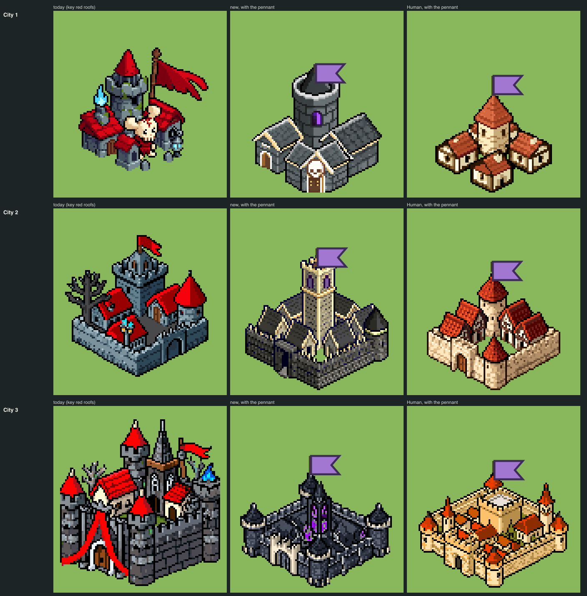

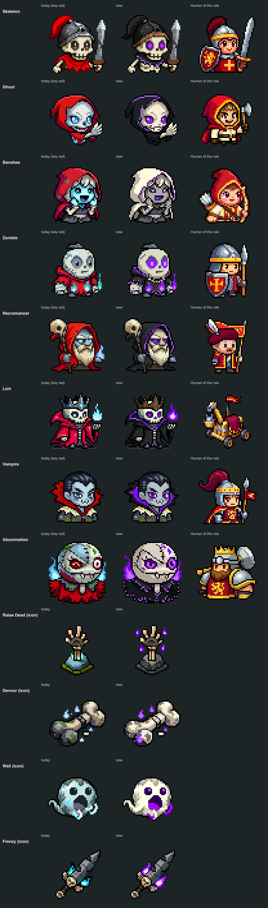

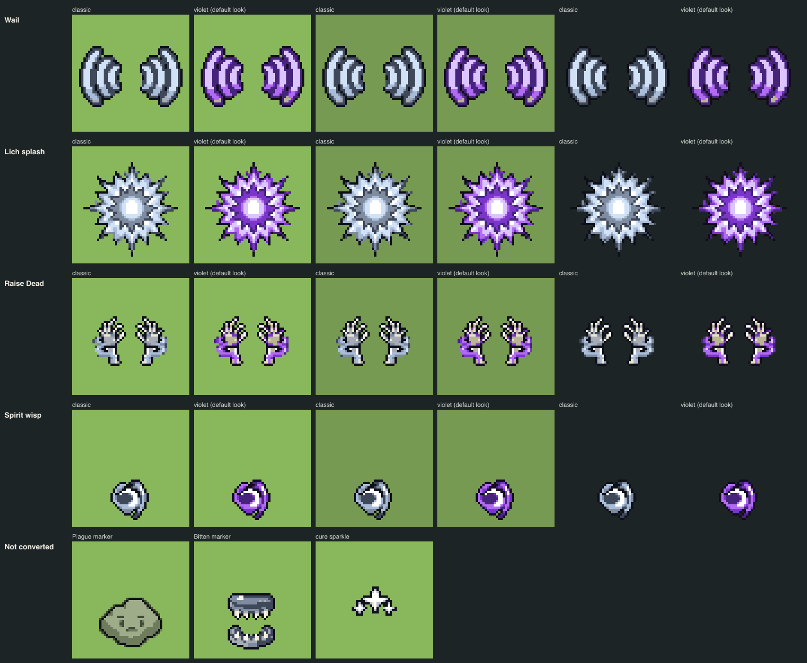

### Weak spots left

- **The roster is dark.** Seven of eight units are more than half black
  (cloth and outline); only the Banshee is pale. That is the look asked
  for, and bone is on every silhouette, but a row of Necromancers, Vampires
  and Abominations is heavy, and the Vampire has almost no bone (0.6%).
- **Wide units hide their plate.** The Ghoul and the Lich cover the
  plate's width with their feet and hem; with no colour on the sprite, the
  player is read from the plate's ends and the border. Unchanged from the
  classic sprites, which had the garment to help.
- **The Violet player's Undead look matched,** and the effects' lit violet
  is only 25 from the Violet plate. A Wail sprite over a Violet player's
  unit sits close to its plate colour; its dark outline separates it.
- **The Abomination keeps a few olive patches** on its shoulder plates.
- **City 3 is the darkest piece on the board** and is lower than City 2,
  whose bell tower is the tallest thing in the set: the tiers are told
  apart by width and walls, not by height. City 2's tower is a warmer tan
  than the bone trim of City 1.
- **City 2 is 8 px taller than its cell** (88 x 88): its pennant and tower
  top reach into the cell above, like the classic cities did by 16 to 24 px.
- **The garrison covers most of a city**, as for the Human cities.
- **The Lich's crown reads brown** rather than bronze at this size.
- **The Banshee is opaque,** not translucent.
- **The effects' bone tones moved too:** the Raise Dead hands are the warm
  ivory of the new units, not the cool ivory of the classic ones.
- **The Devour icon's bite** is shallower after the moss was removed.
- **The setup screen shows no art** for any faction.
- **The study's review** (`art:undead-direction-study-review`) now pins its
  "today" panels to the classic art by its own registry; its checked-in
  evidence was not regenerated.

## 18. Dinosaur study

**Status:** bead `pulp_wars-3tq.14`, waiting for the user's review. The
user accepted the proposed look in principle ("fine. show me a demo with a
few variants. remember dinos can have patterns on their bodies. e.g. tiger
stripes or sth."). This is a study on three units in six variants.
**Nothing is live:** the game draws the Dinosaurs exactly as before, no
sprite is registered, and [DINOSAUR.md](factions/DINOSAUR.md) is unchanged.

Units chosen from the roster (`src/engine/rules/ruleset-v7.ts`):

- **Caveman** (`UNIT:DINOSAUR:FIGHTER`), the human;
- **Raptor** (`UNIT:DINOSAUR:RAIDER`), the small dinosaur;
- **T-Rex** (`UNIT:DINOSAUR:KNIGHT`), the big dinosaur.

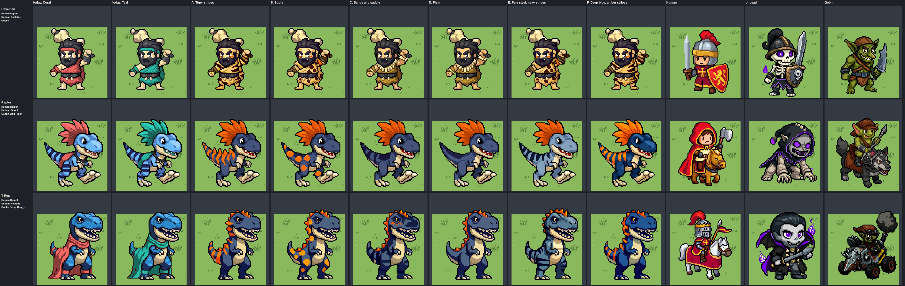

### The look

The same rules as the three converted factions: fixed faction colours, no
owner area and no mask; the player is read from the seat-shaped plate, the
pennant and the border; chibi proportions, camera, top-left light and black
outline unchanged; the same canvases (56 x 80, 72 x 88) and anchors as the
accepted sprites. Today's player-coloured parts are gone: the Raptor's
feather crest is amber and its blanket is removed; the T-Rex's cape, scarf
and ankle bands are removed and it has an amber brow crest and back spikes;
the Caveman's red tunic, headband and wrist wrap are tawny fur and bone.

| Variant                     | Hide (commonest tones)          | Body pattern                                           | Caveman beside it                  |
| --------------------------- | ------------------------------- | ------------------------------------------------------ | ---------------------------------- |
| A. Tiger stripes            | slate `#465f82`, `#45547d`      | bold amber wedges from the spine, on the back and tail | tiger-striped fur, amber war paint |
| B. Spots                    | slate `#46557e`, `#4b6180`      | ten to twelve big solid amber spots                    | spotted fur, amber war paint       |
| C. Bands and saddle         | slate `#4d627f`, `#46547c`      | navy saddle and tail bands; amber on the crest only    | plain fur, a necklace of teeth     |
| D. Plain (control)          | slate `#4e6383`, `#495881`      | none; amber on the crest only                          | plain fur, a necklace of teeth     |
| E. Pale steel, navy stripes | pale steel `#84a2be`, `#577d95` | six to eight navy stripes; amber on the crest only     | spotted fur, amber war paint       |
| F. Deep blue, amber stripes | deep blue `#205794`, `#164271`  | the stripes of A on a deeper, more saturated hide      | tiger-striped fur, amber war paint |

F was not in the brief. The hide edits reached three blues (below), and the
brief's E tests the paler one; F shows the deeper one with the pattern of A,
so the hide colour can be judged in both directions.

| Role         | Colours (measured)                                                       | Share of the two dinosaurs                 | Used for                                             |
| ------------ | ------------------------------------------------------------------------ | ------------------------------------------ | ---------------------------------------------------- |
| Hide         | per variant, above; mean `#4b5d81` (D)                                   | 19% to 31%                                 | head, flank, limbs                                   |
| Navy         | `#151d4d`, `#263253`; F `#050949`                                        | 17% to 29%                                 | the back, tail top and far legs; C's and E's pattern |
| Cream        | `#f4dda3`, `#f2deab`                                                     | 7%                                         | belly, throat, lower jaw, teeth, claws               |
| Amber accent | lit `#fe6d00` to `#fe7500`; shade `#c64600`; mean `#d95301` to `#e86400` | D 11% (Raptor 17%, T-Rex 5%); A 18%; B 19% | crest and spikes; stripes, spots, war paint          |
| Caveman fur  | spotted `#d8a757` with `#431205` spots; plain `#ac823a`                  | most of the body                           | the pelt                                             |
| Caveman skin | `#e3ad60` to `#e5b06e`                                                   | face, arms, legs                           | a light golden tan                                   |
| War paint    | `#f66300`                                                                | 0.9% to 1.5% of the Caveman                | two stripes on each cheek, a band on the arm         |

The tables are written from `palette.json`, which
`npm run art:dinosaur-direction-study-review` measures on the sprites.

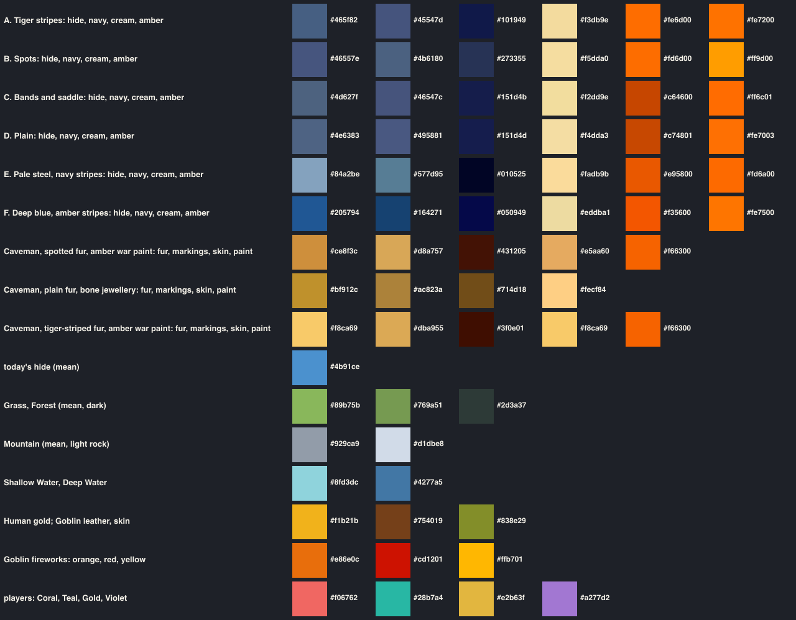

**The accent is orange, not amber.** Every edit asked for "bright
amber-orange, colour `#f08c1e`" and PixelLab drew a red-orange (hue 20° to
28°, `#fe6d00`) every time; only the T-Rex's spots came out yellower
(`#ff9d00`). The findings below are for the colour that was drawn.

### How it was made

Run
[`art/explorations/dinosaur-direction-2026-10/`](../../art/explorations/dinosaur-direction-2026-10/)
(`batch.json` with every recipe, seed and instruction; `faction.md`;
`subjects.json`; `records.json` with each request as sent and each verdict;
receipts in `submissions/`; candidates in `raw/`): 39 recipes, 39 PixelLab
calls, 78 candidates, every one an `edit-image-pixen` edit of an accepted
sprite of batch `dinosaur` or of an earlier step. 13 recipes are rejected
with a recorded reason.
[`samples.ts`](../../scripts/art/dinosaur-direction/samples.ts) cuts the 18
masters and 8 alternatives into `assets/` and records them in
`samples.json`.

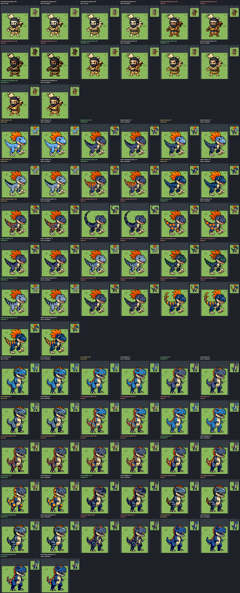

**Step 1, a clean base per unit.**

| Recipe                            | Result                                                                                                                                           |
| --------------------------------- | ------------------------------------------------------------------------------------------------------------------------------------------------ |
| `raptor-base-a`                   | alternative: crest amber, blanket and cord gone, today's light blue kept (`#66b1ee`)                                                             |
| `raptor-base-b`                   | **slate base (D)**: the same with the hide asked for as `#4f73a6`; it came out a darker, duller slate (`#495881`) with no stripes                |
| `raptor-hide-a`                   | alternative: a light head and flank under a navy back                                                                                            |
| `raptor-hide-b`                   | **pale steel base (E)**: lifted from the slate base                                                                                              |
| `raptor-hide-c`                   | **deep blue base (F)**: `#4a78b8` asked for, `#205794` drawn                                                                                     |
| `t-rex-base-a`, `t-rex-base-b`    | cape, scarf and ankle bands removed and a crest added in one edit; the hide stayed today's bright blue (`#2d86c5`) although `-b` gave hex values |
| `t-rex-hide-a`                    | **slate base (D)**: a hide-only edit of `base-b`                                                                                                 |
| `t-rex-hide-b`                    | **pale steel base (E)**: the same edit on `base-a` (smaller crest) landed lighter                                                                |
| `t-rex-hide-c`                    | rejected: a second hide edit of the bright blue base changed nothing                                                                             |
| `t-rex-hide-d`                    | **deep blue base (F)**: from the slate result, not from the bright blue one                                                                      |
| `caveman-fur-spots-a`, `-plain-a` | the two wardrobes: a spotted tawny pelt with a bone-white headband; a plain pelt with a necklace of teeth                                        |
| `caveman-…-skin-a` (two)          | rejected: "tanned warm brown skin, `#c8875a`" came out dark brown, darker than the fur                                                           |
| `caveman-…-skin-b` (two)          | **chosen**: "lightly sun-tanned skin, a light golden tan, `#dba673` … clearly lighter than brown", with the war paint in the same edit           |
| `caveman-fur-stripes-a`           | **chosen for A and F**: the spots of the pelt redrawn as tiger stripes                                                                           |

**Step 2, the patterns,** each an edit of the plain base of its hide:

| Recipe                                            | Result                                                                                                                    |
| ------------------------------------------------- | ------------------------------------------------------------------------------------------------------------------------- |
| `raptor-stripes-probe-a`                          | **A**: nine amber wedges on the back and tail, first try                                                                  |
| `t-rex-stripes-probe-a`, `-b`                     | rejected: twenty thin stripes over the body and both legs; "exactly seven" changed nothing                                |
| `t-rex-stripes-a`                                 | **A**: "five very thick … each a fat solid wedge at least four pixels wide … no thin lines; both legs stay plain"         |
| `raptor-spots-probe-a`, `t-rex-spots-probe-a`     | amber rings ("leopard spots … a dark centre"): kept as an alternative on the Raptor, rejected on the T-Rex (twenty rings) |
| `raptor-spots-a`, `t-rex-spots-a`                 | **B**: "big solid … round spots, each a filled blot about as big as its eye with no ring and no hole"                     |
| `raptor-navy-spots-a`, `t-rex-navy-spots-a`       | rejected: darker-blue rosettes are too low in contrast and look like suckers                                              |
| `raptor-saddle-probe-a`                           | rejected: "no orange on the body" removed the crest, and the tail was redrawn curled                                      |
| `raptor-saddle-a`, `t-rex-saddle-a`               | **C**: the same with "the crest stays exactly as it is and the tail keeps its straight shape"                             |
| `raptor-steel-stripes-a`, `t-rex-steel-stripes-a` | rejected: a dozen thin navy lines; amber bands appeared on the T-Rex's tail unasked                                       |
| `raptor-steel-stripes-b`, `t-rex-steel-stripes-b` | **E**: the "fat solid wedge" wording, and "no orange"                                                                     |
| `raptor-teal-stripes-a`                           | rejected: the head turned teal-green and a teal frill was added                                                           |
| `raptor-deep-stripes-a`                           | rejected: the tail was redrawn curled and the crest reshaped                                                              |
| `raptor-deep-stripes-b`, `t-rex-deep-stripes-a`   | **F**                                                                                                                     |

**The alternative palette of E.** Of the two suggested, the paler steel
hide with navy stripes is chosen over teal-green stripes: a second cool
colour on a blue hide turned the Raptor's head green (the Goblin colour
family) and its stripes were the weakest in contrast; navy on pale steel
has a luminance contrast of 4.4, the highest of any pattern.

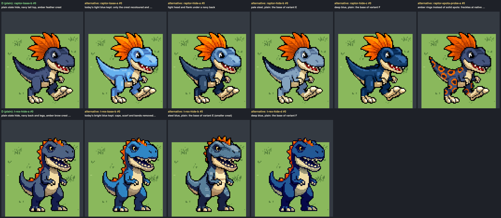

**Did the pattern edits hold the base steady?** Yes, when the instruction
says what stays. `samples.json` records, for each pattern variant against
the plain sprite it was edited from, the pixels whose opacity changed and
the pixels whose colour clearly changed (further than 48 in RGB), on the
hide and elsewhere:

| Variant | Raptor: silhouette, hide, elsewhere | T-Rex: silhouette, hide, elsewhere |
| ------- | ----------------------------------- | ---------------------------------- |
| A       | 91, 201, 22                         | 0, 142, 45                         |
| B       | 0, 196, 4                           | 0, 252, 2                          |
| C       | 0, 106, 0                           | 0, 342, 25                         |
| E       | 3, 131, 0                           | 0, 291, 13                         |
| F       | 1, 180, 6                           | 0, 112, 29                         |

Of about 2,700 opaque pixels. The Raptor's 91 silhouette pixels in A are
stripe tips that stand out from the back and tail as small spines. An edit
does repaint nearly every pixel by a few steps of tone (2,100 to 2,700
pixels are not byte-identical), so the variants are like for like to the
eye but not to a byte comparison, unlike the Undead accents. Two of the
21 pattern edits redrew the tail and crest and were rejected; both
were repaired by naming the crest and the tail as kept.

What worked in the prompts:

- **"Add only a pattern on the hide: …"** then the count, the colour as a
  hex value, where it goes, and where it does not ("No stripes on the head,
  belly or legs"), then "Do not redraw anything. Keep …".
- **Ask for size, not for a number.** "Five stripes" or "exactly seven"
  gave a dozen thin lines. "Very thick … each a fat solid wedge at least
  four pixels wide, with plain hide between them; no thin lines" gave five
  to eight bold ones.
- **"Solid … with no ring and no hole"** for spots. "Leopard spots" and
  "rosettes" give rings, which are freckles at native size.
- **Name the crest and the tail as kept** in every pattern edit of the
  Raptor: "the feather crest stays exactly as it is and the tail keeps its
  straight shape".
- **Never write "no orange on the body":** it removes the crest. To keep a
  pattern navy, write "no orange" inside the stripe clause.
- **The hide's colour needs an edit of its own, and one only.** In an edit
  that also removes a cape the hex value is ignored; a hide-only edit moves
  it once; a second hide edit of the same source does nothing. The hex
  value sets the direction, not the result: `#4f73a6` gave `#495881` and
  `#4e6383`; `#4a78b8` gave `#205794`.
- **"Take off the red cape, the red scarf and the red ankle bands so its
  neck, back, tail and legs are bare … hide"** removes garments cleanly and
  redraws the body under them; "Nothing red is left." closes the edit.
- **Skin: say "light".** "Tanned warm brown" is dark brown. "A light golden
  tan … clearly lighter than brown" is the tone wanted.
- **The accent's hue is not controllable by words or hex:** "amber-orange
  `#f08c1e`" is drawn as `#fe6d00`.
- An instruction is at most 500 characters.

### In the game

`npm run art:dinosaur-direction-study-review` draws the scenes of
[`scene.ts`](../../scripts/art/dinosaur-direction/scene.ts) through the real
board host with the look the game draws, including the live Human, Goblin
and Undead direction art: today's Dinosaur sprites, then each variant.

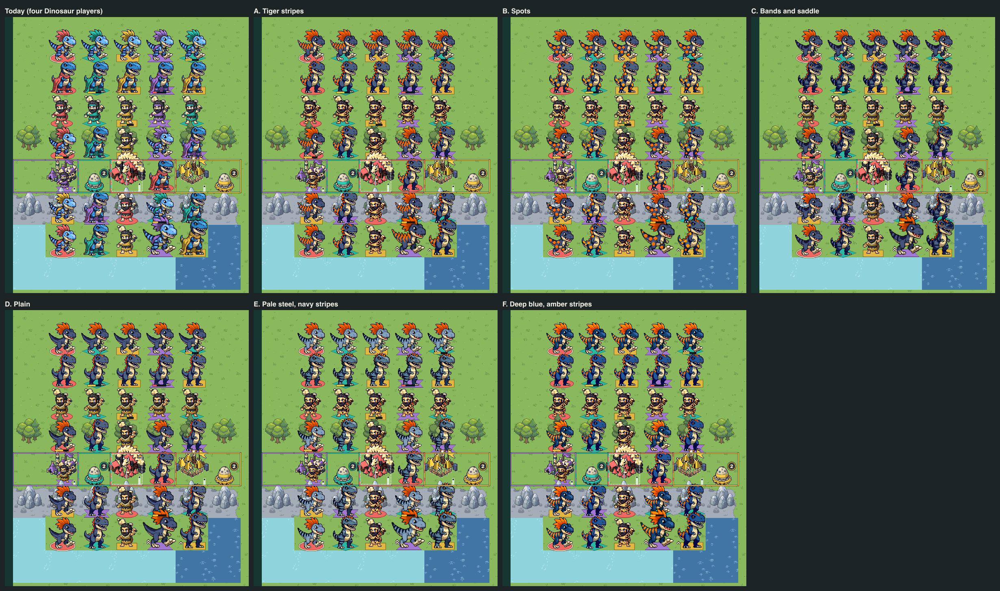

`FOUR` has four Dinosaur players (Coral, Teal, Gold, Violet): rows of
Raptors, T-Rexes and Cavemen on Grass with the ready rim and the damaged HP
bar, a row on Forest, a row beside and inside Dinosaur cities of the three
tiers with two Eggs, a row on Mountain, and a row on the shore with
Shallow Water to the left and below and Deep Water to the right, holding an
Alpha Raptor and a Big T-Rex (today's scale and chevrons).

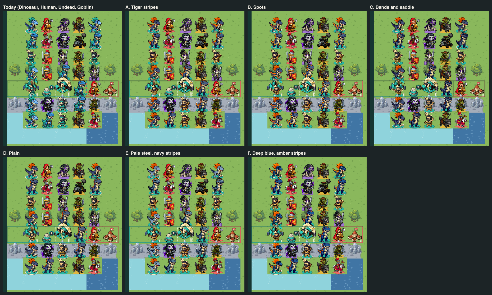

`MIXED` has a Dinosaur player in Teal, a Human player in Coral, an Undead
player in Violet and a Goblin player in Gold. The four factions separate at
once: crimson and gold, black and bone, olive and brown, blue and orange.

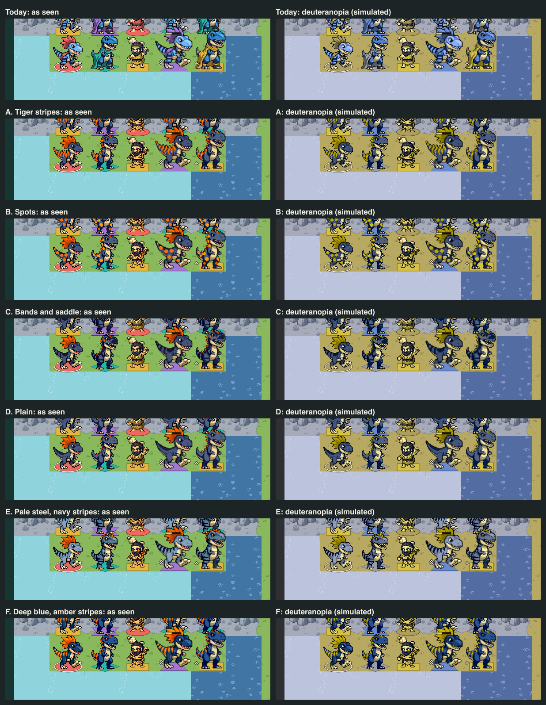

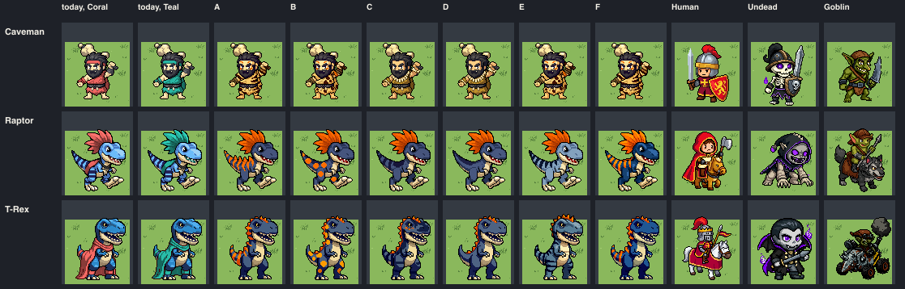

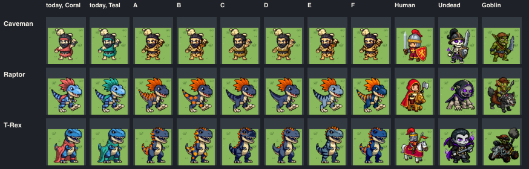

### Readability

`readability.json` (CIE76 colour difference: about 10 is clear at a glance,
20 and more are different colours; "contrast" is the WCAG luminance ratio).
Terrain is measured on the untoned rasters. A variant's hide is the mean of
its Raptor's and T-Rex's hide pixels.

| Check                                       | Result                                                                                                                                                                                                                                                                            |
| ------------------------------------------- | --------------------------------------------------------------------------------------------------------------------------------------------------------------------------------------------------------------------------------------------------------------------------------- |
| Hide against Grass (`#89b75b`)              | slate 79 (contrast 2.9), pale steel 67 (1.6), deep blue 93 (3.5); today's blue 85 (1.4). Every hide is far from Grass; the pale one is the closest in brightness.                                                                                                                 |
| Hide against Shallow Water (`#8fd3dc`)      | slate 48 (contrast 4.0), **pale steel 31 (2.3)**, deep blue 58 (4.9); today's blue 38. The known risk is real only for the pale hide; the dark ones are clearer beside Shallow Water than today's sprites.                                                                        |
| Hide against Deep Water (`#4277a5`)         | **slate 13 to 15, pale steel 14, deep blue 18;** today's blue 13. Every blue hide is the colour of Deep Water. A land unit never stands on water; beside it, the black outline, the navy back (37 to 46 from Deep Water) and the cream belly separate the unit, as they do today. |
| Hide against Mountain (mean `#929ca9`)      | slate 29, **pale steel 14**, deep blue 42. A pale steel dinosaur on a Mountain is grey on grey.                                                                                                                                                                                   |
| Hide against the Teal plate (`#28b7a4`)     | slate 56 (33 under deuteranopia), **pale steel 42 (19)**, deep blue 66 (48); today's blue 54 (38). Slate against the Violet plate 41 (26).                                                                                                                                        |
| Accent against the Gold plate (`#e2b63f`)   | 45 to 52, but **15 to 21 under deuteranopia**, where orange and gold are both yellow-brown. Against Human gold (`#f1b21b`) 40 to 48 (18 to 26).                                                                                                                                   |
| Accent against the Coral plate (`#f06762`)  | 34 to 39 (28 to 32 under deuteranopia): the drawn red-orange is nearer Coral than Gold.                                                                                                                                                                                           |
| Accent against Goblin leather and fireworks | leather (`#754019`) 46 to 51. **Fireworks orange (`#e86e0c`) 3 to 12: the same colour.** Fireworks red 19 to 28, yellow 40 to 49. The Rocket Cart's rockets and a dinosaur's crest share a hue; the cart is told apart by its shape, its olive crew and its other colours.        |
| Cream against Mountain                      | 46 against the mean, 37 to 39 against the light rock (`#d1dbe8`) with a luminance contrast of 1.0 to 1.1: as for Undead bone, warm against cool at equal brightness; the outline and the dark hide separate the unit.                                                             |
| Pattern on its hide                         | amber on slate 97 to 102 (contrast about 2), amber on deep blue 115 (2.4); navy on slate **27 (2.4)**, navy on pale steel 46 (4.4). C's saddle is a tone-on-tone mark.                                                                                                            |
| Caveman fur against Goblin leather          | spotted and striped fur 43 to 44 (contrast 3.8): far lighter than leather. Plain fur 29 (2.4).                                                                                                                                                                                    |
| Caveman fur against the Gold plate          | **spotted 15 to 17**, plain 27: the pale tawny pelt is close to Gold. Against Grass 41, but 11 to 12 under deuteranopia.                                                                                                                                                          |
| Caveman skin against his fur                | **spotted 3.5**, plain 19: in the spotted treatment skin and pelt are one colour, held apart by the outline and the spots.                                                                                                                                                        |
| War paint against skin                      | 45 to 48 (contrast 1.5), 22 to 24 under deuteranopia; 19 to 31 pixels.                                                                                                                                                                                                            |
| Under simulated deuteranopia                | The blue hide stays blue and the orange turns a dark yellow: stripes and spots keep their contrast against the hide (92 to 109). Orange against Grass falls from 84 to 26, so the crest stands out less; the hide carries the unit.                                               |
| Unit width against the plate                | Caveman 52 on a 52 px plate. Raptor 67 and T-Rex 60 on a 57 px plate, as today (67 and 62): the tail and snout overhang; their feet are 43 and 41 px, so the plate shows on both sides.                                                                                           |

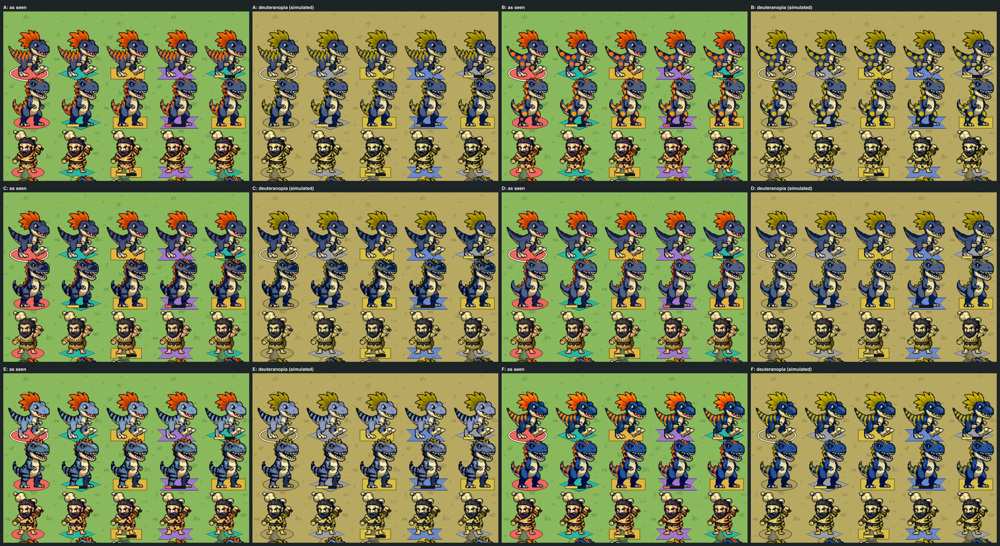

### Findings per variant

- **A. Tiger stripes.** The pattern that reads best: at native size and at
  zoom 0.75 the Raptor is plainly a striped animal, and the T-Rex's tail
  and neck stripes read as a few orange bars. It says "predator" and ties
  the body to the crest. Costs: it doubles the accent on the Raptor (25% of
  the sprite); the T-Rex faces the camera, so its back stripes show only on
  the tail and behind the neck; the Raptor's stripe tips break the outline
  as small spines.
- **B. Spots.** Readable and bold, and the friendliest: big orange dots on
  a dark body. But solid dots read as polka dots or a ladybird rather than
  a leopard, real rosettes turn into freckles at native size, and the spots
  on the T-Rex's legs and belly edge are the busiest result of the six. It
  suits a slow, round herbivore better than a predator.
- **C. Bands and saddle.** The calmest, and too calm: navy on slate differs
  by 27, so at native size C cannot be told from D on the Raptor, and on
  the T-Rex it reads as "a darker T-Rex". It is a good second layer under
  another pattern, not a pattern on its own.
- **D. Plain.** Clean, and already a faction: slate body, cream belly,
  orange crest. The Raptor's big crest carries it; the plain T-Rex is the
  dullest sprite of the study, a dark shape with a thin orange ridge.
- **E. Pale steel with navy stripes.** The stripes have the best contrast
  of all, and it is the only variant whose accent stays small. But the pale
  hide is the weakest in the game: 31 from Shallow Water, 14 from Mountain
  rock, 19 from the Teal plate under deuteranopia, and its lit tone
  (`#84a2be`) is near the Undead iron (`#818f9b`). It reads as a grey zebra.
- **F. Deep blue with amber stripes.** The same pattern as A on a hide that
  measures best everywhere: 93 from Grass, 58 from Shallow Water, 66 from
  the Teal plate, 115 between stripe and hide. At native size the slate of
  A to D reads as near-black navy; F still reads as blue, which is the
  faction's tell. It is a more saturated blue than "slate to steel".

The two Caveman treatments: **spotted fur with war paint** is the livelier
and reads as a caveman at once, but its pelt, its skin and the Gold plate
are nearly one colour; the **plain fur with a tooth necklace** has a
darker pelt that separates from the skin (19) and from Gold (27), and the
necklace reads at native size, but it has no accent at all. The war paint
is 19 to 31 pixels: visible at x4, a warm smudge on the cheek at native
size. The tiger-striped pelt is the clearest of the three patterns on fur.

### Recommendation

1. **Pattern: tiger stripes** (A), as the faction's default body pattern,
   with the "fat wedge" wording. They read at every size, hold the base
   steady, and survive colour blindness.
2. **Hide: the deep blue of F,** or a tone between F and the slate. The
   slate is correct to the brief and looks good enlarged, but at the size
   the game is played it is a dark navy silhouette, and blue is what makes
   a dinosaur a Dinosaur at a glance. Not the pale steel of E.
3. **One pattern per species, not one for the faction.** Stripes on the
   predators (Raptor, T-Rex); spots on a round herbivore (Brontosaurus or
   Triceratops) if variety is wanted; the navy saddle and tail bands of C as
   an under-layer on the armoured ones (Ankylosaurus). Five striped species
   in a row would make the pattern the clutter this direction set out to
   remove.
4. **Pin the accent by a recorded pipeline step,** as the Undead violet is:
   generate with PixelLab's orange, find it by colour (hue 8° to 45°,
   saturation at least 0.75; nothing else on a dinosaur is in that band) and
   move it to the chosen hue. The user asked for amber; a true amber
   (`#f08c1e`) is further from Coral and from the Goblin fireworks and
   nearer to Gold. This is the one open colour choice.
5. **Caveman:** the plain, darker pelt with the tooth necklace **and** the
   war paint (a combination this study did not draw), so that he carries
   the accent and his fur stays apart from his skin and from Gold.

### Growth: Big and Alpha

Today a grown dinosaur is the same sprite drawn larger (x1.125 and x1.25)
with one or two chevrons beside the HP bar; the shore row of scene `FOUR`
shows both. A pattern that intensifies with growth is possible in this
look, because the pattern edits hold the silhouette: a plain base, a
striped Big and a fully striped Alpha would be three rasters of one
outline, and the scale and chevrons would stay as they are. Suggested, not
implemented:

- **Base:** the species' pattern as in this study.
- **Alpha only:** one extra raster per dinosaur with a second mark on the
  same stripes, for example amber war paint on the face or a taller crest.
  Big keeps the base raster and its chevron.

A three-step ladder (plain, some stripes, many stripes) is not
recommended: the middle step cannot be told from its neighbours at native
size (C against D shows how little a quiet difference reads), a base
dinosaur with no pattern would lose the look this study is about, and it
triples the sprites of seven species. The Alpha-only raster costs seven
edits and needs a renderer change (a growth-stage art subject) with tests.
The chevron stays the rule either way: shape, not colour, carries the
meaning.

### Weak spots

- **The accent is not amber.** See above; every finding about Gold, Coral
  and the fireworks shifts if the hue is moved.
- **Blue hide is the colour of Deep Water** (13 to 18), as it is today. It
  is acceptable only because land units do not stand on water; a dinosaur
  on the shore in front of Deep Water is held by its outline.
- **The slate hide is dark at native size.** With the navy back, half of a
  slate dinosaur is darker than `#4b5d81`.
- **The hides of the two dinosaurs are not one colour.** In E the Raptor is
  `#84a2be` and the T-Rex `#577d95`; in the slate variants they differ by a
  few steps. Hide colour drifts per edit, as the accepted roster's blue
  does today.
- **The T-Rex's spots are a yellower orange** (`#ff9d00`) than its crest.
- **The Raptor's gums are red,** a leftover of the accepted sprite; it is
  a second warm colour beside the orange.
- **The spotted Caveman's skin and pelt are one colour** (3.5 apart).
- **The T-Rex's crest differs between hides:** E was built on the smaller
  crest of `t-rex-base-a`.
- **Wide units overhang their plate,** unchanged from today.
- **Eggs, cities, portraits, icons and the other five units in the scenes
  are today's art** with player-coloured parts.

### Open questions for the user

1. Which pattern: tiger stripes (recommended), spots, bands, or none?
2. One pattern for the whole faction, or one per species?
3. Which hide: slate (A to D), deep blue (F, recommended), or pale steel
   (E)?
4. The accent: the red-orange PixelLab draws (`#fe6d00`), or moved to amber
   (`#f08c1e`) by a recorded remap?
5. How much accent: on the crest only (D, about 11% of a dinosaur), or
   crest and pattern (A, about 18%)?
6. Caveman: spotted pelt with war paint, plain pelt with bone jewellery, or
   the plain pelt with both? Should the pelt's pattern follow the dinosaurs
   (tiger pelt beside striped dinosaurs)?
7. Growth: scale and chevrons only (as today), or an Alpha raster?
8. May the frills of the Spitter and the Triceratops, today the largest
   player-coloured areas of the faction, become solid accent areas? A frill
   is about 30% of those sprites, well above the accent share elsewhere.

### Plan for the rest of the roster

On approval, first rewrite [DINOSAUR.md](factions/DINOSAUR.md): the chosen
hide by hex, cream, navy, the accent, tawny fur and tanned skin allowed;
its negative fragment today forbids "orange glow, brown fur, brown hide,
brown leather, tan, leopard spots", which existed to protect the red key
colour and the player colours; its rule "a few navy stripes on the Raptor's
tail are the only skin pattern" is replaced. Then one production batch
(`direction-dinosaur`, `fixedFactionColours`, every asset
`ownerColour: false`) as edits of the accepted `dinosaur`, `5-dinosaur` and
`cities-dinosaur` assets, importing the chosen base and pattern recipes
with `art:chibi -- import` (a whole chain must be imported).

**Order of edits per dinosaur,** from this study: (1) remove the garments
and recolour the crest, (2) the hide alone, (3) the pattern, with the kept
parts named. Three edits, plus repairs.

| Piece                  | Plan                                                                                                                                    | Predicted difficulty                                                                                                                                                                                                                      |
| ---------------------- | --------------------------------------------------------------------------------------------------------------------------------------- | ----------------------------------------------------------------------------------------------------------------------------------------------------------------------------------------------------------------------------------------- |
| Spitter                | the round frill and the poncho are the owner areas: the poncho is removed, the frill becomes the accent with a cream rim                | High. An accent frill is a third of the sprite, where the rule is a small accent; a hide-coloured frill with accent ribs or an accent rim may be the answer. Needs two samples. The frill is also where a pattern would go, not the body. |
| Ankylosaurus           | blanket strip and red tail-club ball removed; cream or bone dome plates; navy bands, accent only on the spikes' tips or a brow          | Medium. It is on the standard canvas and mostly shell: little hide to pattern, and removing the blanket once "made a hood over the whole dome". Tan drifts in on its head and legs.                                                       |
| Shaman                 | tanned skin, tawny robe instead of the red one, the skull headdress kept, its red feathers in the accent, bone and tooth jewellery      | Medium. The robe is most of the sprite: a long tawny robe beside a tawny Caveman, and the Gold plate, needs a darker pelt or a spotted one. The skull hood must not read as Undead bone; the bearded tanned face under it does that.      |
| Triceratops            | the frill is the owner area: hide-coloured with accent markings, or an accent frill; cream horns                                        | High, for the same reason as the Spitter, and it is a side-view quadruped: an edit once turned the whole animal charcoal. One brown belly strap is left on the accepted sprite.                                                           |
| Brontosaurus           | neck bands, collar and back blanket removed; a long plain neck with a pattern on the back and flank                                     | Medium to high. It is the giant (88 x 104) and reached the 96 px cap; removing the blanket exposes the largest hide area of the faction, where spots or a saddle fit best. It took ten calls to make.                                     |
| Raptor, T-Rex, Caveman | import this study's chains; one repair each (the Raptor's red gums, the T-Rex's crest on the chosen hide, the Caveman's pelt and paint) | Low.                                                                                                                                                                                                                                      |
| Egg                    | the red painted band becomes an accent band, or a band of hide-blue speckles                                                            | Low. One edit. An accent band on every Egg keeps the Egg loud, which helps: it is a 48 px piece.                                                                                                                                          |
| Cities 1 to 3          | red tent roofs and banners become tawny hide and bone with accent-painted markings; a bare pole for the code-drawn pennant              | Medium to high. As for the Goblins and the Undead: recorded pennant anchors and `factionCities` no longer `"CLASSIC"` for the Dinosaurs, which is renderer work with tests. City 3's hut walls are already dark brown.                    |
| Portraits (8)          | edits of the `5-dinosaur` busts with the unit's instruction                                                                             | Medium. At 48 x 48 a body pattern does not show on a bust: two or three stripes on the neck at most. A portrait recolour once turned half a crest orange, which is now the wanted colour.                                                 |
| Command icons          | Lay Egg, War Drums, Stampede: red parts to the accent                                                                                   | Low.                                                                                                                                                                                                                                      |
| Accent step            | an accent preset in `scripts/art/chibi/accent.ts` (source band orange, target the chosen hue), recorded per asset                       | Low: the mechanism exists for the Undead. Warm fur and skin on the cavemen are outside the band by saturation (below 0.75); the war paint is inside it, as wanted.                                                                        |

Expected cost: three edits and one repair per dinosaur (seven species),
two to three per caveman, one and a half per portrait, two per city:
roughly 60 to 70 PixelLab calls. Order: the fragment and the batch
scaffold; then the Spitter, the Triceratops and the Shaman as the next
sample (the two frills and the robe are where the rules fit worst); then
the rest, the portraits and icons, and the cities with their renderer
change last. Until then a Dinosaur player keeps today's sprites on plates.

Evidence in
[`art/pixellab/reviews/dinosaur-direction-study/`](../../art/pixellab/reviews/dinosaur-direction-study/):
`candidates-x3.png`, `variants-{x4,1x,0.75x}.png`, `terrain-x2.png`,
`alternatives-x4.png`, `palette.{png,json}`, `readability.json`,
`scene-{four,mixed}-{desktop,phone}-zoom-{1,0.75}.png`,
`shore-{desktop,phone}-zoom-{1,0.75}.png`,
`same-unit-{desktop,phone}-zoom-{1,0.75}.png` and `index.json`.

The Martian faction's production art in this direction (bead
`pulp_wars-t6s.6`, not live yet) is described in
[factions/MARTIAN.md](factions/MARTIAN.md).
