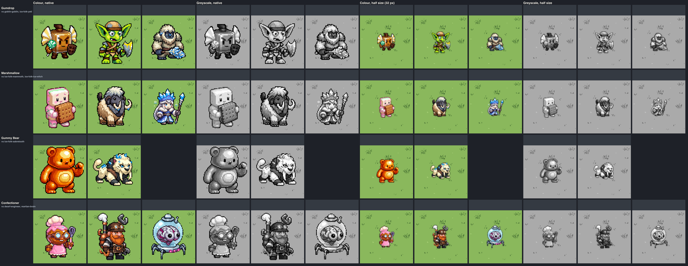
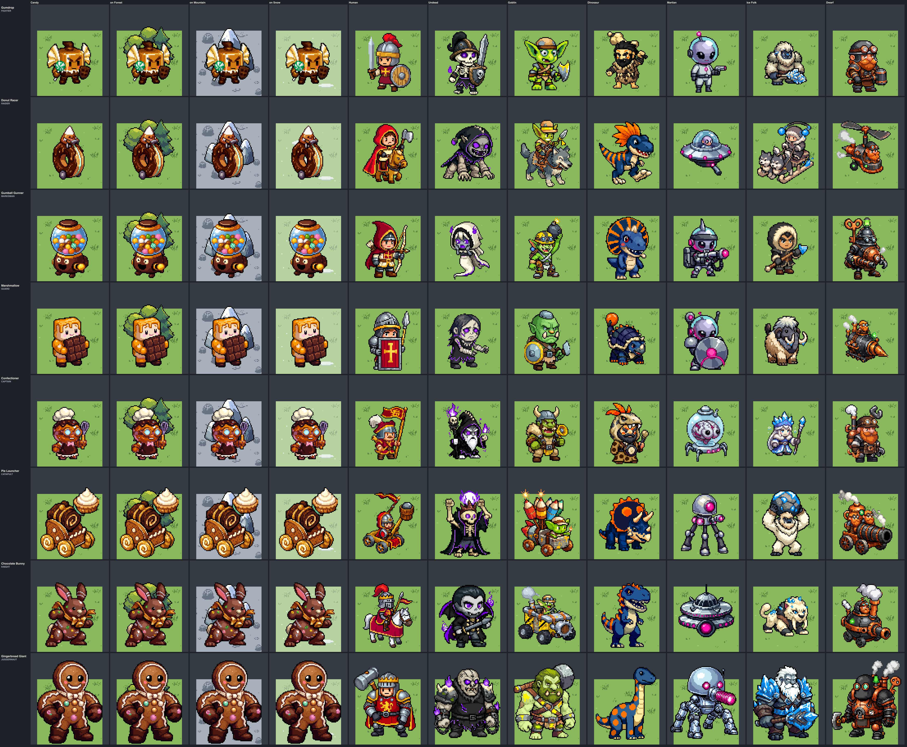
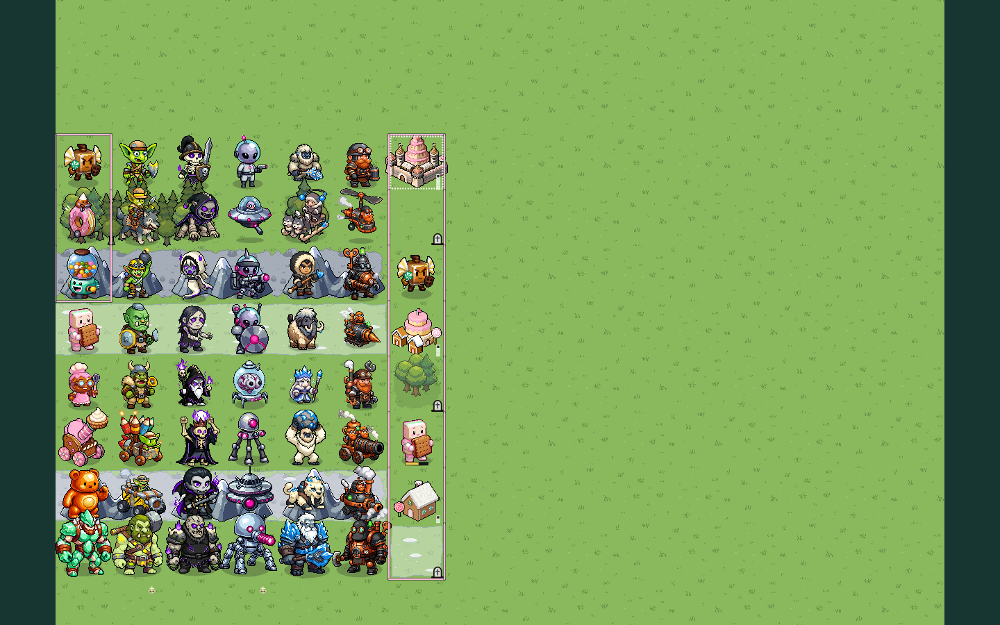
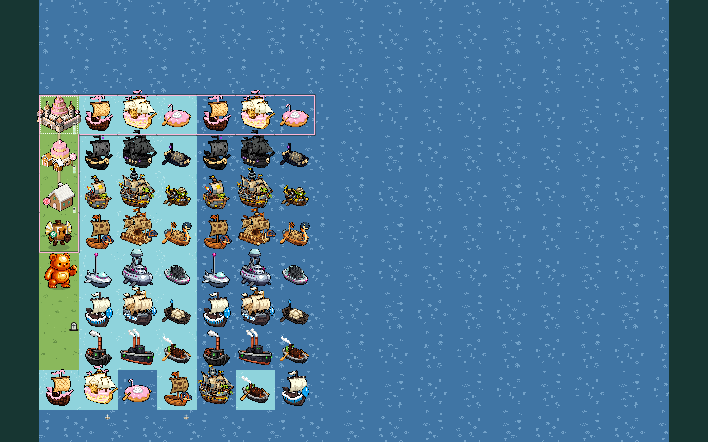

# Faction fragment: CANDY

**Status:** direction and production art made in bead `pulp_wars-jdb.5`
(batches `direction-candy` and `naval-candy`). **Wired in:** the Candy
engine bead (`pulp_wars-jdb.3`) registers both manifests in the live
direction registry and draws the unit sprites, portraits, cities, and
ships, and the Candy UI bead (`pulp_wars-jdb.6`) draws the icons, the
Crumbs marker, and the effects (see the
[wiring list](#wiring-list-for-pulp_wars-jdb6), which is kept as written
before the wiring). **Still open:** the faction emblem is made and not
drawn; the Confectioner's portrait still shows the first sprite's white
apron top and is to be regenerated, and the Classic and LEGACY looks have
no Candy badge (both `pulp_wars-jdb.9`). The Candy rules are folded into
[Ruleset 7: current rules](../../product/RULESET_7_CURRENT.md#23-candy-faction-rules)
(`pulp_wars-jdb.8`). The look follows
[the Candy spec](../../product/RULESET_7_CANDY.md) (sections 2.1 and 15.4):
the Kingdom of Sugarcrest, a kingdom of living sweets, in fixed colours with
the faction colour cotton-candy pink `#ffb8d8`. Every decision below was
made in this bead and is recorded so that it can be overruled. The root
approved the fragment and the subject lines in the bead's correction pass
(2026-10-04) and ruled on three points: the show's name leaves the
negative fragment, the Confectioner gets a pink frosting apron, and the
tiny pink flags on the cities stay.
The art pipeline reads the two `text` blocks under **Prompt fragment** and
**Negative fragment** below as layer 3 of every Candy prompt, so edit them
here and nowhere else. Recipes that were already generated keep the request
stored in their record (see the
[pipeline](../CHIBI_PIPELINE.md#fragment-changes-and-historical-records)).

## Identity

The silliest faction: every unit is an edible thing with a face. A gumdrop
with a candy-cane spear, a candy-corn rider on a rolling donut, a jellybean
with a gumball blaster, a square marshmallow behind a graham cracker, a
caramel pastry cook, a pie cannon on a gingerbread cart, a gummy bear and a
golem of rock candy. Bright, glossy and cheerful, round and squat, never
scary.

The faction wears **fixed colours**; no sprite has an owner area or a mask.
The live look has no coloured base plates, so the look alone says "Candy":
the pale pink, the white shine and the frosting are the tells; the player
is read from the territory border, which is the same pink.

**Original designs only.** The faction is inspired by the general idea of a
kingdom of living sweets and uses no character, likeness or name of any
show (spec 2.1). The negative fragment carries the spec's guard list, and
every sample was checked by eye against it: no banana-shaped guard, no
gumball-machine guardian (the Gunner carries a blaster with a bubble of
gumballs; the Juggernaut is a crystal golem), no pink-haired princess and
no lab coat or crown (the Confectioner is a caramel sweet in a baker's hat
and a pink frosting apron; the pink on its head is frosting with sprinkles), no peppermint
butler, no lemon-headed figure. The first Gummy Bear samples were rejected
for looking like a plush toy bear of a film
([How it was made](#how-it-was-made)).

## Prompt fragment

It names only a mood, materials, colours and small motifs: no figure and no
place.

```text
Faction: cheerful sugary confectionery, bright, glossy and silly. Its fixed
colours: glossy cotton-candy pink sugar glaze and frosting, colour #ffb8d8,
shaded with a deeper rose pink #e58fb5; matte marshmallow white and cream;
warm caramel, pale biscuit wafer and dark chocolate brown; one hard pure
white highlight on every glossy surface; a few tiny pastel sprinkles and a
little pale mint green trim.
```

## Negative fragment

Red and crimson are the Humans; magenta and hot pink the Martians; purple
and violet the Undead; hazard yellow and gold the Goblins; orange the
Dinosaurs; blue and cyan the Ice Folk; green, lime and jade the Goblins and
the Dwarf lamp; metal, fur and bone the other factions' materials. The last
line is the spec's IP guard, described generically: the root ruled that the
show's name is not a prompt word (every recipe of this bead but the
Confectioner's apron edit was generated with the name in the list; an edit
sends no fragment).

```text
red, crimson, magenta, hot pink, neon pink, purple, violet, hazard yellow,
gold, bright orange, blue, cyan, bright green, lime, jade, metal armour,
steel, iron, sword, fur, bone, skull, scary, horror, realistic, banana
guard, gumball machine guardian statue, pink-haired princess, lab coat with
a crown, peppermint butler, lemon-headed figure, cartoon show character
```

## Palette and value structure

Measured on the eight unit masters
([`palette.json`](../../../art/pixellab/reviews/chibi-batch-direction-candy/palette.json));
`CANDY_PALETTE_V7` holds the tones for code-drawn pieces.

| Role                        | Mean      | L\* | Share | Used for                                              |
| --------------------------- | --------- | --: | ----: | ----------------------------------------------------- |
| Hard shine, marshmallow     | `#fcf7f5` |  98 |    5% | the white highlight, marshmallow, whipped cream       |
| Cream                       | `#f0d7ba` |  87 |    8% | vanilla, sponge, the shade of white                   |
| **Cotton-candy pink, lit**  | `#fba4c7` |  77 |   25% | glaze, frosting, jelly, crystal: the signature accent |
| Mint                        | `#8ddab3` |  81 |    2% | small trim only (a frill, a rim, sprinkles)           |
| Biscuit and caramel         | `#c8783a` |  58 |   12% | wafer, graham cracker, donut dough, caramel           |
| Rose, the shade of the pink | `#b25d80` |  50 |   25% | the one shadow tone of every pink surface             |
| Chocolate                   | `#6d2415` |  26 |    9% | feet, gingerbread shade, chocolate                    |
| Outline                     | `#040203` |   1 |   11% | the thick chibi outline                               |
| Effects                     | n/a       | n/a |   n/a | the ten colours of `candy-sugar.png`                  |

**Value structure.** Three steps carry every sprite: a light body (white,
cream and lit pink, L\* 77 to 98, about 40% of a sprite), a middle shadow
(rose and biscuit, L\* 50 to 58, about 37%) and a dark anchor (chocolate and
the outline, L\* 26 and below, about 20%). The light body is what makes the
faction bright: it is lighter than any other faction's main tone, so a
Candy unit is a pale shape with a dark outline on Grass (pink 82 from the
Grass, contrast 11 against the outline). The dark anchor is small on
purpose (feet, a shield's rim, a hat band): it keeps the pastel shapes from
washing out on Snow.

**The signature accent is the cotton-candy pink** with its hard white
shine: every unit, city, ship and icon carries it (a body, a frosting cap,
a stripe, a roof), and it is the faction colour of the border. Mint is trim
only. No other saturated colour appears.

**The pink is pinned.** PixelLab draws "cotton-candy pink, colour #ffb8d8"
as a saturated raspberry (lit `#da5673`) shaded with a dark wine red
(`#871e4a`, `#761a2e`): the first samples measured 34% to 53% of their
pixels in the Martian magenta's band and their shade on the Human crimson
cloth. The `candy-pink` accent step of the
[pipeline](../CHIBI_PIPELINE.md#the-candy-batches-bead-pulp_wars-jdb5)
moves every pink and wine tone (hue 310 to 356) to hue 329 to 338, caps its
saturation at 0.5 and lifts its value, keeping the order of the tones. The
lit pink lands 8.5 from `#ffb8d8`; the rose shade is 41 from the Martian
magenta and 46 from the Human crimson. Every non-effect master is
re-derived from its candidate through the step; a test checks that no
master has a saturated pink pixel.

## Readability

From [`readability.json`](../../../art/pixellab/reviews/chibi-batch-direction-candy/readability.json).
CIE76; "worst" is the smallest of normal vision, deuteranopia and
protanopia.

| Check                             | Result                                                                                                                                                                                                                                             |
| --------------------------------- | -------------------------------------------------------------------------------------------------------------------------------------------------------------------------------------------------------------------------------------------------- |
| The faction colour `#ffb8d8`      | re-measured as the spec has it: 54.6 from the Martian magenta (worst 27.5), 60.3 from the Ice Folk blue (28.7), 82.9 from the Dwarf green (24.1), 64 from the Human crimson. On Shallow Water 49.7 but **4.3** under a deficiency (the weak spot). |
| Lit pink on the grounds           | Grass 82 (worst 41), Mountain rock 38 (**6**), Shallow Water 56 (10), Deep Water 55, Snow 61 (22); contrast 11 against the outline, which carries it on rock.                                                                                      |
| Rose shade against the factions   | Martian magenta 41 (worst 17), Human crimson 46 (30), Dwarf green 91 (17).                                                                                                                                                                         |
| White against the Ice Folk        | the marshmallow white is the Ice Folk's fur white; the Marshmallow is told by its square shape, its biscuit shield and its pink legs (see the lineup).                                                                                             |
| Biscuit against the Human, Goblin | 45 from the Human crimson but **14** under a deficiency; 54 from the Goblin yellow; 35 from the Dinosaur orange (20). Biscuit is 12% of the roster, in small areas.                                                                                |
| Nearest look-alike of each unit   | 17 to 30 away in palette distance; for five of eight units it is the Dwarf Engineer (ginger, leather and copper against caramel and biscuit). Silhouettes overlap 0.42 to 0.68.                                                                    |
| One family                        | each unit is 7 to 12 from the Gumdrop in palette distance.                                                                                                                                                                                         |
| Sizes                             | the role canvases of every faction (56 x 80, 72 x 88, 88 x 104). The Gumdrop's body is 54 x 48 px and stands 16 px above the canvas bottom; the others stand 2 to 11 px above it.                                                                  |

## The 32 px lineup

The spec makes it mandatory before batching: in colour and greyscale, at
native size and at half size, the Gumdrop against the Goblin and the Yeti,
the Marshmallow against the Mammoth and the Ice Witch, the Gummy Bear
against the Sabretooth, the Confectioner against the Engineer and the
Brain. Evidence:
[`lineup-x3.png`](../../../art/pixellab/reviews/chibi-batch-direction-candy/lineup-x3.png)
and `lineup.json`, with the measures and the calibrated thresholds of the
Dwarf lineup ([`measure.ts`](../../../scripts/art/dwarf-direction/measure.ts):
a pair is distinct when its palette distance is at least 18.5 **and** its
worse colour-vision simulation at least 12.5, and in greyscale its
lightness distance is at least 5.5 or its silhouettes overlap at most 0.65;
the thresholds are re-calibrated on the six first factions, the redesigned
Goblins included).

| Pair                    | Palette | Deut. / Prot. | Lightness | Overlap | Verdict                                                         |
| ----------------------- | ------: | ------------: | --------: | ------: | --------------------------------------------------------------- |
| Gumdrop / Goblin        |    34.1 |   15.3 / 17.0 |      17.1 |    0.55 | distinct                                                        |
| Gumdrop / Yeti          |    27.8 |   14.4 / 13.1 |      18.5 |    0.73 | distinct                                                        |
| Marshmallow / Mammoth   |    20.1 |     9.9 / 8.3 |      15.3 |    0.75 | **fails under colour-vision simulation** (both pale and blocky) |
| Marshmallow / Ice Witch |    25.2 |   19.0 / 15.8 |      10.8 |    0.62 | distinct                                                        |
| Gummy Bear / Sabretooth |    46.9 |   24.9 / 30.7 |      17.5 |    0.53 | distinct                                                        |
| Confectioner / Engineer |    17.8 |     6.4 / 7.3 |      18.1 |    0.60 | **fails in colour** (caramel against ginger and leather)        |
| Confectioner / Brain    |    23.1 |   16.0 / 12.8 |       5.7 |    0.71 | distinct                                                        |

**Verdict: the faction reads at 32 px by eye; two of seven pairs miss the
conservative measure.** At half size the Candy units are pale pink shapes
with white shine, unlike any olive, grey, blue or brown rival. The measure
is the Dwarf bead's calibrated one and is strict (the Dwarves failed two of
six pairs). The Marshmallow and the Mammoth share cream and brown in about
the same block; the pink legs and frosting and the square biscuit decide.

**The Confectioner's pink apron** (the root's ruling, recipe
`confectioner-a-apron`): the first sprite wore a small white apron over
dark trousers and measured 15.3 from the Engineer (6.9 and 7.1 simulated).
With a pink frosting apron down to its feet its pink share rises from 31%
to 38% and the pair measures 17.8 (6.4 and 7.3 simulated), 18.1 apart in
greyscale lightness: **closer to the threshold of 18.5 but still below it,
and unchanged under simulation**, because its caramel head and gloves are
the Engineer's ginger and leather for a colour-blind viewer. By eye the
pair is now unmistakable (a pink dress and a white hat against iron and a
steam stack). The pair against the Brain now passes.

## Silhouette language

This guides the subject lines; it is not sent to PixelLab.

- **Round and squat.** Every unit is one edible object with its face on
  the object itself: a dome, a block, a bean, a ball, a ring. No separate
  head on a small body, no hair, no clothes beyond one accessory.
- **One prop each**, drawn oversized: spear and shield, blaster, biscuit,
  whisk, pie.
- **Glossy things carry one hard white shine**; marshmallow and biscuit
  are matte.
- **Pink on every piece**, in a different place: the whole body (Gumdrop,
  Gummy Bear, Golem), a frosting cap (Donut, Confectioner, Marshmallow), a
  bandana (Gunner), a barrel (Pie Launcher).

## Roster

Batch [`direction-candy`](../../../scripts/art/chibi/batches/batch-direction-candy.json),
subject lines in [`subjects/CANDY.json`](../../../scripts/art/chibi/subjects/CANDY.json).

| Unit (role)                     | Canvas   | Accepted recipe             | What it shows                                                                                                                       |
| ------------------------------- | -------- | --------------------------- | ----------------------------------------------------------------------------------------------------------------------------------- |
| Gumdrop (`FIGHTER`)             | 56 x 80  | `gumdrop-b`                 | a squat sugar-dusted pink dome with its face on it, a mint frill, chocolate feet, a pink candy-cane spear and a waffle shield       |
| Donut Racer (`RAIDER`)          | 72 x 88  | `donut-racer-a`             | a pink-frosted ring donut on its edge with a candy-corn rider in goggles, a kickstand wheel and speed lines                         |
| Gumball Gunner (`MARKSMAN`)     | 56 x 80  | `gumball-gunner-a`          | a vanilla-cream jellybean with a pink bandana and a caramel blaster with a clear bubble of pastel gumballs                          |
| Marshmallow (`GUARD`)           | 56 x 80  | `marshmallow-a`             | a fat square white block with a face and pink cheeks behind a big graham cracker                                                    |
| Confectioner (`CAPTAIN`)        | 56 x 80  | `confectioner-a-apron`      | a glossy caramel sweet with pink frosting, brass goggles, a puffy baker's hat, a pink frosting apron with a white frill and a whisk |
| Pie Launcher (`CATAPULT`)       | 72 x 88  | `pie-launcher-a-pie`        | a gingerbread cart on pink peppermint wheels with a fat pink frosting barrel holding a cream pie                                    |
| Gummy Bear (`KNIGHT`)           | 72 x 88  | `gummy-bear-e-bare-b`       | one piece of glossy pink jelly in the shape of a bear, a fist raised, a face of two dots; nothing worn or carried                   |
| Rock Candy Golem (`JUGGERNAUT`) | 88 x 104 | `rock-candy-golem-a-edit` 1 | a towering golem of pink crystal chunks with sprinkles, bound with dripping caramel, a caramel face under a crystal crest           |

Each unit has a 48 x 48 portrait (`chibi-direction-portrait-candy-<unit>`):
close-ups for six (`portrait` class) and the whole machine for the Donut
Racer and the Pie Launcher (`icon` class, as the Catapult and ship
portraits).

Three sprites differ from the spec's one-line intents: the **Pie Launcher**
is a pie cannon on a gingerbread cart, not a throwing arm (its "candy-cane
arm" came out as a fat striped barrel, and it reads at once); the
**Confectioner** has a small body in a pink apron under its caramel head; the **Donut
Racer**'s donut has a small kickstand wheel.

## Cities

A gingerbread house growing into a cake castle, in the direction's calm
building style (`calm-settlement`, subject keys `CITY:CANDY:<level>/CALM`),
on the canvases of the Ice Folk and Dwarf cities. Pennants are retired
([faction colours](../FACTION_COLOURS.md)), so the cities have no pole and
no anchor.

| Level | Asset                          | Canvas  | What it shows                                                                              |
| ----- | ------------------------------ | ------- | ------------------------------------------------------------------------------------------ |
| 1     | `chibi-direction-candy-city-1` | 80 x 80 | a gingerbread house with a thick white frosting roof and a lollipop tree                   |
| 2     | `chibi-direction-candy-city-2` | 88 x 88 | a two-layer pink-frosted cake keep, two gingerbread houses and a lollipop tree             |
| 3     | `chibi-direction-candy-city-3` | 96 x 88 | a tiered pink-frosted cake inside a wafer wall with four cone-roofed towers and a lollipop |

Walls and faction building looks belong to `pulp_wars-xdh` (spec 15.4).

## Icons

48 x 48, `icon` class.

| Subject                          | Asset                                           | What it shows                                              |
| -------------------------------- | ----------------------------------------------- | ---------------------------------------------------------- |
| `ICON:ACTION:SUGAR_RUSH`         | `chibi-direction-icon-action-sugar-rush`        | a swirl lollipop whose stick is a lightning bolt           |
| `ICON:ACTION:REBAKE`             | `chibi-direction-icon-action-rebake`            | a wire whisk with a pink handle and a pink mitt            |
| `ICON:ACTION:SUGAR_TOSS`         | `chibi-direction-icon-action-sugar-toss`        | a wrapped sweet over a curved arrow                        |
| `ICON:ACTION:CANDY:TEND_WOUNDED` | `chibi-direction-icon-action-frosting`          | Frosting: a piping bag squeezing pink frosting             |
| `ICON:ACTION:SPLAT`              | `chibi-direction-icon-action-splat`             | a cream pie                                                |
| `ICON:ACTION:BOUNCE`             | `chibi-direction-icon-action-bounce`            | a marshmallow on a pink coil spring                        |
| `ICON:STATUS:RUSHED`             | `chibi-direction-icon-status-rushed`            | a pink-and-white lightning bolt                            |
| `ICON:STATUS:CRASHED`            | `chibi-direction-icon-status-crashed`           | a dizzy pink swirl with three stars                        |
| `ICON:STATUS:SPLATTED`           | `chibi-direction-icon-status-splatted`          | a splat of white cream with drips                          |
| `ICON:TECH:CANDY:FORTIFICATION`  | `chibi-direction-icon-tech-home-sweet-home`     | Home Sweet Home: a gingerbread house with hearts           |
| `ICON:TECH:CANDY:EXPLOSIVES`     | `chibi-direction-icon-tech-peppermint-surprise` | Peppermint Surprise: a round sweet with a fuse and a spark |
| `ICON:HUD:CANDY:EMBLEM`          | `chibi-direction-icon-candy-emblem`             | the faction emblem: a wrapped sweet                        |

`SUGAR_RUSH`, `REBAKE` and `SUGAR_TOSS` are the icons of the three new
command kinds; Frosting keeps the `TEND_WOUNDED` command with a Candy icon
(the Dwarf Repair precedent); Splat and Bounce are ability icons for
previews and Help; the three status icons are both the dock chips and the
board markers.

## Markers and effects

**Crumbs** (`CRUMBS`, `chibi-direction-candy-crumbs`, 40 x 40, the Grave's
class and canvas): a broken golden biscuit with loose crumbs and pink
frosting bits. One pile for every role; the role icon and the pips for
`turnsLeft` are code-drawn (spec 15.1). It reads on Grass, Forest, Mountain
and every Snow
([`markers-x3.png`](../../../art/pixellab/reviews/chibi-batch-direction-candy/markers-x3.png)).

**Crashed, Rushed, Splatted** are the three status icons drawn small on the
unit: `CANDY_MARKERS_V7` in
[`chibi-direction-candy-presentation.ts`](../../../src/assets/chibi-direction-candy-presentation.ts)
proposes the swirl at 24 px over the head, the bolt at 16 px beside the
head and the cream at 24 px on the face. The "droopy tint" of a Crashed
sprite, the sparkle trail and the Home Sweet Home chip stay code-drawn for
the UI bead.

**Effects** (`palette-map` on
[`candy-sugar.png`](../../../scripts/art/chibi/palettes/candy-sugar.png),
written by `npx tsx scripts/art/candy-direction/sugar-palette.ts`):

| Subject                 | Canvas  | What it shows                                 | For                              |
| ----------------------- | ------- | --------------------------------------------- | -------------------------------- |
| `EFFECT:GUMBALL_SHOT`   | 40 x 40 | a glossy pink gumball with a short trail      | the Gumball Gunner's shot        |
| `EFFECT:PIE`            | 40 x 40 | a biscuit pie heaped with white cream         | the Pie Launcher's pie in flight |
| `EFFECT:SPLAT`          | 48 x 48 | a white cream splat with round splashes       | the pie landing; Splat           |
| `EFFECT:SUGAR_TOSS`     | 40 x 40 | a pink wrapped sweet with a sparkle           | Sugar Toss                       |
| `EFFECT:REBAKE_PUFF`    | 48 x 48 | a puff of four pink-and-cream lumps           | Re-bake                          |
| `EFFECT:PEPPERMINT_POP` | 48 x 48 | a swirl sweet bursting into striped shards    | Peppermint Surprise              |
| `EFFECT:BOUNCE`         | 40 x 40 | a squashed pink coil spring with a motion arc | Bounce                           |

## Naval set

Batch [`naval-candy`](../../../scripts/art/chibi/batches/batch-naval-candy.json),
made as the faction sets of [NAVAL_FACTIONS.md](../NAVAL_FACTIONS.md):
`edit-image-pixen` edits of the accepted batch-4 ships and batch-5 ship
portraits ("Turn it into …", every red part named, "Nothing red"), on the
shared ships' canvases, anchors and waterline (a test holds each hull
within 4 rows of the Dwarf ship's).

| Piece                | Asset                                    | What it shows                                                                        |
| -------------------- | ---------------------------------------- | ------------------------------------------------------------------------------------ |
| Patrol Boat          | `chibi-naval-candy-patrol-boat`          | the cog as a chocolate-bar boat: chocolate blocks, a pink frosting rim, a wafer sail |
| Battleship           | `chibi-naval-candy-battleship`           | the carrack as a layered-cake galleon: sponge hull, pink drips, cream sails          |
| Embarked transport   | `chibi-naval-candy-transport`            | the barge as a donut raft: a pink-frosted ring donut with whipped cream and an oar   |
| Patrol Boat portrait | `chibi-naval-candy-portrait-patrol-boat` | the chocolate-bar boat, whole                                                        |
| Battleship portrait  | `chibi-naval-candy-portrait-battleship`  | the cake galleon, whole                                                              |

The Submarine of the naval branch (spec 16) is not drawn: the naval branch
is not implemented.

## How it was made

75 PixelLab calls (69 in `direction-candy`, 6 in `naval-candy`), none
failed; 44 accepted assets; 30 recipes rejected with a recorded reason
(and `confectioner-a`, accepted first and superseded by its apron edit in
the correction pass).

- **The sample** (Gumdrop, Marshmallow, Gummy Bear, Rock Candy Golem) took
  16 calls. The Marshmallow was right first time. The Golem needed one edit
  (a teal crystal with a face on its belly and a weapon were erased). The
  Gumdrop took four calls: the first was a ball-headed child in a striped
  shirt; the second is the accepted dome; an edit asked to enlarge it drew a
  tall pill, and a third creation a frosted child.
- **"Bear" draws a teddy bear.** Seven Gummy Bear recipes (creations and
  colour edits, hex values included) kept a cream belly and muzzle, like a
  plush toy of a film. A subject line that never says "bear" ("a chubby
  jelly figure moulded in one piece like a jelly baby … two small round
  ears") drew the gummy sweet; two edits then erased a club, a strap and a
  collar.
- **"Balloon whisk" draws a balloon**; "a kitchen whisk, a rounded cage of
  thin wire loops" fixed the portrait.
- **"No face" does not hold for a machine in a faction of faces**: the Pie
  Launcher grew a bird-like face in its frosting; one edit erased it and
  turned its cupcake into a pie.
- **Icons and effects drew scenery four times** (a checkerboard floor, a
  campfire heap, a plate); an edit that names what stays ("only the sweet
  and the arrow are left") cleaned two, a new creation the others.
- **The palette map turns red and teal into caramel and mint**: the gumball
  was a chocolate ball and the pie's cream mint until a colour edit with
  the palette's hex values.
- **Cities** are `calm-settlement` creations at 96 x 96 with one
  ground-removal edit each, all accepted first time.
- **The naval edits** worked first time but for water drawn under the
  Patrol Boat, which one edit removed.
- **Every non-effect asset goes through `candy-pink`** (see the palette).

## Wiring list for `pulp_wars-jdb.6`

The art is in [`chibi-direction-candy-art-manifest.ts`](../../../src/assets/chibi-direction-candy-art-manifest.ts)
(`CHIBI_DIRECTION_CANDY_ART_ASSETS_V7`, 39 entries;
`CHIBI_DIRECTION_CANDY_NAVAL_ART_ASSETS_V7`, 5), which no game module
imported when this list was written (items 1 to 4 and 6 were done by the
engine bead `pulp_wars-jdb.3`, item 5 by the UI bead, except that the
fallback of item 2 has no Candy badge). The subjects exist (`CandyArtSubjectV7` in
[`chibi-art-v7.ts`](../../../src/assets/chibi-art-v7.ts)).

1. **Registry.** Add `...CHIBI_DIRECTION_CANDY_ART_ASSETS_V7` to
   `chibiDirectionArtRegistryV7`, and append the five naval entries to
   `CHIBI_NAVAL_FACTION_ART_ASSETS_V7` (with `faction: "CANDY"`), which the
   generic naval wiring then draws.
2. **Resolve the subjects** once `CANDY` is a `FactionIdV7`:
   `unitArtSubjectV7` returns `UNIT:CANDY:<ROLE>`; `cityArtSubjectV7` and
   `CityArtFactionV7` gain `CANDY`; the DOM art hook returns
   `PORTRAIT:CANDY:<ROLE>`, `ICON:ACTION:{SUGAR_RUSH,REBAKE,SUGAR_TOSS}`,
   `ICON:ACTION:CANDY:TEND_WOUNDED` (Frosting) and
   `ICON:TECH:CANDY:{FORTIFICATION,EXPLOSIVES}`; `chibiFallbackSubjectV7`
   falls back to the Human art with the Candy badge (the emblem) and the
   two technology icons to the Human ones.
3. **Faction colour.** Add `CANDY: "#ffb8d8"` to `FACTION_COLOURS_V7` and
   its rows to `tests/unit/faction-colours-render-v7.test.ts` and
   [FACTION_COLOURS.md](../FACTION_COLOURS.md) (the engine bead adds the
   faction; this bead only re-measured the colour, see Readability).
4. **Shadows.** Run `npm run art:unit-shadows-measure` so the eight units
   get their own ground-shadow anchors (the Gumdrop stands 16 px above its
   canvas bottom).
5. **Markers and effects.** Crumbs (`CRUMBS`) on the tile with the
   code-drawn role icon and pips; the status icons at the sizes and places
   of `CANDY_MARKERS_V7`; the seven effect sprites on their cues. **Done
   by the UI bead** (`pulp_wars-jdb.6`,
   [its notes](../../product/RULESET_7_CANDY.md#24-implementation-notes-pulp_wars-jdb6)):
   the Crumbs token shows the fallen unit's head from its own sprite
   instead of a code-drawn role icon, and the emblem is not drawn.
6. **Tests to update:** `tests/unit/chibi-candy-direction-assets.test.ts`
   ("is not wired in") turned round with the engine bead, as the Dwarf test
   did.
7. **Review.** `npm run art:chibi-candy-direction-review` keeps its
   stand-in scenes; the UI review captures real Candy seats.

## Evidence

`npm run art:chibi-candy-direction-review` writes
[`art/pixellab/reviews/chibi-batch-direction-candy/`](../../../art/pixellab/reviews/chibi-batch-direction-candy/)
(see the [pipeline document](../CHIBI_PIPELINE.md#the-candy-batches-bead-pulp_wars-jdb5)).
No sheet or capture draws a base plate.









## Decisions

Decided in bead `pulp_wars-jdb.5`:

1. **The signature accent is the cotton-candy pink with a hard white
   shine**, pinned by the `candy-pink` accent step; mint is trim only.
2. **The Gumball Gunner is vanilla cream**, not a coloured jellybean: the
   spec allows mint only as small trim, and a third all-pink small unit
   would sit on the Gumdrop.
3. **The Gumdrop stays small** (a 54 x 48 px dome): a dome as wide as the
   canvas cannot be taller, and the taller attempts lost the gumdrop.
4. **The Gummy Bear is bare and one colour**, with no weapon; the subject
   line avoids the word "bear".
5. **The Confectioner wears a baker's hat** (not in the spec): it is the
   unit to find and kill, and the white hat is its tell at 32 px. Its
   **pink frosting apron** is the root's ruling of the correction pass.
6. **Crumbs are a `RESOURCE`-class marker on the Grave's canvas**, subject
   `CRUMBS`; the three status icons double as board markers.
7. **Cities have no pole and no pennant anchor**; a tiny pink flag stays on
   the City 2 cake and the City 3 towers (the faction's own colour).
8. **The fragment's negative list carries the spec's IP guard without the
   show's name** (the root's ruling; the spec asked for the name).
9. **Not registered** by this bead.

## Weak spots

- **The lineup measure fails two of seven pairs** (Marshmallow / Mammoth,
  Confectioner / Engineer, the second even with the pink apron); by eye all
  read apart at 32 px.
- **The Confectioner** has a brown head and gloves, the Dwarf Engineer's
  colours under a colour-vision deficiency; its goggle lenses are pale ice
  blue (a few pixels). Its portrait still shows the first sprite's white
  apron top (a few pixels at the bottom of the bust).
- **The Gumdrop is small** (48 px tall beside a 72 px Human Fighter) and
  stands 16 px above its canvas bottom, so it needs its own shadow anchor.
- **Pink on Shallow Water and Mountain rock under a colour-vision
  deficiency** (worst 10 and 6 for the lit pink; 4.3 for the border colour
  on Shallow Water, as the spec measured): the dark outline and the
  border's casing carry them. No candy-cane border dash was tried; the
  stand-in scenes draw the plain pink border, which reads on Grass and on
  both waters in the captures.
- **The Pie Launcher is a cannon**, not a catapult arm.
- **The Donut Racer's kickstand wheel** is grey metal; the candy-corn rider
  is orange-brown (small).
- **Effects:** the gumball lost its speed lines and has a short stick-like
  trail (it can be read as a lollipop); the Bounce spring reads as a stack
  of pink discs under a chocolate cap; the Re-bake puff is a cluster of
  pink buns more than steam.
- **Icons are of mixed weight**: the Re-bake whisk is thin on the dock
  panel, the Splat icon is a pie rather than a splat, and the Crashed
  swirl sits in a ring like a badge.
- **Portraits are a little cuter than the map sprites** (the Gummy Bear's
  has blush and bigger eyes; the Gunner's shows nearly the whole figure).
- **The review's scenes use stand-ins**: the Candy seat is a Human seat
  with its colour set to pink in the page, the unit shadows are the Human
  sprites' anchors (the Gumdrop's shadow sits low), and Crumbs appear as
  the live look's Grave glyph.
- **Every recipe but the apron edit was generated with the show's name in
  the negative list** (the stored requests keep it); no sample showed a
  likeness. New recipes use the generic wording.
