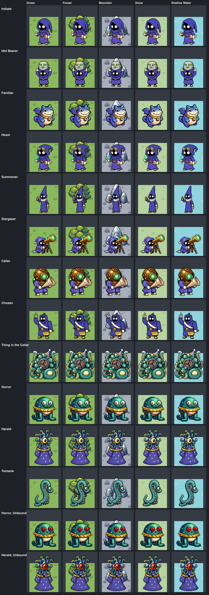

# Faction fragment: CULT

**Status:** the approved art direction of the Cultists (bead
`pulp_wars-mch9.13`, ART1 of epic `pulp_wars-mch9`, 2026-10-10). The user's
standing instruction is to consider art approved, so this document is the
direction the art beads generate from; every decision in it is recorded so
that it can be overruled. **The first sample exists** (bead
`pulp_wars-mch9.14`, ART2): the Initiate, the Horror and the Herald, accepted
in batch `direction-cult`. What it measured and what it changed is under
[The first sample](#the-first-sample). **The unit art is complete and wired**
(bead `pulp_wars-mch9.15`, ART3): the other eight trained units, the
Tentacle, the two Unbound looks, the four ships and the frog, under
[The batches](#the-batches). The cities, buildings, portraits, icons and
effects below are still targets.

The art pipeline reads the two `text` blocks under **Prompt fragment** and
**Negative fragment** below as layer 3 of every Cult prompt, so edit them
here and nowhere else (see the
[pipeline](../CHIBI_PIPELINE.md#fragment-changes-and-historical-records)).

The rules, the roster and the looks come from
[the Cultists spec](../../product/RULESET_7_CULTISTS.md) (sections 4, 14.2 and
14.3) and, for the looks it keeps, from
[the proposal](../../product/RULESET_7_CULT_PROPOSAL.md#73-looks-for-the-art-brief)
(sections 5, 7.2 and 7.3). Where this document differs from a look written
there, it is listed under [Decisions](#decisions).

## Identity

A secret lodge from the cover of a 1920s pulp magazine: small round people in
robes too big for them, pointed hoods that flop over, candles, brass bells, a
telescope, pamphlets, and a cellar they should not have opened. What they
summon is rubbery, many-eyed and pleased to be here. Mock-sinister and silly,
never grim: a village amateur dramatic society that got the spell right by
accident. Nothing is gory, nothing comes from a published mythos or a real
religion (no named Old One or book, no altar, cross or pentagram), and
nothing is drawn to frighten.

The faction wears **fixed colours**; no sprite has an owner area or a mask.
The player is read from the territory border, which is the Cult's eldritch
green. Two families share the faction:

- **The lodge** (the nine trained units, the cities, the buildings, the
  ships): midnight indigo cloth, pale cream wax and paper, warm brass, and
  exactly one accent, the green flame.
- **The summoned** (the Horror, the Herald's crown, the Tentacle, the Thing
  in the Cellar): rubbery deep-sea teal with pale cream bellies and suckers
  and big pale yellow eyes. Their colours are in their subject lines, not in
  the fragment, so that no cultist turns teal.

**Theme music** belongs to the interface bead U3
([spec, section 19](../../product/RULESET_7_CULTISTS.md#19-implementation-beads)):
the 5/4 procession of
[the proposal, section 7.6](../../product/RULESET_7_CULT_PROPOSAL.md#76-theme-music),
added by the steps of
[Adding a future faction](../../audio/THEME_MUSIC.md#adding-a-future-faction)
when `CULT` becomes a faction of the game.

## Prompt fragment

It names only a mood, an era, materials, colours and small motifs: no figure
and no place or building (60 words, the limit). "Secret society" is used
instead of "lodge", which is a building word.

```text
Faction: a pulp-magazine secret society of the 1920s, mock-sinister, silly
and never scary. Their fixed colours: soft midnight indigo cloth shaded
deeper violet-blue, never black; pale cream candle wax and parchment; small
pieces of warm polished brass; and exactly one accent colour, a bright
glowing spring green, only as small flames and glows: candle flames, lamp
glass, an eye-in-a-spiral sign.
```

## Negative fragment

Gore and horror words keep the tone playful. Bone, skulls, black and grey
cloth and torn hems are the Undead's; purple and violet their accent;
magenta and pink the Martians' and the Candy's; chrome, steel and gold
armour the other factions' metals. Red cloth is the Humans', and red is kept
for the Unbound cue (see [Palette](#palette)). Orange, yellow and blue
flames because the faction has one accent. The two symbols keep it a lodge
and not a religion. It has no figure and no building word, because the
negative also reaches the other classes.

```text
blood, gore, guts, dripping, horror, creepy realism, slime, skull, bone,
black cloth, grey cloth, torn cloth, ragged hems, purple, violet, magenta,
pink, red cloth, red robe, orange flames, yellow flames, blue flames, gold
armour, chrome, steel armour, sword, gun, pentagram, cross, large glowing
area
```

## Faction colour, seat and hue token

**The ninth faction colour is eldritch green `#00ff78`**, the green of the
lodge's candle flames
([spec, section 14.2](../../product/RULESET_7_CULTISTS.md#142-colour-looks-sound-music)).
This bead re-measured it with the formulas and thresholds of
`tests/unit/faction-colours-render-v7.test.ts` against the eight colours of
[FACTION_COLOURS.md](../FACTION_COLOURS.md) (the Candy pink included) and it
passes all four: every pair at least 45 apart, at least 20 under each colour
vision deficiency, more than 25 from every ground, L\* above 42.

| Against         |    CIE76 | Deuteranopia | Protanopia | Note                                                  |
| --------------- | -------: | -----------: | ---------: | ----------------------------------------------------- |
| Human crimson   |    151.9 |         36.2 |       73.2 |                                                       |
| Undead violet   |    205.3 |        123.5 |      149.4 | the furthest: the two "dark magic" factions           |
| Goblin yellow   |     85.2 |         37.6 |   **23.2** | the weakest simulated pair (threshold 20)             |
| Dinosaur orange |    129.8 |         32.4 |       34.3 |                                                       |
| Martian magenta |    172.5 |         65.4 |      109.2 |                                                       |
| Ice Folk blue   |    116.8 |         96.1 |      103.1 |                                                       |
| Dwarf jade      | **50.2** |         38.4 |       45.7 | the nearest neighbour; told by lightness (L\* 67, 88) |
| Candy pink      |    122.0 |         47.3 |       74.2 |                                                       |
| Grass           |     51.3 |         17.8 |       26.0 | the nearest ground; the border's dark casing carries  |
| Snow            |     65.9 |         23.5 |       38.2 |                                                       |
| Shallow Water   |     85.4 |         58.2 |       71.0 |                                                       |
| Deep Water      |    116.5 |         85.9 |       99.0 |                                                       |
| Mountain ground |     98.3 |         54.4 |       72.5 |                                                       |

L\* is 88.4, the lightest of the nine with the Goblin yellow (86): a bright
line in the border's dark casing on every ground. Its shades by the code's
own rule (`factionColourShadesV7`) are glow `#80ffbc` and dark `#007336`.

**What goes into the code, and where** (proposed here, implemented by the
beads that own the files; nothing is changed by this bead):

| Item                      | Proposal                                                                                                                             | Owner bead               |
| ------------------------- | ------------------------------------------------------------------------------------------------------------------------------------ | ------------------------ |
| `FACTION_COLOURS_V7.CULT` | `"#00ff78"`. The record is typed by `FactionIdV7`, so the bead that adds the faction ID must add it                                  | E1                       |
| Colour test and document  | the rows above into `faction-colours-render-v7.test.ts` (nine factions) and FACTION_COLOURS.md                                       | E1                       |
| Engine seat colour        | none new: `PLAYER_COLORS_V7` already has nine entries (CORAL to AMBER) and the client never shows a seat                             | no change                |
| Newsstand hue token       | `--pw-emerald: #0a6638` (ink) and `--pw-emerald-fill: #b9f7d0`, a ninth hue pair in `src/styles/v7.css`                              | U1 (the first Cult chip) |
| Code palette              | `CULT_PALETTE_V7`: flame `#00ff78`, glow `#80ffbc`, dark `#007336`, indigo `#372f8f`, wax `#f3e7c4`, brass `#c9a24a`, teal `#1f8f95` | U1 to U3                 |

- **The hue token.** A faction colour is never text
  ([interface style](../../ui/STYLE.md#colour-of-a-faction)), so Favour, a
  strand count, Candlelit, Unbound and every other Cult chip use the hue's
  ink on its fill. `#0a6638` on `#b9f7d0` has a contrast of 5.8, and 6.2, 5.2,
  6.8 and 5.6 on `--pw-surface`, `--pw-surface-2`, `--pw-surface-raised` and
  `--pw-dock` (the style test asks for 4.5). It needs its own name because
  `--pw-green` is the Plague chip and the recovery chip, and `--pw-teal` is
  an owned technology and a gain: a Cult chip must not read as either.
- **Weak spot of the token:** three dark green inks are close (emerald is 17
  from `--pw-green` and 20 from `--pw-teal`); the chips are told apart by
  their fills (emerald's mint is 16 from both) and their icons. If that is
  not enough in U1's capture, the fallback is the robe's hue, a token
  `--pw-indigo` of `#2e3382` on `#dcdff7` (contrast 8.3), which is clear of
  the greens but 16 from `--pw-blue`.
- **The capture.** The spec asked for the colour to be looked at in a capture
  beside the Dwarf jade and the board's help mark. A capture of the real
  board needs `CULT` in `FACTION_COLOURS_V7`, which this docs bead does not
  add; the measurement above stands in for it, and bead E1 runs
  `npm run art:faction-colours-review` with the ninth colour and looks at
  two things: the Cult border beside a Dwarf border on Grass, and the two
  cautions below.
- **Caution 1, the help mark.** The help mark is `#b6f36a`
  ([board targeting](../../ui/BOARD_TARGETING.md)): 38.5 from the Cult green
  but only 11.3 and 5.5 under the two deficiencies. They differ by shape and
  place (a ring with a plus badge inside a tile; a line in a dark casing on
  a tile's edge), and the Cult's own Sacrifice marks its victims with it
  inside its own border. If the capture shows them merging, change the mark's
  ring for Cult viewers, not the faction colour.
- **Caution 2, the Dwarf lamp.** The gauge lamp on Dwarf sprites is a
  yellow-green near `#2bd94a`, 16 from the flame. Both are a few pixels on
  bodies that could not be more different (soot iron and copper against
  indigo cloth), and the two border colours are 50 apart.

## Palette

Targets, to be replaced by the measured table (`palette.json` of the review)
when ART2's sample is accepted. Distances are CIE76 from this bead's scratch
measurement.

| Role                | Target colours                                 | Used for                                                                                      |
| ------------------- | ---------------------------------------------- | --------------------------------------------------------------------------------------------- |
| Indigo cloth, lit   | `#4a43b5` (hue 244°, L\* 36)                   | hoods, robes, the Herald's robe, roof shingles, sails and tarps                               |
| Indigo cloth, shade | `#372f8f`; deepest `#231d5e`                   | the shaded side and folds; the inside of a hood                                               |
| Wax and parchment   | `#f3e7c4`; shade `#d8c79a`                     | candles, pamphlets, the book, the star chart, eyes in a hood, slippers, sashes, clapboard     |
| Brass               | `#c9a24a`; lit `#ecd27c`; shade `#8a6a2a`      | bells, chains, the telescope, the diving helmet, the cleaver, collars, domes, small trim      |
| **Eldritch green**  | lit `#00ff78`; glow `#80ffbc`; shade `#00b85a` | candle flames, lamp glass, the idol's eyes, the Hexer's squiggle, round windows; always small |
| Deep-sea teal       | `#1f8f95`; lit `#2aa6a6`; shade `#145f6b`      | the summoned: bodies and tentacles                                                            |
| Belly and suckers   | `#f3e7c4` (the wax cream)                      | the summoned: bellies, suckers, teeth                                                         |
| Summoned eyes       | pale yellow `#ffe27a`, a black pupil           | the summoned: every eye; **red `#e0281e` only on an Unbound daemon**                          |
| Idol stone          | pale grey `#b9b8b0`; shade `#8a8a86`           | the Idol Bearer's idol, city walls' stone footing, Monuments                                  |
| Outline             | black                                          | the thick outline of the chibi look                                                           |

Rules:

- **Indigo, never black, never navy.** The robe is a violet-leaning blue at
  hue 240° to 250° with a clearly lit side. That keeps it 69 from the Undead
  near-black cloth (`#313135`), 46 from the Undead lit violet (hue 274°), 38
  to 47 from the Dinosaur deep blue hide (hue 212°), 54 from the Ice Witch's
  navy robe and 62 from the Ice Folk blue. The deepest shade `#231d5e` is
  only 16 from the Dinosaur navy, so it is a fold tone, never a body colour:
  a robe that comes out navy or near-black is rejected (the Wight's first
  sample failed the same way: 72% dark).
- **One accent, derived.** PixelLab will draw "spring green" anywhere from
  lime to emerald. ART2 adds a `cult-green` accent preset to the
  [pipeline](../CHIBI_PIPELINE.md), in the shape of `undead-violet` and
  `martian-magenta`: it finds the green glow pixels by colour and pins them
  to hue 148°. Green is at most about 8% of a lodge sprite; a large glowing
  area is rejected.
- **Wax cream carries each silhouette.** No cultist is a featureless dark
  cone: every one has two round cream eyes in the hood's opening and at
  least one big pale or brass prop (a candle, pamphlets, a book, an idol, a
  telescope, a conch, a sash).
- **Teal belongs to the summoned.** No cultist, building or ship has a teal
  area, except a tentacle that is itself a summoned thing (the Market's
  joke, the Anchor grip). Teal on Grass is 56, on Deep Water 31 and on
  Shallow Water 28: the Tentacle on water leans on its outline, its cream
  suckers and its yellow eye.
- **Red means broken.** No bound or trained Cult piece has a red pixel. Red
  eyes are the sprite cue of an Unbound daemon, as the red flash of a
  snapped strand and the red tether of Pick Me! are in the interface
  ([spec, section 14.3](../../product/RULESET_7_CULTISTS.md#143-how-it-reads-on-the-board-without-text)).
- **Wood is allowed** (a converted faction has no owner key to protect): the
  Thing's trapdoor, the telescope's tripod and timber in buildings are a
  weathered grey-brown, small and dull.

## Silhouette language

This guides the subject lines; it is not sent to PixelLab.

- **The pointed hood is the faction.** Every robed cultist ends in a point,
  and the point says the job: it flops (Initiate), stands very tall
  (Summoner), curls (Hexer), is squashed flat by a load (Idol Bearer), is
  thrown back from big shoulders (Chosen), or is replaced by a nightcap
  (Stargazer) or a diving helmet (Caller).
- **No face, two eyes.** The hood's opening is dark with two big round cream
  eyes. No beard, no skull, no skin: against the Necromancer's white beard
  and gaunt face, the Lich's skull and the Ice Witch's pale face.
- **Bell-shaped and neat.** A robe is a smooth bell with a round clean hem
  that reaches the ground and hides the legs; cream slippers peek out. The
  Undead hems are torn zigzags, the Undead robes hang open over ribs.
- **Small and round.** A cultist is a head-and-hood on a tiny body, a little
  shorter than a Human Fighter; the props are oversized.
- **Everything summoned is soft.** Rounded, rubbery, no bones, no armour, no
  claws: fat tentacles, googly eyes of two sizes, wide grins.
- **Nobody carries a staff.** The staff is the Necromancer's, the Ice
  Witch's and the Shaman's. The Cult's caster props are a candle, a book, a
  bell and chain, a telescope and a conch.

**Against the robed units of other factions** (the board-size tells; ART2
and ART3 put each pair in a lineup):

| Rival                    | It shows                                                                | The Cult unit nearest to it, and the tell                                                     |
| ------------------------ | ----------------------------------------------------------------------- | --------------------------------------------------------------------------------------------- |
| Undead Necromancer       | black hood and robe, ragged violet hem, skull staff with a flame, beard | Summoner: indigo, a hat twice as tall, no staff, a bell and a looped brass chain, a neat hem  |
| Undead Lich              | crowned skull, open black robe over ribs, a big violet orb held up      | Stargazer: bent over a brass telescope on a tripod, a nightcap; nothing held overhead         |
| Undead Banshee           | a floating bone-white shroud, no feet                                   | none is pale or floats; every cultist stands on slippers                                      |
| Ice Folk Ice Witch       | navy robe with white fur, tall ice crown, crystal staff, a pale face    | Hexer: no face, brass spectacles on the hood, a cream book held upside down, a green squiggle |
| Dinosaur Shaman          | tawny spotted fur robe, a skull, feathers                               | none is warm-coloured                                                                         |
| Martian Colossus, Tripod | chrome domes on legs, magenta lights                                    | Herald: cloth, one eye, a tentacle crown; no metal                                            |
| Giant Spider, Bigfoot    | a wide brown spider; a shaggy umber ape                                 | Unbound Horror and Herald: teal and indigo, red eyes; the Tentacle: one limb, no body         |

## Roster

Canvases, classes and placement are the role's, as for every faction
([chibi direction, section 3](../CHIBI_ART_DIRECTION.md#3-geometry-and-resolution);
`CHIBI_CLASS_GEOMETRY_V7`): every unit is **bottom-centred** on its cell (the
canvas bottom on the cell's bottom edge), `STANDARD_UNIT` 56 x 80 with no
overflow, `LARGE_UNIT` 72 x 88 with at most 4 px to a side and 8 px upward,
`GIANT_UNIT` 88 x 104 with at most 4 px to a side and 24 px upward. All are
fixed colours with no mask (`fixedFactionColours`, `ownerColour: false`),
accent `cult-lodge` (the summoned without cloth: `cult-green`; see
[The first sample](#what-the-sample-changed)), light from the south-west
([art direction](../ART_DIRECTION.md#light)), never mirrored. Batch
`direction-cult`; subject lines in `scripts/art/chibi/subjects/CULT.json`
(written by ART2 from this section).

### Trained units

| Unit (role)                        | Subject, asset                                         | Canvas, class            | Silhouette and what it shows                                                                                                                                                                                                                     |
| ---------------------------------- | ------------------------------------------------------ | ------------------------ | ------------------------------------------------------------------------------------------------------------------------------------------------------------------------------------------------------------------------------------------------ |
| Initiate (`FIGHTER`)               | `UNIT:CULT:FIGHTER`, `chibi-direction-cult-initiate`   | 56 x 80, `STANDARD_UNIT` | the plain one and the smallest robe: a hood whose tip flops to one side, sleeves too long, a fat cream candle with a green flame held up in one hand, a sheaf of cream pamphlets under the other arm, cream slippers                             |
| Idol Bearer (`GUARD`)              | `UNIT:CULT:GUARD`, `chibi-direction-cult-idol-bearer`  | 56 x 80, `STANDARD_UNIT` | "two heads stacked": one stout wide cultist, the hood squashed flat, holding a squat grinning pale stone idol with green eyes over its head with both arms; the idol is as big as the head under it; the widest and squarest standard piece      |
| Familiar (`RAIDER`)                | `UNIT:CULT:RAIDER`, `chibi-direction-cult-familiar`    | 72 x 88, `LARGE_UNIT`    | the one piece with no robe: a fat toad-cat in mid-hop, low and wide (about 60 x 50 px), indigo-blue hide with a cream belly, stubby bat wings, one big cream eye and one small, a brass collar with a bell                                       |
| Hexer (`MARKSMAN`)                 | `UNIT:CULT:MARKSMAN`, `chibi-direction-cult-hexer`     | 56 x 80, `STANDARD_UNIT` | a hood whose tip curls like a question mark, big round brass spectacles on the hood, an open cream book held upside down in one hand, the other hand thrown forward with a green squiggle leaving it                                             |
| Summoner (`CAPTAIN`)               | `UNIT:CULT:CAPTAIN`, `chibi-direction-cult-summoner`   | 56 x 80, `STANDARD_UNIT` | the tallest and thinnest: a straight pointed hat-hood that reaches the top of the canvas, a cream stole with the eye-in-a-spiral sign, a small brass bell raised in one hand and a looped brass chain hanging from the other                     |
| Stargazer (`CATAPULT`)             | `UNIT:CULT:CATAPULT`, `chibi-direction-cult-stargazer` | 72 x 88, `LARGE_UNIT`    | brass first, robe second: a cultist bent to the eyepiece of a big brass telescope on a wooden tripod, the tube pointing up and to the right, an indigo nightcap with cream stars and a pompom, a cream star chart trailing on the ground         |
| Caller (`KNIGHT`)                  | `UNIT:CULT:KNIGHT`, `chibi-direction-cult-caller`      | 72 x 88, `LARGE_UNIT`    | a round brass diving helmet with one green-lit porthole in place of the hood, a robe wet and darker at the hem, both hands holding a huge cream conch shell horn up to the helmet; the horn is as big as the body                                |
| Chosen (`SWORDSMAN`)               | `UNIT:CULT:SWORDSMAN`, `chibi-direction-cult-chosen`   | 56 x 80, `STANDARD_UNIT` | burly and square: big shoulders, a short hood, a broad cream sash across the chest with a brass medal, a huge brass ceremonial cleaver in one hand, the other arm raised straight up with one finger pointing at the sky (the Pick Me! pose)     |
| Thing in the Cellar (`JUGGERNAUT`) | `UNIT:CULT:JUGGERNAUT`, `chibi-direction-cult-thing`   | 88 x 104, `GIANT_UNIT`   | a wide heap of fat teal tentacles with cream suckers and many friendly yellow eyes of different sizes, a broken wooden trapdoor round its middle like a collar, a tiny cream-and-indigo striped party hat on top; a mound, wider than it is tall |

### Summoned units

Never trained, so they have no training card; each still needs a portrait
for the selection dock. Their subject keys are the engine's summoned role IDs
(`SUMMONED_ROLE_IDS_V7`: `HORROR`, `HERALD`, `TENTACLE`), wired by bead
`pulp_wars-mch9.15`.

| Unit     | Subject, asset                                        | Canvas, class            | Silhouette and what it shows                                                                                                                                                                                                                                                                                                                                    |
| -------- | ----------------------------------------------------- | ------------------------ | --------------------------------------------------------------------------------------------------------------------------------------------------------------------------------------------------------------------------------------------------------------------------------------------------------------------------------------------------------------- |
| Horror   | `UNIT:CULT:HORROR`, `chibi-direction-cult-horror`     | 72 x 88, `LARGE_UNIT`    | a ball on legs: a round rubbery teal body on four thick tentacles, a very wide toothy cream grin, two googly yellow eyes of different sizes, a brass spiked collar with a short trailing chain; no arms, no clothes; about the size of a Knight-role unit                                                                                                       |
| Herald   | `UNIT:CULT:HERALD`, `chibi-direction-cult-herald`     | 88 x 104, `GIANT_UNIT`   | **as tall as the canvas allows**: a target of 100 px or more of the 104 (the tallest giant today, the Gingerbread Giant, is 80 x 102 px), and narrow, a tall tapering bell with its eye at the very top; a robe of indigo night sky with a few cream stars, no face but one huge yellow eye, a crown of teal tentacles, a brass collar ring, long empty sleeves |
| Tentacle | `UNIT:CULT:TENTACLE`, `chibi-direction-cult-tentacle` | 56 x 80, `STANDARD_UNIT` | one thick teal tentacle rising straight from the canvas bottom, curled over at the top to slap, cream suckers down its inner side, one yellow eye at the tip; nothing under it: the hole on land and the ripple on water are drawn in code, so one sprite serves both                                                                                           |

**Unbound looks** (`UNIT:CULT:HORROR_UNBOUND`, `UNIT:CULT:HERALD_UNBOUND`,
same canvases and footprints): `edit-image-pixen` edits of the accepted
bound sprites that change two things only: the eyes become red, and the
Horror's chain is gone and its collar cracked (the Herald's collar ring is
cracked). The interface adds the rest (no strands, the eye mark on its
target, steam while Furious).

### How each is told apart at board size

- **Inside the faction, by outline alone:** Initiate (small, floppy tip,
  candle up), Hexer (curl, book overhead-height, arm forward), Summoner
  (a spike to the canvas top), Chosen (a block with one arm up and a
  cleaver), Idol Bearer (a second head on top), Stargazer (a diagonal brass
  tube), Caller (a round helmet and a horn), Familiar (a low blob with
  wings), Thing (a mound). No two differ only by a thin prop.
- **Cultist against summoned, by colour:** indigo against teal. The Herald is
  the one summoned thing in a robe, and it is twice a cultist's height.
- **Horror against Thing:** a ball on four legs with one grin, against a
  legless mound of many eyes with a trapdoor.
- **Tentacle against the Thing and the Herald's crown:** a single upright
  limb with nothing else.

### Portraits

48 x 48, `PORTRAIT` class, fixed colours, no mask
(`chibi-direction-portrait-cult-<unit>`, subjects `PORTRAIT:CULT:<ROLE>`).
Busts for the seven robed cultists (the hood, the eyes, and the prop beside
the head: candle, idol, spectacles and book, bell, nightcap and eyepiece,
helmet and conch, sash and raised hand). Whole-figure portraits (`icon`
class, as the Catapult has) for the Familiar, the Thing, the Horror, the
Herald (the eye and the crown fill the frame) and the Tentacle. Twelve in
all, plus the three ship portraits below. The Initiate's portrait is the
faction emblem of the setup form and the Gallery until the emblem icon is
drawn.

### Subject lines for the first sample

The three pieces of ART2, written in full as the model for the rest. Each
unit line carries the whole body, because the fragment names none.

```text
Subject: Initiate, a chunky cute small secret-society novice with a huge
round head about half of the figure's height and a tiny round body lost in
a robe too big for it: a tall pointed midnight indigo hood whose tip flops
over to one side, the face hidden in the hood's dark opening except two big
round cream-white eyes, a long bell-shaped midnight indigo robe with a neat
round hem down to the ground and sleeves too long for the arms, a fat pale
cream wax candle with a small bright green flame held up in one hand, a
sheaf of pale cream paper pamphlets tucked under the other arm, a small
brass badge on the chest, pale cream slippers peeking out under the hem; no
weapon, no staff, no beard, no skull; simple shapes and very few details.

Subject: Horror, a chunky cute round rubbery monster, clearly bigger than a
soldier, a ball on legs: one big round smooth deep-sea teal body with a pale
cream belly, standing on four short thick teal tentacles with pale cream
suckers, a very wide happy grin full of small blunt cream teeth, two big
round googly pale yellow eyes of different sizes with black pupils, a brass
spiked collar round its middle with a short brass chain trailing behind; no
arms, no clothes, no hood, no cloth, no horns, no claws; the tentacle feet
are the lowest thing in the image; clearly a silly friendly monster, not
scary; simple shapes and very few details.

Subject: Herald, a chunky cute towering herald, a giant much taller than a
normal soldier and narrow, filling the whole height of the image: a tall
tapering bell-shaped robe of midnight indigo cloth sprinkled with a few
small pale cream stars, reaching the ground with a neat round hem, long
empty hanging sleeves, a brass collar ring, and in place of a head one huge
round pale yellow eye with a black pupil under a crown of five short thick
curling deep-sea teal tentacles with pale cream suckers; no face, no mouth,
no hands, no feet, no weapon; the robe's hem is the lowest thing in the
image; pompous and silly, not scary; simple shapes and very few details.
```

Notes for the recipes: the Horror and the Tentacle use the ordinary `unit`
class with `negativeAddendum` words for cloth (`robe, hood, cloak, cloth`),
because layer 3 names indigo cloth in every prompt; the Thing and the
Stargazer's telescope may need the `machine` class text (no "big head, both
feet visible"); settlement and building recipes add the faction's figure
words (`person, character, hooded figure, monk, wizard, monster, tentacle`).

## Cities

A lodge that grows into a little town of crooked pointed roofs. In the
direction's calm building style (`calm-settlement`, subject keys
`CITY:CULT:<level>/CALM`), on the canvases of the other direction cities,
`SETTLEMENT` class, bottom-centred, side overflow at most 8 px, generated at
96 x 96 with one ground-removal edit, as every faction city was. Pennants
are retired, so there is no pole and no anchor. The neutral village is the
shared one.

**Building language** (cities and buildings alike): pale cream-grey
weatherboard walls on a low footing of pale grey stone; **steep indigo
shingle roofs that end in a bent point, like a hood**; a small brass dome
with a telescope poking out; **round windows glowing green**; a green lamp
over a door; the eye-in-a-spiral sign once per piece, on a hanging board. No
skulls, no gravestones, no dead trees (the Undead necropolis: dark slate
walls, near-black roofs, bone trim, violet windows); no terracotta and no
oak frame (the Humans); no copper (the Dwarves). The walls are pale on
purpose, so a Cult town is a light shape under dark blue roofs and not a
dark blob.

| Level | Asset                         | Canvas  | What it shows                                                                                                                                                                                |
| ----- | ----------------------------- | ------- | -------------------------------------------------------------------------------------------------------------------------------------------------------------------------------------------- |
| 1     | `chibi-direction-cult-city-1` | 80 x 80 | the lodge hall, one fat cream-walled house under a bent pointed indigo roof with a small brass dome and telescope on its ridge, a green lamp over the door, two tall narrow houses beside it |
| 2     | `chibi-direction-cult-city-2` | 88 x 88 | a bigger hall with a crooked observatory tower under a brass dome, four tall narrow houses with bent pointed roofs pressed round it, a low stone wall with the eye sign over its gate        |
| 3     | `chibi-direction-cult-city-3` | 96 x 88 | a great domed hall with a big brass dome and telescope, three crooked towers with bent roofs, a ring wall, and at the front a pair of open cellar doors with green light coming out          |

```text
Subject: a small level-1 town: one fat little meeting hall with pale
cream-grey weatherboard walls on a low pale grey stone footing, a steep
midnight indigo shingle roof ending in a bent crooked point, a small brass
dome with a little brass telescope poking out of the roof ridge, one round
window glowing green and a small green lamp over the door, and two tall
narrow houses with the same cream walls and bent pointed indigo roofs
pressed against its sides; wide and chunky, filling the whole width of the
image. Buildings only.
```

## Ground and forest

In the live look a faction's territory has its own Grass
([faction grass](../FACTION_GRASS.md)) and its own Forest
([faction forests](../FACTION_FORESTS.md)). The Cult's:

- **Ground: heather moor.** A dusty lilac-grey turf, base `#9d94ab`, with
  sage-green tufts, clumps of paler heather, and on some tiles a faint
  chalk arc or a ring of small cream toadstools. It is made as the other
  grounds are (the tile derivation of `deriveFactionGrassTile`, three
  variants `chibi-cult-grass-1..3`, 80 x 80, opaque, seamless). Measured:
  108 from the Cult border, 63 from the lit robe, 36 from the summoned teal,
  42 from the wax cream; 28 from the Undead ashen ground, 31 from the Dwarf
  moor, 36 from the Martian dust, 66 from the default Grass.
- **Forest: a lantern wood.** Crooked dark-barked trees with drooping
  blue-green willow canopies, a few with a small hanging lantern with a
  green flame, fat cream-spotted toadstools at the foot; no bare dead trees
  (the Undead wood) and no pines (the Dwarves). A whole piece set of the
  [composed forests](../COMPOSED_FORESTS.md), three or four clumps, made as
  the other faction forests are.

**Weak spot:** the heather is 11 from the rocky Mountain ground, so the
edge between Cult moor and a Mountain cell is soft; the massif art on the
Mountain carries it. **No bead of the spec's list covers the ground and the
forest** (ART2 to ART4 name neither): until one does, Cult territory draws
the default Grass and Forest. See [Follow-ups](#follow-ups).

## Buildings

Each is drawn in the look of the faction that owns the territory
([faction buildings](../FACTION_BUILDINGS.md), rule 1), keeps its shared
name, canvas, anchor and placement, has no owner colour and no mask, and
falls back to the shared building in the Classic look and the LEGACY art
set. All are `calm-feature` (`generate-image-v2`, 16 candidates a call, the
light stated), `BUILDING` class, bottom-centred, **on the 72 x 72 canvas and
the anchor of the shared piece, seated 3 px above the bottom edge**, with a
sprite of about 58 to 64 px, as the other factions' are. Asset
`chibi-cult-<building>`, subject `IMPROVEMENT:CULT:<ID>`.

| Building    | Canvas  | What it shows                                                                                                                                                                                             | Its tell among the Cult's own        |
| ----------- | ------- | --------------------------------------------------------------------------------------------------------------------------------------------------------------------------------------------------------- | ------------------------------------ |
| Lumber Camp | 72 x 72 | the lantern wood being cut: two drooping willows, one with a green lantern, a stack of cut logs, an axe in a stump, a small indigo canvas lean-to                                                         | standing trees, no house             |
| Sawmill     | 72 x 72 | a cream weatherboard shed under a bent indigo roof, a round steel saw blade on a bench at its front, a log, and a half-carved grinning wooden idol leaning on the wall                                    | the round blade                      |
| Forge       | 72 x 72 | a bell foundry: a squat cream-walled smithy on a stone footing, a crooked chimney with a puff of pale green smoke, a warm fire glow, an anvil, a big brass bell on a frame                                | the bell and the chimney             |
| Workshop    | 72 x 72 | a print shop: a narrow house with one big brass cogwheel on its gable, a hand press with a wheel at the door, stacks of cream pamphlets, a line of sheets hung up to dry                                  | the cogwheel and the paper           |
| Port        | 72 x 72 | a pier of pale planks on dark posts, a small cream harbour hut with a bent indigo roof and a round green window, brass bollards, a tall post with a green lantern                                         | the pier and the lantern post        |
| Shipyard    | 72 x 72 | a half-built gondola hull with a tall curled prow on trestles, a crooked timber crane with a brass chain, a boathouse with a bent indigo roof                                                             | the hull                             |
| Market      | 72 x 72 | "a perfectly ordinary antique shop": two stalls under indigo-and-cream striped awnings, brass candlesticks, a globe, old books and jars lit green, one teal tentacle tip curling out from under an awning | the striped awnings and the tentacle |

**Kept shared, on purpose:** the Farm, the Windmill and the Mine. Most
factions keep most of the shared set (rule 2 of the faction buildings), and
none of the three contradicts a small-town lodge. The proposal's mushroom
Farm is the Dwarves' Mushroom Farm already, and its "prayer-wheel" Windmill
would read as a religion, which the faction avoids.

### Monuments and the obelisk

The seven achievement Monuments and the faction obelisk in Cult materials:
pale grey stone, brass, cream wax candles and small green flames, an indigo
drape where cloth is needed, never red. Batch `monuments-cult`, class
`calm-feature`, **the shared Monument's 48 x 72 canvas, anchor and seat**,
no owner colour. Assets `chibi-cult-monument-<achievement>` and
`chibi-cult-monument`. Each keeps the shared Monument's idea, so the
achievement still reads:

| Monument   | What it shows                                                                                |
| ---------- | -------------------------------------------------------------------------------------------- |
| Explorer   | a stone obelisk with a brass compass rose and a small brass telescope at its foot            |
| Engineer   | a square pillar carrying a brass cogwheel, a candle on top                                   |
| Muster     | a pillar hung with four different shields under a brass bell (the bell in place of the horn) |
| Conqueror  | a small stone arch with a brass wreath and the eye-in-a-spiral sign on its keystone          |
| Land Baron | a stout boundary stone with a carved shield, a brass crown on top and a crooked signpost     |
| Sea Dog    | a fluted column with a brass anchor, a coil of rope and a green ship's lantern               |
| Slayer     | a brass cleaver set in a block of stone inside a wreath, a candle beside it                  |
| Obelisk    | a pale stone obelisk with a green glowing eye near its tip and three candles at its foot     |

## Ships

Made as the faction sets of [NAVAL_FACTIONS.md](../NAVAL_FACTIONS.md) and
the [naval contract](../classes/naval.md): `edit-image-pixen` edits of the
accepted shared ships and ship portraits, so each keeps the shared piece's
canvas, class, anchor and waterline (a hull's lowest row within 4 rows of
the shared hull's); fixed colours, no mask. Batch `naval-cult`, assets
`chibi-naval-cult-<piece>`, subjects `UNIT:CULT:<ROLE>` and
`PORTRAIT:CULT:<ROLE>`.

| Piece                | Canvas, class         | What it shows                                                                                                                                                          |
| -------------------- | --------------------- | ---------------------------------------------------------------------------------------------------------------------------------------------------------------------- |
| Patrol Boat          | 72 x 88, `LARGE_UNIT` | a long midnight indigo lacquered gondola with a tall brass prow curled like a tentacle tip, a small indigo-and-cream striped sail, a green lantern at the stern        |
| Battleship           | 88 x 96, `GIANT_UNIT` | a tall indigo galleon: cream sails with the eye-in-a-spiral sign in indigo, a brass dome with a telescope on the stern castle, green lanterns                          |
| Embarked transport   | 72 x 72, `LARGE_UNIT` | a low indigo rowing barge, the cargo under an indigo tarp with a cream border, one candle lantern with a green flame on a pole                                         |
| Submarine            | 72 x 88, `LARGE_UNIT` | a fat brass bathysphere-barrel with rivets, one big round porthole glowing green, a short periscope with an eye painted on it, an indigo tail fin; no mast and no sail |
| Submarine, submerged | 72 x 88, derived      | derived by `scripts/art/naval-branch/submerged.ts` from the accepted Submarine: no PixelLab call                                                                       |
| Portraits            | 48 x 48, `PORTRAIT`   | the Patrol Boat, the Battleship and the Submarine, whole                                                                                                               |

**Tell beside the other fleets:** an indigo hull with cream-and-indigo
stripes and a green light. The Undead fleet is the near neighbour (a
near-black hull, a bone rail, a skull, violet lights): the Cult hull must be
visibly blue, and nothing on it is bone-white or ragged.

## Icons

48 x 48, `ICON` class (the recipe calls each an item sprite; one object on
transparency, no badge or frame), in the faction's colours. The Favour
candle of the HUD is also made at 32 x 32, as the coin and population icons
are. Subject keys follow the existing patterns and are settled by the bead
that wires each.

**Technology** (as for the other factions, only the technologies whose name
and rule differ and that do not show a unit get an icon of their own; the
five that unlock a unit show its portrait):

| Subject                        | Shows                                                                             |
| ------------------------------ | --------------------------------------------------------------------------------- |
| `ICON:TECH:CULT:FORTIFICATION` | Warding Circles: a chalk ring on the ground with a squat stone idol in its middle |
| `ICON:TECH:CULT:EXPLOSIVES`    | The Stars Are Right: a brass star chart disc with three cream stars in a line     |
| `ICON:TECH:CULT:FARMING`       | Harvest Rites: a wheat sheaf tied with an indigo ribbon beside a lit candle       |

Stargazers, Hexers, Familiars, Callers and the Chosen show the unit's
portrait; Leadership (Administration) shows the Summoner's.

**Commands and abilities:**

| Subject                       | Shows                                                                     |
| ----------------------------- | ------------------------------------------------------------------------- |
| `ICON:ACTION:SACRIFICE`       | a pointed indigo hood left spinning in a puff of green smoke              |
| `ICON:ACTION:SEIZE`           | a teal tentacle out of a crack in the ground, curled round a boot         |
| `ICON:ACTION:OFFERING`        | a brass dish holding two small cream candles, one lit green               |
| `ICON:ACTION:SUMMON`          | a chalk circle with a green flame in it and two teal tentacle tips rising |
| `ICON:ACTION:CHANNEL`         | a cream sleeve and hand holding one glowing green chain link              |
| `ICON:ACTION:BEHOLD`          | the squat grinning stone idol with green eyes and short rays              |
| `ICON:ACTION:PICK_ME`         | a raised cream hand with one finger up and a starburst behind it          |
| `ICON:ACTION:ANCHOR`          | a teal tentacle coiled three times round a lit candle                     |
| `ICON:ACTION:BOO`             | a wide toothy grin under two googly yellow eyes, with startle lines       |
| `ICON:ACTION:PROCLAIM`        | an unrolled cream scroll with the eye-in-a-spiral seal and a brass bell   |
| `ICON:ACTION:RIBBIT`          | a fat teal frog with a green sparkle                                      |
| `ICON:ACTION:SWITCHEROO`      | two curved arrows chasing each other round a small puff                   |
| `ICON:ACTION:TENTACLE`        | one teal tentacle curled up out of a crack                                |
| `ICON:ACTION:STARFALL`        | a cream five-pointed star falling with a green tail                       |
| `ICON:ACTION:GREAT_SUMMONING` | four lit candles round one huge yellow eye                                |
| `ICON:ACTION:PAMPHLETS`       | a fanned sheaf of cream pamphlets with the eye sign                       |
| `ICON:ACTION:MARTYR`          | a cream sash with a brass medal and a small green flame over it           |
| `ICON:ACTION:GRAB`            | a teal tentacle tip wrapped round an ankle                                |

Ravage and Unstoppable are text lines on the Herald's card with no icon
(the Skeleton's Bones precedent).

**Statuses and the HUD** (each `ICON:STATUS:*` is the dock chip at 48 x 48
and the board marker, drawn small on a dark token in the unit's marker
slot, as the Candy status icons are):

| Subject                 | Shows                                                                        |
| ----------------------- | ---------------------------------------------------------------------------- |
| `ICON:HUD:CULT:FAVOUR`  | Favour: one fat cream candle with a green flame (48 x 48 and 32 x 32)        |
| `ICON:HUD:CULT:EMBLEM`  | the faction emblem: an eye in a spiral, green on indigo                      |
| `ICON:STATUS:CANDLELIT` | a lit candle with a small halo: over every channeller and ritual participant |
| `ICON:STATUS:FROG`      | the teal frog's head                                                         |
| `ICON:STATUS:UNBOUND`   | a cracked brass collar with a snapped chain                                  |
| `ICON:STATUS:FURIOUS`   | two red eyes under two puffs of steam                                        |
| `ICON:STATUS:GRABBED`   | a tentacle loop                                                              |
| `ICON:STATUS:COWED`     | a round window with its shutters closed                                      |
| `ICON:STATUS:WARDED`    | Behold!: the idol's head inside a chalk ring                                 |
| `ICON:STATUS:PICK_ME`   | the raised hand                                                              |

## Markers and effects

**The frog overlay** (`FROG`, `chibi-direction-cult-frog`, **40 x 40**,
`RESOURCE` class, centred: the Grave's and the Crumbs' class and canvas): a
fat squat frog in the summoned palette, deep-sea teal with a cream belly and
two big yellow eyes, so that it reads as Cult magic on every ground and is
never a green frog lost on Grass. One frog for every victim; it sits on the
frogged unit's base and the pip for the turn left is code-drawn. Nothing
under it.

**Effects** (`EFFECT` class, at most 48 x 48, centred on a cell and moved,
scaled and faded by code; a palette swap on a new
`scripts/art/chibi/palettes/cult-green.png`, as the Undead and Candy effects
are swaps on theirs):

| Subject                 | Canvas  | Shows                                                        | For                                    |
| ----------------------- | ------- | ------------------------------------------------------------ | -------------------------------------- |
| `EFFECT:SACRIFICE_PUFF` | 48 x 48 | a puff of green smoke with a pointed hood spinning in it     | Sacrifice, a consumption               |
| `EFFECT:SEIZE`          | 48 x 48 | a teal tentacle out of a crack, tugging downward             | Seize                                  |
| `EFFECT:SUMMON_POP`     | 48 x 48 | a green ring bursting upward with small cream stars          | a Horror or the Herald arriving        |
| `EFFECT:STRAND_SNAP`    | 40 x 40 | two halves of a green chain link flying apart                | a broken strand (the flash is in code) |
| `EFFECT:UNBOUND`        | 48 x 48 | a brass collar bursting, chain links flying                  | a daemon becoming Unbound              |
| `EFFECT:STARFALL_STAR`  | 40 x 40 | a cream star with a green tail                               | the star in flight                     |
| `EFFECT:STARFALL_BURST` | 48 x 48 | a round burst of cream and green sparks, scaled to the 3 x 3 | the star landing                       |
| `EFFECT:BOO`            | 48 x 48 | a ring of startle lines round a toothy grin                  | Boo!                                   |
| `EFFECT:RIBBIT`         | 48 x 48 | a green puff with a small frog jumping out                   | Ribbit landing; a frog ending          |
| `EFFECT:SWITCHEROO`     | 40 x 40 | a small spiral puff, drawn on both tiles                     | Switcheroo                             |
| `EFFECT:TENTACLE_SLAP`  | 40 x 40 | a teal tentacle tip with a slap star                         | the Tentacle's slap                    |
| `EFFECT:PROCLAIM`       | 48 x 48 | three green sound rings from a huge open eye                 | Proclaim                               |
| `EFFECT:PAMPHLETS`      | 40 x 40 | three cream pamphlets fluttering down                        | Pamphlets (the instant capture)        |
| `EFFECT:FAVOUR`         | 40 x 40 | a candle flame lighting with a sparkle                       | Favour gained                          |
| `EFFECT:RITUAL_FIZZLE`  | 48 x 48 | three wisps of grey smoke from blown-out wicks               | a ritual fizzling                      |

**Code-drawn**, as the spec's
[board table](../../product/RULESET_7_CULTISTS.md#143-how-it-reads-on-the-board-without-text)
describes, in `CULT_PALETTE_V7`: the strands (thin green chains, glow
`#80ffbc` on dark `#007336`), the Control pips, the chalk rings of a ritual
and of Behold! (cream `#f3e7c4` at low alpha), the countdown ring, the
Star-fall and arrival marks, the Anchor tentacle (teal), the Pick Me!
tethers (red), the Switcheroo ghosts, the Tentacle's hole and ripple, the
steam of Furious, the shutters and banner of a Cowed city, and the eye mark,
which is the Giant Spider's existing one. Help and attack marks keep their
shared colours ([board targeting](../../ui/BOARD_TARGETING.md)).

## Asset list by bead

What each art bead of
[the spec's list](../../product/RULESET_7_CULTISTS.md#19-implementation-beads)
generates from this document. Counts are accepted rasters, not PixelLab
calls.

| Bead            | Assets                                                                                                                                                                                                                                            | Count |
| --------------- | ------------------------------------------------------------------------------------------------------------------------------------------------------------------------------------------------------------------------------------------------- | ----: |
| **ART2**        | the sample: Initiate, Horror, Herald; `subjects/CULT.json`; batch `direction-cult`; the `cult-green` accent preset; the review command `art:chibi-cult-direction-review`                                                                          |     3 |
| **ART3** (done) | the other eight trained units (Idol Bearer, Familiar, Hexer, Summoner, Stargazer, Caller, Chosen, Thing); the Tentacle; the two Unbound looks; the four ships and the derived submerged one; the frog                                             |    17 |
| **ART4**        | City 1 to 3; the seven buildings; the seven Monuments and the obelisk; twelve unit portraits and three ship portraits; three technology icons; eighteen ability icons; ten HUD and status icons (the Favour candle at two sizes); fifteen effects |    80 |
| (none)          | the heather-moor Grass (three tiles) and the lantern-wood Forest set: see [Follow-ups](#follow-ups)                                                                                                                                               |     — |

**Gates the sample must pass before ART3 batches** (the faction layer's
step 4, with the Cult's own risks):

1. The Initiate's robe is indigo with a lit side: not navy, not near-black,
   under about 45% dark pixels; its eyes and candle read at zoom 0.75.
2. The Horror has no cloth and no hood although layer 3 names cloth.
3. The Herald fills the canvas height (100 px or more) and is not shorter
   than any giant of the review's lineup; its eye reads at zoom 0.75.
4. Green is small on all three and lands on hue 148° after the accent step;
   no pixel is red, violet or magenta.
5. A lineup at native and half size, in colour and greyscale, by the
   measure of the Dwarf lineup: Initiate against the Necromancer, the Ice
   Witch, the Human Fighter and the Grunt; Horror against the Giant Spider
   and the Chocolate Bunny; Herald against the Lich, the Colossus
   and the Frost Giant.

## Checks

- [x] The prompt fragment names no figure and no building, and is 60 words.
- [x] The negative fragment has no figure and no building word.
- [x] Every material has a stated shade: indigo by deeper violet-blue, wax
      by a warmer cream, brass by a dark brass, teal by a deeper teal.
- [x] One accent; the faction colour is the accent.
- [x] Every settlement line ends "Buildings only." and fills the width.
- [x] Canvases, classes, anchors and overflow limits are the shared ones;
      nothing in the shared direction is changed.
- [ ] The sample passes its gates (ART2): four of five pass; gate 3 is 3 px
      short (see [The first sample](#the-first-sample)).

## The first sample

Bead `pulp_wars-mch9.14` (ART2), batch `direction-cult`, 29 PixelLab calls
(15 creations, 14 edits). `npm run art:chibi-cult-direction-review` writes
the evidence to `art/pixellab/reviews/chibi-batch-direction-cult/`
(`candidates-x3.png` shows every candidate with its verdict; `gates.json`
holds the numbers below). The three rasters were accepted and validated before `CULT` was a faction of
the game; bead `pulp_wars-mch9.15` registered them with the rest of the
roster ([The batches](#the-batches)).

| Asset                           | Accepted recipe          | Sprite     | Accent       |
| ------------------------------- | ------------------------ | ---------- | ------------ |
| `chibi-direction-cult-initiate` | `initiate-a-indigo-flop` | 48 x 73 px | `cult-lodge` |
| `chibi-direction-cult-horror`   | `horror-a-gums`          | 68 x 68 px | `cult-green` |
| `chibi-direction-cult-herald`   | `herald-e-tall-indigo`   | 53 x 97 px | `cult-lodge` |

### The gates

| Gate | Verdict  | Measured                                                                                                                                                                                                                                                                 |
| ---- | -------- | ------------------------------------------------------------------------------------------------------------------------------------------------------------------------------------------------------------------------------------------------------------------------ |
| 1    | pass     | the Initiate is 22% dark (L\* under 35, outline excluded); cloth mean `#4e48b5`, hue 243, 66 from the Undead near-black; the eyes are 74 cream px and the flame 8 green px at zoom 0.75 (the eyes read first; the flame is small on Grass and Snow)                      |
| 2    | pass     | by eye: a bare teal ball, no robe and no hood; its 12% of blue is the navy shade of the teal body                                                                                                                                                                        |
| 3    | **fail** | the Herald is 53 x 97 px: as tall as the Brass Titan (97), taller than the Juggernaut, Abomination, Troll, Brontosaurus, Colossus and Frost Giant (83 to 93), **3 px under the 100 asked for and 5 px under the Gingerbread Giant (102)**; its eye is 27 px at zoom 0.75 |
| 4    | pass     | green is 0.7%, 0.5% and 4.1% of the three sprites, every green tone at hue 147 to 150; no red, violet or magenta pixel                                                                                                                                                   |
| 5    | pass     | all nine named pairs are distinct by the Dwarf lineup's thresholds (palette 18.5, simulated 12.4): the closest are Initiate and Ice Witch (22.8) and Herald and Frost Giant (23.3); the Lich, the Banshee and the Shaman beside the Initiate measure 23 to 33            |

**Gate 3 is waived** (root decision, 2026-10-10: the Herald is accepted at
97 px, taller than six giants and level with the Brass Titan; no more calls
are spent on 100 px). Pixen draws a creation about 6 px inside the canvas
(nine Heralds came out 74 to 92 px tall, whatever height the prompt named),
and an edit keeps the outer 4 px clear, so 97 px was the most two
lengthening edits gave. The root or the designer decides: accept 97 px
(the Herald is then the joint second tallest piece of the game, and the
narrowest giant by 23 px), or have ART3 try again for a creation that
reaches the canvas edges, as the Gingerbread Giant's did.

### The measured palette

Band means on the three masters, with the accent step applied
(`palette.json`).

| Role                | Target    | Measured  | Note                                                                    |
| ------------------- | --------- | --------- | ----------------------------------------------------------------------- |
| Indigo cloth, lit   | `#4a43b5` | `#4d49ab` | hue 243, L\* 36.5; tones `#5452ab`, `#4a49b8`, `#443d98`                |
| Indigo cloth, shade | `#372f8f` | `#3c378a` | under 1% of the cloth: the accent compresses the shading (see below)    |
| Wax and parchment   | `#f3e7c4` | `#eee5b0` | a little yellower                                                       |
| Brass               | `#c9a24a` | `#af792c` | PixelLab's brass is an orange gold, lit `#f9b728`; hue 35, not red      |
| Eldritch green      | `#00ff78` | `#63e89f` | on hue 147, but paler than the faction colour (saturation 0.57)         |
| Deep-sea teal       | `#1f8f95` | `#2c7e75` | greener than the target (hue 173); lit `#78ebb6`, shaded with navy blue |
| Summoned eyes       | `#ffe27a` | `#fcdd4b` | a stronger yellow                                                       |

### What the sample changed

- **Two accent presets, not one.** `cult-green` (the summoned: Horror,
  Tentacle, Thing) pins greens to hue 148 and moves the few purple shadow
  pixels PixelLab leaves on a teal body to the body's navy. `cult-lodge`
  (the cultists and the Herald) pins the green and then **makes the cloth
  indigo**: every saturated blue (hue 212 to 262) goes to hue 240 to 248
  with its value compressed into 0.49 to 0.92. PixelLab would not hold the
  cloth: a creation with the hex values drew a charcoal robe, a recolour
  edit landed the lit tone (`#4342c6`) but shaded it navy (61% dark), and
  four more edits gave an azure robe, a purple hood, a periwinkle hood on a
  navy body and a darker navy. The accent step is the deterministic rule
  the Undead violet and the Candy pink already use, extended with a second
  band (`then`) in [`accent.ts`](../../../scripts/art/chibi/accent.ts).
- **The cloth is one step lighter and flatter than the targets.** Gate 1's
  "under about 45% dark" cannot be met at the target tones: `#4a43b5` is
  L\* 36 and `#372f8f` L\* 26, so a robe in exactly those colours is itself
  more than half dark. The lodge preset therefore lifts the folds nearly to
  the lit tone; the robe reads as flat indigo with a slightly lighter left
  side. If deeper folds are wanted, lower the preset's value floor and
  accept a dark share near 50%.
- **The Herald uses the `machine` class text**, as the recipe notes above
  allowed for pieces the unit class fights: under the `unit` class four
  Heralds in four had hands, a tool (cleaver, lantern, book, axe) and feet.
- **Layer 3's green flames reach the summoned.** Every Horror creation grew
  horns or antennae carrying green flames; edits removed them one part at a
  time (horns and lamp, then collar and eyes by hex colour, then the feet,
  then the gums). The Thing and the Tentacle will need the same, or a class
  without the faction layer.
- **Lit teal sits beside the green band.** The lit tips of the Herald's
  tentacle crown are greener than hue 152 and the lodge preset pins them to
  the faction green (4% of the sprite). It reads as part of the crown; a
  summoned piece whose body is that light must use `cult-green` and be
  checked.
- **Differences from the subject lines**, accepted: the Initiate holds its
  papers in its hand and wears a brass belt buckle, not a chest badge; the
  Horror's eyes are nearly the same size; the Herald's stars are pale gold
  and its crown has more than five tentacles, which also hang round the eye.

Prompt notes for ART3: give sizes as "drawn very large: about W pixels wide
and H pixels tall"; give every recolour as hex values with its shadow tone;
name one part per edit, and do not ask an edit to repaint the inside of a
mouth (the grin became a hole); an edit instruction is at most 500
characters.

## The batches

Bead `pulp_wars-mch9.15` (ART3): 23 more PixelLab calls in batch
`direction-cult` (12 creations, 11 edits) and 4 edits in the new batch
`naval-cult`, 27 calls for 16 accepted pieces; the submerged Submarine is
derived. `npm run art:chibi-cult-direction-review` now also writes
`roster-{x4,1x}.png`, `roster-zoom-0.75.png`, `roster-lineup-{1x,x3}.png`,
`roster-lineup.json`, `ships-x3.png`, `frog-x4.png`, `roster.json` and
`candidates-naval-x3.png`.



| Asset                                  | Accepted recipe      | Sprite     | Class, accent            | How it was made                                                          |
| -------------------------------------- | -------------------- | ---------- | ------------------------ | ------------------------------------------------------------------------ |
| `chibi-direction-cult-idol-bearer`     | `idol-bearer-s-one`  | 43 x 71 px | `unit`, `cult-lodge`     | a sibling edit of the Initiate, then one edit (two small idols into one) |
| `chibi-direction-cult-familiar`        | `familiar-a-brass`   | 58 x 65 px | `creature`, `cult-lodge` | a creation, then one edit (a leather collar to brass, the tongue gone)   |
| `chibi-direction-cult-hexer`           | `hexer-s`            | 50 x 73 px | `unit`, `cult-lodge`     | a sibling edit of the Initiate                                           |
| `chibi-direction-cult-summoner`        | `summoner-s`         | 36 x 75 px | `unit`, `cult-lodge`     | a sibling edit of the Initiate                                           |
| `chibi-direction-cult-stargazer`       | `stargazer-a-hood`   | 68 x 54 px | `unit`, `cult-lodge`     | a creation, then one edit (a bearded face into a hood with two eyes)     |
| `chibi-direction-cult-caller`          | `caller-a`           | 62 x 79 px | `unit`, `cult-lodge`     | the first creation                                                       |
| `chibi-direction-cult-chosen`          | `chosen-s`           | 56 x 73 px | `unit`, `cult-lodge`     | a sibling edit of the Initiate                                           |
| `chibi-direction-cult-thing`           | `thing-c-heap`       | 80 x 84 px | `creature`, `cult-green` | the third creation, then one edit (a small face into a tentacle coil)    |
| `chibi-direction-cult-tentacle`        | `tentacle-b`         | 53 x 74 px | `creature`, `cult-green` | the second creation                                                      |
| `chibi-direction-cult-horror-unbound`  | `horror-unbound-a`   | 68 x 68 px | `unit`, `cult-green`     | one edit of the accepted Horror                                          |
| `chibi-direction-cult-herald-unbound`  | `herald-unbound-a`   | 53 x 97 px | `machine`, `cult-lodge`  | one edit of the accepted Herald                                          |
| `chibi-direction-cult-frog`            | `frog-a`             | 33 x 34 px | `creature`, `cult-green` | the first creation                                                       |
| `chibi-naval-cult-patrol-boat`         | `cult-patrol-boat-a` | 59 x 68 px | `ship`, `cult-lodge`     | one edit of the shared cog                                               |
| `chibi-naval-cult-battleship`          | `cult-battleship-a`  | 71 x 79 px | `ship`, `cult-lodge`     | one edit of the shared carrack                                           |
| `chibi-naval-cult-transport`           | `cult-transport-a`   | 60 x 49 px | `ship`, `cult-lodge`     | one edit of the shared barge                                             |
| `chibi-naval-cult-submarine`           | `cult-submarine-a`   | 61 x 52 px | `ship`, `cult-lodge`     | one sibling edit of the accepted gondola                                 |
| `chibi-naval-cult-submarine-submerged` | derived              | 61 x 46 px | none                     | `scripts/art/naval-branch/submerged.ts`                                  |

### What the batches changed

- **A robed unit is a sibling edit of the Initiate.** "Redraw it as another
  member of the same society in the same blue robe: …" on the accepted
  Initiate kept its cloth, its two cream eyes, its mittens, its slippers and
  its size, and changed the hood and the props as asked: the Hexer, the
  Summoner and the Chosen were accepted at the first call. The fresh
  creations of the same units drew a face with skin in the hood (`hexer-a`)
  or hugged the idol at the chest (`idol-bearer-a`).
- **The cloth is asked for as "bright royal blue".** "Midnight indigo" drew
  slate grey, which the accent step cannot find; any saturated blue becomes
  the lodge's indigo under `cult-lodge`. The subject lines of the batches say
  royal blue for that reason, and no recolour edit was needed.
- **A `creature` recipe class** (root decision 4): the unit sizes and
  options, the light stated, and **no faction layer**. The Thing, the
  Tentacle, the Familiar and the frog were made with it: none grew a robe, a
  hood or a green flame. Their colours are in their subject lines, and the
  batch's accent presets still apply.
- **Fresh creations are seated on their class's foot line** (`bottomMargin`
  6 for the three large units, 8 for the Thing, 4 for the Tentacle): Pixen
  drew the Stargazer 19 px above the canvas bottom.
- **The ships are edits of the shared fleet**, one call each, so canvas,
  anchor and waterline are the shared ships' (lowest rows 77, 84, 58 against
  79, 84, 58); the Submarine is seated and anchored like the other seven.
- **Subjects.** The summoned units take the engine's summoned role IDs
  (`UNIT:CULT:HORROR`, `UNIT:CULT:HERALD`, `UNIT:CULT:TENTACLE`), the
  Unbound looks `UNIT:CULT:HORROR_UNBOUND` and `UNIT:CULT:HERALD_UNBOUND`,
  the frog `FROG`; `cultSummonedArtSubjectV7` names them for the beads that
  spawn them. They have no fallback: no Human sprite stands in for them.

### Differences from the direction, accepted

- The **Hexer** holds a rolled scroll, not an open book.
- The **Idol Bearer** is no wider than the other robed units; its tell is
  the second head.
- The **Familiar** sits upright and is not in mid-hop.
- The **Summoner**'s stole is a collar and carries no sign.
- The **Stargazer** is the smallest large unit (68 x 54 px) and has two small
  green flames on its telescope.
- The **Thing**'s party hat is orange and blue, and six pixels of its stripe
  shadow (`#c25e4a`) sit at the edge of the red band; no eye is red.
- The **Tentacle** ends in a small curled tail on the ground.
- The **Unbound Horror**'s cracked collar does not read at board size; its
  red eyes carry the cue. Its grin shows more teeth.
- The **transport**'s tarp has cream cords, not a cream border; the
  **Battleship** flies a green pennant; the **Submarine**'s periscope has no
  painted eye.

### What the measure says

`roster-lineup.json` holds the Dwarf lineup's measure for every look-alike
the direction names and for every two pieces of the faction. Of the 17
look-alike pairs one is not called distinct (the Thing against the
Abomination, by palette distance; by eye a teal heap against a grey
figure). Inside the faction most pairs are "colour too close": the lodge
shares one palette by design, and the thresholds were calibrated between
factions, so the pieces are told apart by outline, as the
[roster](#how-each-is-told-apart-at-board-size) asks. The four pairs that
are also close in greyscale are the Initiate against the Hexer and the
Chosen, the Idol Bearer against the Chosen, and the Caller against the
Horror.

## Decisions

Made in this bead. The first four are the spec's; the rest are this
document's and differ from a look written in the spec or the proposal.

1. **Faction colour** eldritch green `#00ff78`; re-measured against eight
   factions and it passes. Hue token `--pw-emerald`.
2. **Fixed colours:** indigo robes, one green accent; the summoned in teal.
3. **Tone:** a silly lodge, never grim; no mythos names, no religion.
4. **The sample** is the Initiate, the Horror and the Herald.
5. **The Initiate has no dagger.** The proposal gave it a candle and a wavy
   dagger and the spec added pamphlets; three props do not read at 56 px.
   The candle and the pamphlets stay: they are the faction and the ability.
6. **The Idol Bearer is one figure**, not two under a pole: two bodies on a
   56 px canvas read as two units, and the unit count matters when a player
   counts channellers. The idol overhead keeps "the widest piece".
7. **The Chosen has no crimson trim and no lettering.** The spec gave it a
   crimson-trimmed hood and a "CHOSEN" sash. Sprites carry no text, crimson
   is the Humans' colour, and red is kept for "broken": the sash is plain
   cream with a brass medal, and the raised arm and the cleaver say the rest.
8. **Cultists have cream eyes, not green ones.** Glowing accent-coloured
   eyes in a dark hood are the Undead's look; green stays on flames, lamps
   and the idol.
9. **The summoned have yellow eyes; red eyes mean Unbound.** Two edited
   sprites carry it.
10. **The Herald keeps to the giant canvas** (88 x 104): "taller than a
    giant" is met by filling the height and standing narrow, not by a larger
    canvas, which the faction layer may not change.
11. **The Tentacle sprite has no hole**; the hole and the ripple are code.
12. **The gondola is indigo, not black:** the black hull is the Undead's.
13. **The frog is teal**, in the summoned palette, on the Grave's canvas.
14. **The Farm, the Windmill and the Mine stay shared**; seven buildings and
    the Monuments get a Cult look.
15. **Walls are pale** (cream-grey weatherboard) under indigo roofs.
16. **The ground is a heather moor and the forest a lantern wood.**
17. **Technology icons:** three (Warding Circles, The Stars Are Right,
    Harvest Rites); the unit technologies show portraits.

## Weak spots

- **Indigo is a crowded corner.** The Dinosaur hide and navy, the Ice
  Witch's robe and the Martian gunmetal are all dark blues. The Cult is the
  only one that is cloth with a pointed top and a cream-and-green light,
  but a navy sample must be rejected, not accepted and explained.
- **Green on Grass.** The border is 51 from the default Grass (18 and 26
  simulated): the casing carries it, as it carries the Dwarf jade.
- **The help mark and the Dwarf lamp** (see the cautions above).
- **The emerald ink** sits between two existing green inks.
- **The summoned teal on water** (28 on Shallow, 31 on Deep) and against the
  Dwarf jade border (37).
- **The heather ground** against Mountain rock (11).
- **Layer 3 names cloth** in the prompts of clothless things; the recipes
  need the negative addendum.
- **Eighty rasters in ART4** is the largest art bead of any faction; it can
  be split by class (cities and buildings; portraits and icons; effects)
  without changing this document.

## Follow-ups

For the root to file or fold; none is done here.

1. **Ground and forest art.** No bead of the spec's list makes the Cult's
   faction Grass and Forest. A bead in the shape of the other factions'
   (three grass tiles; a forest piece set; `art:faction-forests`) is needed,
   or the Cult keeps the default ones.
2. **The colour capture** moves to E1, which must add `CULT` to
   `FACTION_COLOURS_V7` anyway (the record is typed by faction ID).
3. **The hue token** `--pw-emerald` goes in with the first Cult chip (U1),
   with its rows in `tests/unit/interface-style-ui-v7.test.ts`.
4. **The spec's looks** (section 14.2) still describe the crimson trim, the
   "CHOSEN" sash and the black gondola; bead D1 folds this document's
   decisions in.
