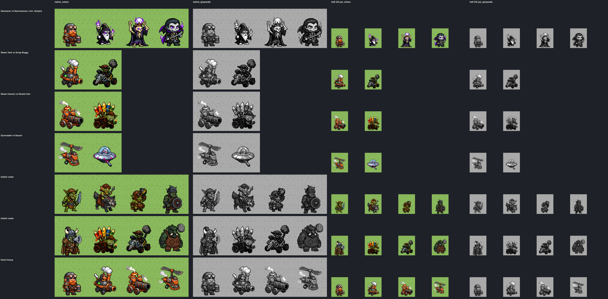
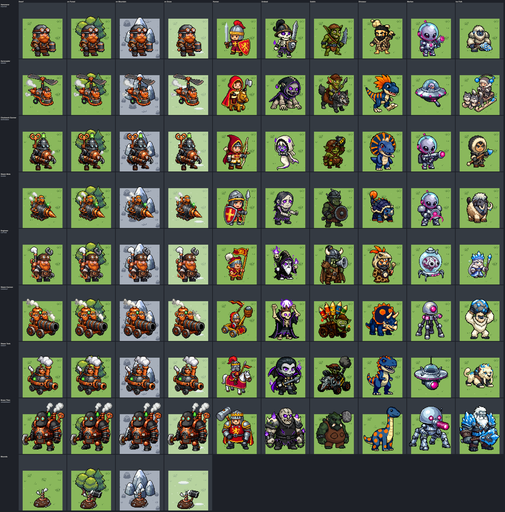
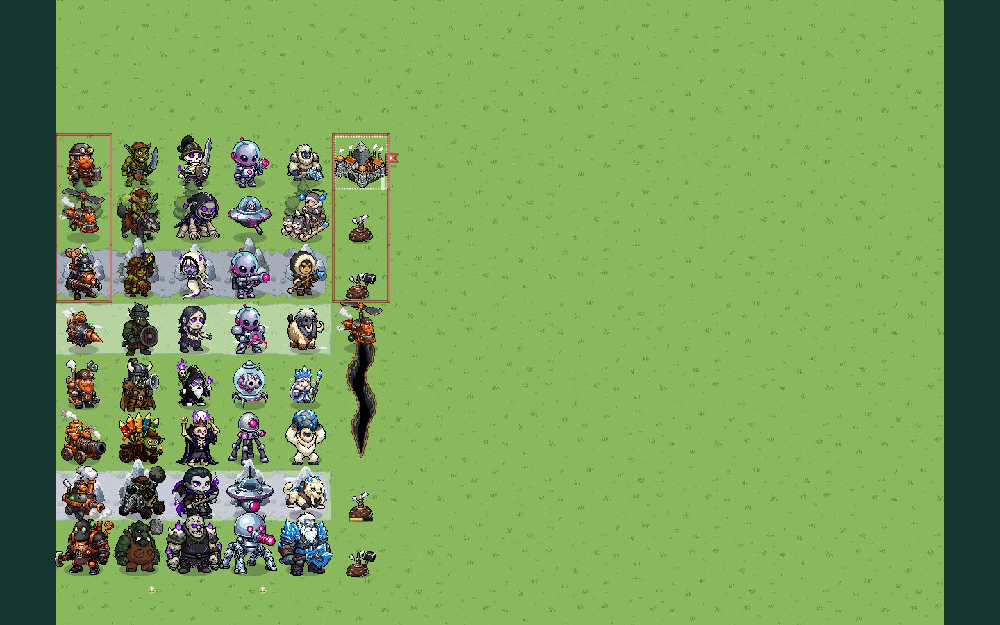
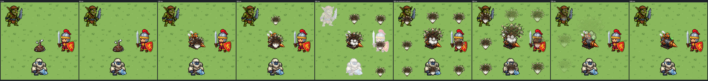

# Faction fragment: DWARF

**Status:** direction and production art made in bead `pulp_wars-78i.5`
(batches `direction-dwarf` and `naval-dwarf`), **wired in by the Dwarf UI
bead `pulp_wars-78i.6`** (see the
[wiring list](#wiring-list-for-pulp_wars-78i6), every step done, and the
[UI bead's decisions](#wired-in-bead-pulp_wars-78i6)). The look is the root's
decision 8 of the [Dwarf spec](../../product/RULESET_7_DWARVES.md)
(section 16.4, with the copper lift of section 20.2 and 20.5): soot-black
iron with a light rim, copper, dark leather, white steam, ginger-copper
beards, and no other accent unless the 32 px lineup fails a pair. **It
failed two pairs, so every Dwarf machine carries the reserve signal-green
lamp** ([The 32 px lineup](#the-32-px-lineup)). Every other decision below
was made in this bead and is recorded so that it can be overruled.

The art pipeline reads the two `text` blocks under **Prompt fragment** and
**Negative fragment** below as layer 3 of every Dwarf prompt, so edit them
here and nowhere else. Recipes that were already generated keep the
request stored in their record (see the
[pipeline](../CHIBI_PIPELINE.md#fragment-changes-and-historical-records)):
the units and portraits were made with an earlier fragment
([How it was made](#how-it-was-made)).

## Identity

Heavy, slow and built to last; they come from above and below. Short,
broad dwarves with huge ginger beards, goggles and leather aprons; machines
of riveted soot-black iron with copper boilers, pipes and stacks puffing
white steam; two clockwork constructs with wind-up keys. Cheerful and
toy-like, never grim.

The faction wears **fixed colours**; no sprite has an owner area or a mask.
The live look has no coloured base plates (retired by bead
`pulp_wars-w5j.3`), so the look alone says "Dwarf": the ginger beards, the
white steam and the green lamp are the tells; the player is read from the
pennant and the border.

## Prompt fragment

It names only a mood, materials, colours and small motifs: no figure, no
place, no goggles and no gauges (see [How it was made](#how-it-was-made)).

```text
Faction: sturdy cheerful steampunk craft of the deep mountain forges.
Its fixed colours: soot-black riveted iron with a thin light warm grey
highlight along every lit edge; bright polished copper pipes, boilers and
bands, colour #c27c3a; dark brown leather straps and aprons; small puffs of
pure white steam from smokestacks; small details of rivets and gears.
```

## Negative fragment

Brass and gold are 6 from the Gold plate; red, purple, magenta, blue and
cyan are other factions' accents; green is the Goblins (the lamp is named
in the subject lines); white and grey beards are the Undead bone and the
Ice Folk fur; robes, hoods and cloaks are the Undead casters' shapes.

```text
brass, gold, yellow, bright orange, fire, flames, red, crimson, green, lime,
purple, violet, magenta, pink, blue, cyan, glowing lights, white beard, grey
beard, blond beard, rust, wooden planks, robe, hood, cloak, magic, skull,
medieval knight, sword, bow, scary, horror, realistic
```

## The 32 px lineup

The spec makes it mandatory before any batch: the Hammerer beside the
Undead casters (Necromancer, Lich, Vampire), the Steam Tank beside the
Goblin Scrap Buggy, the Steam Cannon beside the Goblin Rocket Cart, the
Gyrocopter beside the Martian Saucer, in colour and greyscale, at native
size and at half size (a 40 px tile: the sprites about 32 px tall), and the
four against the whole Goblin roster. No base plates. Evidence:
[`lineup-x3.png`](../../../art/pixellab/reviews/chibi-batch-direction-dwarf/lineup-x3.png)
and `lineup.json` (the accepted masters), `lineup-study-{a,b,c,d}` (the
study before batching); `npx tsx scripts/art/dwarf-direction/lineup.ts`.

**The measure** ([`measure.ts`](../../../scripts/art/dwarf-direction/measure.ts)):
the area-weighted palette distance of the naval review (CIE76, each colour
of one sprite to the nearest of the other, both ways), also under
deuteranopia and protanopia; for greyscale the earth mover's distance of
the L\* histograms and the silhouette overlap (bottom-centred, intersection
over union). **The thresholds are calibrated** on the 120 same-role pairs
of the six accepted factions: a Dwarf pair must be at least as far apart
as three quarters of them, palette at least **18.6**, worse simulation at
least **13.1**; in greyscale lightness at least **7.1** L\* or overlap at
most **0.65**.

| Pair                       | Palette | Deut. / Prot. | Lightness | Overlap | Verdict                                         |
| -------------------------- | ------: | ------------: | --------: | ------: | ----------------------------------------------- |
| Hammerer / Necromancer     |    24.8 |   18.1 / 17.2 |       9.6 |    0.69 | distinct                                        |
| Hammerer / Lich            |    21.6 |   15.5 / 14.3 |       8.0 |    0.55 | distinct                                        |
| Hammerer / Vampire         |    20.5 |   13.9 / 13.3 |       7.2 |    0.55 | distinct                                        |
| Steam Tank / Scrap Buggy   |    10.6 |     6.1 / 5.3 |      17.4 |    0.59 | **fails in colour** (greyscale and shape clear) |
| Steam Cannon / Rocket Cart |    20.5 |   10.9 / 10.9 |       9.6 |    0.65 | **fails under colour-vision simulation**        |
| Gyrocopter / Saucer        |    24.2 |   20.5 / 20.6 |       9.3 |    0.47 | distinct                                        |

**Verdict: two pairs fail, so the reserve lamp is on.** Soot iron, copper
and dark leather sit on the Goblins' gunmetal, rust and leather; against
the whole Goblin roster (4 Dwarf roles x 8 Goblins) 30 of 32 pairs fall
below the thresholds, where the same roles of the Humans give 23, the
Undead 16, the Ice Folk 11, the Dinosaurs 7 and the Martians 1. By eye the
pairs are told apart at 32 px (domed iron and white steam against an open
rusty frame and an olive goblin; a fat black barrel against a fan of
rockets), but the decision says the lamp is added when a pair fails, and
the colour measure is the conservative test.

Things tried and rejected in the study:

- **A copper cap on the Steam Tank** (`steam-tank-a-copper`): 15.4 from the
  Buggy, still below 18.6, and the whole dome turned copper and the dwarf in
  the hatch became a knob: not the soot-black dome of the look.
- **Pinning the copper to `#c27c3a`** (an accent step, no PixelLab call):
  PixelLab draws the copper redder (lit about `#de6f2a`, hue 18); moved to
  hue 26 the copper's mid shades land **3 to 5** from the Goblin leather
  `#955627`. The red copper keeps them 18 to 31 apart, so it stays.
- **The lamp moves the colour measure by 0.1** (2 to 4 px of a sprite of
  about 2,500): it is a small, unique tell for the eye, not for an
  area-weighted measure. `lineup-study-c` (lamp on the Tank) and `-d`
  (lamp on every lineup machine) record it.

**The lamp** is the spec's `#2bd94a`, drawn as a mean `#4ac14a` (lit
`#68ef3a`), on every machine and on no dwarf: 10 to 31 green pixels on
the vehicles and the Gunner, 78 on the Brass Titan (its beacon and its
green-glass eye lenses); a beacon on top of the head of the two
constructs, a dot on the vehicles (a test holds at least 4 green pixels on
each machine and none on a dwarf). Measured
(`readability.json`): 52 to 128 from the four player colours (Coral 111,
Teal 52, Gold 63, Violet 129), at least 77 from every faction accent and
material but the Goblin olive skin (40); under deuteranopia it is only 10
from Coral and 7 from Gold and 10 from the Goblin olive. It also tells the
Engineer's Repair which units heal by 4 (the machines).

## Palette

Measured on the eight unit masters
([`palette.json`](../../../art/pixellab/reviews/chibi-batch-direction-dwarf/palette.json));
`DWARF_PALETTE_V7` holds them for code-drawn pieces.

| Role                  | Mean (tones)                                    | Share | Spec reference                 | Used for                                          |
| --------------------- | ----------------------------------------------- | ----: | ------------------------------ | ------------------------------------------------- |
| Outline               | `#050405`                                       |   28% | n/a                            | the thick chibi outline                           |
| Soot iron             | `#37393b` (`#4d4d4e`, `#1d2125`)                |   18% | `#3a3835`, L\* 22 to 25        | machine bodies, helmets, armour                   |
| Iron rim              | `#9c9c9d` (`#babac4`, `#94929e`)                |   11% | 1 px warm grey highlight       | the lit edge of iron                              |
| Copper, lit           | `#de6f2a` (`#da5d1d`, `#e16d2e`)                |   12% | about `#c27c3a` (20 apart)     | boilers, pipes, bands, stacks, drills             |
| Copper, shade         | `#812e11` (`#9e370e`, `#8e2511`)                |   14% | not rust-dark                  | the shade of copper                               |
| Ginger beard          | `#be5826` (`#a44119`, `#ec7721`)                |   19% | about `#c8642a` (5 apart)      | beards and faces of the Hammerer and the Engineer |
| Dark leather          | `#4e2417` (`#3f2720`, `#6b2f1e`)                |   13% | about `#4a3426`                | aprons, straps, caps                              |
| Steam white           | `#f0f1ee`                                       |    4% | `#f2f2ee`, never a body colour | steam and gauge faces                             |
| **Signal-green lamp** | `#4ac14a` (`#68ef3a`)                           |    1% | `#2bd94a`, 2 to 4 px           | every machine                                     |
| Effects               | the ten colours of `dwarf-forge.png`            |   n/a | n/a                            | the four effect sprites                           |
| Code-drawn earth      | `#3d2a1e`, `#6e4b30`, `#a07a52`; bags `#c9b48a` |   n/a | n/a                            | the Dig In earthwork, the eruption ring outline   |

Rules:

- **No pixel in the owner key's band.** PixelLab drew the darkest copper
  shades at hue 352 to 5 on four pieces (5 to 64 px). The `dwarf-copper`
  accent step of the [pipeline](../CHIBI_PIPELINE.md#the-dwarf-batches-bead-pulp_wars-78i5)
  moves every deep red-copper shade (hue 340 to 9, a band that wraps
  round 0) into copper at hue 7 to 14; lit copper, beards, skin, leather,
  iron, steam and the lamp are outside the band. Every master is
  re-derived from its candidate through it; a test checks no master has a
  key-band or player-colour pixel.
- **Copper is red copper, not `#c27c3a`.** Lit copper is 29 from the
  Goblin leather (the rule asks 15), 34 from the Goblin rust and from the
  banned `#8c4a2a`, 20 from the Dinosaur orange. Its shade is 18 from the
  leather but **11 from the Goblin rust and 13 from `#8c4a2a`** (a weak
  spot).
- **The beard is the faction's hue**: `#be5826`, 5 from the spec's
  `#c8642a`, 13 from the lit copper (the two read as one warm family), 20
  from the Goblin leather, 25 from Coral, 32 from the Dinosaur orange.

## Readability

From [`readability.json`](../../../art/pixellab/reviews/chibi-batch-direction-dwarf/readability.json).

| Check                             | Result                                                                                                                                                                                                                                                   |
| --------------------------------- | -------------------------------------------------------------------------------------------------------------------------------------------------------------------------------------------------------------------------------------------------------- |
| **Iron against the outline**      | soot iron 22.6 from the outline, contrast **1.8** (bare soot `#2b2a28` would be 1.4); the **rim** is 63 from the outline, contrast **7.5**, and 4.3 against the iron: the rim, 11% of a machine, is what separates iron from the outline at 32 px.       |
| Copper against the Goblin leather | lit 29.4 (21 worst case); shade 17.5 (11 worst); against the Goblin rust 34 and **11**.                                                                                                                                                                  |
| The beards                        | 20 from the Goblin leather (8 for a deuteranope), 25 from Coral, 47 from Gold, 129 from the Undead violet; never white or grey.                                                                                                                          |
| Steam against the Martian chrome  | 9.8: steam is only in puffs and gauge faces.                                                                                                                                                                                                             |
| On terrain                        | iron against Grass 70 (contrast 5.0), Forest 57, Mountain rock 46 (5.0), Snow 74 (10.9), Deep Water 38 (2.4); copper and beards 66 to 96 from every terrain; the rim is **8** from the Mountain rock (the dark iron carries a unit there).               |
| Nearest look-alike of each unit   | every Dwarf unit's nearest unit of another faction is 9.1 to 11.0 away in palette (Human Catapult, Goblin Scrap Buggy, Goblin Warboss); silhouettes overlap 0.41 to 0.63. The Engineer and the Goblin Warboss (10.6, overlap 0.63) are the closest pair. |
| One family                        | each unit is 5 to 7 from the Hammerer in palette distance: the roster reads as one faction.                                                                                                                                                              |
| Sizes                             | the role canvases of every faction (56 x 80, 72 x 88, 88 x 104); the mounds 56 x 48; the Gyrocopter's lowest pixel is row 69 of 88 (a walker's is 81).                                                                                                   |

## Silhouette language

This guides the subject lines; it is not sent to PixelLab.

- **Short and broad.** Dwarves are wider than tall, beards to the belt,
  round riveted helmets (no horns: the Goblin Warboss has a horned helm).
- **Machines are closed iron**: a dome, a tub, a pod, a carriage; never an
  open rusty frame (the Goblin vehicles).
- **Every machine smokes**: a copper stack with a white puff. Every living
  machine shows a ginger-bearded dwarf in a hatch or a seat.
- **Constructs have no face**: a domed iron head with two glass lenses, a
  wind-up key on the back, the green lamp as a beacon on the head.

## Roster

Batch [`direction-dwarf`](../../../scripts/art/chibi/batches/batch-direction-dwarf.json),
subject lines in [`subjects/DWARF.json`](../../../scripts/art/chibi/subjects/DWARF.json).

| Unit (role)                     | Canvas   | Accepted recipe           | What it shows                                                                                                              |
| ------------------------------- | -------- | ------------------------- | -------------------------------------------------------------------------------------------------------------------------- |
| Hammerer (`FIGHTER`)            | 56 x 80  | `hammerer-a-edit`         | a broad dwarf, ginger beard, goggles on a round riveted helmet, leather apron, iron chest plate, copper-banded hammer      |
| Gyrocopter (`RAIDER`)           | 72 x 88  | `gyrocopter-a-lamp-b` 1   | a goggled pilot in a small iron pod under a two-blade rotor, copper engine and stack, tail, bomb; no skids, a gap under it |
| Clockwork Gunner (`MARKSMAN`)   | 56 x 80  | `clockwork-gunner-a-key`  | a round iron automaton, copper boiler belly, glass lenses, copper gatling arm, iron claw, big copper wind-up key           |
| Steam Mole (`GUARD`)            | 56 x 80  | `steam-mole-a-drill`      | a squat iron tub on tracks with a big grooved copper cone drill, a stack and a dwarf in the hatch                          |
| Engineer (`CAPTAIN`)            | 56 x 80  | `engineer-a`              | goggles on a leather cap, ginger beard, tool apron, backpack boiler with a steam stack, a wrench as long as he is, a cog   |
| Steam Cannon (`CATAPULT`)       | 72 x 88  | `steam-cannon-a-lamp-b` 1 | a fat iron barrel with copper bands on a closed copper carriage, a boiler with a stack, two goggled gunners                |
| Steam Tank (`KNIGHT`)           | 72 x 88  | `steam-tank-a-lamp`       | a domed soot-iron body with a copper band and rim highlights, a cannon snout, a tall stack, a dwarf in the hatch           |
| Brass Titan (`JUGGERNAUT`)      | 88 x 104 | `brass-titan-a-key-b`     | a towering copper-and-iron giant, domed iron head with lenses and no face, furnace chest, axe, two stacks, a clock key     |
| Mound (`UNIT:DWARF:MOUND`)      | 56 x 48  | `mound-a-drill`           | a heap of dark earth and grey rocks with a grooved copper drill tip poking up and a steam puff                             |
| Rider's mound (`…:MOUND_RIDER`) | 56 x 48  | `mound-rider-b`           | the same heap with the iron head of a war hammer sticking up beside the drill                                              |

Each unit has a 48 x 48 portrait (`chibi-direction-portrait-dwarf-<unit>`):
busts for the Hammerer, the Engineer, the Clockwork Gunner and the Brass
Titan (`portrait` class); the whole machine for the Gyrocopter, the Steam
Mole, the Steam Cannon and the Steam Tank (`icon` class, as the Catapult
and ship portraits).

**The Brass Titan keeps its name and has no brass**: copper and iron, as
the spec asks.

## How it was made

89 PixelLab calls (84 in `direction-dwarf`, one of which failed at
PixelLab, and 5 in `naval-dwarf`); 40 accepted assets (one more accepted
asset, the eruption ring, was retired); 48 recipes rejected with a
recorded reason.

- **Units are fresh creations** (the `unit` class for the dwarves and the
  constructs, `machine` for the vehicles), corrected by single-purpose
  edits: the Hammerer's white helmet puffs (they read as horns), the
  Gyrocopter's landing skids (erased to leave the flyer's gap, as the
  Martian Saucer's legs were), the Mole's round front (made a cone drill),
  the Titan's moustached face (made a machine head), the wind-up keys
  ("like a butterfly" drew a butterfly; "like a clock key" worked) and the
  lamps ("one tiny detail … on the boiler", or it went into the muzzle).
- **Fresh creations held the chibi look** with the Martian wording ("a
  huge round head about half of the figure's height and a tiny sturdy
  body"), and named hex colours (`#c8642a` beards) landed within 5.
- **The first fragment named "dwarves", "goggles" and "gauges"**: every
  icon then drew a white-bearded dwarf or a goggled gadget with a face.
  The fragment now names materials only; the icons that still failed were
  **sibling edits of the clean Bomb Run icon** ("redraw it as a different
  object in the same style: …"), which send no faction layer.
- **Effects** are `palette-map` sprites on `dwarf-forge.png`: the
  eruption burst, the bomb blast, a steam puff, and the Repair sparks (two
  creations drew a campfire under the sparks; a sibling edit of the steam
  puff made them). A ring of dirt became a black tyre once palette-mapped
  and was **retired**: the ring over the eight tiles is drawn from smaller
  copies of the burst instead.
- **Cities** are `calm-settlement` creations at 96 x 96 with one
  ground-removal edit each.
- **Every non-effect asset goes through `dwarf-copper`**, the accent step
  that keeps copper shades out of the owner key's band.

## Cities

A mountain hold growing into a fortress city, in the direction's calm
building style (`calm-settlement`, subject keys `CITY:DWARF:<level>/CALM`),
on the canvases of the Ice Folk cities. No part takes a player colour;
each level has a dark iron pole of its own for the code-drawn pennant.

| Level | Asset                          | Canvas  | What it shows                                                                                       | Pennant anchor (`DWARF_FLAG_ANCHORS_V7`) |
| ----- | ------------------------------ | ------- | --------------------------------------------------------------------------------------------------- | ---------------------------------------- |
| 1     | `chibi-direction-dwarf-city-1` | 80 x 80 | a squat stone hold in a rock outcrop: a round iron door, a copper roof, a chimney with steam        | `{ x: 70, y: 31, pole: 0 }`              |
| 2     | `chibi-direction-dwarf-city-2` | 88 x 88 | a stone tower with a round iron gate and a copper cog, two copper-roofed houses in a stone wall     | `{ x: 78.5, y: 47, pole: 0 }`            |
| 3     | `chibi-direction-dwarf-city-3` | 96 x 88 | a fortress against a grey peak: copper-domed towers, copper roofs, chimneys, a big copper cog wheel | `{ x: 84, y: 36, pole: 0 }`              |

The anchor is the top of the pole, in master pixels from the sprite's
top-left corner; a test checks it is on the pole.

## Icons

48 x 48, `icon` class.

| Subject                          | Asset                                        | What it shows                                            |
| -------------------------------- | -------------------------------------------- | -------------------------------------------------------- |
| `ICON:ACTION:TUNNEL`             | `chibi-direction-icon-action-tunnel`         | a grooved copper drill boring into a heap of earth       |
| `ICON:ACTION:BOMB_RUN`           | `chibi-direction-icon-action-bomb-run`       | a black bomb under a small two-blade rotor               |
| `ICON:ACTION:ASSEMBLE`           | `chibi-direction-icon-action-assemble`       | a copper key across an iron cog                          |
| `ICON:ACTION:DWARF:TEND_WOUNDED` | `chibi-direction-icon-action-repair`         | Repair: an iron wrench with sparks                       |
| `ICON:ACTION:KNOCKBACK`          | `chibi-direction-icon-action-knockback`      | an iron cannon firing with steam and a push arrow        |
| `ICON:ACTION:PLATED`             | `chibi-direction-icon-action-plated`         | a thick riveted iron plate with a copper band            |
| `ICON:STATUS:CLOCKWORK`          | `chibi-direction-icon-status-clockwork`      | the clockwork glyph: a copper cog                        |
| `ICON:STATUS:DUG_IN`             | `chibi-direction-icon-status-dug-in`         | the dug-in glyph: a ring of earth and sandbags           |
| `ICON:TECH:DWARF:FORTIFICATION`  | `chibi-direction-icon-tech-dig-in`           | Dig In: a shovel in a mound of earth                     |
| `ICON:TECH:DWARF:EXPLOSIVES`     | `chibi-direction-icon-tech-blasting-charges` | Blasting Charges: a copper-cased charge with a drill tip |

`ICON:ACTION:TUNNEL`, `BOMB_RUN` and `ASSEMBLE` are the icons of the three
new command kinds; Repair keeps the `TEND_WOUNDED` command with a Dwarf
icon (the `ICON:ACTION:MARTIAN:RALLY` precedent); Knockback and Plated are
ability icons for previews and Help (as the Ice Folk Sweep and Prowl).

## The mound and the eruption

**The mound** is the most important Dwarf board marker (spec 5.3: visible
to everyone, untouchable). It is a raster drawn **where the unit would
stand**, bottom-centred like a unit, with the unit's HP bar, in the
owner's faction look: `UNIT:DWARF:MOUND` for the Mole,
`UNIT:DWARF:MOUND_RIDER` for its rider (a hammer head beside the drill).
It reads on Grass, Forest, Mountain, every Snow and a city centre
([`mound-x3.png`](../../../art/pixellab/reviews/chibi-batch-direction-dwarf/mound-x3.png));
it is small in its tile (a heap about 40 px wide), so selection and hover
should draw the eruption ring (`DWARF_MOUND_V7.eruptionRing`: a dashed
earth-light line round the eight tiles, inset 3 px).

**The eruption** is the faction's "wow" moment, so it has a timeline
(`DWARF_ERUPTION_TIMELINE_V7`, frames in
[`eruption-frames-x3.png`](../../../art/pixellab/reviews/chibi-batch-direction-dwarf/eruption-frames-x3.png)):
0 to 120 ms the mound shakes by 1 px; at 120 ms the Mole and its rider
are back and the burst (`EFFECT:ERUPTION`) plays at the Mole's tile,
growing from 1.1 to 2.3 times and rising 14 px, opaque until 55% and
fading to 720 ms; from 180 ms one smaller burst (0.8 to 1.25 times) on
each of the eight tiles, 25 ms apart clockwise from the north, fading
after half their 420 ms; a dust and steam puff (`EFFECT:STEAM_PUFF`, 1.2 to
2.2 times) rises from 220 to 1000 ms; the board shakes by 1 px from 120 to
300 ms; the victims flash white and show their damage at 260 ms; Field
Defense in the ring collapses at 300 ms. Reduced motion draws the 360 ms
frame. **The bomb run** has its own (`DWARF_BOMB_TIMELINE_V7`): the flight,
the bomb falling 24 px, `EFFECT:BOMB_BLAST` on the target.

## Code-drawn pieces

In [`chibi-direction-dwarf-presentation.ts`](../../../src/assets/chibi-direction-dwarf-presentation.ts),
which imports nothing:

- `DWARF_PALETTE_V7`, `DWARF_FLAG_ANCHORS_V7`, `DWARF_MOUND_V7`,
  `DWARF_ERUPTION_TIMELINE_V7`, `DWARF_BOMB_TIMELINE_V7`;
- `DWARF_FLYER_PRESENTATION_V7` and `DWARF_FLYER_SHADOW_V7`: the
  Gyrocopter's hull bottom (row 69), ground line (82) and the ground shadow
  the interface draws, as for the Martian flyers;
- **`dwarfDigInMarkerV7(width)`**: the Dig In earthwork (spec 8). Since
  bead `pulp_wars-78i.9` a parapet on the front half, not a ring (a ring of
  sandbags beside the cream ready ring read as a double ring): a low wall
  of separate pillow-shaped sandbags in front of the unit's feet, two
  courses in the middle and bowed back at its ends onto clods of earth
  (`front`, drawn after the unit), and two small heaps of dug earth behind
  the wall's ends (`back`, drawn before it); `width` is the wall's width,
  `DWARF_DIG_IN_WALL_SHARE_V7` of the unit's shadow width, and the board
  stands its foot on the front edge of the unit's measured shadow
  (`unit-shadows-v7.ts`). Deterministic, the two layers never overlap, and
  nothing is drawn behind the middle of the unit (tests). The art review's
  `mound-x3.png` and `terrain-x2.png` still show the first, ring-shaped
  earthwork until they are regenerated.

## Naval set

Batch [`naval-dwarf`](../../../scripts/art/chibi/batches/batch-naval-dwarf.json),
made exactly as the six faction sets of [NAVAL_FACTIONS.md](../NAVAL_FACTIONS.md):
`edit-image-pixen` edits of the accepted batch-4 ships and batch-5 ship
portraits ("Turn it into …", every red part named, "Nothing red"), one
call each, all accepted first time; the shared ships' canvases, classes,
anchors and waterline (a test holds the hull within 4 rows of the shared
waterline).

| Piece                | Asset                                    | What it shows                                                                                      |
| -------------------- | ---------------------------------------- | -------------------------------------------------------------------------------------------------- |
| Patrol Boat          | `chibi-naval-dwarf-patrol-boat`          | the cog as an iron-clad steam paddle tug: riveted iron hull, tall copper stack, paddle wheel, lamp |
| Battleship           | `chibi-naval-dwarf-battleship`           | the carrack as a riveted steam ironclad: iron hull with a copper band, a turret, two stacks        |
| Embarked transport   | `chibi-naval-dwarf-transport`            | the barge as an iron steam barge: oars, cargo under dark leather, a short stack, lamps             |
| Patrol Boat portrait | `chibi-naval-dwarf-portrait-patrol-boat` | the tug, whole                                                                                     |
| Battleship portrait  | `chibi-naval-dwarf-portrait-battleship`  | the ironclad, whole                                                                                |

Tell at a glance: **black iron hulls with copper stacks and white steam,
no sail** (only the Martian ships also have no sail; theirs are chrome).
`naval-x4.png` and the `scene-coast-*` captures show them beside the six
fleets on Shallow and Deep Water.

## Wiring list for `pulp_wars-78i.6`

**Done in bead `pulp_wars-78i.6`** (steps 1 to 7; step 8, the art review's
re-run with a real Dwarf seat, was replaced by the UI review
`npm run review:ruleset7-dwarf-ui`, which captures real Dwarf seats on the
Showcase and on the Dwarf UI fixtures; the art review's scenes keep their
stand-ins and now leave the Dwarf naval entries out of their live list,
since they register them under stand-in subjects themselves). The list as
it was planned:

The art is in [`chibi-direction-dwarf-art-manifest.ts`](../../../src/assets/chibi-direction-dwarf-art-manifest.ts)
(`CHIBI_DIRECTION_DWARF_ART_ASSETS_V7`, 35 entries;
`CHIBI_DIRECTION_DWARF_NAVAL_ART_ASSETS_V7`, 5), which no game module
imports. The subjects exist (`DwarfArtSubjectV7` in
[`chibi-art-v7.ts`](../../../src/assets/chibi-art-v7.ts)). The naval ones
are `UNIT:DWARF:<ROLE>` and `PORTRAIT:DWARF:<ROLE>`, exactly what the live
generic naval wiring of bead `pulp_wars-w5j.3` resolves
(`navalArtSubjectV7`, `NavalFactionArtSubjectV7`) once `DWARF` is a
`FactionIdV7`; until the engine bead adds it, the manifest spells them out
(`DwarfNavalArtSubjectV7`), and a test holds them to `navalArtSubjectV7`.

1. **Registry.** Add `...CHIBI_DIRECTION_DWARF_ART_ASSETS_V7` to
   `chibiDirectionArtRegistryV7`.
2. **Resolve the subjects** once `DWARF` is a `FactionIdV7`: `unitArtSubjectV7`
   returns `UNIT:DWARF:<ROLE>` for a Dwarf unit's land roles;
   `cityArtSubjectV7` and `CityArtFactionV7` gain `DWARF`; the portrait,
   icon and technology-icon lookups of the DOM art hook return
   `PORTRAIT:DWARF:<ROLE>`, `ICON:ACTION:{TUNNEL,BOMB_RUN,ASSEMBLE}`,
   `ICON:ACTION:DWARF:TEND_WOUNDED` (Repair, by the viewer's faction),
   `ICON:TECH:DWARF:FORTIFICATION` (Dig In) and `…:EXPLOSIVES` (Blasting
   Charges); `chibiFallbackSubjectV7` falls back to the Human art with the
   Dwarf badge (spec 16.4), Dig In and Blasting Charges to the Human
   Fortification and Explosives.
3. **Anchors.** Copy `DWARF_FLAG_ANCHORS_V7` into `DIRECTION_FLAG_ANCHORS_V7`.
4. **The mound.** Draw a burrowed unit's mound (`UNIT:DWARF:MOUND` for the
   Mole, `UNIT:DWARF:MOUND_RIDER` for the rider) at its tile with its HP
   bar; outline the eruption ring from `DWARF_MOUND_V7` on selection or
   hover.
5. **Markers and effects.** The Dig In earthwork from `dwarfDigInMarkerV7`
   (back before the unit, front after), the clockwork glyph
   (`ICON:STATUS:CLOCKWORK`) on unit info and the HP bar's end, the
   dug-in glyph (`ICON:STATUS:DUG_IN`) on unit info; the eruption and bomb
   timelines with `EFFECT:ERUPTION`, `EFFECT:BOMB_BLAST`,
   `EFFECT:STEAM_PUFF` (Assemble, Knockback, the tunnel's dive) and
   `EFFECT:REPAIR_SPARKS`; the Gyrocopter's shadow from
   `DWARF_FLYER_PRESENTATION_V7`.
6. **Naval.** The six other fleets are live since bead `pulp_wars-w5j.3`
   through a generic wiring by faction ([NAVAL_FACTIONS.md](../NAVAL_FACTIONS.md)):
   `unitArtSubjectV7` and `portraitSubjectV7` ask for
   `navalArtSubjectV7(faction, kind, role)`, and `NavalFactionArtSubjectV7`
   is defined from `FactionIdV7`. So once the engine bead makes `DWARF` a
   `FactionIdV7`, the Dwarf boats and every embarked Dwarf unit (the
   Gyrocopter self-launched afloat is an ordinary embarked unit: the
   transport) already ask for `UNIT:DWARF:PATROL_BOAT|BATTLESHIP|EMBARKED_TRANSPORT`
   and `PORTRAIT:DWARF:PATROL_BOAT|BATTLESHIP`, and fall back to the
   shared ship until art is registered. The only step left: append the
   five `CHIBI_DIRECTION_DWARF_NAVAL_ART_ASSETS_V7` entries to
   `CHIBI_NAVAL_FACTION_ART_ASSETS_V7` (their shape, with `faction: "DWARF"`
   and the asset typed `ChibiArtAssetV7`), which the direction registry
   already holds whole.
7. **Tests to update:** `tests/unit/chibi-dwarf-direction-assets.test.ts`
   ("is not wired in") turns round, as the Martian and Ice Folk tests did.
8. **Review.** Rerun `npm run art:chibi-dwarf-direction-review`; its
   scenes can then use the real Dwarf seat instead of the Human and
   Dinosaur stand-ins.

## Evidence

`npm run art:chibi-dwarf-direction-review` writes
[`art/pixellab/reviews/chibi-batch-direction-dwarf/`](../../../art/pixellab/reviews/chibi-batch-direction-dwarf/)
(see the [pipeline document](../CHIBI_PIPELINE.md#the-dwarf-batches-bead-pulp_wars-78i5)).
No sheet or capture draws a base plate.









## Decisions

Decided in bead `pulp_wars-78i.5`:

1. **The lamp is on** (the lineup fails two pairs by the calibrated colour
   measure), on every machine: the six vehicles and constructs; never on
   the Hammerer or the Engineer.
2. **Red copper**, not `#c27c3a`: pinned to hue 26 its shades fall onto the
   Goblin leather; only the darkest shades are moved (`dwarf-copper`), out
   of the key band.
3. **No horns** on the Hammerer (the spec's "horned iron helm"): a round
   riveted helmet with goggles, because the Goblin Warboss wears a horned
   helmet. The hammer is one-handed in the sprite.
4. **The fragment names no figure, goggles or gauges** (they reach every
   class); dwarves, goggles and gauges are in the subject lines.
5. **The mound is a unit-sized raster** (`UNIT:DWARF:MOUND`, 56 x 48, the
   Dinosaur Egg precedent), not an effect, so it is drawn like a unit with
   its HP bar; the rider's mound is a sibling edit of it.
6. **The eruption ring is code-driven** from the burst sprite; the dirt-ring
   raster was retired.
7. **The Dig In earthwork is code-drawn** (`dwarfDigInMarkerV7`), with the
   status glyph `ICON:STATUS:DUG_IN` beside the Dig In technology icon.
8. **Machine portraits show the whole machine** (the Catapult and ship
   precedent); the constructs and dwarves have busts.
9. **The Steam Cannon's carriage is copper**, not iron: the iron edit lost
   the barrel's copper bands and the rim.
10. **Not registered** by this bead (the UI bead did it: see below).

## Wired in (bead `pulp_wars-78i.6`)

How the UI bead drew the pieces (SCREEN_FLOW.md, "Current Ruleset 7 Dwarf
overlay"); each decision can be overruled:

1. **The mound is a unit-sized entry of its own** (`mound:<id>`), drawn by
   the unit path (the art, the faint ground shadow, the HP bar) but never a
   unit: no ready ring, no target, no selection jump, no orders cycle.
   Choosing it selects its tile; the tile's dock describes the mound.
2. **"Untouchable this turn"** is a small earth chip with an upward arrow
   beside the heap (where the Egg's countdown sits), plus the dock and
   cursor text "Burrowed: surfaces at the start of {owner}'s next turn. It
   cannot be attacked". No label on the board.
3. **The eruption ring** is drawn for the selected or hovered Mole mound and
   for a focused Tunnel destination, from `DWARF_MOUND_V7.eruptionRing`,
   with a dark casing under the dashes so it reads on Grass and Snow.
4. **The eruption cue** follows `DWARF_ERUPTION_TIMELINE_V7` but leaves out
   its two 1 px shakes (mound and board): the brief asks for calm.
5. **The clockwork glyph on the board** sits at the HP bar's end only while
   the bar shows (a damaged construct): a full-HP construct carries no
   extra mark. The unit info and the dock chip always show it.
6. **The Dig In earthwork** is code-drawn on the ground, so it does not jump
   with a selected unit; since bead `pulp_wars-78i.9` it is a sandbag wall
   in front of the feet on the unit's measured shadow anchor (heaps of
   earth behind its ends), not the first review's ring.
7. **Calm targeting:** Tunnel destinations are labelled only where they
   would erupt on someone; a passenger's other landings (small dots since
   bead `pulp_wars-78i.9`) and Assemble tiles carry no labels; the shooter's
   lines (Clockwork, the second shot, "Cannot move after
   firing") show on the focused target only.
8. **The Classic look and LEGACY** draw the Human stand-in with the cog
   badge (a copper cog on dark leather), and a code-drawn heap with a drill
   tip (and a hammer head for the rider) for the mound.

## Weak spots

- **The Dwarves are the faction closest to the Goblins in colour**: soot
  iron, copper and leather against gunmetal, rust and leather (30 of 32
  cross-role pairs below the calibrated threshold; the Humans 23). The
  beards, the steam, the lamp, the closed shapes and the Goblins' olive
  skin tell them apart by eye; the measure does not see it.
- **The copper shade** (`#812e11`) is 11 from the Goblin rust.
- **The lamp under colour-vision deficiency** is 7 to 10 from the Gold and
  Coral plates and the Goblin olive; it is a few pixels on dark iron.
- **The Engineer and the Goblin Warboss** are the closest pair of all
  (10.6): both broad, brown and bearded or helmeted; the Engineer's ginger
  beard and steam stack decide.
- **The Gyrocopter's rotor and the Steam Cannon's steam reach into the HP
  bar strip** (24 and 3 px); the ships and mounds stay clear.
- **The Gyrocopter's bomb has a small green fuse light**, a second green
  dot; **the Steam Cannon's carriage is copper with spoked wheels**, a little
  like a cart.
- **The constructs' lamps are beacons** (6 to 8 px), larger than the spec's
  2 to 4 px; the vehicles' are dots.
- **The mound is small** in its tile at zoom 0.75; the HP bar and the ring
  outline help.
- **The eruption ring over eight tiles is reused bursts**, not a raster of
  its own; the burst sprite is speckled once palette-mapped.
- **The Dig In earthwork is code-drawn and plain** (pale sandbags and clods
  of earth); it is small at zoom 0.75, where the sandbags blur into a pale
  lumpy wall, and the first, ring-shaped version was weakest on Snow.
- **Icons are of two families**: creations (plated, knockback, blasting,
  dig in, dug in, clockwork, bomb run) and sibling edits of the Bomb Run
  icon (tunnel, assemble, repair), which are flatter. The Dig In icon is
  small in its square; the Knockback icon shows the gun as well as the
  push.
- **The rim is 8 from the Mountain rock**: on a Mountain the dark iron and
  the outline carry a machine.
- **The art review's scenes use stand-ins** (the Human seat for the
  Dwarves, a Dinosaur seat for the mounds; the UI review uses real Dwarf
  seats); the Gyrocopter stands in for the Human
  Raider and so has no flyer shadow in the scenes; in the COAST scene the
  Dwarf ships are land units on water (the other six fleets are real naval
  units from the live registry), so they get the live look's faint ground
  shadow, which a real ship afloat does not.

## Ninth unit: the Whirligig (bead `pulp_wars-w49.17`, stand-in art)

Ruleset `7r55` gives every faction a ninth land unit ([what was
built](../../product/RULESET_7_NINTH_UNIT.md)). The Dwarf one with no art of
its own is the **Whirligig** (engine role `KNIGHT`). **It has no art yet.** No
PixelLab call was made for it.

- **Art slot.** `UNIT:DWARF:SWORDSMAN` and `PORTRAIT:DWARF:SWORDSMAN`: the
  ninth art slot of the faction (`unitArtRoleV7` in
  `src/assets/chibi-art-v7.ts`). No raster is registered for either subject.
- **Stand-in.** Until an art bead registers them, both fall back to the
  Clockwork Gunner (`UNIT:DWARF:MARKSMAN`, `PORTRAIT:DWARF:MARKSMAN`) through
  `chibiFallbackSubjectV7` (`NINTH_UNIT_STAND_INS_V7`). The board marks the
  piece with a steel disc lettered **W** where the faction badges go
  (`drawStandInBadgeV7`), and the Gallery shows its stand-in mark.
- **What the art bead must make.** One board sprite and one 48 x 48 portrait
  in this fragment's direction: A wind-up spinning top of soot-black iron on one
  wheel, a big copper key in its back, three hammers on chains flying out around
  it, the green lamp on top.
- **Notes for that bead.** A construct: the green lamp is the clockwork mark
  it shares with the Clockwork Gunner and the Brass Titan. Three hammers, not
  two and not four (Three Hammers is the rule).
- **When the art lands.** Register the two subjects in this faction's
  direction manifest, delete the faction's entry from `NINTH_UNIT_STAND_INS_V7`
  (the fallback and the letter badge go with it), regenerate the unit shadow
  measurements, and update the stand-in assertions in
  `tests/unit/ruleset-v7-ninth-unit.test.ts`.

The Steam Tank is the heavy line role now (`SWORDSMAN`); its rasters, prompts
and generation records stay under the art slot they were made for,
`UNIT:DWARF:KNIGHT` and `PORTRAIT:DWARF:KNIGHT`.
