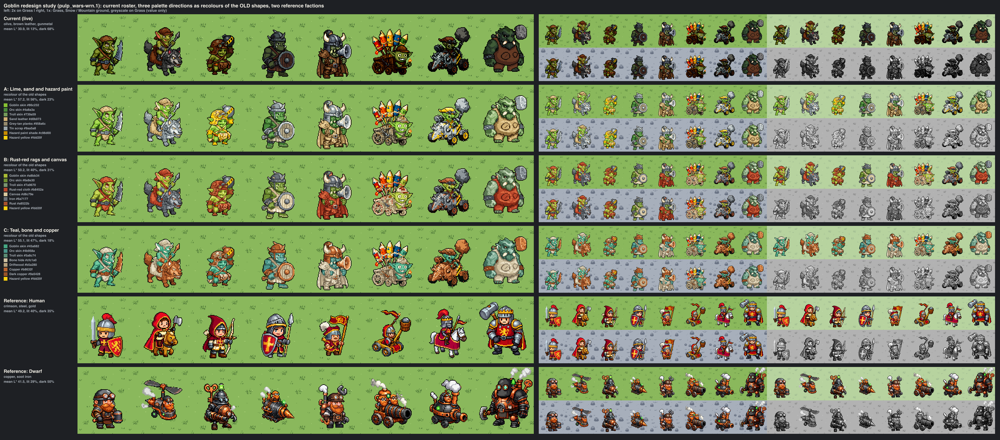
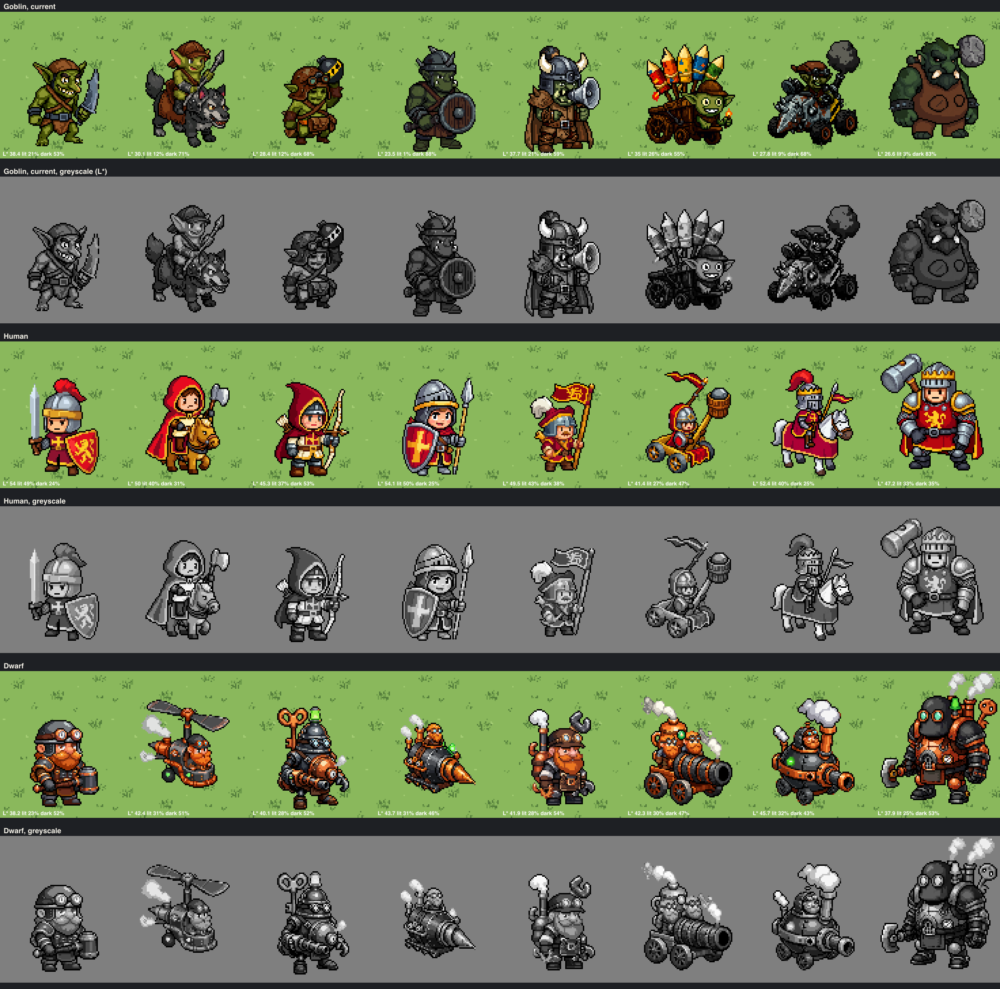
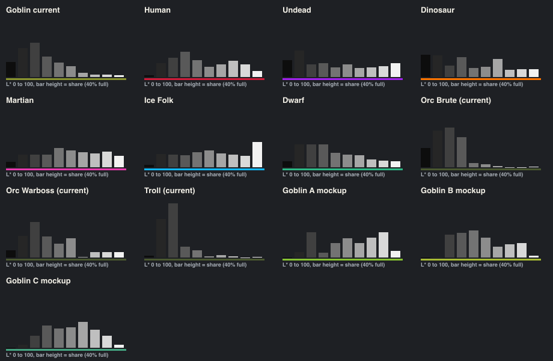
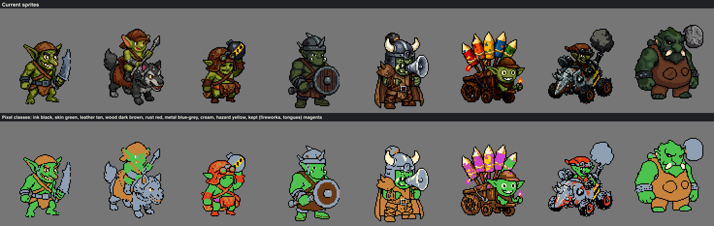
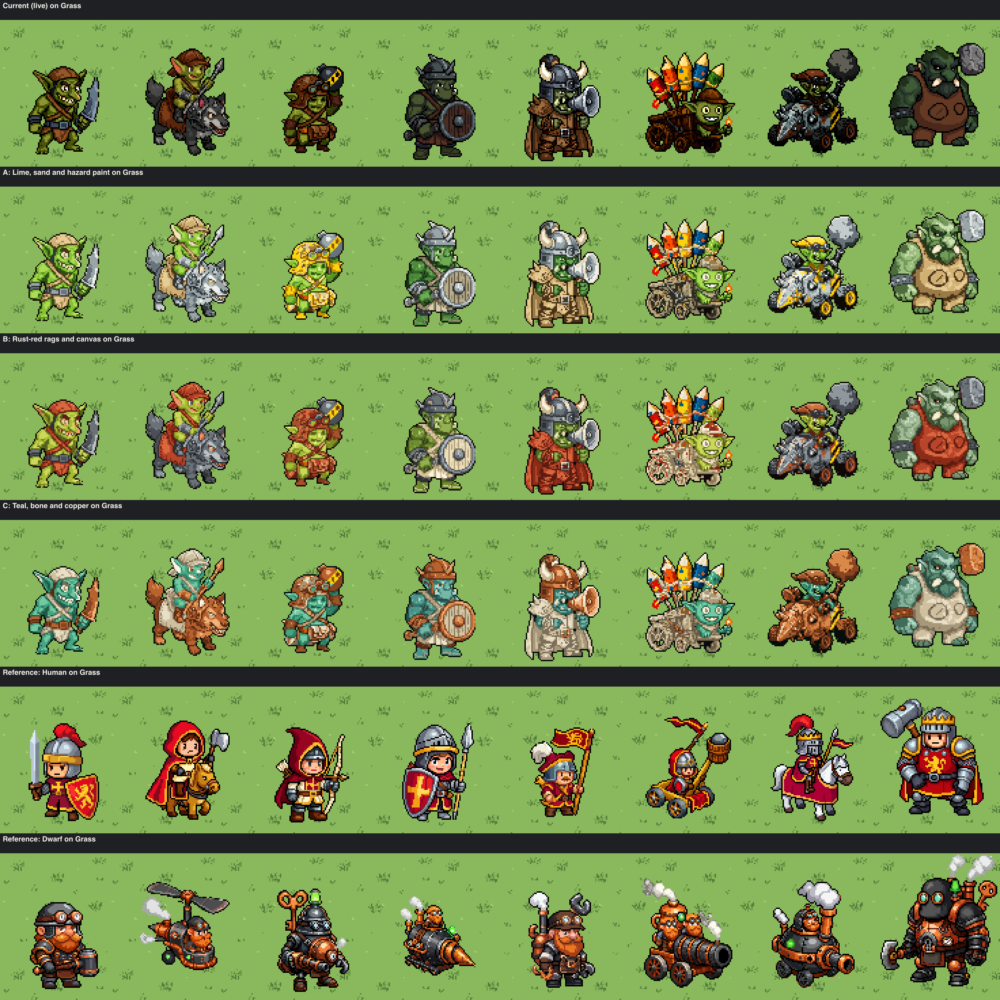
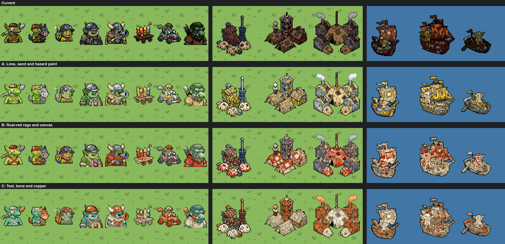

# Goblin redesign: direction study

**Status:** study for bead `pulp_wars-wrn.1` (epic `pulp_wars-wrn`), for the
user to choose a direction. Nothing in the game changed: no production
sprite, registry entry or fragment of [GOBLIN.md](GOBLIN.md) was touched.
The mockups below are **recolours of the current sprites**, made in code
with no PixelLab call; the redesign also changes the shapes, and the
recipes for that are checked in and ready to run once the PixelLab key is
available to the generating worker.

The brief, from the user (2026-10-04): "the goblin sprites came out too
dark. this palette doesn't work. especially the orc and troll are way too
dark. warboss is unreadable. redesign the goblin sprites from scratch. you
did a great job with the other factions figure this one out too. Don't
worry too much about contrast vs grass. green Grass is the dominant
landscape now but won't be forever."



## 1. Diagnosis of the current roster

Measured by `npm run art:goblin-redesign-study-review` on the live sprites
(`index.json`). CIE L\* (0 black, 100 white) of every opaque pixel except
the pure-black outline; "lit" is L\* 55 and above, "dark" below 35. Grass
is L\* 69.

| Roster     | Mean L\* | Dark | Lit | 90th pct L\* | Chroma | Faction colour on the sprite |
| ---------- | -------: | ---: | --: | -----------: | -----: | ---------------------------: |
| **Goblin** | **30.9** |  68% | 13% |       **57** |     23 |                         0.5% |
| Human      |     49.2 |  35% | 40% |           83 |     42 |                          14% |
| Undead     |     44.2 |  46% | 37% |           90 |     18 |                           6% |
| Dinosaur   |     40.9 |  43% | 36% |           80 |     38 |                          10% |
| Martian    |     53.5 |  27% | 47% |           89 |     20 |                           4% |
| Ice Folk   |     57.8 |  25% | 53% |           96 |     19 |                           4% |
| Dwarf      |     41.5 |  50% | 29% |           78 |     26 |      0.2% (copper, not jade) |

Per unit:

| Unit         | Mean L\* | Dark | Lit | 90th pct | What fails                                                                                                    |
| ------------ | -------: | ---: | --: | -------: | ------------------------------------------------------------------------------------------------------------- |
| Goblin       |     38.4 |  53% | 21% |       59 | olive skin and brown leather sit in one dark-mid band; reads, but dull                                        |
| Wolf Rider   |     30.1 |  71% | 12% |       59 | dark slate wolf under a dark rider: one dark lump                                                             |
| Bomb Chucker |     28.4 |  68% | 12% |       56 | rust pot helmet, brown straps and black bomb merge into the face                                              |
| Orc Brute    | **23.5** |  88% |  1% |   **35** | no light pixel at all: moss skin, dark gunmetal helmet and dark plank shield are one value; helmet hides face |
| Orc Warboss  |     37.7 |  59% | 21% |       80 | skin is 8% of the sprite: helmet, megaphone and cape cover the face; its only lights are horns and megaphone  |
| Rocket Cart  |     35.0 |  55% | 26% |       79 | readable only through the paper rockets; the near-black planks (`#391501`) read as outline                    |
| Scrap Buggy  |     27.8 |  68% |  9% |       51 | 42% of its pixels are black outline or tyre; gunmetal body has no light plane                                 |
| Troll        |     26.6 |  83% |  3% |       36 | the largest sprite is a dark green and dark brown blob; tusks are the only light                              |



What the numbers and the greyscale row say:

- **The problem is the missing light end, not too much dark.** The Dwarf
  is as dark on average (50% dark) and reads well, because it has a light
  end (white steam, copper highlights, 90th percentile L\* 78) and a
  saturated signature material. The Goblin roster's histogram stops at
  L\* 60: no light dominant material, no highlight, and the Orc Brute and
  Troll stop at L\* 36. In greyscale the Goblins are a dark mush; every
  other faction keeps a full value range.
- **No signature colour.** Every other faction wears its own faction colour
  or a saturated signature material (Human crimson 14%, Dinosaur orange
  10%, Undead violet 6%, Dwarf copper). The Goblins' hazard yellow is 0.5%
  of the roster; olive, brown and gunmetal are all low-chroma.
- **Three greens, one value.** Olive, moss and dark forest green differ in
  hue, not in lightness, so the Orcs and the Troll lose their faces.
- **Black inner lines.** 28% of Goblin pixels are pure black outline,
  the most of any faction with the Undead; on dark materials the inner
  lines merge with the shading.
- **The Warboss is a costume problem as much as a palette one**: the face
  is hidden by a full helmet with cheek guards, a megaphone held at the
  mouth and a cape that covers the body. Lightening the colours (see the
  mockups) helps but cannot fix it; the new shape must show the face.



## 2. What the other factions do

The rosters the user liked share four traits, which become the rules for
every Goblin direction:

1. **One light or saturated dominant material** that covers the body:
   Human steel and cream with crimson cloth, Undead bone, Ice Folk white
   fur, Martian silver, Dwarf copper, Dinosaur blue hide with cream bellies.
2. **One signature accent**, usually the faction colour itself.
3. **A full value range**: real darks (boots, belts, iron) _and_ real
   lights (highlights, white, cream), 90th percentile L\* 78 or more.
4. **Faces and bellies are light planes**: the Human faces, the Dinosaurs'
   cream bellies and jaws, the Ice Folk faces in white fur.

## 3. Three directions

All three share the value rules, the material rules and the silhouettes
below; they differ in palette. Palettes are five-step ramps per material in
[`directions.ts`](../../../scripts/art/goblin-redesign/directions.ts); the
lit step is given here.

### Shared value-structure rules

- **At least half of every material on its lit step or lighter**, at most
  about an eighth on its shadow step. Target for the roster: mean L\* 50 to
  58, dark (L\* < 35, outline excluded) 15 to 30%, lit 45 to 60%, 90th
  percentile 80 or more, like Martian and Ice Folk.
- **Dark anchors are small**: belts, boots, the bomb, tyres, the inside of a
  mouth. Never a whole garment, helmet or shield.
- **Light planes on every face, jaw, chest and belly**, one step lighter
  than the skin: the Orcs' jaws and chests, the Troll's whole belly and face
  in a pale cream-green. This is what makes big green creatures read.
- **Only the silhouette is black.** Inner lines are the shadow step of the
  material they sit in. The mockups apply this in code (`innerLines` in
  [`recolour.ts`](../../../scripts/art/goblin-redesign/recolour.ts)): the
  pure-black share drops from 28% to 13%. PixelLab draws black inner lines
  by default; if the prompt does not hold it, the same deterministic step
  can become a derivation step of the batch, like the Undead `accent`.
- **A rim light** on the top edge of large bodies (Troll, Orcs, wolf,
  buggy): one ramp step lighter just under the outline.
- **The faction colour on every unit**, 3 to 10% of the sprite, never the
  whole figure.

### A. Lime, sand and hazard paint (recommended)

| Role            | Lit colour | Ramp, dark to light                               | Used for                                                   |
| --------------- | ---------- | ------------------------------------------------- | ---------------------------------------------------------- |
| Goblin skin     | `#86c232`  | `#2c4f12` `#5a9424` `#86c232` `#acdc55` `#d4f08a` | every goblin, the crews                                    |
| Orc skin        | `#4a8a3a`  | `#16330f` `#326426` `#4a8a3a` `#6faa55` `#9fcb80` | Brute and Warboss: deeper and cooler, never dark           |
| Troll skin      | `#739a59`  | `#21391b` `#4c6c3c` `#739a59` `#9dbf80` `#cde0b4` | sage, with a pale `#cde0b4` belly and face                 |
| Sand leather    | `#d0b073`  | `#4a3218` `#9a7a46` `#d0b073` `#e6cc95` `#f6e6bf` | caps, straps, loincloths, saddle, hides, tents             |
| Grey-tan planks | `#958a6c`  | `#2f2a20` `#645a46` `#958a6c` `#b8ad8c` `#d8cfb0` | cart, raft, hulls: weathered, not brown                    |
| Tin scrap       | `#9aa5a8`  | `#2e3539` `#68737a` `#9aa5a8` `#c4cccc` `#eef2ee` | blades, helmets, shield, buggy, huts                       |
| Hazard paint    | `#fdd20f`  | `#8c5a00` `#c98d00` `#fdd20f` `#ffe24d` `#fff1a0` | the faction colour: daubed on helmets, rims, panels, bombs |

Material language: bare lime skin, pale patched leather and light dented
tin, held together with rope; the faction's hazard yellow is **paint**
slapped on whatever scrap they found (a helmet, a shield rim, a buggy
panel, a megaphone), with black stripes where something explodes. Rust,
dark brown leather, gunmetal and near-black planks are gone.

### B. Rust-red rags and canvas (alternative)

| Role           | Lit colour | Used for                                       |
| -------------- | ---------- | ---------------------------------------------- |
| Goblin skin    | `#a8bb34`  | yellow-green, every goblin                     |
| Orc skin       | `#6e8e30`  | olive green                                    |
| Troll skin     | `#7a9670`  | grey-sage with a pale `#cfdfc4` belly          |
| Rust-red cloth | `#b8452a`  | bandanas, straps, loincloths, capes, patches   |
| Light canvas   | `#d8c79e`  | tents, sails, shields, the cart's cover, wraps |
| Iron           | `#6a7177`  | blades, helmets, the buggy                     |
| Hazard yellow  | `#fdd20f`  | bomb bands and one buggy panel only            |

Material language: rag-tag raiders in rust-red rags and patched canvas. The
red cloth is the signature accent, as crimson is for the Humans.

### C. Teal, bone and copper (not recommended)

Teal-green skin (`#45a682`), bleached bone-white hide (`#cfc1a0`), pale
driftwood and copper scrap (`#b8632f`). It reads well and stands apart from
Grass, but it collides with two factions: the teal skin is 13 from the Dwarf
signal green and the copper 8.5 from the Dwarf ginger beard (CIE76), and the
bone hide is 12 from the Undead bone. No recipes were prepared for it.

### Silhouettes for the new shapes (A; B differs only in colour words)

| Piece                     | New silhouette and readability notes                                                                                                                                                                              |
| ------------------------- | ----------------------------------------------------------------------------------------------------------------------------------------------------------------------------------------------------------------- |
| Goblin (`FIGHTER`)        | huge head, huge ears straight out sideways (the faction's silhouette), light belly and face, tiny sand cap; an oversized tin cleaver with a hazard-yellow handle                                                  |
| Wolf Rider (`RAIDER`)     | the wolf turns light ash grey with a cream belly and muzzle (the dark slate wolf was the problem); small rider, hazard-yellow rag on the spear                                                                    |
| Bomb Chucker (`MARKSMAN`) | keeps the user's pot helmet, now **painted hazard yellow** with one black stripe: the faction colour on the head; the black bomb above the head is the one large dark shape                                       |
| Orc Brute (`GUARD`)       | the whole face visible: a small tin cap on top instead of a helmet with guards; light jaw and chest; a big light tin shield with a thick hazard-yellow rim                                                        |
| Orc Warboss (`CAPTAIN`)   | the face is the point: big, open shouting mouth, a small horned tin helmet sitting **high**, no visor; a short mantle over the shoulders only, no full cape; the hazard-yellow megaphone held **out to the side** |
| Rocket Cart (`CATAPULT`)  | the fireworks stay (they were the readable part); the cart becomes weathered grey-tan planks with tin wheel rims; a lime crew leans out                                                                           |
| Scrap Buggy (`KNIGHT`)    | light tin body with two **hazard-yellow panels with black stripes**: the faction colour as the vehicle's paint job; black tyres are the dark anchor                                                               |
| Troll (`JUGGERNAUT`)      | sage skin with a big pale belly, chest and face; the smock becomes a loincloth so the belly shows; light moss tufts; light stone club                                                                             |
| Boats                     | grey-tan planks, light tin plates, pale sand sails with one hazard-yellow patch, a lime goblin at the rail (patrol boat, battleship, raft)                                                                        |
| Portraits                 | head and shoulders in the same palette; the face fills the frame, every helmet sits above the brow                                                                                                                |
| Cities 1 to 3             | the calm settlement class of the newer factions: pale sand hide tents, light tin huts with hazard-yellow doors or roofs, a crooked lookout pole or tower, no flag                                                 |

## 4. Mockups (recolours of the old shapes)

[`recolour.ts`](../../../scripts/art/goblin-redesign/recolour.ts)
classifies every pixel of a live sprite by colour (outline ink, skin,
leather, wood, rust, metal, cream, hazard accent, or kept: the fireworks'
paper and tongues), then re-ranks each material's own shading onto the
direction's five-step ramp, applies the inner-line and rim-light rules and
leaves shape and transparency untouched. Because of the re-ranking, each
mockup meets its own value-structure rule **by construction**: the numbers
below show what the palette does on these shapes, not proof that PixelLab
will draw it. The old shapes keep their problems (the Warboss's covered
face, the Bomb Chucker's satchel classed with the rust helmet and painted
yellow, the ship hulls' noisy texture).



| Look     | Mean L\* | Dark | Lit | 90th pct | Faction colour |
| -------- | -------: | ---: | --: | -------: | -------------: |
| Current  |     30.9 |  68% | 13% |       57 |           0.5% |
| A mockup |     57.2 |  23% | 57% |       86 |           3.5% |
| B mockup |     50.2 |  31% | 40% |       78 |           0.6% |
| C mockup |     55.1 |  18% | 47% |       82 |           0.6% |

Per unit in A, mean L\* (current in brackets): Goblin 59 (38), Wolf Rider
60 (30), Bomb Chucker 64 (28), Orc Brute 51 (24), Orc Warboss 56 (38),
Rocket Cart 54 (35), Scrap Buggy 57 (28), Troll 57 (27).



Also written: `directions-{grass,snow,mountain}-{1x,x3}.png` (Snow is the
Ice Folk overlay on Grass; Mountain ground is the neutral rocky tile) and
`extras-x2.png` (portraits, cities and ships per look).



### Distance from the other factions

The nearest colour to each lit swatch, among the other factions' signature
colours and the grounds (CIE76, normal vision; `collisions` in
`index.json`):

| Direction | Weakest pairs                                                                                                                      |
| --------- | ---------------------------------------------------------------------------------------------------------------------------------- |
| A         | tin and Mountain ground 5.8; sand leather and Dinosaur shaman fur 14.5; Troll skin and Grass 16.1; Orc skin and Grass 19.2         |
| B         | canvas and Undead bone 13.3; rust and Dwarf ginger beard 14.2; rust-red cloth and Dwarf ginger beard 15.5; Orc skin and Grass 15.6 |
| C         | copper and Dwarf ginger beard 8.5; bone and Undead bone 12.3; teal skin and Dwarf signal green 13.4                                |

A's first draft wore tan leather `#c48d48` and orange paint `#e8701a`:
3.6 from the Dinosaur shaman's fur and 11.8 from the Dinosaur orange. The
leather moved to pale sand and the orange became the faction's own hazard
yellow. Its first Orc green, `#6aa443`, was 9.5 from Grass; the Orcs moved
to a deeper `#4a8a3a` (19.2), still a mid value (L\* 52). Rust-red cloth in
B is 23 from the Human faction crimson. Skin against Grass stays near 20 in every direction; the user
accepted that, and the light planes and the outline carry the figure.
Under simulated colour-vision deficiency every green, sand and brown pair
falls below 10, as it does for every faction; lightness, the outline and
the faction colour separate them.

## 5. Recommendation

**Direction A, Lime, sand and hazard paint.** It fixes what failed: every
unit gets a light end and light faces and bellies (Orc Brute from L\* 24 to
51, Troll from 27 to 57), and it gives the Goblins what the other factions
have: one signature colour that is their own faction colour, hazard yellow,
painted on their scrap, as crimson is the Human colour and violet the
Undead one. It keeps the user's earlier choices that worked (the pot helmet,
the fireworks cart) and drops the ones that made the roster dark (olive and
moss skins, brown leather, gunmetal, dark-brown planks, the dark-green
Troll). Bright lime skin is the classic goblin read and stays distinct from
every other faction.

B is the alternative if the user wants a punchier, warmer look: its
rust-red cloth is the strongest accent of the three, but it is a red
faction look beside the Human crimson, its accent is not the faction colour,
and its skins sit closest to Grass. C is not recommended (two Dwarf
collisions and the Undead bone).

## 6. Recipes, ready for PixelLab

Two exploration runs (they never register production art):

| Run                                                                                                        | Faction            | Contents                                                 |
| ---------------------------------------------------------------------------------------------------------- | ------------------ | -------------------------------------------------------- |
| [`art/explorations/goblin-redesign-2026-10/lime`](../../../art/explorations/goblin-redesign-2026-10/lime/) | `TEST-GOBLIN-LIME` | A: `faction.md` (layer 3), `subjects.json`, `batch.json` |
| [`art/explorations/goblin-redesign-2026-10/rag`](../../../art/explorations/goblin-redesign-2026-10/rag/)   | `TEST-GOBLIN-RAG`  | B: the same three files                                  |

Each `batch.json` declares 24 fixed-colour assets (8 units, 8 portraits,
3 cities, 3 ships, 2 ship portraits; canvases of the current Goblin art)
and 28 `create-image-pixen` recipes, all **fresh creations** (no edit of the
old sprites, so the shapes can change). Seeds: A 93001 to 93232, B 94001 to 94232. The first eight recipes are the **sample stage**: two seeds each of
the Goblin, Orc Brute, Orc Warboss and Troll (the base unit and the three
readability failures). The rest are the batch stage, run only after the
sample passes review.

```sh
npm run art:chibi -- prompts --exploration art/explorations/goblin-redesign-2026-10/lime
npm run art:chibi -- generate --exploration art/explorations/goblin-redesign-2026-10/lime \
  --ids goblin-a,goblin-b,orc-brute-a,orc-brute-b,orc-warboss-a,orc-warboss-b,troll-a,troll-b
```

(`generate` reads `PIXELLAB_API_KEY`; the key is never in the files.)
Review of the sample: each candidate at 1x and x4 on Grass, Snow and
Mountain ground and in greyscale beside the current roster; accept only
when the mean L\* is 50 or more, the lit share 45% or more, the face is
visible and the faction colour is on the sprite (the review script's
`valueMetricsV7` measures this). Expect follow-up `edit-image-pixen`
recolours with hex values, as in the last Goblin batch: PixelLab may draw
darker greens or brown leather than asked. When the look is accepted, the
fragment and subject lines move into [GOBLIN.md](GOBLIN.md) and
`scripts/art/chibi/subjects/GOBLIN.json`, and a production batch replaces
`direction-goblin`.

### What PixelLab is needed for

- The 8-recipe sample of the chosen direction, then the remaining 20
  creations, plus the hex-value edits review finds necessary.
- Not covered by these recipes and still to plan: the Kaboom! and WAAAGH!
  icons and the Goblin explosion effects (now code-drawn and unconverted),
  and any new Goblin naval unit of the Seamanship and Submersibles designs.

## 7. Weak spots and open questions

- **Recolours are not the redesign.** The mockups prove the palette and the
  value rules on the current shapes; the Warboss in particular stays
  crowded until it is redrawn.
- **Tin on Mountain ground** (5.8) is close; the outline and the hazard
  paint separate it. A warmer tin is an option if review shows a problem.
- **Lime and Grass**: about 20 apart, as the user accepted. Bright lime is
  closer in hue to Grass than olive was, but much lighter and more
  saturated; the light faces and sand leather carry the figure.
- **Hazard yellow as a large area**: the mockup's Bomb Chucker shows what
  too much looks like (helmet and satchel). The recipes put it on one or two
  parts per unit; it is 17 from the Human gold.
- For the user: A or B (or C)? Should the Troll keep a smock (it hides the
  pale belly), and should the Warboss keep horns (the most readable part of
  the current sprite)?

## Evidence

`npm run art:goblin-redesign-study-review` writes
[`art/pixellab/reviews/goblin-redesign-study/`](../../../art/pixellab/reviews/goblin-redesign-study/):
`overview.png`, `diagnosis-x3.png`, `histograms.png`,
`directions-{grass,snow,mountain}-{1x,x3}.png`, `extras-x2.png`,
`classes-x3.png` and `index.json` (every measurement, the palettes and the
collision table). `--out DIR` copies them. The palette, classification and
the two runs are pinned in
[`goblin-redesign-study-assets.test.ts`](../../../tests/unit/goblin-redesign-study-assets.test.ts).
