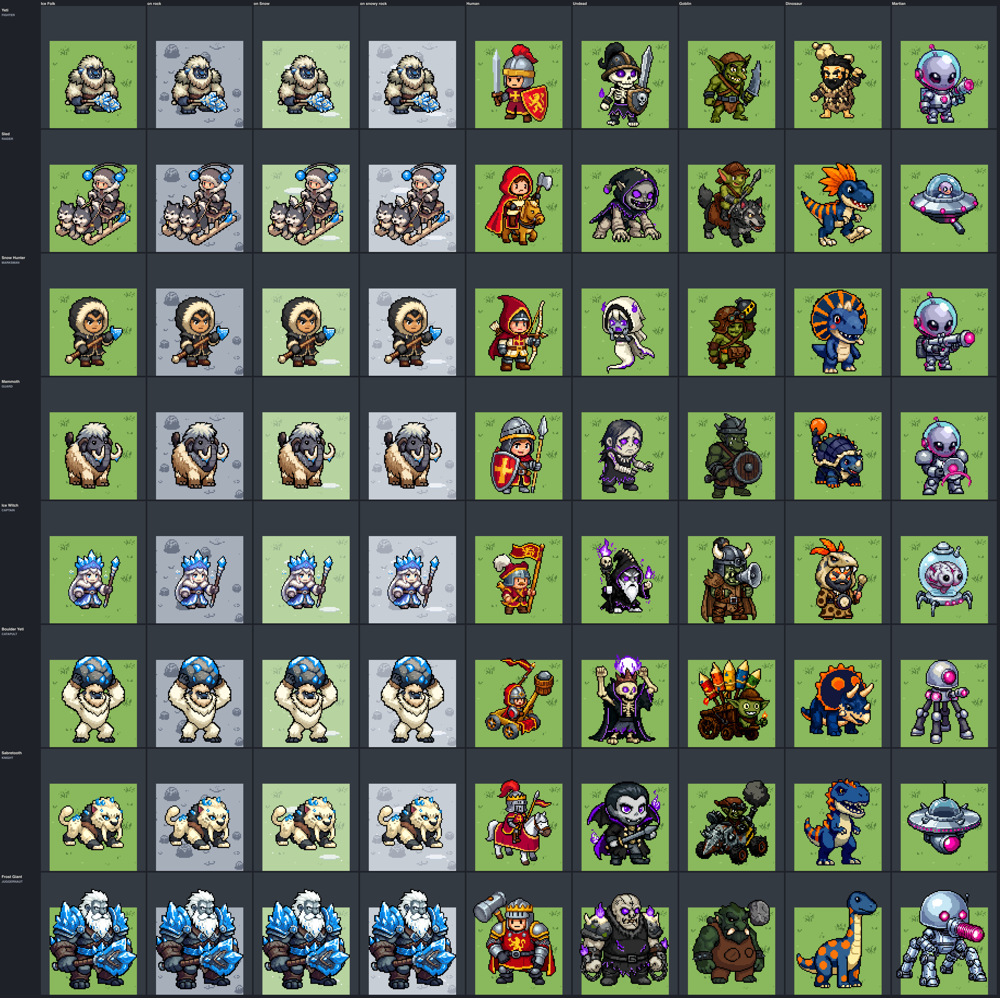
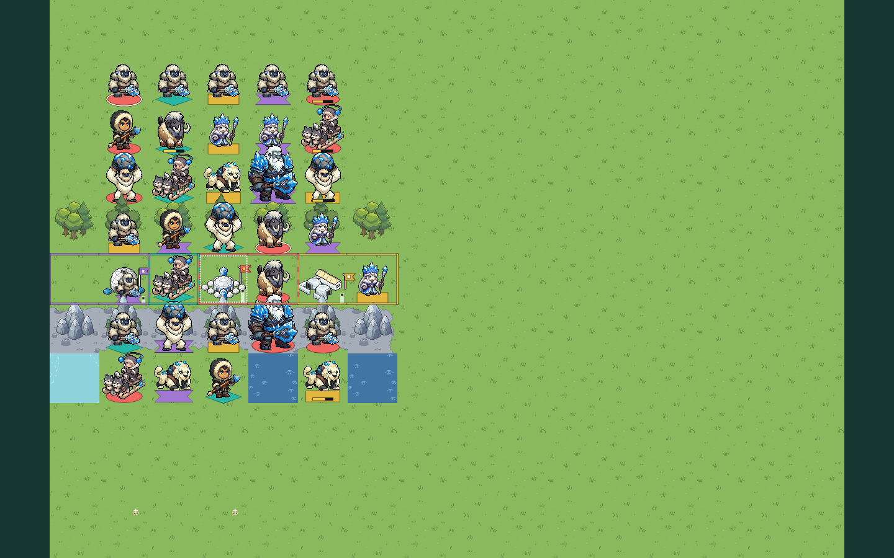
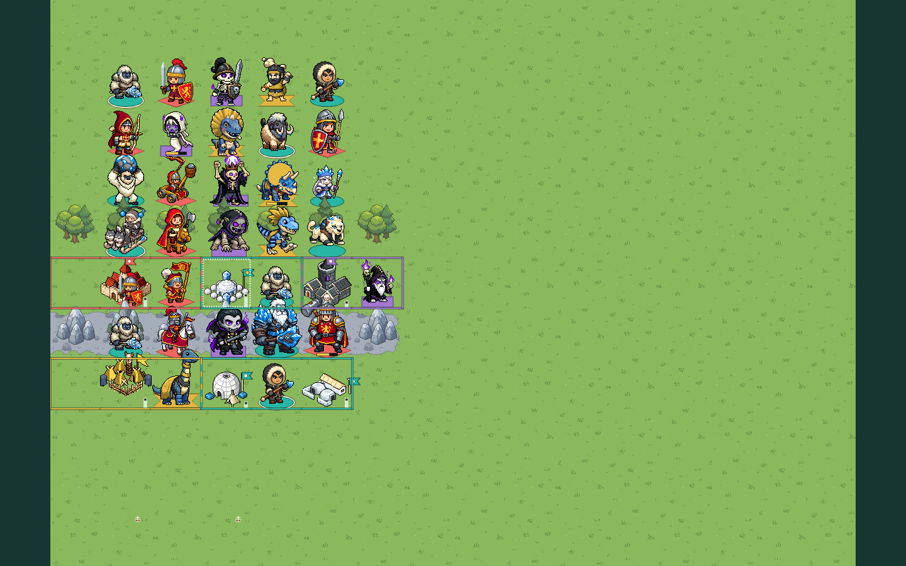
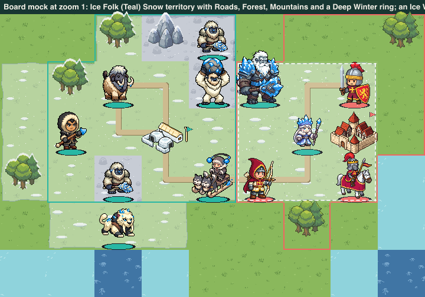

# Faction fragment: ICE_FOLK

**Status:** direction chosen and production art made in bead
`pulp_wars-7g3.5` (batch `direction-ice-folk`), **not wired into the game
yet**. The user delegated the look: "pick art direction and implement. I'll
come back when it's done and fix or not." The root proposed "frost and fur"
(warm white fur, slate faces, one glacier ice-blue accent); this bead
measured that proposal and its alternatives in a short study, kept the fur
with a warmer shade and moved the accent to a deeper ice blue. Every
decision below is recorded so that it can be overruled.

The art pipeline reads the two `text` blocks under **Prompt fragment** and
**Negative fragment** below as layer 3 of every Ice Folk prompt, so edit
them here and nowhere else. Recipes that were already generated keep the
request stored in their record (see the
[pipeline](../CHIBI_PIPELINE.md#fragment-changes-and-historical-records));
the first study recipes were made with the root's first fragment.

The rules and roster come from the
[Ice Folk spec](../../product/RULESET_7_ICE_FOLK.md) (sections 3 and 13).
Patrol Boat, Battleship and the embarked transport reuse the shared ship
art.

## Identity

The things from the peaks: shaggy snow apes, ice-age hunters in fur parkas,
a woolly mammoth, a sabre-toothed cat, a Frost Giant and an Ice Witch under
whom the ground is winter. Friendly and calm, never scary; a winter
picture book, not a horror film.

The faction wears **fixed colours**: warm white and cream fur shaded warm
taupe, charcoal slate on the beasts' faces, hands and feet, dark brown-grey
hide and furs, pale ivory bone, and exactly one accent, a deep ice blue. No
sprite has an owner area or a mask. The player is read from the
seat-shaped plate under a unit, the pennant on a city and the territory
border.

## Prompt fragment

It names only a mood, materials, surfaces, colours and small motifs: no
figure and no place or building. ("Beasts" is the one exception: it keeps
the slate skin off the people.)

```text
Faction: ice-age folk of the frozen mountain peaks, calm and friendly. Their
fixed colours: shaggy warm white and cream fur shaded with warm taupe grey,
never blue-grey; dark charcoal slate on the bare faces, hands and feet of
beasts; dark brown-grey hide and furs; pale ivory bone; and exactly one
accent colour, a bright clear ice blue with white highlights, only as small
ice crystals, frost and ice shards.
```

## Negative fragment

Red, gold, orange and fire are the Human, Goblin and Dinosaur colours;
green the Grass and the Goblins; purple, violet, magenta and pink the
Undead and the Martians; metal armour, steel and chrome the Humans and the
Martians. Blue-grey and grey fur are excluded because they are the colour
of the Mountain rock (below).

```text
red, crimson, gold, brass, orange, fire, flames, green, lime, purple,
violet, magenta, pink, blue-grey fur, grey fur, metal armour, steel, chrome,
plate armour, medieval knight, helmet, sword, gun, scary, horror, realistic,
large glowing area
```

## How the direction was chosen

A short study on three units (Yeti, Ice Witch, Mammoth), evidence in
[`study-options-x3.png`](../../../art/pixellab/reviews/chibi-batch-direction-ice-folk/study-options-x3.png)
and `study.json` (`npx tsx scripts/art/ice-folk-direction/study.ts`).
CIE76 colour difference: about 10 is clear at a glance, 20 and more are
different colours; "worst" is the smallest of normal vision, deuteranopia
and protanopia.

**Before any call**, the root's colours were measured against the
terrain and the colours already taken: glacier ice blue `#8fe3ff` is 12
from Shallow Water and 16 from the Martian glass; a blue-grey fur shade
(`#9aa6bd`) is **6** from the Mountain rock. So the study drew the root's
direction and its alternatives and measured them on real sprites.

**Fur** (three Yeti options, PixelLab edits of one Yeti):

| Option                                    | Lit, shade           | Lit against Grass, rock | Shade against rock | Verdict                                                                                    |
| ----------------------------------------- | -------------------- | ----------------------- | ------------------ | ------------------------------------------------------------------------------------------ |
| F1 warm white, blue-grey shade (`yeti-a`) | `#dbd8c1`, `#747a82` | 44, 26                  | 18                 | rejected: the shade is the rock's hue, and it falls in the accent step's band (turns blue) |
| **F2 warm white, taupe shade**            | `#ddd9c1`, `#8d8273` | 44, 26                  | **22**             | **chosen**                                                                                 |
| F3 honey cream (`yeti-fur-c`)             | `#f1deb6`            | 42, 36                  | 23                 | rejected: reads orange, like a lion; 43 from the Gold plate                                |

All three lit furs have a luminance contrast of only about 1.6 against the
rock: no fur colour pale enough to read as snow fur can be dark against a
grey-white Mountain. What carries a Yeti there is measured below.

**Accent** (three options on the same three units; A1 is what PixelLab
draws, A2 and A3 are deterministic recolours of the same pixels; the edit
`yeti-ice-b` shows that asking PixelLab for a deep ice blue by hex drew a
dark royal blue, `#0813af`):

| Option                            | Lit       | Shallow Water | Teal plate | Martian glass, lit       | Worst of the three | Verdict                  |
| --------------------------------- | --------- | ------------- | ---------- | ------------------------ | ------------------ | ------------------------ |
| A1 glacier ice blue (the root's)  | `#a4f1fa` | 10            | 32         | 14 (2 for a deuteranope) | 2.2                | rejected                 |
| **A2 deep ice blue**              | `#37b1fa` | **38**        | **55**     | **41**                   | **29**             | **chosen**               |
| A3 frost white, blue-violet shade | `#eefdfe` | 25            | 48         | 12                       | 4.5                | rejected: Martian chrome |

A2 against the colours near it: Dinosaur blue `#205794` 36, Deep Water 26,
the Violet plate 45 (13 for a deuteranope), the Undead violet 91.

So: **F2 fur and the A2 accent.** The accent is pinned by a pipeline step
(`ice-folk-blue`, below), because PixelLab draws "ice blue" pale whatever
the prompt says.

## Palette

Measured on the eight unit masters
([`palette.json`](../../../art/pixellab/reviews/chibi-batch-direction-ice-folk/palette.json)).

| Role                         | Colours                                   | Share | Used for                                                      |
| ---------------------------- | ----------------------------------------- | ----- | ------------------------------------------------------------- |
| Fur and cream, lit           | mean `#e3d5b7`; `#fffbe6`, `#f9e8c6`      | 24%   | Yetis, Mammoth wool, Sabretooth coat, parka hoods             |
| Fur, taupe shade             | mean `#8c7667`; `#aa856e`, `#847072`      | 9%    | the shade of the fur, never blue-grey                         |
| Slate faces, hands and stone | mean `#555c69`; `#4e4e59`, `#2b2e36`      | 10%   | the beasts' faces, hands and feet, the Frost Giant's skin     |
| Dark brown-grey hide         | mean `#493736`; `#594f4d`, `#2d2b2b`      | 6%    | parkas, straps, the Giant's leathers                          |
| Navy                         | mean `#22324f`; `#1c233e`                 | 7%    | the Ice Witch's robe                                          |
| Snow white                   | `#ffffff`, `#fafcf9`                      | 4%    | highlights, frost trim, the Witch's hair                      |
| **Ice blue (accent)**        | lit `#24abfc`; mean `#198de3`; hue 203°   | 8%    | crystals, club, crown, bolas, harpoon tip, the Giant's armour |
| Outline                      | `#000000`                                 | 22%   | the thick outline of the chibi look                           |
| Code-drawn                   | `ICE_FOLK_PALETTE_V7` (below)             | n/a   | Snow overlay, Blizzard, Chill markers, HP window              |
| Effect sprites               | the eight colours of `ice-folk-frost.png` | n/a   | the five effect sprites                                       |

Rules:

- **One accent, pinned by a pipeline step.** The `ice-folk-blue` preset of
  the [pipeline](../CHIBI_PIPELINE.md#the-ice-folk-batch-bead-pulp_wars-7g35)
  finds the drawn ice by colour (hue 175° to 218°, saturation at least 0.2,
  value at least 0.62) and moves it to hue 205° with its saturation raised
  (`min(0.95, s * 1.4 + 0.3)`). Fur, hide, bone, skin and the slate faces
  are below saturation 0.2 or value 0.62; the navy robe is bluer (225° and
  more) and darker. The masters measure the accent at hue 197° to 213°.
- **No red, no key colour.** No master has a pixel in the owner key's band
  (hue 340° to 5°, saturated); a test checks it. The Snow Hunter's and the
  Sled driver's first faces did, and were recoloured to a light golden tan.
- **The accent is on every unit:** from 16 pixels (the Mammoth's frosted
  tusk tips) to the Frost Giant's armour (19% of it, the one large ice
  area, as the Martian Colossus's cannon is the one large magenta area).

## Readability

From [`readability.json`](../../../art/pixellab/reviews/chibi-batch-direction-ice-folk/readability.json).

| Check                                     | Result                                                                                                                                                                                                                                                   |
| ----------------------------------------- | -------------------------------------------------------------------------------------------------------------------------------------------------------------------------------------------------------------------------------------------------------- |
| **Fur on Mountain rock** (the risk)       | lit fur 29 from the mean rock (`#a2aab6`), 28 from its light tones, 41 from the peaks; shade 27. Different colours, but a luminance contrast of only **1.6**.                                                                                            |
| What carries a Yeti on a Mountain         | the black outline (22% of a unit, contrast **9.5** against the light rock), the charcoal face and hands (31 from the rock, contrast 2.9), the hide (46, contrast 4.7) and the ice accent (40). In the scenes the Yetis on the Mountain row read at once. |
| Fur on Grass and Forest                   | 43 and 41 (28 and 31 for a deuteranope).                                                                                                                                                                                                                 |
| Accent against Shallow Water, Teal, glass | 43, 60, 36 (lit); 51, 67 (mean); never below 33 under either colour-vision deficiency.                                                                                                                                                                   |
| Accent against Dinosaur blue, Deep Water  | 34 and 27: a small light accent against a large dark hide or water.                                                                                                                                                                                      |
| Accent against the Violet plate           | 43, but 16 and 14 under deuteranopia and protanopia.                                                                                                                                                                                                     |
| Fur on the Snow overlay                   | **19** on Snow over Grass (6 for a deuteranope), 22 on Snow over rock; contrast 1.1. An Ice Folk unit on its own Snow is the weakest case: the outline, the slate face (contrast 4.1) and the plate under it carry it.                                   |
| Fur against the Gold plate                | 48.                                                                                                                                                                                                                                                      |
| Sizes                                     | Yeti 52 x 54, Sled 69 x 76, Snow Hunter 53 x 65, Mammoth 53 x 61, Ice Witch 48 x 55, Boulder Yeti 58 x 80, Sabretooth 60 x 49, Frost Giant 80 x 92 (in the canvases of their roles).                                                                     |

## Silhouette language

This guides the subject lines; it is not sent to PixelLab.

- **Shaggy, round, low.** Apes, wool and fur hoods: round tufted outlines
  against the Humans' helmets, the Undead's hoods and the Martians' domes.
- **Apes are one family.** Yeti and Boulder Yeti share fur, a charcoal
  face with small fangs and big slate hands; the Boulder Yeti is bigger
  (the `CATAPULT` canvas) with its arms up under a blue boulder.
- **People wear hoods.** The Snow Hunter and the Sled driver have tan faces
  in cream fur hoods and dark brown-grey parkas; the Ice Witch has no hood
  and no hat, only white hair and an ice crown.
- **Ice is the accent and the tell:** a crystal on every piece, never a
  whole blue garment.

## Roster

Batch [`direction-ice-folk`](../../../scripts/art/chibi/batches/batch-direction-ice-folk.json),
subject lines in
[`subjects/ICE_FOLK.json`](../../../scripts/art/chibi/subjects/ICE_FOLK.json).
The canvas follows the mechanical role, as for every faction.

| Unit (role)                | Canvas   | Sprite   | Accepted recipe           | What it shows, and how its job reads                                                                        |
| -------------------------- | -------- | -------- | ------------------------- | ----------------------------------------------------------------------------------------------------------- |
| Yeti (`FIGHTER`)           | 56 x 80  | 52 x 54  | `yeti-fur-b`              | a broad white snow ape with a charcoal face and an ice-crusted bone club: the plain soldier, clearly an ape |
| Sled (`RAIDER`)            | 72 x 88  | 69 x 76  | `sled-a`                  | two grey-and-white huskies, an ivory sled and a hooded driver whirling a bolas with two ice weights         |
| Snow Hunter (`MARKSMAN`)   | 56 x 80  | 53 x 65  | `snow-hunter-a-skin-hair` | a lean hooded hunter with an ivory harpoon tipped with an ice crystal: the human-sized one                  |
| Mammoth (`GUARD`)          | 56 x 80  | 53 x 61  | `mammoth-a-edit`          | a woolly mammoth in side view: cream-to-tan wool, charcoal face and trunk, long ivory tusks with frost tips |
| Ice Witch (`CAPTAIN`)      | 56 x 80  | 48 x 55  | `ice-witch-c`             | pale face, white hair, a tall ice crown, navy robe with white fur, a staff with an ice crystal              |
| Boulder Yeti (`CATAPULT`)  | 72 x 88  | 58 x 80  | `boulder-yeti-a-edit`     | a bigger Yeti lifting an ice-crusted boulder over its head                                                  |
| Sabretooth (`KNIGHT`)      | 72 x 88  | 60 x 49  | `sabretooth-a-edit-frost` | a pale snow-leopard cat in mid-prowl, two long ivory fangs, ice-blue eyes and frost on its back             |
| Frost Giant (`JUGGERNAUT`) | 88 x 104 | 80 x 92  | `frost-giant-a-edit`      | a towering slate-stone giant in ice armour with an ice axe and a frosty white beard                         |
| Patrol Boat, Battleship    | shared   | (shared) | (unchanged)               | the shared ships with the player-coloured sail                                                              |

Each unit has a 48 x 48 portrait (`chibi-direction-portrait-ice-folk-<unit>`):
busts for the Yeti, the Snow Hunter, the Ice Witch, the Boulder Yeti, the
Sled driver (with his husky), the Frost Giant and the Sabretooth's head;
the Mammoth is a whole small mammoth.

How they were made (72 PixelLab calls in all, 43 creations and 29 edits;
38 recipes are rejected with a recorded reason):

- **Units are fresh creations,** with colour edits where PixelLab drifted:
  the Mammoth's orange trunk and brown lower wool, the Boulder Yeti's brown
  bear coat, the Sabretooth's tan and brown patches (and then its frost),
  the Frost Giant's blond beard, the Snow Hunter's red face and fringe. The
  Sled is the `machine` class (a vehicle, not one figure); the Mammoth and
  the Sabretooth use the side view of the Dinosaur quadrupeds.
- **The Ice Witch** is a creation with the final fragment: the first one,
  made with the root's fragment, got its "slate skin".
- **Portraits** of beasts came out as whole small figures; a "zoom in to a
  close-up" edit made the busts, and the Boulder Yeti's portrait is a
  sibling edit of the Yeti's.

## Cities

An ice-age camp growing into an igloo town, in the direction's calm
building style (`calm-settlement`, subject keys `CITY:ICE_FOLK:<level>/CALM`),
on the canvases of the Undead direction cities. No part takes a player
colour; each level has a bone pole of its own for the code-drawn pennant.

| Level | Asset                             | Canvas  | What it shows                                                                | Pennant anchor (`ICE_FOLK_FLAG_ANCHORS_V7`) |
| ----- | --------------------------------- | ------- | ---------------------------------------------------------------------------- | ------------------------------------------- |
| 1     | `chibi-direction-ice-folk-city-1` | 80 x 80 | a snow-block igloo, a cream hide cone tent, two ice blocks, a tall bone pole | `{ x: 64.5, y: 22, pole: 0 }`               |
| 2     | `chibi-direction-ice-folk-city-2` | 88 x 88 | two igloos and a long hall with a cream hide roof inside a snow-block wall   | `{ x: 79.5, y: 39, pole: 0 }`               |
| 3     | `chibi-direction-ice-folk-city-3` | 96 x 88 | a domed great hall with two ice towers in a ring of igloos                   | `{ x: 75, y: 26, pole: 0 }`                 |

The anchor is the top of the pole, in master pixels from the sprite's
top-left corner. Each city is a creation at 96 x 96 and one edit that
removes the grass slab (City 2's also darkened its orange doorways).

## Icons

48 x 48, made with the `icon` class like the existing action icons.

| Subject                            | Asset                                     | What it shows                                     |
| ---------------------------------- | ----------------------------------------- | ------------------------------------------------- |
| `ICON:ACTION:THROW_BOLAS`          | `chibi-direction-icon-action-throw-bolas` | two ice weights on a cream cord                   |
| `ICON:ACTION:COLD_SNAP`            | `chibi-direction-icon-action-cold-snap`   | an ice snowflake in a ring of shards              |
| `ICON:ACTION:SHATTER`              | `chibi-direction-icon-action-shatter`     | ice bursting into shards round a white flash      |
| `ICON:ACTION:SWEEP`                | `chibi-direction-icon-action-sweep`       | a mammoth's tusk swinging with a white swoosh     |
| `ICON:ACTION:ROCKFALL`             | `chibi-direction-icon-action-rockfall`    | an icy rock flying off a small snowy peak         |
| `ICON:ACTION:PROWL`                | `chibi-direction-icon-action-prowl`       | a trail of big cat paw prints                     |
| `ICON:TECH:ICE_FOLK:FORTIFICATION` | `chibi-direction-icon-tech-deep-winter`   | Deep Winter: an igloo with snow spreading from it |
| `ICON:TECH:ICE_FOLK:EXPLOSIVES`    | `chibi-direction-icon-tech-brittle`       | Brittle: an ice cube split by zigzag cracks       |
| `ICON:STATUS:CHILLED`              | `chibi-direction-icon-status-chilled`     | the frost glyph: one symmetrical ice snowflake    |
| `ICON:STATUS:FROZEN`               | `chibi-direction-icon-status-frozen`      | a cube of clear ice with icicles                  |

`ICON:ACTION:THROW_BOLAS` and `ICON:ACTION:COLD_SNAP` are the subjects of
the two new command kinds; the Ice Folk subject type lists them by name
until the engine adds the kinds. Charge (Sled) keeps the Raider's icon.

## Ability effects

Five sprites in the format of the Undead and Martian effects (`effect`
class, mapped to the eight colours of
[`ice-folk-frost.png`](../../../scripts/art/chibi/palettes/ice-folk-frost.png):
outline `#0e1c30`, deep ice `#145a9c`, ice blue `#2f9be8`, light ice
`#7fcbff`, frost `#d6f0ff`, white, slate `#5b6577`, ivory `#e8dcc2`).

| Subject                 | Asset (`chibi-direction-effect-ice-folk-…`) | Size    | Use                                                                    |
| ----------------------- | ------------------------------------------- | ------- | ---------------------------------------------------------------------- |
| `EFFECT:SHATTER`        | `shatter`                                   | 48 x 48 | the burst: sharp shards flying out from a white flash                  |
| `EFFECT:SHATTER_SHARDS` | `shatter-shards`                            | 48 x 48 | the loose shards that fly out, fall and melt                           |
| `EFFECT:COLD_SNAP`      | `cold-snap`                                 | 48 x 48 | a ring of ice points with an empty middle, scaled out to two tiles     |
| `EFFECT:BOLAS`          | `bolas`                                     | 40 x 40 | the thrown bolas, spinning along its arc from the Sled                 |
| `EFFECT:FROST_HIT`      | `frost-hit`                                 | 40 x 40 | frost forming on a unit as it is chilled (Bolas, Cold Snap, Cold Aura) |

**The Shatter** is the faction's "wow" moment, so it has a timeline
(`ICE_FOLK_SHATTER_TIMELINE_V7`, frames in
[`shatter-frames-x3.png`](../../../art/pixellab/reviews/chibi-batch-direction-ice-folk/shatter-frames-x3.png)):
0 to 140 ms the victim is cased in ice to the top
(`iceFolkFrozenCasingV7` with `heightShare` 1); 140 to 220 ms three white
cracks run over the casing and the sprite shakes by 1 px; at 220 ms the
sprite is gone and the burst plays at its centre (scale 0.7 to 1.25, alpha
1 to 0.5, to 520 ms); from 300 to 950 ms the shards spread (scale 1 to
1.7), fall 8 px and fade. No body, no Grave, no death blast, which is what
tells a Shatter from an ordinary death.

## Code-drawn pieces

The spec makes these code-drawn. The colours and the pure drawing
functions are in
[`chibi-direction-ice-folk-presentation.ts`](../../../src/assets/chibi-direction-ice-folk-presentation.ts),
which imports nothing: the same bytes in the game, the review and the
tests. Rasters were considered for the Snow overlay and rejected: a snow
texture would hide which tile is Grass, Forest or Mountain, and it would
need 16 edge variants per terrain to end cleanly at a territory edge; a
wash computed per edge set does both.

`ICE_FOLK_PALETTE_V7`: ice `#37b1fa`, ice glow `#7fcbff`, ice pale
`#d6f0ff`, ice dark `#145a9c`, outline `#0e1c30`, snow `#f5f8fc`, snow shade
`#bccbdd`, snow rim `#9aaec7`, fur `#ddd9c1`, fur shade `#8d8273`, slate
`#3b4352`, navy `#1b2552`.

### Snow overlay

`iceFolkSnowTileV7(edges, variant)` returns an 80 x 80 RGBA tile;
`iceFolkSnowVariantV7(at)` picks one of four variants per cell. Draw it on
every explored land tile whose view flag `snow` is true, **over the
terrain ground and under Roads, improvements, resources, tall terrain
bodies, cities and units**; build each (edges, variant) tile once and
cache it (64 tiles at most), as the Mountain fringe does.

- **Wash:** snow white at 42% alpha. Grass becomes a pale sage white (27
  from Grass), Forest ground white under green trees, Mountain rock a
  lighter grey (13 from the rock: the caps and drifts carry it there).
- **Drifts and sparkle:** three low white lenses with a blue-grey shade
  line and ten single sparkle pixels per tile, at hashed positions at least
  7 px from the edges. Every border pixel is the plain wash, so a field of
  Snow has no seam (a test checks it).
- **Edges:** where a neighbour is not Snow (a territory edge, water, an
  unexplored cell) the wash is cut 2 to 5 px inside the edge on a smooth
  ragged profile that meets itself at the cell corners, with a 1 px
  `snowRim` bank. Neighbouring Snow tiles are never cut.
- **Tall terrain:** `iceFolkSnowCapsV7(body)` returns snow caps (the top 3
  opaque rows of each shape, 85% white, outline pixels kept) to draw over
  a tree or peak body on a Snow cell, after the body.
- Roads stay on top and readable; a city's territory border is drawn over
  the cut edge as today.

Evidence:
[`snow-tiles-x2.png`](../../../art/pixellab/reviews/chibi-batch-direction-ice-folk/snow-tiles-x2.png)
(every edge set on Grass and rock, and a 6 x 3 field),
[`terrain-x2.png`](../../../art/pixellab/reviews/chibi-batch-direction-ice-folk/terrain-x2.png)
and the board mock
[`snow-board-zoom-1.png`](../../../art/pixellab/reviews/chibi-batch-direction-ice-folk/snow-board-zoom-1.png).

### Blizzard

`ICE_FOLK_BLIZZARD_V7` and `iceFolkBlizzardFlakesV7(at, timeMs)`: on every
explored tile whose flag `blizzard` is true, water included, a 8% white
veil and nine falling flakes per tile (1 px dots and 2 px flakes with a
shade pixel; 14 px/s down, 5 px/s to the left, a 2 px sway; deterministic
by cell and time, so a paused or reduced-motion frame is stable; time 0
for reduced motion). Over the Snow overlay and the terrain, under the
plates and units. The selected or hovered Witch adds the outline of her
nine tiles: a 2 px white dashed line (6 on, 4 off) at 55%, inset 3 px,
corner radius 10. Calm, not a storm.

### Chill markers

`ICE_FOLK_CHILL_MARKER_V7`, on units of any owner
([`markers-x3.png`](../../../art/pixellab/reviews/chibi-batch-direction-ice-folk/markers-x3.png)
shows them on six factions' units):

- **Frozen** (`sluggish`): `iceFolkFrozenCasingV7(sprite)` returns the
  unit cased in ice to the waist: the silhouette widened by 2 px from the
  feet up to 45% of the sprite's height, filled ice glow at 50%, a pale
  rim along its top and sides, an ice-dark outline and two white glints.
  Draw it over the sprite at the sprite's position minus the 3 px margin.
  Heavy on purpose: "slow this turn".
- **Frosted** (Chilled, not sluggish): a 2 px ice-pale rime on the top
  edges of the sprite (`iceFolkSnowCapsV7(sprite, { depth: 2, colour:
icePale, alpha: 0.85 })`) and the `ICON:STATUS:CHILLED` glyph at 16 px in
  the status slot (the Plague and Bitten slot). Light: "can be shattered".
- **Thawing:** nothing on the board.
- **Shatter window on the HP bar:** while an Ice Folk seat is in the match,
  the lowest {threshold} HP of a Chilled unit's bar are drawn in
  `#7fcbff` with a 1 px white divider (`shatterWindow`).
- **Cold Aura pulse:** the `FROST_HIT` sprite on each chilled neighbour and
  a 200 ms ice-glow flash over the Giant's eight tiles; **Cold Snap:** the
  `COLD_SNAP` ring scaled from the Witch's tile out to five tiles across
  over 450 ms, then `FROST_HIT` on each target.

## What the UI bead must wire

`pulp_wars-7g3.6` (the faction is in the engine by then):

1. Add `...CHIBI_DIRECTION_ICE_FOLK_ART_ASSETS_V7` to
   `chibiDirectionArtRegistryV7`
   ([`chibi-direction-art-manifest.ts`](../../../src/assets/chibi-direction-art-manifest.ts)).
   The subjects exist (`IceFolkArtSubjectV7` in
   [`chibi-art-v7.ts`](../../../src/assets/chibi-art-v7.ts)).
2. Resolve them: `unitArtSubjectV7` for an `ICE_FOLK` unit
   (`UNIT:ICE_FOLK:<ROLE>`), `cityArtSubjectV7` and `CityArtFactionV7` for
   an Ice Folk city, the fallback of `chibiFallbackSubjectV7` (Human art
   with the Ice Folk badge), and the portrait, icon and technology-icon
   lookups of the DOM art hook (`ICON:TECH:ICE_FOLK:FORTIFICATION` for
   Deep Winter, `…:EXPLOSIVES` for Brittle, by the viewer's faction).
3. Copy `ICE_FOLK_FLAG_ANCHORS_V7` into `DIRECTION_FLAG_ANCHORS_V7`.
4. Draw the Snow overlay, the snow caps, the Blizzard and the Witch's
   outline, the Frozen and Frosted markers and the HP Shatter window from
   the presentation module, and play the effect sprites (the Shatter
   timeline, Cold Snap, Bolas, frost on hit) through the effects canvas.
5. Turn round the test "is not wired into the game yet" of
   `tests/unit/chibi-ice-folk-direction-assets.test.ts`.

## Evidence

`npm run art:chibi-ice-folk-direction-review` writes
[`art/pixellab/reviews/chibi-batch-direction-ice-folk/`](../../../art/pixellab/reviews/chibi-batch-direction-ice-folk/)
(see the [pipeline document](../CHIBI_PIPELINE.md#the-ice-folk-batch-bead-pulp_wars-7g35)).









## Decisions

Decided in bead `pulp_wars-7g3.5` under the user's delegation:

1. **Look:** "frost and fur", the root's proposal, with two changes made by
   measurement: a warm taupe fur shade instead of blue-grey, and a deep
   ice blue (hue 203°, lit `#24abfc` on the masters) instead of the pale
   glacier ice blue.
2. **Accent pinned by `ice-folk-blue`,** with a saturation step added to the
   accent mechanism for it.
3. **Skin:** charcoal slate for the beasts; light golden tan for the
   hunters; pale cream for the Witch.
4. **Mammoth:** no rider; side view, filling the 56 px `GUARD` canvas (the
   role's canvas binds it; the spec's "wide rather than tall" is met inside
   it: 53 x 61).
5. **Boulder Yeti:** the Yeti family's fur, not a darker coat. The spec
   asks for "a larger, darker Yeti"; the first creation was a brown, bear
   like coat outside the faction's colours, so it is told from the Yeti by
   size (the `CATAPULT` canvas, 80 px tall against 54), the raised arms and
   the blue boulder instead.
6. **Frost Giant:** slate stone skin, not blue skin: a blue skin would fall
   in the accent's band and fight the ice armour.
7. **Sabretooth:** riderless snow-leopard cat with frost on its back.
8. **Cities:** an igloo camp to an igloo town with a bone pole for the
   pennant, calm style, the Undead direction canvases.
9. **Snow, Blizzard and Chill markers are code-drawn** from pure functions;
   no raster tile set.
10. **Status and technology icons** use the families `ICON:STATUS:*` (the
    Martian precedent) and `ICON:TECH:ICE_FOLK:*`.
11. **Not registered:** the module is imported only by the review scenes
    until `pulp_wars-7g3.6`.

## Weak spots

- **Pale fur on pale ground.** On Mountain rock the fur differs by about 28
  but its luminance contrast is 1.6; on the Snow overlay over Grass by 19
  (6 for a deuteranope). The outline, the charcoal faces and the plate
  carry the unit; in the scenes it reads, but it is the faction's weakest
  case.
- **Snow on Mountain is subtle** (the wash is 13 from the rock); the snow
  caps on the peaks carry it.
- **The accent step catches a few lit tones of the slate faces,** which
  turn a little bluer: the Yeti's mouth and the Sabretooth portrait's
  cheeks have blue pixels.
- **The Boulder Yeti is not darker** than the Yeti (decision 5).
- **The Frost Giant wears brown leathers** and reads a little like an
  armoured dwarf at x4; its portrait's beard is ice blue where the map
  sprite's is white.
- **Portraits:** the Mammoth's is a whole small mammoth, not a bust; the
  Sled driver's recoloured mouth is a dark smudge.
- **The Bolas icon** can read as a pair of cherries at 24 px.
- **Brittle and Frozen** are both ice cubes (cracked against icicled); they
  appear on different surfaces (technology card and status line).
- **City 2 has no ice** (an edit that added it turned the whole village
  blue and was rejected), and City 3 is a flat, sparse ring of igloos
  beside the other factions' crowded capitals.
- **The Martian test's list of accent presets** now names `ice-folk-blue`.
- **The review scenes use stand-in factions,** and the Snow overlay and the
  Blizzard are shown in a board mock (approximate plates, Roads and
  borders), not in the renderer.
