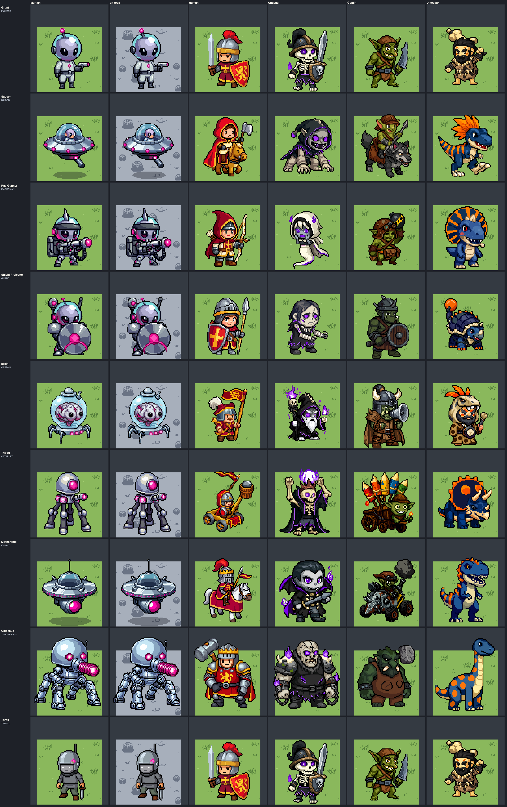
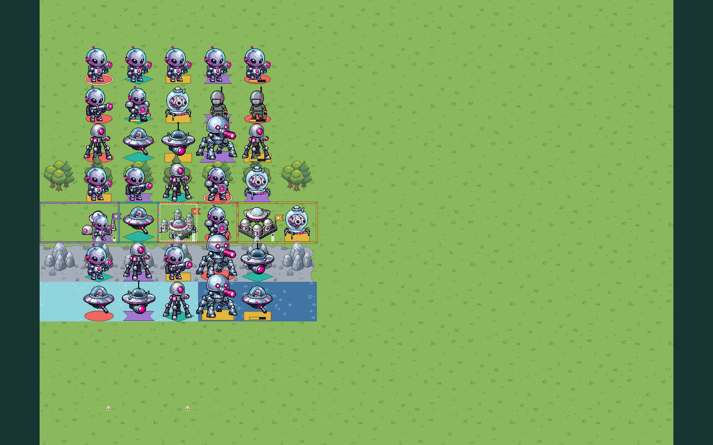
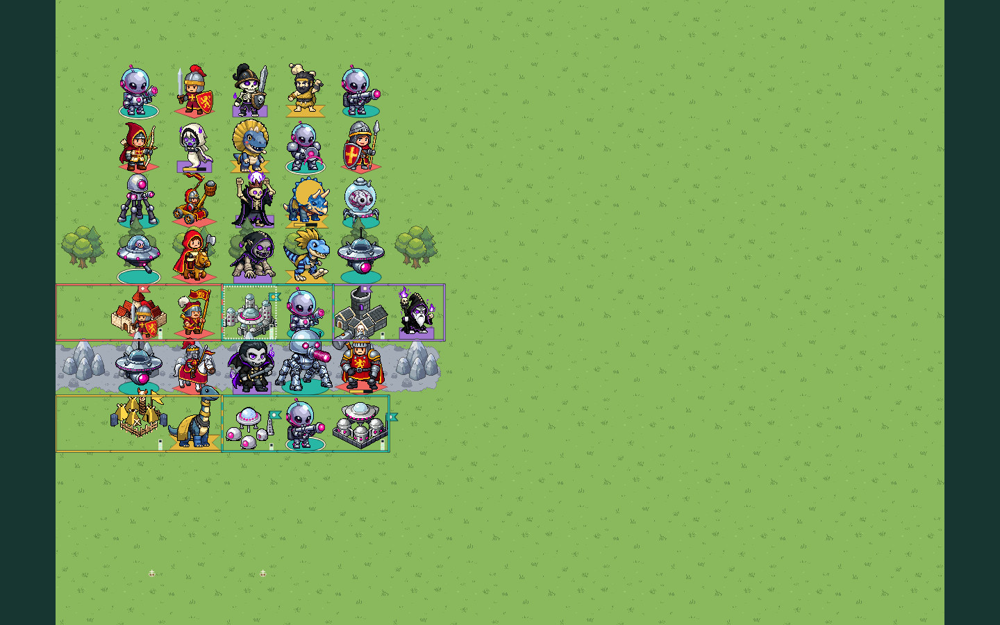
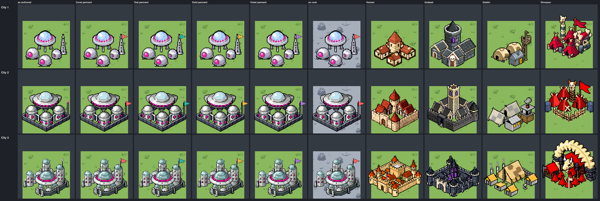
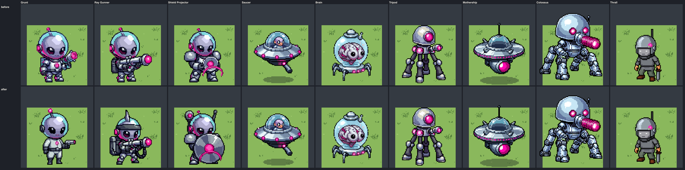
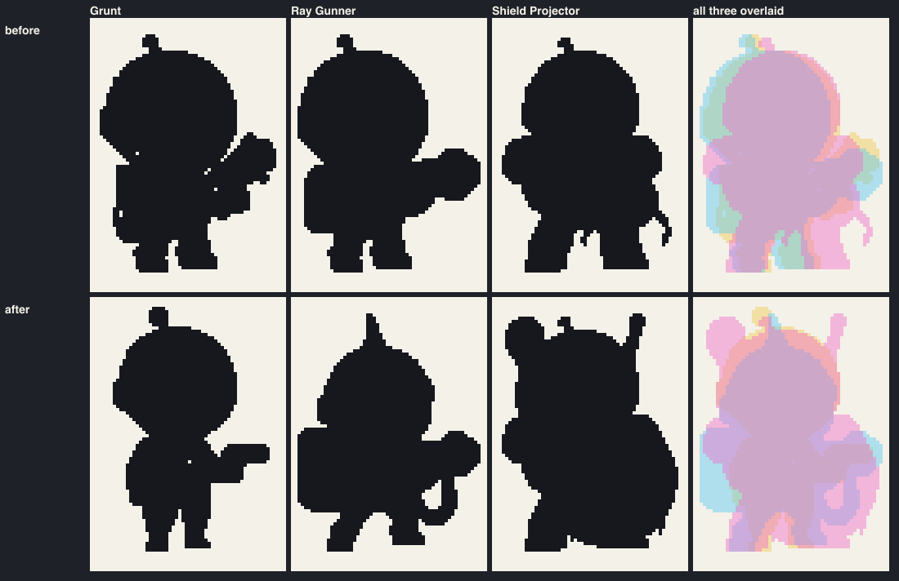
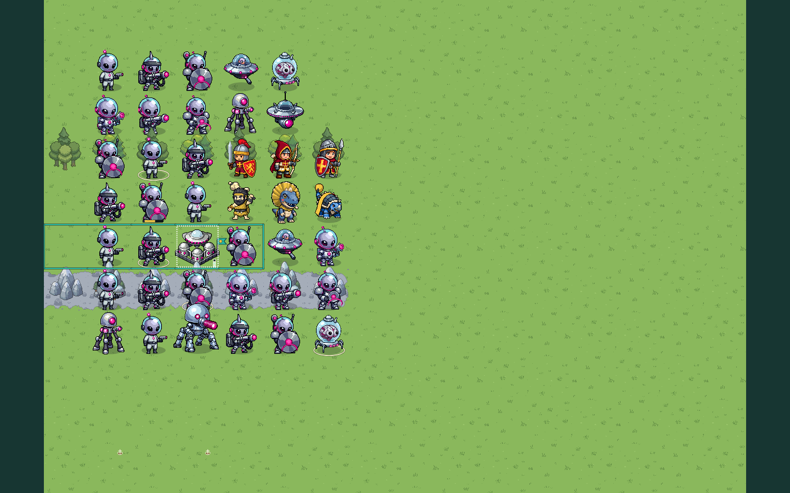

# Faction fragment: MARTIAN

**Status:** production art made in bead `pulp_wars-t6s.6` (batch
`direction-martian`), **live in the default look since the Martian UI bead
`pulp_wars-t6s.4`** (see [What the UI bead wired](#what-the-ui-bead-wired)).
The user's direction
(2026-10-02): "add the martians. Come up with a nice look for them, colors
and all and just do it. make all the decisions. if i don't like something
tomorrow we'll change it." The root chose the look, "retro pulp invaders,
chrome and magenta"; every other decision below was made in this bead and is
recorded so that it can be overruled.

The art pipeline reads the two `text` blocks under **Prompt fragment** and
**Negative fragment** below as layer 3 of every Martian prompt, so edit them
here and nowhere else. Recipes that were already generated keep the request
stored in their record (see the
[pipeline](../CHIBI_PIPELINE.md#fragment-changes-and-historical-records)).

The rules and roster come from the
[Martian spec](../../product/RULESET_7_MARTIANS.md) (sections 3 and 13).
Patrol Boat, Battleship and the embarked transport of a foot unit reuse the
shared ship art.

## Identity

Cheerful 1950s pulp invaders: toy-like flying saucers, tall walking machines
and small big-headed aliens in bubble helmets. They are cute and a little
smug, never scary: a tin-toy invasion, not a horror film. The faction theme
is a small high-tech force: frail bodies behind energy Shields, heat rays,
machines that walk or fly anywhere, and enslaved locals.

The faction wears **fixed colours**: polished chrome, dark gunmetal, pale
glass, lavender-grey skin and exactly one accent, hot magenta. No sprite has
an owner area or a mask. The player is read from the seat-shaped plate under
a unit, the pennant on a city and the territory border.

## Prompt fragment

It names only a mood, materials, surfaces, colours and small motifs: no
figure and no place or building.

```text
Faction: retro 1950s pulp science-fiction invaders, cheerful and toy-like.
Their fixed colours: polished chrome and silver-white metal shaded with soft
blue-grey, dark gunmetal joints and undersides, rivets and small fins, clear
pale glass domes with one white highlight, and exactly one accent colour, a
bright glowing hot magenta pink, only as small lights and glows: lamps,
lenses, antenna tips, emitter tips.
```

## Negative fragment

Green skin is excluded because green is the Grass and the Goblins; purple
and violet because violet is the Undead accent; red, gold, brown, wood and
leather because they are the Human and Goblin materials; blue, cyan, yellow
and orange glows because the faction has one accent.

```text
green skin, green alien, lime, slime, tentacles, blue glow, cyan glow,
yellow lights, orange flames, fire, red, gold, brass, brown, wood, leather,
rust, purple, violet, medieval, sword, bow, horse, scary, horror, realistic,
large glowing area
```

## Palette

Measured on the eight faction unit masters
([`palette.json`](../../../art/pixellab/reviews/chibi-batch-direction-martian/palette.json);
the Thrall is left out, since its drab cloth is not the faction's). The
table is the measurement of bead `pulp_wars-t6s.6`; after the
[redesign of the three aliens](#the-three-aliens-bead-pulp_wars-b5f1) the
review measures the accent at lit `#ef0f93`, mean `#aa1671`, 8% of a unit,
hue 323° (320° to 324° per unit), and 66, 50 and 56 from the Undead
violet and the Coral and Violet plates; the other roles moved by a point
or two.

| Role               | Colours                                                   | Share of a unit | Used for                                                               |
| ------------------ | --------------------------------------------------------- | --------------- | ---------------------------------------------------------------------- |
| Chrome, lit        | mean `#d1dbe1`; `#afc6d3`, `#ecf6f8`, `#ffffff`           | 14%             | hulls, suits, the Tripod's hood, dome huts                             |
| Chrome, shaded     | mean `#65718d`; `#61759e`, `#687c99`                      | 7%              | the soft blue-grey shade of chrome                                     |
| Gunmetal           | mean `#34354e`; `#3a3e5e`, `#1f2a3b`                      | 11%             | joints, undersides, legs, belts, boots, the Ray Gunner's tank          |
| Glass              | mean `#8db9cd`; `#c7e7f5`, `#9ed3e6`                      | 18%             | bubble helmets, saucer domes, the Brain's jar                          |
| Lavender-grey skin | mean `#8e8cb2`; lit `#b5b4d3`, shade `#6e749b`            | 11%             | alien heads; the Brain is a paler pink-grey                            |
| **Hot magenta**    | lit `#f30a96`; mean `#a81972`; shade `#540738`            | 9% (6% to 14%)  | ray emitters, eye lenses, running lights, antenna tips, the Shield arc |
| Outline            | `#000000` to `#010016`                                    | 21%             | the thick outline of the chibi look                                    |
| Code-drawn markers | `#ff2fb0`, glow `#ff8fd6`, pale `#ffd3ee`, dark `#8c1264` | n/a             | Shield bar, beams, glows (`MARTIAN_PALETTE_V7`)                        |
| Effect sprites     | the eight colours of `martian-magenta.png`                | n/a             | the five ability effect sprites                                        |

Rules:

- **One accent, pinned by a pipeline step.** PixelLab draws "hot magenta
  pink" anywhere from a purple magenta (hue 300°, the Mothership's beam
  port) to a pink red (hue 340°, the Grunt's lights). The `martian-magenta`
  accent preset of the
  [pipeline](../CHIBI_PIPELINE.md#the-martian-batch-bead-pulp_wars-t6s6)
  finds those pixels by colour (hue 285° to 350°, saturation at least 0.4,
  value at least 0.25) and moves them to hue 322° with a fifth of the hue
  spread, so every accent pixel of every sprite lies between 315° and 328°.
  The masters measure a mean hue of 322° (320° to 324° per unit).
- **Magenta against the Undead violet: clearly apart.** The lit magenta
  `#f30a96` differs from the lit violet `#a221ee` by **65** (CIE76; 20 and
  more are different colours), by 59 from the lightened violet trim, and by
  72 and 52 under deuteranopia and protanopia. The hues are 324° and 278°.
  The lime-yellow fallback was **not** needed.
- **Against the plates.** Coral `#f06762`: 52 (38 and 50 with the two colour
  vision deficiencies). Violet `#a277d2`: 57 (38 and 19). Gold: 111. Teal:
  125 in normal vision but **7 under deuteranopia**: for a deuteranope a
  magenta light and a Teal plate are the same hue and differ only in
  lightness (contrast 1.6). The lights are small and sit on chrome or
  gunmetal, never on the plate, so the unit still reads; it is recorded as
  a weak spot.
- **Against the other factions.** Human crimson `#a8202c`: 53. Dinosaur
  orange `#fe6d00`: 90.
- **No red, no key colour.** No master has a pixel in the owner key's band
  (hue 340° to 5°, saturated); a test checks it.
- **Chrome against Mountain is the weak contrast,** as expected: lit chrome
  differs from the rock by 16 to 18 (contrast 1.7), lavender skin by 18.
  The outline (21% of a sprite), gunmetal (47 from the rock, contrast 5.1),
  shaded chrome (24 to 26) and the magenta lights (85) carry a unit there.
  On Grass and Forest chrome differs by 53 to 57 and skin by 74. On Shallow
  Water chrome differs by 19 (contrast 1.2): the machines read by their
  outline and dark undersides.

## Silhouette language

This guides the subject lines; it is not sent to PixelLab.

- **Domes and bubbles.** Every head or hull ends in a round glass or chrome
  dome, against the Humans' crested helmets, the Undead's hoods and the
  Goblins' ears.
- **Aliens share one head; their kit tells them apart.** A smooth bald
  lavender-grey head about half the figure's height, two very big black
  almond eyes and a glass bubble helmet are the same on every alien. Since
  bead `pulp_wars-b5f.1` the outline says the job: the Grunt is slim and
  plain (an antenna, a jumpsuit, a pistol held out), the Ray Gunner is wide
  and boxy (a chrome fin crest and a visor band instead of the antenna, a
  big power pack, a long rifle with a coiled cable) and the Shield
  Projector is the broadest (a big round shield disc in front of the body,
  big shoulder plates, an emitter dish on a mast beside the helmet).
- **Machines have no crew on the ground.** The Saucer shows its pilot in the
  dome; the walkers are a head on legs.
- **Small magenta lights** on every piece: never a large glowing area,
  except the Colossus's cannon barrel and the Mothership's beam port.

## Roster

Batch [`direction-martian`](../../../scripts/art/chibi/batches/batch-direction-martian.json),
subject lines in
[`subjects/MARTIAN.json`](../../../scripts/art/chibi/subjects/MARTIAN.json).
The canvas follows the mechanical role, as for every faction.

| Unit (role)                | Canvas   | Sprite   | Accepted recipe                | What it shows, and how its job reads                                                                 |
| -------------------------- | -------- | -------- | ------------------------------ | ---------------------------------------------------------------------------------------------------- |
| Grunt (`FIGHTER`)          | 56 x 80  | 48 x 75  | `grunt-r5-edit-b`              | a slim alien in a plain silver jumpsuit, no armour, no pack, a small pistol held out: the basic one  |
| Saucer (`RAIDER`)          | 72 x 88  | 63 x 56  | `saucer-a-edit`                | a small chrome saucer with a glass dome, its pilot, rim lights and a beam nozzle; no legs: it flies  |
| Ray Gunner (`MARKSMAN`)    | 56 x 80  | 56 x 73  | `ray-gunner-r5-edit-a`         | a fin crest, a visor band, a big boxy power pack, a huge finned rifle on a coiled cable, wide stance |
| Shield Projector (`GUARD`) | 56 x 80  | 54 x 73  | `shield-projector-r5-edit-a-3` | heavy shoulder plates, a big round shield disc with a magenta lens and arc, a dish on a mast         |
| Brain (`CAPTAIN`)          | 56 x 80  | 52 x 69  | `brain-b`                      | a big brain with two eyes in a glass jar on a chrome base with spider legs                           |
| Tripod (`CATAPULT`)        | 72 x 88  | 58 x 76  | `tripod-r6-c`                  | a smooth chrome hood with one big magenta lens, a heat-ray arm, exactly three tall gunmetal legs     |
| Mothership (`KNIGHT`)      | 72 x 88  | 68 x 65  | `mothership-r6-a-port`         | two stacked chrome decks, each with a ring of lights, an armoured dome, a big beam port: the big one |
| Colossus (`JUGGERNAUT`)    | 88 x 104 | 83 x 89  | `colossus-b-edit`              | a huge chrome dome head with two magenta eyes, a heavy ray cannon and thick armoured legs            |
| Thrall (as a `FIGHTER`)    | 56 x 80  | 36 x 70  | `thrall-b`                     | a slumped drab grey soldier with a chrome control helmet, an antenna and one magenta light           |
| Patrol Boat, Battleship    | shared   | (shared) | (unchanged)                    | the shared ships with the player-coloured sail                                                       |

Each unit has a 48 x 48 portrait (`chibi-direction-portrait-martian-<unit>`):
busts for the Grunt, the Ray Gunner, the Shield Projector and the Thrall, and
whole-object portraits for the machines and the Brain, as the Human Catapult
has. The Ray Gunner's bust is `portrait-ray-gunner-r5-edit-a` and the
Shield Projector's `portrait-shield-projector-r5-edit-c` since bead
`pulp_wars-b5f.1`; the Grunt's (`portrait-grunt-b-edit`) already showed
the plain trooper and was kept.

How they were made (62 PixelLab calls in all: 39 creations and 23 edits):

- **The Grunt is a fresh creation** with the ordinary `unit` class. An edit
  of the Human Fighter was tried beside it (`grunt-edit-a`): it kept the
  Fighter's proportions but came out pale, with almost no magenta. The fresh
  Grunt has the bigger head, measures 54 x 73 against the Fighter's 52 x 72,
  and has the thick outline.
- **Sibling edits keep the aliens alike.** A fresh Ray Gunner
  (`ray-gunner-a`) was another alien: a dark head, an opaque helmet, a
  red-orange emitter. The Ray Gunner and the Shield Projector are
  `edit-image-pixen` edits of the accepted Grunt ("Change only what he
  holds: …"), and the Mothership is an edit of the accepted Saucer.
- **Machines use the `machine` class,** a class text without the unit's
  "big head, both feet visible".
- **The Thrall is an edit of the Human Fighter,** so it has the scale of a
  `FIGHTER`; the fresh creation was a 38 px robot knight. The edit removes
  the shield, the crest and every heraldic colour, so it reads as "some
  soldier", not as a Human.
- **Stray horns.** PixelLab put a horn on the Tripod's and the Colossus's
  head (perhaps the "antenna"); "Change only one thing: erase the pointed
  horn …" removed each.

### The three aliens (bead `pulp_wars-b5f.1`)

The user (2026-10-03): "martian ray gunner, shield projector and grunt all
look the same. they are individually cool but need to be differentiated
more." The sibling edits had kept one head, helmet, suit and size, and
only the tool in the hands changed, which a 56 px sprite does not show.
The redesign varies the outline first and keeps the faction (lavender
head, bubble helmet, chrome, one magenta accent), the asset ids, canvases
and anchors, so the game picks the new masters up as they are. 15
PixelLab calls (3 creations, 12 edits):

- **Fresh creations from the new subject lines drew other aliens** again
  (`grunt-r5-a`: a grey head; `ray-gunner-r5-a`: a grey robot face in an
  opaque visor and a thin outline; `shield-projector-r5-a`: a spiked
  knight with a blushing face); all three were rejected, and the designs
  were made as edits of the accepted sprites.
- **Grunt:** "Make him a smaller, slimmer, plainer foot soldier …" on
  `grunt-a` gave a slim jumpsuit alien with long thin limbs and 20 magenta
  pixels (`grunt-r5-edit-a`); a second edit made the limbs stubby and added
  the antenna ball, the chest light and the muzzle glow (`grunt-r5-edit-b`,
  48 x 75 px, 57 magenta pixels). An edit of `grunt-a` at its own size
  (`grunt-r5-edit-c`) erased the bubble helmet.
- **Ray Gunner:** one edit of `ray-gunner-b` replaced the antenna with a
  chrome fin crest, added a gunmetal visor band, a much bigger power pack
  and a coiled cable, and widened the stance.
- **Shield Projector:** of two edits of `shield-projector-a`, the one that
  grows the dish into a big round shield disc in front of the body
  (`shield-projector-r5-edit-a`) read as a defender at a glance; the other
  put a radar dish on a backpack frame above the head
  (`shield-projector-r5-edit-b`) but left the lower body the old one.
  "Change only one thing: erase the single stray dark pixel …" removed a
  speck four rows below the feet (`-a-2`), and "Add only one thing: … a
  small round silver dish emitter … above and behind the top left of his
  helmet" (`-a-3`) gave the head an outline of its own.
- **Portraits:** the Ray Gunner's bust got the crest, the visor and the
  pack in one edit; the Shield Projector's needed three (the disc grew too
  little, then twice as big, then the dish beside the helmet).

The review measures the outlines (`aliens.json`, intersection over union
of the opaque pixels on the shared canvas, lower is more different): the
mean pairwise overlap fell from 0.74 to 0.65, Grunt and Ray Gunner from
0.82 to 0.62 and Grunt and Shield Projector from 0.74 to 0.65; the Ray
Gunner and the Shield Projector stay at 0.69 (0.66 before), as both are
now wide and heavy, and are told apart by the crest, the pack and the gun
against the round shield.

## The Thrall (retired)

**Retired by bead `pulp_wars-b5f.3`** (the
[Mind Control overlay](../../product/RULESET_7_MIND_CONTROL.md#9-presentation)):
a mind-controlled unit keeps its own kind's sprite and portrait and wears
the code-drawn control halo and brain chip in the Martian faction colour,
so the Thrall sprite and portrait (`UNIT:MARTIAN:THRALL`,
`PORTRAIT:MARTIAN:THRALL`) are no longer subjects, registered, or shipped:
their two runtime manifest entries and the two PNGs under
`public/assets/chibi/` are removed (`npm run art:chibi -- retire`). Their
recipes (`thrall-a`, `thrall-b`, `portrait-thrall-a`, `portrait-thrall-b`)
stay in the batch as history, bound to the Grunt's assets with their
verdicts marked retired, and the raw PixelLab outputs, submissions, review
evidence and the subject prompts in `scripts/art/chibi/subjects/MARTIAN.json`
stay as they were. The rest of this section and the Thrall rows above and
below describe the retired art.

One sprite for a mind-controlled unit of any faction. It is deliberately
drab: mid-grey tunic, olive-grey trousers, brown boots, a grey blank face,
no emblem, with a chrome helmet, an antenna and one magenta light (21
magenta pixels, 1.3% of the sprite). It is narrow (36 px on a 52 px plate),
so the owner's plate shows well.

## The Mothership and the Tripod (bead `pulp_wars-2o7.3`)

The user (2026-10-05): "the martian mothership looks too much like the
flying saucer. i suppose it can be saucer shaped but needs to be clearer
that this is the big one. The tripod martian should have 3 legs (otherwise
it looks great)." Both were redrawn in place (same asset ids, canvases and
anchors; new recipes `*-r6-*` in batch `direction-martian`, whose
`accept` supersedes the earlier one). 10 PixelLab calls, all edits.

- **Mothership** (`mothership-r6-a-port`, 68 x 65 px): the first Mothership
  was the Saucer's disc with a bigger dome. The new one is two stacked
  chrome decks, each with its own ring of magenta lights, under a dark
  armoured command dome with fins and an antenna, with one big round beam
  port. Three first samples: `mothership-r6-a` (the two decks; a pink
  beam hung from it to the ground, which one edit replaced by the port),
  `-b` (three narrow tiers, 61 px wide: a spinning top, narrower than the
  Saucer) and `-c` (a slanted beam across the canvas). The canvas is 72 px
  wide and the Saucer already 63, so "the big one" is carried by the decks
  and the mass, not by width. The hull ends on row 69;
  `MARTIAN_FLYER_PRESENTATION_V7` holds it, and the shadow is unchanged.
  The portrait (`portrait-mothership-r6-b`) shows the stacked decks and
  the grey armoured dome; its beam port is hidden under the lower deck.
- **Tripod** (`tripod-r6-c`, 58 x 76 px): exactly three legs, one spread
  to each side and one straight down in the middle, with gaps between
  them. Removing one of four legs failed again (`tripod-r6-a` erased both
  middle legs, `-b` redrew four); **adding a leg worked first time**:
  `tripod-r6-c` is an edit of the two-legged `tripod-r6-a` that adds one
  leg in the middle (`-d`, the same request in other words, left one leg
  only). The hood, the lens, the body lights and the heat-ray arm are the
  accepted sprite's. The portrait already showed three leg tops and is
  kept.

## Flying

The Saucer and the Mothership are drawn with no legs and **a gap of ten
empty rows under the hull**: the lowest pixel of the Saucer is row 71 of 88
and of the Mothership row 69 (72 before bead `pulp_wars-2o7.3`), where a walker of the same canvas stands on
row 81 to 84. On a base plate the hull therefore already floats above the
plate. The interface adds the ground shadow the spec asks for
(`MARTIAN_FLYER_PRESENTATION_V7`: an ellipse on the ground line, radius
20 x 4 px for the Saucer and 25 x 5 px for the Mothership, `#10131a` at 35%
alpha), and may lift the sprite further; the shadow stays on the ground.
No shadow is baked into a sprite, so the same sprite serves over water.

## Afloat

A self-launched machine over water is drawn as the machine itself
([spec 13.1](../../product/RULESET_7_MARTIANS.md#131-surfaces)). The four
machines were checked on Shallow and Deep Water
([`terrain-x2.png`](../../../art/pixellab/reviews/chibi-batch-direction-martian/terrain-x2.png)
and the bottom rows of the `scene-four-*` captures): the flyers hover over
the water with their shadow; the Tripod and the Colossus stand in it on
their legs. Nothing in the art shows wading; a suggestion for the interface
is under [code-drawn markers](#suggestions-for-the-code-drawn-markers).

## Cities

A landed-saucer colony in the direction's calm building style
(`calm-settlement`, subject keys `CITY:MARTIAN:<level>/CALM`), on the
canvases of the Undead direction cities. No part takes a player colour; each
colony has an antenna mast of its own for the code-drawn pennant.

| Level | Asset                            | Canvas  | Art     | What it shows                                                                                 | Pennant anchor (`MARTIAN_FLAG_ANCHORS_V7`) |
| ----- | -------------------------------- | ------- | ------- | --------------------------------------------------------------------------------------------- | ------------------------------------------ |
| 1     | `chibi-direction-martian-city-1` | 80 x 80 | 70 x 61 | a landed chrome saucer on legs, three chrome dome huts with magenta windows, a lattice mast   | `{ x: 68.5, y: 22, pole: 0 }`              |
| 2     | `chibi-direction-martian-city-2` | 88 x 88 | 81 x 68 | a big saucer on four chrome domes inside a gunmetal ring wall, a mast with a magenta tip      | `{ x: 80, y: 33, pole: 0 }`                |
| 3     | `chibi-direction-martian-city-3` | 96 x 88 | 78 x 65 | a central dome with a magenta ring, chrome towers with glass domes, a ring wall, a tower mast | `{ x: 75.5, y: 20, pole: 0 }`              |

The anchor is the top of the mast, in master pixels from the sprite's
top-left corner; `pole: 0` because the art has the mast. Each city was a
creation at 96 x 96 and one edit that removes the ground slab (City 1's
edit also turned two cube houses into dome huts).

## Icons

48 x 48, made with the `icon` class like the existing action icons.

| Subject                     | Asset                                       | What it shows                                        |
| --------------------------- | ------------------------------------------- | ---------------------------------------------------- |
| `ICON:ACTION:BEAM_DOWN`     | `chibi-direction-icon-action-beam-down`     | a saucer shining a magenta beam on a small figure    |
| `ICON:ACTION:MIND_CONTROL`  | `chibi-direction-icon-action-mind-control`  | a brain with magenta waves on both sides             |
| `ICON:ACTION:TRACTOR_BEAM`  | `chibi-direction-icon-action-tractor-beam`  | a saucer pulling a boulder up a slanted beam         |
| `ICON:ACTION:MARTIAN:RALLY` | `chibi-direction-icon-action-martian-rally` | Psychic Command: an antenna dish sending signal arcs |
| `ICON:ACTION:FORCE_FIELD`   | `chibi-direction-icon-action-force-field`   | an emitter pylon under a dome of hexagon cells       |
| `ICON:STATUS:SHIELD`        | `chibi-direction-icon-status-shield`        | a plain pale pink energy shield with a magenta rim   |
| `ICON:STATUS:COOLING`       | `chibi-direction-icon-status-cooling`       | a ray gun barrel with heat lines rising, no glow     |

Strafe uses the existing Charge icon of the Raider.

**Stand-in since the Martian pass** (`pulp_wars-w49.14`, `7r52`): the
Martian Fieldcraft is named **Heat Sinks** (Ray Gunners do not overheat)
and its node in the technology tree still shows the shared Fieldcraft
icon. A Martian icon for it (a ray gun barrel with cooling fins and no
heat lines, the opposite of `ICON:STATUS:COOLING`) is open for the art
queue; no asset was generated in that bead. The Force Field icon is
unchanged: the field now needs the Force Fields technology, and the
Projector's card says so in words.

## Ability effects

Five sprites in the format of the Undead effects (`effect` class, mapped to
the eight colours of
[`martian-magenta.png`](../../../scripts/art/chibi/palettes/martian-magenta.png),
written by `npx tsx scripts/art/martian-direction/magenta-palette.ts`).

| Subject               | Asset (`chibi-direction-effect-martian-…`) | Size    | Use                                                                             |
| --------------------- | ------------------------------------------ | ------- | ------------------------------------------------------------------------------- |
| `EFFECT:HEAT_RAY`     | `heat-ray`                                 | 48 x 48 | the impact flash of a heat ray on its target                                    |
| `EFFECT:SHIELD_FLARE` | `shield-flare`                             | 48 x 48 | a hit absorbed by a Shield: a crescent of hexagon cells, turned to the attacker |
| `EFFECT:BEAM_DOWN`    | `beam-down`                                | 48 x 48 | the arrival column: a pillar of light with a ring at its foot                   |
| `EFFECT:TRACTOR_BEAM` | `tractor-beam`                             | 48 x 48 | a cone of light crossed by hoops                                                |
| `EFFECT:MIND_CONTROL` | `mind-control`                             | 40 x 40 | a hypnosis spiral over the victim                                               |

The flash, the crescent and the spiral are usable as they are. **The Beam
Down column and the Tractor Beam are weak** (see below): a beam is a long
thin shape that a 48 px sprite cannot hold, so those two are better drawn
in code with the sprite as an optional end cap.

## Suggestions for the code-drawn markers

The spec makes these code-drawn; the colours are `MARTIAN_PALETTE_V7`.

- **Shield bar:** segments above the HP bar, one per point of the current
  maximum: filled `#ff2fb0` with a 1 px `#ffd3ee` top edge, empty `#160a14`
  at 60% alpha with a `#8c1264` rim. A segment raised by a Force Field
  (the third and fourth) gets a `#ff8fd6` fill, so the field is seen.
- **Cooling glyph:** the heat lines of the Cooling icon in `#aab3c0` on a
  `#4a5262` chip; no magenta, so "not glowing" reads as "not at full power".
- **Control halo and brain chip** (bead `pulp_wars-b5f.3`, replacing the
  Thrall collar): a thin ring just above a mind-controlled unit's head with
  two tendrils waving down to it, and a brain on the status chip, in the
  Martian faction colour `#e83aae` (`faction-colours-v7.ts`) on its dark
  shade, pulsing toward its glow; the dashed control link between a
  selected controlled unit and its Brain in the same colour. In the
  interface the brain badge and the Martian chips are pink ink on a pale
  fill, and the faction colour itself is only a swatch, stripe or ring
  ([interface style](../../ui/STYLE.md)).
- **Flying:** the shadow ellipse above; a ready flyer may bob by 1 px.
- **Heat ray:** a 3 px line from the emitter to the target, `#ff2fb0` with
  a 1 px `#ffffff` core, ending in the `heat-ray` flash; the Pierce victim
  gets a second, thinner line and a half-size flash.
- **Beam Down:** a vertical bar 12 px wide from above the cell to the
  ground, `#ff8fd6` at 70% alpha with `#ffffff` sparkles, and a `#ff2fb0`
  ellipse on the ground.
- **Tractor Beam:** a cone from the Mothership's beam port to the target,
  `#ff8fd6` at 50% alpha, with three `#ffffff` hoops moving toward the
  ship.
- **Mind Control:** the spiral sprite over the target, then the Thrall
  sprite; a `#ff8fd6` ring round the Brain's jar.
- **Force Field:** a thin `#ff8fd6` arc on the tiles next to a Shield
  Projector when it is selected.
- **Machines afloat:** two short `#ffffff` ripple arcs at the feet of a
  wading Tripod or Colossus; the bottom 6 rows of its legs may be drawn at
  50% alpha.

## What the UI bead wired

`pulp_wars-t6s.4` did each step (the faction was in the engine by then);
the list stays as the record of what the wiring is.

1. **Done.** Add `...CHIBI_DIRECTION_MARTIAN_ART_ASSETS_V7` to
   `chibiDirectionArtRegistryV7`
   ([`chibi-direction-art-manifest.ts`](../../../src/assets/chibi-direction-art-manifest.ts)).
   The art subjects exist already (`UNIT:MARTIAN:<ROLE>`,
   `UNIT:MARTIAN:THRALL`, `PORTRAIT:MARTIAN:<ROLE>`, `CITY:MARTIAN:<level>`,
   the icons and effects, in
   [`chibi-art-v7.ts`](../../../src/assets/chibi-art-v7.ts)).
2. **Done.** Resolve them: `unitArtSubjectV7` for a Martian unit (and the Thrall
   subject for a Thrall of any original faction), `cityArtSubjectV7` and
   `CityArtFactionV7` for a Martian city, the fallback of
   `chibiFallbackSubjectV7`, and the portrait and icon lookups of the DOM
   art hook.
3. **Done.** Copy `MARTIAN_FLAG_ANCHORS_V7` into `DIRECTION_FLAG_ANCHORS_V7`.
4. **Done.** Draw the flyers' shadow and lift from `MARTIAN_FLYER_PRESENTATION_V7`,
   and a machine afloat with its own sprite.
5. **Done.** Draw the Shield bar, the Cooling glyph, the Thrall collar and the beams
   in code (above), and the effect sprites through the effects canvas.
6. **Done.** The placeholder sprites of
   [spec 13.4](../../product/RULESET_7_MARTIANS.md#134-placeholder-art) are
   not needed: this art replaces them. In the Classic look and wherever a
   raster is missing, a Martian unit still falls back to the Human sprite of
   its role with a Martian badge.
7. **Done.** Turn round the test "is not wired into the game yet" of
   `tests/unit/chibi-martian-direction-assets.test.ts`, which now checks
   that no registry holds a Martian asset.

### Decisions of the UI bead

Made in `pulp_wars-t6s.4` and recorded so that they can be overruled:

1. **Classic look and LEGACY.** The Martians have no classic art, so both
   draw the Human sprite of the role (the Fighter for a Thrall) with a
   code-drawn **saucer badge** (a chrome saucer with a pale dome and a
   magenta light on a gunmetal disc, chrome rim) in the corner every
   earlier faction's badge uses, and the Human city. The saucer badge of the
   interface is ink on a pale plate ([interface style](../../ui/STYLE.md)). LEGACY does not borrow
   the direction art: its sprites are of another style, and the badge is
   the rule every faction followed before its art. Every marker is
   code-drawn in both.
2. **The Shield bar is always shown** for a unit with a Shield maximum,
   though the HP bar of the default look shows only when damaged: the
   Shield changes how a unit is best attacked (focus it), opponents must
   see it, and a full bar of two to four small segments in a dark track is
   quiet. In the default look it sits on the plate, at the HP bar's line
   while HP is full and directly above the HP bar when it shows; in the
   Classic look it is a column beside the vertical HP bar; in LEGACY a row
   under the HP bar (the badges sit above it). The track is dark so magenta segments read on every
   plate colour (Coral is close to magenta).
3. **One status chip right of the sprite** carries Cooling (grey heat lines,
   no magenta) or the Thrall collar (a chrome ring with one magenta light);
   a Thrall never has a ray, so they never compete.
4. **Flyers** are lifted a further 4 master pixels above their plate; the
   shadow (`MARTIAN_FLYER_PRESENTATION_V7`) stays on the ground line, over
   land and water. No bob: a moving sprite on every ready flyer would not
   be calm.
5. **Machines afloat** stand in the ships' thin ring (the water shows); a
   wading Tripod or Colossus gets two white ripple arcs. Its legs are not
   faded.
6. **Beams in code, sprites as accents**: the heat ray, the Beam Down column
   and the Tractor Beam cone are code-drawn; the heat-ray flash, the Shield
   flare and the Mind Control spiral are the effect sprites, and the Beam
   Down and Tractor Beam sprites are small end caps.
7. **The shooter's preview lines** ("Full power", "Leaves it Cooling next
   turn") are drawn on the focused attack target only, as they are the same
   for every target; target lines (Shield, Disintegrator, Pierce) on each.

## Evidence

`npm run art:chibi-martian-direction-review` writes
[`art/pixellab/reviews/chibi-batch-direction-martian/`](../../../art/pixellab/reviews/chibi-batch-direction-martian/)
(see the [pipeline document](../CHIBI_PIPELINE.md#the-martian-batch-bead-pulp_wars-t6s6)).















## Decisions

Decided in bead `pulp_wars-t6s.6` under the user's "make all the
decisions":

1. **Look** (root): retro pulp invaders; chrome, gunmetal, glass,
   lavender-grey skin, one hot magenta accent; fixed colours, no masks.
2. **Accent:** hot magenta at hue 322°, pinned by the `martian-magenta`
   preset; kept, because it measures 65 from the Undead violet and 52 and
   57 from the Coral and Violet plates. The lime-yellow fallback was not
   used.
3. **Aliens share one head,** and the Ray Gunner and the Shield Projector
   began as the Grunt with another tool. Overruled by the user in bead
   `pulp_wars-b5f.1`: the three now differ in outline (decision 15).
4. **Shield Projector:** an alien carrying a dish, not a drone, so the
   `GUARD` reads as a trooper who holds the line.
5. **Brain:** a brain with two eyes in a jar on spider legs, not a
   hover-chair: it must not read as a third flyer.
6. **The Colossus stands on four visible legs; the Tripod on three since
   bead `pulp_wars-2o7.3`** (see
   [the Mothership and the Tripod](#the-mothership-and-the-tripod-bead-pulp_wars-2o73)).
   In the first batch three edits and a second creation could not make it
   three (one removed the eye lens instead of a leg).
7. **Colossus:** a squat, wide giant with a ball head and a cannon, of the
   Tripod's family but not a taller Tripod: the `JUGGERNAUT` canvas is
   wider than it is tall, and a second tall thin walker would read as a
   Tripod.
8. **Mothership:** no pilot and a dark armoured dome; it is told from the
   Saucer by its two stacked decks, each with its own ring of lights, its
   fins, antenna and the big beam port (redrawn in bead `pulp_wars-2o7.3`).
9. **Flyers** carry a 10 px gap under the hull and no baked shadow; the
   shadow is code-drawn.
10. **Thrall:** an edit of the Human Fighter into a drab grey soldier; one
    sprite for every original faction and size.
11. **Cities:** a landed saucer among dome huts, in the calm style, with a
    mast for the pennant; canvases of the Undead direction cities.
12. **Status icons** have a subject family of their own, `ICON:STATUS:*`.
13. **Effects:** five rasters in one magenta palette; beams are suggested
    as code-drawn.
14. **Not registered** by this bead: the module was imported by nothing
    until `pulp_wars-t6s.4` registered it.
15. **The three aliens differ in outline** (bead `pulp_wars-b5f.1`, see
    [above](#the-three-aliens-bead-pulp_wars-b5f1)): the Grunt slim and
    plain with a pistol, the Ray Gunner wide with a crest, a visor, a power
    pack and a long rifle, the Shield Projector broadest behind a big round
    shield disc with a dish beside the helmet. The Grunt's portrait is kept.

## Weak spots

- **The walkers have four legs,** not three (decision 6).
- **Chrome on Mountain and on Shallow Water** is low in contrast (16 to 19);
  the outline, gunmetal and the lights carry the unit.
- **Magenta and the Teal plate** are close for a deuteranope (7).
- **The Thrall's light is small** (21 pixels), and its boots and trousers
  are brown and olive, not grey.
- **The Mothership is only 5 px wider than the Saucer** (68 against 63):
  the canvas is 72 px wide. Since bead `pulp_wars-2o7.3` its size is told
  by its two decks and its mass: 2,536 opaque pixels against the Saucer's
  1,892 (the first Mothership had 2,186).
- **The Colossus is 15 px and the Mothership 11 px wider than their plate,**
  like the other factions' large units.
- **Glass is a cyan-tinted blue** (`#8db9cd`), 18% of a unit: on a Teal
  plate a bubble helmet is near the plate's colour family.
- **The Beam Down and Tractor Beam effect sprites are small** shapes with a
  base ring or dish; the Beam Down icon's figure is a blob.
- **Portraits and map sprites differ in detail:** the Brain's portrait has
  no legs, the Colossus's cannon is chrome in the portrait and magenta on
  the map, and the busts carry less magenta (the Grunt's 35 pixels).
- **The Mind Control and Force Field icons** have a few cyan pixels.
- **The review scenes use stand-in factions,** not a Martian match.
- **The Grunt's jumpsuit is matte pale grey** (`#c8d7d6`), not polished
  chrome, and its magenta is small (57 pixels against 198 and 371).
- **The Ray Gunner and the Shield Projector** are both wide and heavy now
  (outline overlap 0.69); they read apart by the crest, the pack and the
  gun against the round shield, not by size.
- **The Shield Projector's dish** sits beside the helmet as a small rig of
  a mast and a rod; in the bust it overlaps the helmet glass.

## Ninth unit: the Shock Trooper (beads `pulp_wars-w49.17` and `pulp_wars-2yc.34`)

Ruleset `7r55` gives every faction a ninth land unit ([what was
built](../../product/RULESET_7_NINTH_UNIT.md)). The Martian one is the
**Shock Trooper** (engine role `SWORDSMAN`), the heavy line unit. It was drawn
as the Grunt under a steel disc lettered **T** until bead `pulp_wars-2yc.34`
gave it its own art.

- **Art slot.** `UNIT:MARTIAN:SWORDSMAN` and `PORTRAIT:MARTIAN:SWORDSMAN`, the
  ninth art slot of the faction (`unitArtRoleV7` in
  `src/assets/chibi-art-v7.ts`): `chibi-direction-martian-shock-trooper`
  (56 x 80, `STANDARD_UNIT`) and
  `chibi-direction-portrait-martian-shock-trooper` (48 x 48), fixed colours, no
  mask, accent `martian-magenta`. Recipes `shock-trooper-*` and
  `portrait-shock-trooper-a` in batch `direction-martian`; 3 PixelLab calls.
- **Sprite** (`shock-trooper-a`, 52 x 74 px): the Grunt's head, eyes, glass
  dome and antenna on a wide round chrome battle-suit with two big shoulder
  plates and short thick legs; one arm ends in a pincer claw, the other in a
  fist; magenta lightning arcs cross the dome and both shoulder plates; no gun.
  A sibling edit of the accepted Grunt, so the alien is the same alien.
- **Told apart at board size:** the Grunt is slim, in a plain jumpsuit, with a
  pistol; the Shield Projector stands behind a chrome disc with a magenta lens;
  the Shock Trooper is twice the Grunt's width, all chrome armour, with
  magenta cracks of lightning and nothing held in front of it.
- **Portrait** (`portrait-shock-trooper-a`): the Grunt's bust with a big chrome
  shoulder plate, lightning arcs over the dome and a raised pincer; no pistol.
- **Two eyes.** The first description made it one-eyed; it keeps the two black
  eyes of the faction's aliens, which a sibling edit preserves. The lightning
  arcs are the Shock Field and belong to the sprite; the Shield ring is the
  board's, as for every Martian unit.
- **Light.** `lighting-qa` reads the sprite -12.4 and the portrait -6.9: the
  dome's white highlight is at its upper left, and the magenta arcs and the
  dark pincer lie at the left.
- **Rejected.** `shock-trooper-b`, the Shield Projector without its disc: a
  dark gunmetal body with two small claws and no antenna, darker than the
  faction's chrome and less clearly a new unit.
- LEGACY (`?art=legacy`) and the developer option "Classic look" have no Shock
  Trooper art: there it falls back like every faction subject, to the Human
  unit of the slot under the Martian badge.

## Forest, Lumber Camp and Sawmill (bead `pulp_wars-2yc.38`)

- The forest is the alien growths of bead `pulp_wars-2yc.2` (unchanged).
- **Lumber Camp** (`chibi-martian-lumber-camp`, `lumber-camp-b` candidate 0): a tall ochre fungal stalk with a teal cap and two smaller ones, a stack of cut stalk logs, a stump, and a chrome harvester pod on three gunmetal legs with a magenta cutting beam.
- **Sawmill** (`chibi-martian-sawmill`, `sawmill-b` candidate 0): a low chrome dome hut with a round magenta window and an antenna, a round chrome saw disc with a glowing magenta edge in a gunmetal bench, an ochre stalk log on the bench and a stack of three.
- **Ochre by hex.** Asked for "red-ochre" stalks, the generator drew a saturated red: 233 and 166 pixels of the first camp and mill were the owner key red, on unowned buildings (`lumber-camp-a`, `sawmill-a`, rejected), and one colour edit of the mill left 115. The subject lines now give the forest's ochre (`#b06a48`, shade `#7f4634`) and say "never red".

Records: [faction forests](../FACTION_FORESTS.md) and [faction buildings, section 12](../FACTION_BUILDINGS.md#12-a-lumber-camp-and-a-sawmill-per-faction-bead-pulp_wars-2yc38). Both buildings keep the names "Lumber camp" and "Sawmill", are drawn by the owner of the territory they stand in, and fall back to the shared pair in the Classic look and the LEGACY art set.

## Forge, Workshop, Port and Shipyard (bead `pulp_wars-2yc.38`, stage 2)

- **Forge** (`chibi-martian-forge`, `forge-a` candidate 0): a low chrome dome with a gunmetal exhaust stack and a steam puff, an arch glowing hot magenta, a chrome anvil block.
- **Workshop** (`chibi-martian-workshop`, `workshop-a` candidate 5): a tall chrome dome with a magenta window, a big chrome cogwheel with a magenta hub, a gunmetal workbench with a robot arm.
- **Port** (`chibi-martian-port`, `port-a` candidate 0): a chrome pier deck on gunmetal pylons, a round chrome dome hut with a magenta window, a mooring pylon with a magenta light.
- **Shipyard** (`chibi-martian-shipyard`, `shipyard-b` candidate 14): a chrome boat hull on gunmetal cradles, a chrome crane with a magenta light, a tall chrome dome hangar with a magenta band.

Record: [faction buildings, section 13](../FACTION_BUILDINGS.md#13-a-forge-a-workshop-a-port-and-a-shipyard-per-faction-bead-pulp_wars-2yc38-stage-2). Names unchanged; drawn by the owner of the territory; the shared four in the Classic look and the LEGACY art set.

## Market (bead `pulp_wars-eu3r.1`)

- **Market** (`chibi-martian-market`, `market-b` candidate 2): two chrome kiosks under curved chrome canopies with hot magenta trim, jars of glowing magenta orbs, gunmetal boxes and a chrome crate. `market-a` was cut off while polling and stays recorded as submitted.

Record: [faction buildings, section 14](../FACTION_BUILDINGS.md#14-a-market-per-faction-bead-pulp_wars-eu3r1). Name unchanged; drawn by the owner of the territory; the shared Market in the Classic look and the LEGACY art set.

## Monuments (bead `pulp_wars-eu3r.2`)

The seven achievement Monuments and the faction obelisk in Martian materials. Silver-white chrome, gunmetal and hot magenta lights (`chibi-martian-monument-<achievement>`): the Explorer a chrome needle with a magenta compass rose and a telescope; the Engineer a gunmetal pillar under a chrome cogwheel; the Muster a chrome pylon with shields under horn loudspeakers; the Conqueror a chrome arch with a magenta-lit wreath and crossed ray guns; the Land Baron a gunmetal block with a saucer shield and a chrome crown; the Sea Dog a chrome column with a gunmetal anchor and cable (no wheel); the Slayer a chrome sword with a glass space helmet. **No Martian obelisk yet**: its recipe (`obelisk-a`) is pending, as the bead's US$5 limit was reached and no Martian candidate was free of an achievement's motif; a viewer who may not see the achievement gets the shared obelisk. Art only: the board still draws the Human (achievement) Monument or the shared obelisk until bead `pulp_wars-eu3r.3` wires the skin rule.

Record: [faction buildings, section 15](../FACTION_BUILDINGS.md#15-faction-monuments-bead-pulp_wars-eu3r2).
